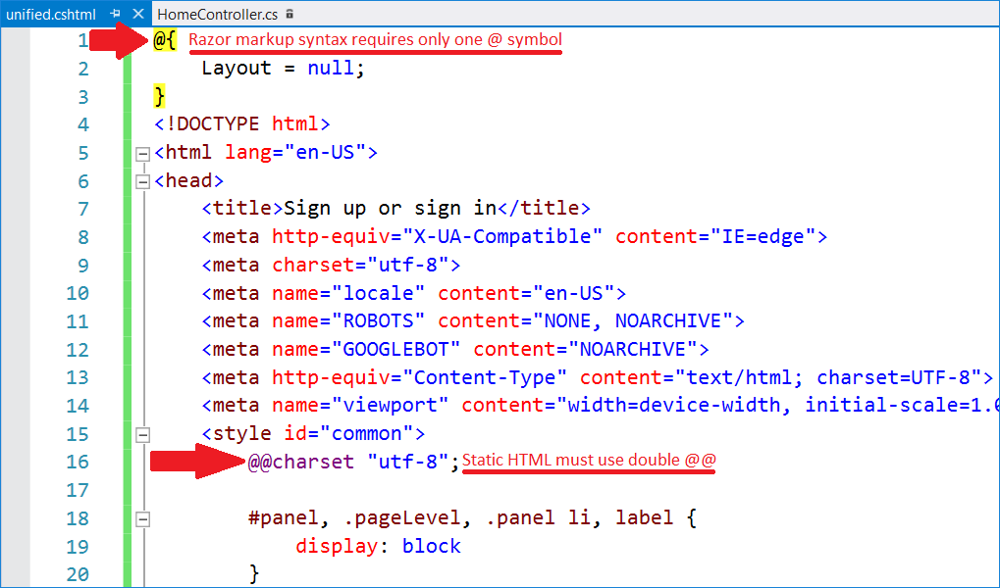
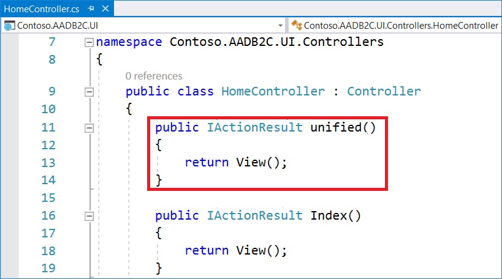
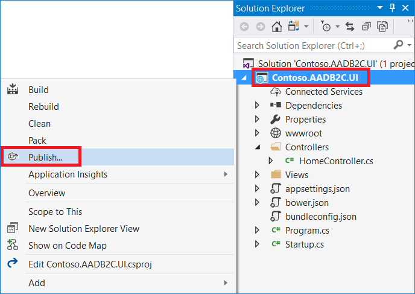
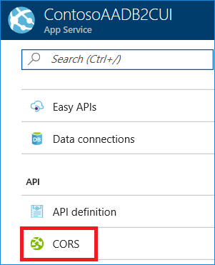
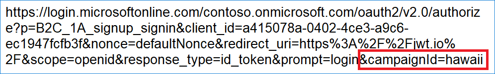
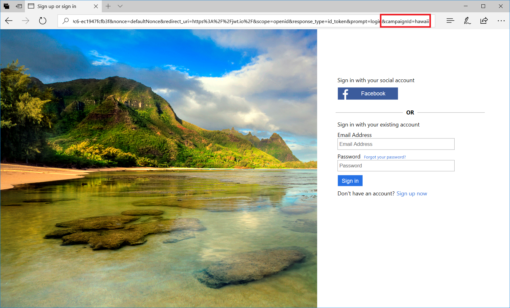
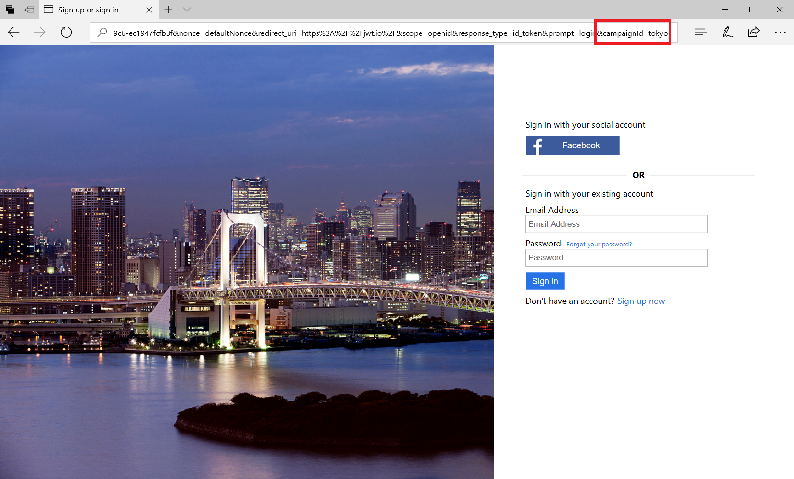

# Azure Active Directory B2C: Configure the UI with dynamic content by using custom policies

[!INCLUDE [active-directory-b2c-advanced-audience-warning](../../includes/active-directory-b2c-advanced-audience-warning.md)]

By using Azure Active Directory B2C (Azure AD B2C) custom policies, you can send a parameter in a query string. By passing the parameter to your HTML endpoint, you can dynamically change the page content. For example, you can change the background image on the Azure AD B2C sign-up or sign-in page, based on a parameter that you pass from your web or mobile application.

## Prerequisites
This article focuses on how to customize the Azure AD B2C user interface with *dynamic content* by using custom policies. To get started, see [UI customization in a custom policy](active-directory-b2c-ui-customization-custom.md).

>[!NOTE]
>The Azure AD B2C article, [Configure UI customization in a custom policy](active-directory-b2c-ui-customization-custom.md), discusses the following fundamentals:
> * The page user interface (UI) customization feature.
> * Essential tools for testing the page UI customization feature by using our sample content.
> * The core UI elements of each page type.
> * Best practices for applying this feature.

## Add a link to HTML5/CSS templates to your user journey

In a custom policy, a content definition defines the HTML5 page URI that is used for a specified UI step (for example, the sign-in or sign-up pages). The base policy defines the default look and feel by pointing to a URI of HTML5 files (in the CSS). In the extension policy, you can modify the look and feel by overriding the LoadUri for the HTML5 file. Content definitions contain URLs to external content that is defined by crafting HTML5/CSS files, as appropriate.

The `ContentDefinitions` section contains a series of `ContentDefinition` XML elements. The ID attribute of the `ContentDefinition` element specifies the type of page that relates to the content definition. That is, the element defines the context that a custom HTML5/CSS template is going to apply. The following table describes the set of content definition IDs that are recognized by the IEF engine, and the page types that relate to them.

| Content definition ID | Default HTML5 template| Description |
|-----------------------|--------|-------------|
| *api.error* | [exception.cshtml](https://login.microsoftonline.com/static/tenant/default/exception.cshtml) | **Error page**. This page is displayed when an exception or an error is encountered. |
| *api.idpselections* | [idpSelector.cshtml](https://login.microsoftonline.com/static/tenant/default/idpSelector.cshtml) | **Identity provider selection page**. This page lists identity providers that users can choose from during sign-in. The options are usually enterprise identity providers, social identity providers such as Facebook and Google+, or local accounts. |
| *api.idpselections.signup* | [idpSelector.cshtml](https://login.microsoftonline.com/static/tenant/default/idpSelector.cshtml) | **Identity provider selection for sign-up**. This page lists identity providers that users can choose from during sign-up. The options are either enterprise identity providers, social identity providers such as Facebook and Google+, or local accounts. |
| *api.localaccountpasswordreset* | [selfasserted.html](https://login.microsoftonline.com/static/tenant/default/selfAsserted.cshtml) | **Forgot password page**. This page contains a form that users must complete to initiate a password reset.  |
| *api.localaccountsignin* | [selfasserted.html](https://login.microsoftonline.com/static/tenant/default/selfAsserted.cshtml) | **Local account sign-in page**. This page contains a form for signing in with a local account that's based on an email address or a user name. The form can contain a text input box and password entry box. |
| *api.localaccountsignup* | [selfasserted.html](https://login.microsoftonline.com/static/tenant/default/selfAsserted.cshtml) | **Local account sign up page**. This page contains a form for signing up for a local account that's based on an email address or a user name. The form can contain various input controls, such as: a text input box, a password entry box, a radio button, single-select drop-down boxes, and multi-select check boxes. |
| *api.phonefactor* | [multifactor-1.0.0.cshtml](https://login.microsoftonline.com/static/tenant/default/multifactor-1.0.0.cshtml) | **Multi-factor authentication page**. On this page, users can verify their phone numbers (by using text or voice) during sign-up or sign-in. |
| *api.selfasserted* | [selfasserted.html](https://login.microsoftonline.com/static/tenant/default/selfAsserted.cshtml) | **Social account sign-up page**. This page contains a form that users must complete when they sign up by using an existing account from a social identity provider. This page is similar to the preceding social account sign-up page, except for the password entry fields. |
| *api.selfasserted.profileupdate* | [updateprofile.html](https://login.microsoftonline.com/static/tenant/default/updateProfile.cshtml) | **Profile update page**. This page contains a form that users can access to update their profile. This page is similar to the social account sign-up page, except for the password entry fields. |
| *api.signuporsignin* | [unified.html](https://login.microsoftonline.com/static/tenant/default/unified.cshtml) | **Unified sign-up or sign-in page**. This page handles the user sign-up and sign-in process. Users can use enterprise identity providers, social identity providers such as Facebook or Google+, or local accounts.  |

## Serving dynamic content
In the [Configure UI customization in a custom policy](active-directory-b2c-ui-customization-custom.md) article, you upload HTML5 files to Azure Blob storage. Those HTML5 files are static and render the same HTML content for each request.

In this article, you use an ASP.NET web app, which can accept query string parameters and respond accordingly.

In this walkthrough, you:
* Create an ASP.NET Core web application that hosts your HTML5 templates.
* Add a custom HTML5 template, _unified.cshtml_.
* Publish your web app to Azure App Service.
* Set cross-origin resource sharing (CORS) for your web app.
* Override the `LoadUri` elements to point to your HTML5 file.

## Step 1: Create an ASP.NET web app

1. In Visual Studio, create a project by selecting **File** > **New** > **Project**.

2. In the **New Project** window, select **Visual C#** > **Web** > **ASP.NET Core Web Application (.NET Core)**.

3. Name the application (for example, *Contoso.AADB2C.UI*), and then select **OK**.

    

4. Select the **Web Application** template.

5. Set the authentication to **No Authentication**.

    

6. Select **OK** to create the project.

## Step 2: Create MVC view
### Step 2.1: Download the B2C built-in HTML5 template
Your custom HTML5 template is based on the Azure AD B2C built-in HTML5 template. You can download the [unified.html file](https://login.microsoftonline.com/static/tenant/default/unified.cshtml) or download the template from [starter pack](https://github.com/AzureADQuickStarts/B2C-AzureBlobStorage-Client/tree/master/sample_templates/wingtip). You use this HTML5 file to create a unified sign-up or sign-in page.

### Step 2.2: Add the MVC view
1. Right-click the Views/Home folder, and then **Add** > **New Item**.

    

2. In the **Add New Item - Contoso.AADB2C.UI** window, select **Web > ASP.NET**.

3. Select **MVC View Page**.

4. In the **Name** box, change the name to **unified.cshtml**.

5. Select **Add**.

    

6. If the *unified.cshtml* file is not open already, double-click the file to open it, and then clear the file contents.

7. For this walkthrough, we remove the reference to layout-page. Add the following code snippet to _unified.cshtml_:

    ```csharp
    @{
        Layout = null;
    }
    ```

8. Open the _unified.cshtml_ file you downloaded from Azure AD B2C built-in HTML5 template.

9. Replace the single at signs (@) with double at signs (@@).

10. Copy the content of the file and paste it below the Layout definition. Your code should look like:

    

### Step 2.3: Change the background image

Locate the `` element that contains the `ID` value *background_background_image*, and then replace the `src` value with **https://kbdevstorage1.blob.core.windows.net/asset-blobs/19889_en_1** or any other background image you want to use.


### Step 2.4: Add your view to the MVC controller

1. Open **Controllers\HomeController.cs**, and add following method:

    ```C
    public IActionResult unified()
    {
        return View();
    }
    ```
    This code specifies that the method should use a *View* template file to render a response to the browser. Because we don't explicitly specify the name of the *View* template file, MVC defaults to using the _unified.cshtml_ View file in the */Views/Home* folder.

    After you add the _unified_ method, your code should look like:

    

2. Debug your web app, and make sure that the _unified_ page is accessible (for example, `http://localhost:<Port number>/Home/unified`).

### Step 2.5: Publish to Azure
1. In **Solution Explorer**, right-click the **Contoso.AADB2C.UI** project, and then select **Publish**.

    

2. Select the **Microsoft Azure App Service** tile, and then select **Publish**.

    

    The **Create App Service** window opens. In it you can begin to create all the necessary Azure resources to run the ASP.NET web app in Azure.

    > [!NOTE]
    > For more information about publishing, see [Create an ASP.NET web app in Azure](https://docs.microsoft.com/azure/app-service-web/app-service-web-get-started-dotnet).

3. In the **Web App Name** box, type a unique app name (valid characters are a-z, A-Z, 0-9, and the hyphen (-). The URL of the web app is `http://<app_name>.azurewebsites.NET`, where `<app_name>` is your web app name. You can accept the automatically generated name, which is unique.

4. Select **Create** to start creating the Azure resources.

    

    After the creation process is complete, the wizard publishes the ASP.NET web app to Azure and then launches the app in the default browser.

5. Copy the URL of the _unified_ page (for example, _https://<app_name>.azurewebsites.net/home/unified_).

## Step 3: Configure CORS in Azure App Service
1. In the [Azure portal](https://portal.azure.com/), Select **App Services**, and then select the name of your API app.

    

2. In the **Settings** section, under **API** section, select **CORS**.

    

3. In the **CORS** window, in the **Allowed Origins** box, do either of the following:

    * Enter the URL or URLs that you want to allow JavaScript calls to come from. You need to use all lowercase letters in the URLs that you enter.
    * Enter an asterisk (*) to specify that all origin domains are accepted.

4. Select **Save**.

    

    After you select **Save**, the API app accepts JavaScript calls from the specified URLs.

## Step 4: HTML5 template validation
Your HTML5 template is ready to use. However, it is not available in the `ContentDefinition` code. Before you can add `ContentDefinition` to your custom policy, ensure that:
* Your content is HTML5 compliant and accessible.
* Your content server is enabled for CORS.

    >[!NOTE]
    >To verify that the site where you're hosting your content has enabled CORS and can test CORS requests, go to the [test-cors.org](https://test-cors.org/) website.

* Your served content is secure over **HTTPS**.
* You are using *absolute URLS*, such as `https://yourdomain/content`, for all links, CSS content, and images.

## Step 5: Configure your content definition
To configure `ContentDefinition`, do the following:
1. Open the base file of your policy (for example, *TrustFrameworkBase.xml*).

2. Search for the `<ContentDefinitions>` element, and then copy the entire contents of the `<ContentDefinitions>` node.

3. Open the extension file (for example, *TrustFrameworkExtensions.xml*) and then search for the `<BuildingBlocks>` element. If the element doesn't exist, add it.

4. Paste the entire contents of the `<ContentDefinitions>` node that you copied as a child of the `<BuildingBlocks>` element.

5. Search for the `<ContentDefinition>` node that contains `Id="api.signuporsignin"` in the XML that you copied.

6. Change the value of `LoadUri` from _~/tenant/default/unified_ to _https://<app_name>.azurewebsites.net/home/unified_.
    Your custom policy should look like the following:

    

## Step 6: Upload the policy to your tenant
1. In the [Azure portal](https://portal.azure.com), select the **Directory + Subscription** icon in the portal toolbar, and then select the directory that contains your Azure AD B2C tenant.

1. In the Azure portal, search for and select **Azure AD B2C**.

1. Select **Identity Experience Framework**.

1. Select **All Policies**.

1. Select **Upload Policy**.

1. Select the **Overwrite the policy if it exists** check box.

1. Upload the *TrustFrameworkExtensions.xml* file, and ensure that it passes validation.

## Step 7: Test the custom policy by using Run Now
1. Select **Azure AD B2C Settings**, and then select **Identity Experience Framework**.

    >[!NOTE]
    >Run Now requires at least one application to be preregistered on the tenant. To learn how to register applications, see the Azure AD B2C [Get started](active-directory-b2c-get-started.md) article or the [Application registration](active-directory-b2c-app-registration.md) article.

2. Open **B2C_1A_signup_signin**, the relying party (RP) custom policy that you uploaded, and then select **Run now**.
    You should be able to see your custom HTML5 with the background that you created earlier.

    

## Step 8: Add dynamic content
Change the background based on query string parameter named _campaignId_. Your RP application (web and mobile apps) sends the parameter to Azure AD B2C. Your policy reads the parameter and sends its value to your HTML5 template.

### Step 8.1: Add a content definition parameter

Add the `ContentDefinitionParameters` element by doing the following:
1. Open the *SignUpOrSignin* file of your policy (for example, *SignUpOrSignin.xml*).

2. Under the `<DefaultUserJourney>` node, add the `UserJourneyBehaviors` node:

    ```XML
    <RelyingParty>
      <DefaultUserJourney ReferenceId="SignUpOrSignIn" />
      <UserJourneyBehaviors>
        <ContentDefinitionParameters>
          <Parameter Name="campaignId">{OAUTH-KV:campaignId}</Parameter>
        </ContentDefinitionParameters>
      </UserJourneyBehaviors>
      ...
    </RelyingParty>
    ```

### Step 8.2: Change your code to accept a query string parameter, and replace the background image
Modify the HomeController `unified` method to accept the campaignId parameter. The method then checks the parameter's value and sets the `ViewData["background"]` variable accordingly.

1. Open the *Controllers\HomeController.cs* file, and then change the `unified` method by adding the following code snippet:

    ```csharp
    public IActionResult unified(string campaignId)
    {
        // If campaign ID is Hawaii, show Hawaii background
        if (campaignId != null && campaignId.ToLower() == "hawaii")
        {
            ViewData["background"] = "https://kbdevstorage1.blob.core.windows.net/asset-blobs/19889_en_1";
        }
        // If campaign ID is Tokyo, show Tokyo background
        else if (campaignId != null && campaignId.ToLower() == "tokyo")
        {
            ViewData["background"] = "https://kbdevstorage1.blob.core.windows.net/asset-blobs/19666_en_1";
        }
        // Default background
        else
        {
            ViewData["background"] = "https://kbdevstorage1.blob.core.windows.net/asset-blobs/18983_en_1";
        }

        return View();
    }

    ```

2. Locate the `` element with ID `background_background_image`, and replace the `src` value with `@ViewData["background"]`.

    

### 8.3: Upload the changes and publish your policy
1. Publish your Visual Studio project to Azure App Service.

2. Upload the *SignUpOrSignin.xml* policy to Azure AD B2C.

3. Open **B2C_1A_signup_signin**, the RP custom policy that you uploaded, and then select **Run now**.
    You should see the same background image that was previously displayed.

4. Copy the URL from the browser's address bar.

5. Add the _campaignId_ query string parameter to the URI. For example, add `&campaignId=hawaii`, as shown in following image:

    

6. Select **Enter** to display the Hawaii background image.

    

7. Change the value to *Tokyo*, and then select **Enter**.
    The browser displays the Tokyo background.

    

## Step 9: Change the rest of the user journey
If you select the **Sign up now** link on the sign-in page, the browser displays the default background image, not the image you defined. This behavior arises because you've changed only the sign-up or sign-in page. To change the rest of the Self-Assert content definitions:
1. Go back to "Step 2," and do the following:

    a. Download the *selfasserted* file.

    b. Copy the file content.

    c. Create a new view, *selfasserted*.

    d. Add *selfasserted* to the **Home** controller.

2. Go back to "Step 4," and do the following:

    a. In your extension policy, find the `<ContentDefinition>` node that contains `Id="api.selfasserted"`, `Id="api.localaccountsignup"`, and `Id="api.localaccountpasswordreset"`.

    b. Set the `LoadUri` attribute to your *selfasserted* URI.

3. Go back to "Step 8.2," and change your code to accept query string parameters, but this time to the *selfasserted* function.

4. Upload the *TrustFrameworkExtensions.xml* policy, and ensure that it passes validation.

5. Run the policy test, and then select **Sign up now** to see the result.

## (Optional) Download the complete policy files and code
* After you complete the [Get started with custom policies](active-directory-b2c-get-started-custom.md) walkthrough, we recommend that you build your scenario by using your own custom policy files. For your reference, we have provided [Sample policy files](https://github.com/Azure-Samples/active-directory-b2c-custom-policy-starterpack/tree/master/scenarios/aadb2c-ief-ui-customization).
* You can download the complete code from [Sample Visual Studio solution for reference](https://github.com/Azure-Samples/active-directory-b2c-custom-policy-starterpack/tree/master/scenarios/aadb2c-ief-ui-customization).
