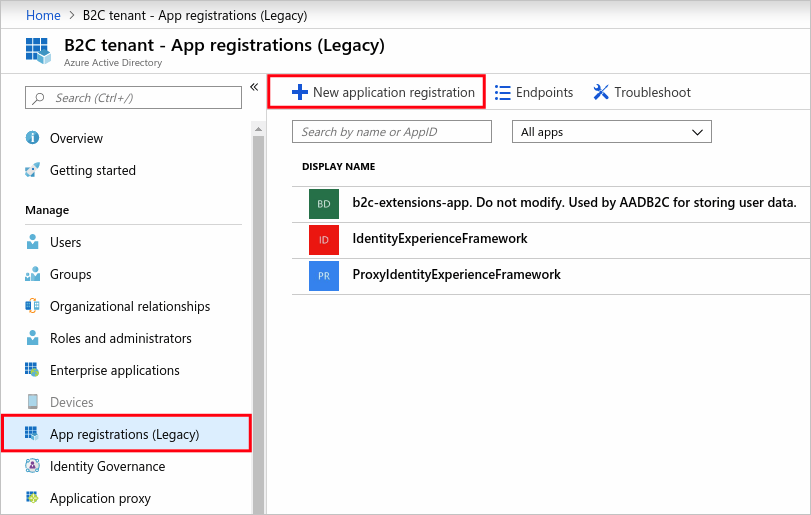
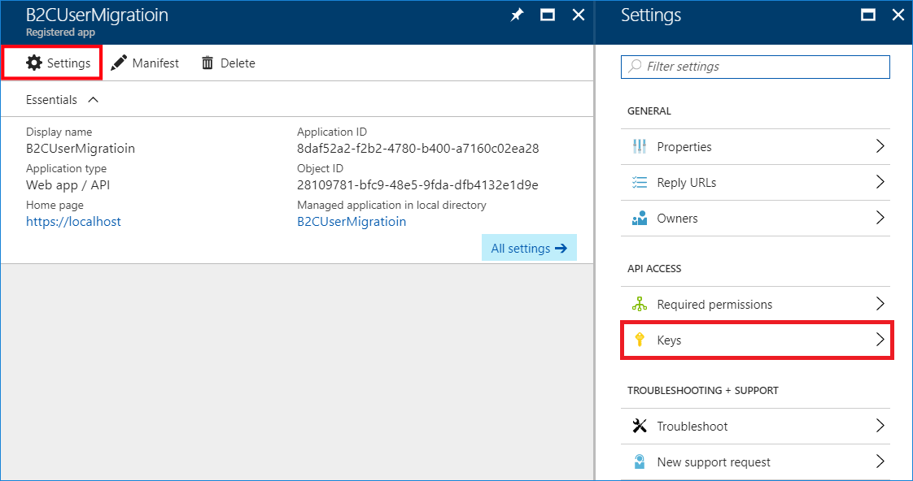
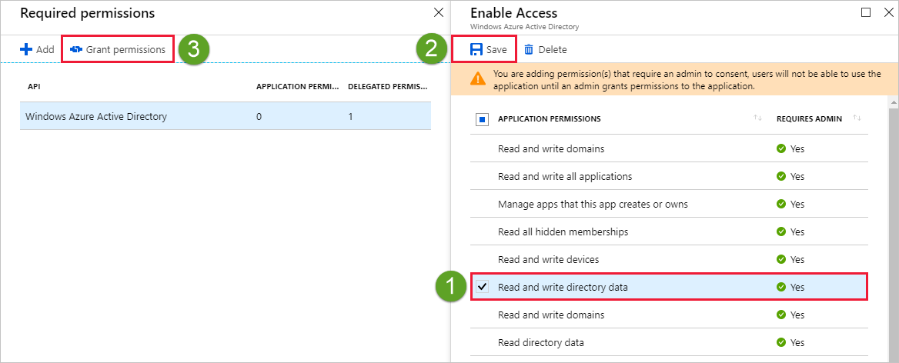
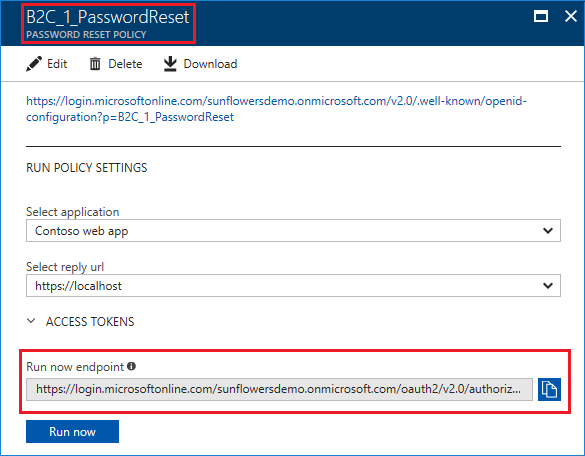
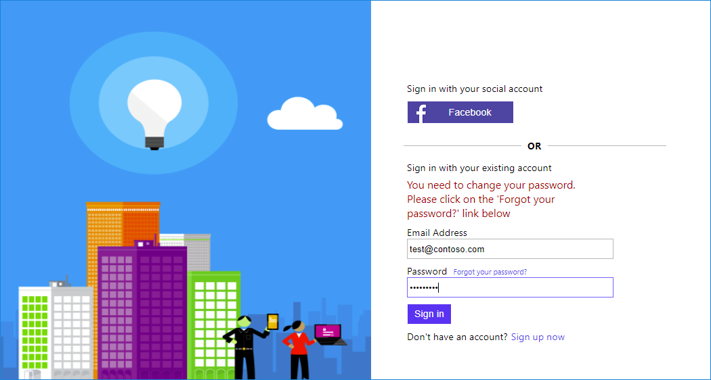

# Azure Active Directory B2C: User migration
When you migrate your identity provider to Azure Active Directory B2C (Azure AD B2C), you might also need to migrate the user account. This article explains how to migrate existing user accounts from any identity provider to Azure AD B2C. The article is not meant to be prescriptive but, rather, it describes a few scenarios. The developer is responsible for the suitability of each approach.

## User migration flows
With Azure AD B2C, you can migrate users through [Azure AD Graph API][B2C-GraphQuickStart]. The user migration process falls into two flows:

- **Pre-migration**: This flow applies when you either have clear access to a user's credentials (user name and password) or the credentials are encrypted, but you can decrypt them. The pre-migration process involves reading the users from the old identity provider and creating new accounts in the Azure AD B2C directory.

- **Pre-migration and password reset**: This flow applies when a user's password is not accessible. For example:
   - The password is stored in HASH format.
   - The password is stored in an identity provider that you can't access. Your old identity provider validates the user credential by calling a web service.

In both flows, you first run the pre-migration process, read the users from your old identity provider, and create new accounts in the Azure AD B2C directory. If you do not have the password, you create the account by using a password that's generated randomly. You then ask the user to change the password or, when the user signs in for the first time, Azure AD B2C asks the user to reset it.

## Password policy
The Azure AD B2C password policy (for local accounts) is based on Azure AD policy. The Azure AD B2C sign-up or sign-in and password reset policies use the "strong" password strength and doesn't expire any passwords. For more information, see [Azure AD password policy][AD-PasswordPolicies].

If the accounts that you want to migrate use a weaker password strength than the [strong password strength enforced by Azure AD B2C][AD-PasswordPolicies], you can disable the strong password requirement. To change the default password policy, set the `passwordPolicies` property to `DisableStrongPassword`. For example, you can modify the create user request as follows:

```JSON
"passwordPolicies": "DisablePasswordExpiration, DisableStrongPassword"
```

## Step 1: Use Azure AD Graph API to migrate users
You create the Azure AD B2C user account via Graph API (with the password or with a random password). This section describes the process of creating user accounts in the Azure AD B2C directory by using Graph API.

### Step 1.1: Register your application in your tenant
To communicate with the Graph API, you first must have a service account with administrative privileges. In Azure AD, you register an application and authentication to Azure AD. The application credentials are **Application ID** and **Application Secret**. The application acts as itself, not as a user, to call the Graph API.

First, register your migration application in Azure AD. Then, create an application key (application secret) and set the application with write privileges.

1. Sign in to the [Azure portal][Portal].

1. Choose your Azure AD **B2C** tenant by selecting your account at the top right of the window.

1. In the left pane, select **Azure Active Directory** (not Azure AD B2C). To find it, you might need to select **More Services**.

1. Select **App registrations**.

1. Select **New application registration**.

   

1. Create a new application by doing the following:
   - For **Name**, use **B2CUserMigration** or any other name you want.
   - For **Application type**, use **Web app/API**.
   - For **Sign-on URL**, use `https://localhost` (as it's not relevant for this application).
   - Select **Create**.

1. After the application is created, in the **Applications** list, select the newly created **B2CUserMigration** application.

1. Select **Properties**, copy the **Application ID**, and save it for later.

### Step 1.2: Create the application secret
1. In the Azure portal **Registered App** window, select **Keys**.

1. Add a new key (also known as a client secret), and then copy the key for later use.

   

### Step 1.3: Grant administrative permission to your application
1. In the Azure portal **Registered App** window, select **Required permissions**.

1. Select **Windows Azure Active Directory**.

1. In the **Enable Access** pane, under **Application Permissions**, select **Read and write directory data**, and then select **Save**.

1. In the **Required permissions** pane, select **Grant Permissions**.

   

Now you have an application with permissions to create, read, and update users from your Azure AD B2C tenant.

### Step 1.4: (Optional) Environment cleanup
Read and write directory data permissions do *not* include the right to delete users. To give your application the ability to delete users (to clean up your environment), you must perform an extra step, which involves running PowerShell to set User Account Administrator permissions. Otherwise, you can skip to the next section.

> [!IMPORTANT]
> You must use a B2C tenant administrator account that is *local* to the B2C tenant. The account name syntax is *admin\@contosob2c.onmicrosoft.com*.

>[!NOTE]
> The following PowerShell script requires [Azure Active Directory PowerShell Version 2][AD-Powershell].

In this PowerShell script, do the following:
1. Connect to your online service. To do so, run the `Connect-AzureAD` cmdlet at the Windows PowerShell command prompt, and provide your credentials.

1. Use the **Application ID** to assign the application the user account administrator role. These roles have well-known identifiers, so all you need to do is enter your **Application ID** in the script.

```powershell
Connect-AzureAD

$AppId = "<Your application ID>"

# Fetch Azure AD application to assign to role
$roleMember = Get-AzureADServicePrincipal -Filter "AppId eq '$AppId'"

# Fetch User Account Administrator role instance
$role = Get-AzureADDirectoryRole | Where-Object {$_.displayName -eq 'User Account Administrator'}

# If role instance does not exist, instantiate it based on the role template
if ($role -eq $null) {
    # Instantiate an instance of the role template
    $roleTemplate = Get-AzureADDirectoryRoleTemplate | Where-Object {$_.displayName -eq 'User Account Administrator'}
    Enable-AzureADDirectoryRole -RoleTemplateId $roleTemplate.ObjectId

    # Fetch User Account Administrator role instance again
    $role = Get-AzureADDirectoryRole | Where-Object {$_.displayName -eq 'User Account Administrator'}
}

# Add application to role
Add-AzureADDirectoryRoleMember -ObjectId $role.ObjectId -RefObjectId $roleMember.ObjectId

# Fetch role membership for role to confirm
Get-AzureADDirectoryRoleMember -ObjectId $role.ObjectId
```

Change the `$AppId` value with your Azure AD **Application ID**.

## Step 2: Pre-migration application sample
[Download and run the sample code][UserMigrationSample]. You can download it as a .zip file.

### Step 2.1: Edit the migration data file
The sample app uses a JSON file that contains dummy user data. After you successfully run the sample, you can change the code to consume the data from your own database. Or you can export the user profile to a JSON file, and then set the app to use that file.

To edit the JSON file, open the `AADB2C.UserMigration.sln` Visual Studio solution. In the `AADB2C.UserMigration` project, open the `UsersData.json` file.


As you can see, the file contains a list of user entities. Each user entity has the following properties:
- email
- displayName
- firstName
- lastName
- password (can be empty)

> [!NOTE]
> At compile time, Visual Studio copies the file to the `bin` directory.

### Step 2.2: Configure the application settings
Under the `AADB2C.UserMigration` project, open the *App.config* file. Replace the following app settings with your own values:

```XML
<appSettings>
    <add key="b2c:Tenant" value="{Your Tenant Name}" />
    <add key="b2c:ClientId" value="{The ApplicationID from above}" />
    <add key="b2c:ClientSecret" value="{The Client Secret Key from above}" />
    <add key="MigrationFile" value="{Name of a JSON file containing the users' data; for example, UsersData.json}" />
    <add key="BlobStorageConnectionString" value="{Your connection Azure table string}" />
</appSettings>
```

> [!NOTE]
> - The use of an Azure table connection string is described in the next sections.
> - Your B2C tenant name is the domain that you entered during tenant creation, and it is displayed in the Azure portal. The tenant name usually ends with the suffix *.onmicrosoft.com* (for example, *contosob2c.onmicrosoft.com*).

### Step 2.3: Run the pre-migration process
Right-click the `AADB2C.UserMigration` solution, and then rebuild the sample. If you are successful, you should now have a `UserMigration.exe` executable file located in `AADB2C.UserMigration\bin\Debug\net461`. To run the migration process, use one of the following command-line parameters:

- To **migrate users with password**, use the `UserMigration.exe 1` command.

- To **migrate users with random password**, use the `UserMigration.exe 2` command. This operation also creates an Azure table entity. Later, you configure the policy to call the REST API service. The service uses an Azure table to track and manage the migration process.


### Step 2.4: Check the pre-migration process
To validate the migration, use one of the following two methods:

- To search for a user by display name, use the Azure portal:

   1. Open **Azure AD B2C**, and then select **Users and Groups**.

   1. In the search box, type the user's display name, and then view the user's profile.

- To retrieve a user by sign-in email address, use this sample application:

   1. Run the following command:

      ```Console
          UserMigration.exe 3 {email address}
      ```

      > [!TIP]
      > You can also retrieve a user by display name by using the following command: `UserMigration.exe 4 "<Display name>"`.

   1. Open the UserProfile.json file in a JSON editor to see user's information.

      

### Step 2.5: (Optional) Environment cleanup
If you want to clean up your Azure AD tenant and remove users from the Azure AD directory, run the `UserMigration.exe 5` command.

> [!NOTE]
> * To clean up your tenant, configure User Account Administrator permissions for your application.
> * The sample migration app cleans up all users who are listed in the JSON file.

### Step 2.6: Sign in with migrated users (with password)
After you run the pre-migration process with user passwords, the accounts are ready to use, and users can sign in to your application by using Azure AD B2C. If you don't have access to user passwords, continue to the next section.

## Step 3: Help users reset their password
If you migrate users with a random password, they must reset their password. To help them reset the password, send a welcome email with a link to reset the password.

To get the link to your password reset policy, do the following:

1. Select **Azure AD B2C Settings**, and then select **Reset password** policy properties.

1. Select your application.

    > [!NOTE]
    > Run Now requires at least one application to be preregistered on the tenant. To learn how to register applications, see the Azure AD B2C [Get started][B2C-GetStarted] article or the [Application registration][B2C-AppRegister] article.

1. Select **Run now**, and then check the policy.

1. In the **Run now endpoint** box, copy the URL, and then send it to your users.

    

## Step 4: (Optional) Change your policy to check and set the user migration status

> [!NOTE]
> To check and change the user migration status, you must use a custom policy. The set-up instructions from [Get started with custom policies][B2C-GetStartedCustom] must be completed.
>

When users try to sign in without resetting the password first, your policy should return a friendly error message. For example:
>*Your password has expired. To reset it, select the Reset Password link.*

This optional step requires the use of Azure AD B2C custom policies, as described in the [Getting started with custom policies][B2C-GetStartedCustom] article.

In this section, you change the policy to check the user migration status on sign-in. If the user didn't change the password, return an HTTP 409 error message that asks the user to select the **Forgot your password?** link.

To track the password change, you use an Azure table. When you run the pre-migration process with the command-line parameter `2`, you create a user entity in an Azure table. Your service does the following:

- On sign-in, the Azure AD B2C policy invokes your migration RESTful service, sending an email message as an input claim. The service searches for the email address in the Azure table. If the address exists, the service throws an error message: *You must change password*.

- After the user successfully changes the password, remove the entity from the Azure table.

>[!NOTE]
>We use an Azure table to simplify the sample. You can store the migration status in any database or as a custom property in the Azure AD B2C account.

### 4.1: Update your application setting
1. To test the RESTful API demo, open `AADB2C.UserMigration.sln` in Visual Studio.

1. In the `AADB2C.UserMigration.API` project, open the *Web.config* file. Replace the setting with the one configured in [Step 2.2](#step-22-configure-the-application-settings):

    ```json
    {
        "BlobStorageConnectionString": "{The Azure Blob storage connection string}",
        ...
    }
    ```

### Step 4.2: Deploy your web application to Azure App Service
In Solution Explorer, right-click on the `AADB2C.UserMigration.API`, select "Publish...". Follow the instructions to publish to Azure App Service. For more information, see [Deploy your app to Azure App Service][AppService-Deploy].

### Step 4.3: Add a technical profile and technical profile validation to your policy
1. In Solution Explorer, expand "Solution Items", and open the *TrustFrameworkExtensions.xml* policy file.
1. Change `TenantId`, `PublicPolicyUri` and `<TenantId>` fields from `yourtenant.onmicrosoft.com` to the name of your tenant.
1. Under the `<TechnicalProfile Id="login-NonInteractive">` element, replace all instances of `ProxyIdentityExperienceFrameworkAppId` and `IdentityExperienceFrameworkAppId` with the Application IDs configured in [Getting started with custom policies][B2C-GetStartedCustom].
1. Under the `<ClaimsProviders>` node, find the following XML snippet. Change the value of `ServiceUrl` to point to your Azure App Service URL.

    ```XML
    <ClaimsProvider>
      <DisplayName>REST APIs</DisplayName>
      <TechnicalProfiles>

        <TechnicalProfile Id="LocalAccountSignIn">
          <DisplayName>Local account just in time migration</DisplayName>
          <Protocol Name="Proprietary" Handler="Web.TPEngine.Providers.RestfulProvider, Web.TPEngine, Version=1.0.0.0, Culture=neutral, PublicKeyToken=null" />
          <Metadata>
            <Item Key="ServiceUrl">http://{your-app}.azurewebsites.net/api/PrePasswordReset/LoalAccountSignIn</Item>
            <Item Key="AuthenticationType">None</Item>
            <Item Key="SendClaimsIn">Body</Item>
          </Metadata>
          <InputClaims>
            <InputClaim ClaimTypeReferenceId="signInName" PartnerClaimType="email" />
          </InputClaims>
          <UseTechnicalProfileForSessionManagement ReferenceId="SM-Noop" />
        </TechnicalProfile>

        <TechnicalProfile Id="LocalAccountPasswordReset">
          <DisplayName>Local account just in time migration</DisplayName>
          <Protocol Name="Proprietary" Handler="Web.TPEngine.Providers.RestfulProvider, Web.TPEngine, Version=1.0.0.0, Culture=neutral, PublicKeyToken=null" />
          <Metadata>
            <Item Key="ServiceUrl">http://{your-app}.azurewebsites.net/api/PrePasswordReset/PasswordUpdated</Item>
            <Item Key="AuthenticationType">None</Item>
            <Item Key="SendClaimsIn">Body</Item>
          </Metadata>
          <InputClaims>
            <InputClaim ClaimTypeReferenceId="email" PartnerClaimType="email" />
          </InputClaims>
          <UseTechnicalProfileForSessionManagement ReferenceId="SM-Noop" />
        </TechnicalProfile>
      </TechnicalProfiles>
    </ClaimsProvider>
    ```

The preceding technical profile defines one input claim: `signInName` (send as email). On sign-in, the claim is sent to your RESTful endpoint.

After you define the technical profile for your RESTful API, tell your Azure AD B2C policy to call the technical profile. The XML snippet overrides `SelfAsserted-LocalAccountSignin-Email`, which is defined in the base policy. The XML snippet also adds `ValidationTechnicalProfile`, with ReferenceId pointing to your technical profile `LocalAccountUserMigration`.

### Step 4.4: Upload the policy to your tenant
1. In the [Azure portal][Portal], switch to the [context of your Azure AD B2C tenant][B2C-NavContext], and then select **Azure AD B2C**.

1. Select **Identity Experience Framework**.

1. Select **All Policies**.

1. Select **Upload Policy**.

1. Select the **Overwrite the policy if it exists** check box.

1. Upload the *TrustFrameworkExtensions.xml* file, and ensure that it passes validation.

### Step 4.5: Test the custom policy by using Run Now
1. Select **Azure AD B2C Settings**, and then go to **Identity Experience Framework**.

1. Open **B2C_1A_signup_signin**, the relying party (RP) custom policy that you uploaded, and then select **Run now**.

1. Try to sign in with one of the migrated users' credentials, and then select **Sign In**. Your REST API should throw the following error message:

    

### Step 4.6: (Optional) Troubleshoot your REST API
You can view and monitor logging information in near-real time.

1. On your RESTful application's settings menu, under **Monitoring**, select **Diagnostic logs**.

1. Set **Application Logging (Filesystem)** to **On**.

1. Set the **Level** to **Verbose**.

1. Select **Save**

    

1. On the **Settings** menu, select **Log stream**.

1. Check the output of the RESTful API.

> [!IMPORTANT]
> Use the diagnostics logs only during development and testing. The RESTful API output might contain confidential information that should not be exposed in production.
>

## (Optional) Download the complete policy files
After you complete the [Get started with custom policies][B2C-GetStartedCustom] walkthrough, we recommend that you build your scenario by using your own custom policy files. For your reference, we have provided [Sample policy files][UserMigrationSample].

[AD-PasswordPolicies]: https://docs.microsoft.com/azure/active-directory/active-directory-passwords-policy
[AD-Powershell]: https://docs.microsoft.com/powershell/azure/active-directory/install-adv2
[AppService-Deploy]: https://docs.microsoft.com/aspnet/core/tutorials/publish-to-azure-webapp-using-vs
[B2C-AppRegister]: https://docs.microsoft.com/azure/active-directory-b2c/active-directory-b2c-app-registration
[B2C-GetStarted]: https://docs.microsoft.com/azure/active-directory-b2c/active-directory-b2c-get-started
[B2C-GetStartedCustom]: https://docs.microsoft.com/azure/active-directory-b2c/active-directory-b2c-get-started-custom
[B2C-GraphQuickStart]: https://docs.microsoft.com/azure/active-directory-b2c/active-directory-b2c-devquickstarts-graph-dotnet
[B2C-NavContext]: https://docs.microsoft.com/azure/active-directory-b2c/active-directory-b2c-navigate-to-b2c-context
[Portal]: https://portal.azure.com/
[UserMigrationSample]: https://github.com/yoelhor/Azure-AD-B2C-UserMigration
