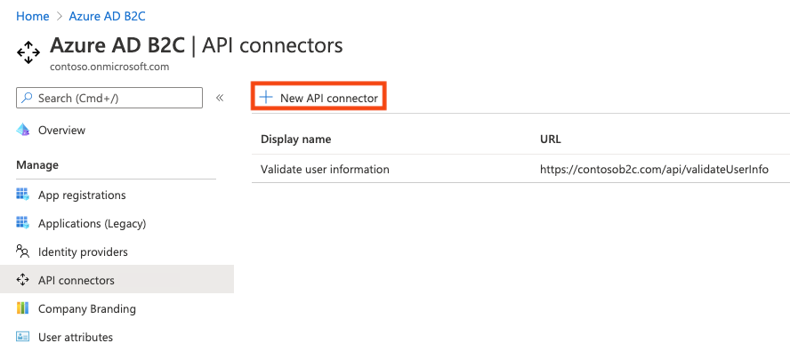
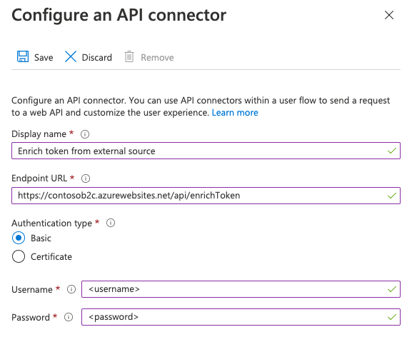
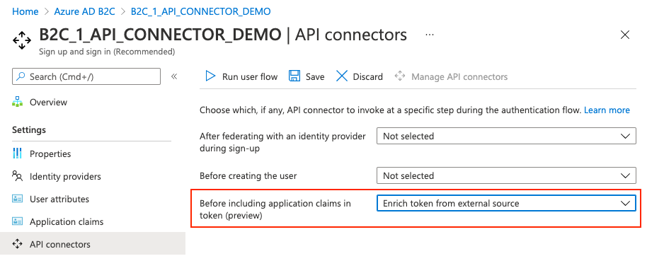
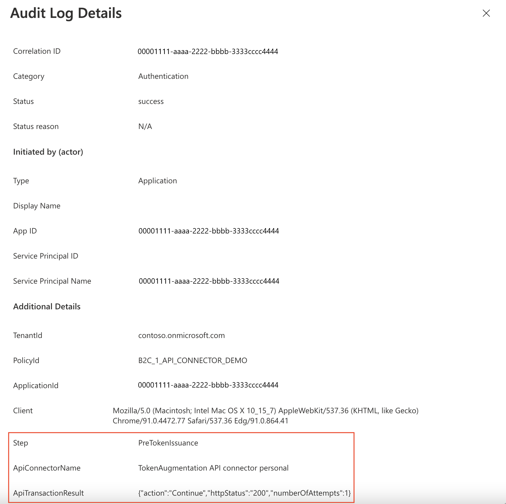

# Enrich tokens with claims from external sources using API connectors
[!INCLUDE [active-directory-b2c-choose-user-flow-or-custom-policy](../../includes/active-directory-b2c-choose-user-flow-or-custom-policy.md)]
Azure Active Directory B2C (Azure AD B2C) enables identity developers to integrate an interaction with a RESTful API into their user flow using [API connectors](api-connectors-overview.md). It enables developers to dynamically retrieve data from external identity sources. At the end of this walkthrough, you'll be able to create an Azure AD B2C user flow that interacts with APIs to enrich tokens with information from external sources.
::: zone pivot="b2c-user-flow"
You can use API connectors applied to the **Before sending the token (preview)** step to enrich tokens for your applications with information from external sources. When a user signs in or signs up, Azure AD B2C will call the API endpoint configured in the API connector, which can query information about a user in downstream services such as cloud services, custom user stores, custom permission systems, legacy identity systems, and more.

[!INCLUDE [b2c-public-preview-feature](../../includes/active-directory-b2c-public-preview.md)]

You can create an API endpoint using one of our [samples](api-connector-samples.md#api-connector-rest-api-samples).

## Prerequisites

[!INCLUDE [active-directory-b2c-customization-prerequisites](../../includes/active-directory-b2c-customization-prerequisites.md)]
- An API endpoint. You can create an API endpoint using one of our [samples](api-connector-samples.md#api-connector-rest-api-samples).

## Create an API connector

To use an [API connector](api-connectors-overview.md), you first create the API connector and then enable it in a user flow.

1. Sign in to the [Azure portal](https://portal.azure.com).
1. Under **Azure services**, select **Azure AD B2C**.
1. Select **API connectors**, and then select **New API connector**.

   

1. Provide a display name for the call. For example, **Enrich token from external source**.
1. Provide the **Endpoint URL** for the API call.
1. Choose the **Authentication type** and configure the authentication information for calling your API. Learn how to [Secure your API Connector](secure-rest-api.md).

   

1. Select **Save**.

## Enable the API connector in a user flow

Follow these steps to add an API connector to a sign-up user flow.

1. Sign in to the [Azure portal](https://portal.azure.com).
1. Under **Azure services**, select **Azure AD B2C**.
1. Select **User flows**, and then select the user flow you want to add the API connector to.
1. Select **API connectors**, and then select the API endpoint you want to invoke at the **Before sending the token (preview)** step in the user flow:

   

1. Select **Save**.

This step only exists for **Sign up and sign in (Recommended)**, **Sign up (Recommended)**, and **Sign in (Recommended)** user flows.

## Example request sent to the API at this step
An API connector at this step is invoked when a token is about to be issued during sign-ins and sign-ups. 
An API connector materializes as an **HTTP POST** request, sending user attributes ('claims') as key-value pairs in a JSON body. Attributes are serialized similarly to [Microsoft Graph](/graph/api/resources/user#properties) user properties. 
```http
POST <API-endpoint>
Content-type: application/json
{
 "email": "johnsmith@fabrikam.onmicrosoft.com",
 "identities": [
     {
     "signInType":"federated",
     "issuer":"facebook.com",
     "issuerAssignedId":"0123456789"
     }
 ],
 "displayName": "John Smith",
 "objectId": "ab3ec3b2-a435-45e4-b93a-56a005e88bb7",
 "extension_<extensions-app-id>_CustomAttribute1": "custom attribute value",
 "extension_<extensions-app-id>_CustomAttribute2": "custom attribute value",
 "client_id": "231c70e8-8424-48ac-9b5d-5623b9e4ccf3",
 "step": "PreTokenIssuance",
 "ui_locales":"en-US"
}
```
The claims that are sent to the API depend on the information defined for the user.
Only user properties and custom attributes listed in the **Azure AD B2C** > **User attributes** experience are available to be sent in the request.
Custom attributes exist in the **extension_\<extensions-app-id>_CustomAttribute**  format in the directory. Your API should expect to receive claims in this same serialized format. For more information on custom attributes, see [Define custom attributes in Azure AD B2C](user-flow-custom-attributes.md).
Additionally, these claims are typically sent in all requests for this step:
- **UI Locales ('ui_locales')** -  An end-user's locale(s) as configured on their device. This can be used by your API to return internationalized responses.
- **Step ('step')** - The step or point on the user flow that the API connector was invoked for. Value for this step is `
- **Client ID ('client_id')** - The `appId` value of the application that an end-user is authenticating to in a user flow. This is *not* the resource application's `appId` in access tokens.
- **objectId** - The identifier of the user. You can use this to query downstream services for information about the user.
  
> [!IMPORTANT]
> If a claim does not have a value at the time the API endpoint is called, the claim will not be sent to the API. Your API should be designed to explicitly check and handle the case in which a claim is not in the request.
## Expected response types from the web API at this step
When the web API receives an HTTP request from Microsoft Entra ID during a user flow, it can return a "continuation response."
### Continuation response
A continuation response indicates that the user flow should continue to the next step: issuing the token.
In a continuation response, the API can return additional claims. A claim returned by the API that you wish to return in the token must be a built-in claim or [defined as a custom attribute](user-flow-custom-attributes.md) and must be selected in the **Application claims** configuration of the user flow. 
The claim value in the token will be that returned by the API, not the value in the directory. Some claim values cannot be overwritten by the API response. Claims that can be returned by the API correspond to the set found under **User attributes** with the exception of `email`.
> [!NOTE]
> The API is only invoked during an initial authentication. When using refresh tokens to silently get new access or ID tokens, the token will include the values evaluated during the initial authentication. 
## Example response
### Example of a continuation response
```http
HTTP/1.1 200 OK
Content-type: application/json
{
    "version": "1.0.0",
    "action": "Continue",
    "postalCode": "12349", // return claim
    "extension_<extensions-app-id>_CustomAttribute": "value" // return claim
}
```
| Parameter                                          | Type              | Required | Description                                                                                                                                                                                                                                                                            |
| -------------------------------------------------- | ----------------- | -------- | -------------------------------------------------------------------------------------------------------------------------------------------------------------------------------------------------------------------------------------------------------------------------------------- |
| version     | String | Yes      | The version of your API.                                                    |
| action                                             | String            | Yes      | Value must be `Continue`.                                                                                                                                                                                                                                                              |
| \<builtInUserAttribute>                            | \<attribute-type> | No       | They can be returned in the token if selected as an **Application claim**.                                        |
| \<extension\_{extensions-app-id}\_CustomAttribute> | \<attribute-type> | No       | The claim does not need to contain `_<extensions-app-id>_`, it is *optional*. They can be returned in the token if selected as an **Application claim**.  |
::: zone-end
::: zone pivot="b2c-custom-policy"

In this scenario, we enrich the user's token data by integrating with a corporate line-of-business workflow. During sign-up or sign-in with local or federated account, Azure AD B2C invokes a REST API to get the user's extended profile data from a remote data source. In this sample, Azure AD B2C sends the user's unique identifier, the objectId. The REST API then returns the user's account balance (a random number). Use this sample as a starting point to integrate with your own CRM system, marketing database, or any line-of-business workflow.
You can also design the interaction as a validation technical profile. This is suitable when the REST API will be validating data on screen and returning claims. For more information, see [Walkthrough: Add an API connector to a sign-up user flow](add-api-connector.md).
## Prerequisites
- Complete the steps in [Get started with custom policies](tutorial-create-user-flows.md?pivots=b2c-custom-policy). You should have a working custom policy for sign-up and sign-in with local accounts.
- Learn how to [Integrate REST API claims exchanges in your Azure AD B2C custom policy](api-connectors-overview.md).
## Prepare a REST API endpoint
For this walkthrough, you should have a REST API that validates whether a user's Azure AD B2C objectId is registered in your back-end system. 
If registered, the REST API returns the user account balance. Otherwise, the REST API registers the new account in the directory and returns the starting balance `50.00`.
The following JSON code illustrates the data Azure AD B2C will send to your REST API endpoint. 
```json
{
    "objectId": "User objectId",
    "lang": "Current UI language"
}
```
Once your REST API validates the data, it must return an HTTP 200 (Ok), with the following JSON data:
```json
{
    "balance": "760.50"
}
```
The setup of the REST API endpoint is outside the scope of this article. We have created an [Azure Functions](../azure-functions/functions-reference.md) sample. You can access the complete Azure function code at [GitHub](https://github.com/azure-ad-b2c/rest-api/tree/master/source-code/azure-function).
## Define claims
A claim provides temporary storage of data during an Azure AD B2C policy execution. You can declare claims within the [claims schema](claimsschema.md) section. 
1. Open the extensions file of your policy. For example, <em>`SocialAndLocalAccounts/`**`TrustFrameworkExtensions.xml`**</em>.
1. Search for the [BuildingBlocks](buildingblocks.md) element. If the element doesn't exist, add it.
1. Locate the [ClaimsSchema](claimsschema.md) element. If the element doesn't exist, add it.
1. Add the following claims to the **ClaimsSchema** element.  
```xml
<ClaimType Id="balance">
  <DisplayName>Your Balance</DisplayName>
  <DataType>string</DataType>
</ClaimType>
<ClaimType Id="userLanguage">
  <DisplayName>User UI language (used by REST API to return localized error messages)</DisplayName>
  <DataType>string</DataType>
</ClaimType>
```
## Add the RESTful API technical profile 
A [Restful technical profile](restful-technical-profile.md) provides support for interfacing with your own RESTful service. Azure AD B2C sends data to the RESTful service in an `InputClaims` collection and receives data back in an `OutputClaims` collection. Find the **ClaimsProviders** element in your <em>**`TrustFrameworkExtensions.xml`**</em> file and add a new claims provider as follows:
```xml
<ClaimsProvider>
  <DisplayName>REST APIs</DisplayName>
  <TechnicalProfiles>
    <TechnicalProfile Id="REST-GetProfile">
      <DisplayName>Get user extended profile Azure Function web hook</DisplayName>
      <Protocol Name="Proprietary" Handler="Web.TPEngine.Providers.RestfulProvider, Web.TPEngine, Version=1.0.0.0, Culture=neutral, PublicKeyToken=null" />
      <Metadata>
        <!-- Set the ServiceUrl with your own REST API endpoint -->
        <Item Key="ServiceUrl">https://your-account.azurewebsites.net/api/GetProfile?code=your-code</Item>
        <Item Key="SendClaimsIn">Body</Item>
        <!-- Set AuthenticationType to Basic or ClientCertificate in production environments -->
        <Item Key="AuthenticationType">None</Item>
        <!-- REMOVE the following line in production environments -->
        <Item Key="AllowInsecureAuthInProduction">true</Item>
      </Metadata>
      <InputClaims>
        <!-- Claims sent to your REST API -->
        <InputClaim ClaimTypeReferenceId="objectId" />
        <InputClaim ClaimTypeReferenceId="userLanguage" PartnerClaimType="lang" DefaultValue="{Culture:LCID}" AlwaysUseDefaultValue="true" />
      </InputClaims>
      <OutputClaims>
        <!-- Claims parsed from your REST API -->
        <OutputClaim ClaimTypeReferenceId="balance" />
      </OutputClaims>
      <UseTechnicalProfileForSessionManagement ReferenceId="SM-Noop" />
    </TechnicalProfile>
  </TechnicalProfiles>
</ClaimsProvider>
``` 
In this example, the `userLanguage` will be sent to the REST service as `lang` within the JSON payload. The value of the `userLanguage` claim contains the current user language ID. For more information, see [claim resolver](claim-resolver-overview.md).
### Configure the RESTful API technical profile 
After you deploy your REST API, set the metadata of the `REST-GetProfile` technical profile to reflect your own REST API, including:
- **ServiceUrl**. Set the URL of the REST API endpoint.
- **SendClaimsIn**. Specify how the input claims are sent to the RESTful claims provider.
- **AuthenticationType**. Set the type of authentication being performed by the RESTful claims provider such as `Basic` or `ClientCertificate` 
- **AllowInsecureAuthInProduction**. In a production environment, make sure to set this metadata to `false`.
	
See the [RESTful technical profile metadata](restful-technical-profile.md#metadata) for more configurations.
The comments above `AuthenticationType` and `AllowInsecureAuthInProduction` specify changes you should make when you move to a production environment. To learn how to secure your RESTful APIs for production, see [Secure your RESTful API](secure-rest-api.md).
## Add an orchestration step
[User journeys](userjourneys.md) specify explicit paths through which a policy allows a relying party application to obtain the desired claims for a user. A user journey is represented as an orchestration sequence that must be followed through for a successful transaction. You can add or subtract orchestration steps. In this case, you will add a new orchestration step that is used to augment the information provided to the application after the user sign-up or sign-in via the REST API call.
1. Open the base file of your policy. For example, <em>`SocialAndLocalAccounts/`**`TrustFrameworkBase.xml`**</em>.
1. Search for the `<UserJourneys>` element. Copy the entire element, and then delete it.
1. Open the extensions file of your policy. For example, <em>`SocialAndLocalAccounts/`**`TrustFrameworkExtensions.xml`**</em>.
1. Paste the `<UserJourneys>` into the extensions file, after the close of the `<ClaimsProviders>` element.
1. Locate the `<UserJourney Id="SignUpOrSignIn">`, and add the following orchestration step before the last one.
    ```xml
    <OrchestrationStep Order="7" Type="ClaimsExchange">
      <ClaimsExchanges>
        <ClaimsExchange Id="RESTGetProfile" TechnicalProfileReferenceId="REST-GetProfile" />
      </ClaimsExchanges>
    </OrchestrationStep>
    ```
1. Refactor the last orchestration step by changing the `Order` to `8`. Your final two orchestration steps should look like the following:
    ```xml
    <OrchestrationStep Order="7" Type="ClaimsExchange">
      <ClaimsExchanges>
        <ClaimsExchange Id="RESTGetProfile" TechnicalProfileReferenceId="REST-GetProfile" />
      </ClaimsExchanges>
    </OrchestrationStep>
    <OrchestrationStep Order="8" Type="SendClaims" CpimIssuerTechnicalProfileReferenceId="JwtIssuer" />
    ```
1. Repeat the last two steps for the **ProfileEdit** and **PasswordReset** user journeys.
## Include a claim in the token 
To return the `balance` claim back to the relying party application, add an output claim to the <em>`SocialAndLocalAccounts/`**`SignUpOrSignIn.xml`**</em> file. Adding an output claim will issue the claim into the token after a successful user journey, and will be sent to the application. Modify the technical profile element within the relying party section to add `balance` as an output claim.
 
```xml
<RelyingParty>
  <DefaultUserJourney ReferenceId="SignUpOrSignIn" />
  <TechnicalProfile Id="PolicyProfile">
    <DisplayName>PolicyProfile</DisplayName>
    <Protocol Name="OpenIdConnect" />
    <OutputClaims>
      <OutputClaim ClaimTypeReferenceId="displayName" />
      <OutputClaim ClaimTypeReferenceId="givenName" />
      <OutputClaim ClaimTypeReferenceId="surname" />
      <OutputClaim ClaimTypeReferenceId="email" />
      <OutputClaim ClaimTypeReferenceId="objectId" PartnerClaimType="sub"/>
      <OutputClaim ClaimTypeReferenceId="identityProvider" />
      <OutputClaim ClaimTypeReferenceId="tenantId" AlwaysUseDefaultValue="true" DefaultValue="{Policy:TenantObjectId}" />
      <OutputClaim ClaimTypeReferenceId="balance" DefaultValue="" />
    </OutputClaims>
    <SubjectNamingInfo ClaimType="sub" />
  </TechnicalProfile>
</RelyingParty>
```
Repeat this step for the **ProfileEdit.xml**, and **PasswordReset.xml** user journeys.
Save the files you changed: *TrustFrameworkBase.xml*, and *TrustFrameworkExtensions.xml*, *SignUpOrSignin.xml*, *ProfileEdit.xml*, and *PasswordReset.xml*. 
## Test the custom policy
1. Sign in to the [Azure portal](https://portal.azure.com).
1. If you have access to multiple tenants, select the **Settings** icon in the top menu to switch to your Azure AD B2C tenant from the **Directories + subscriptions** menu.
1. Choose **All services** in the top-left corner of the Azure portal, and then search for and select **App registrations**.
1. Select **Identity Experience Framework**.
1. Select **Upload Custom Policy**, and then upload the policy files that you changed: *TrustFrameworkBase.xml*, and *TrustFrameworkExtensions.xml*, *SignUpOrSignin.xml*, *ProfileEdit.xml*, and *PasswordReset.xml*. 
1. Select the sign-up or sign-in policy that you uploaded, and click the **Run now** button.
1. You should be able to sign up using an email address or a Facebook account.
1. The token sent back to your application includes the `balance` claim.
```json
{
  "typ": "JWT",
  "alg": "RS256",
  "kid": "X5eXk4xyojNFum1kl2Ytv8dlNP4-c57dO6QGTVBwaNk"
}.{
  "exp": 1584961516,
  "nbf": 1584957916,
  "ver": "1.0",
  "iss": "https://contoso.b2clogin.com/f06c2fe8-709f-4030-85dc-38a4bfd9e82d/v2.0/",
  "aud": "e1d2612f-c2bc-4599-8e7b-d874eaca1ee1",
  "acr": "b2c_1a_signup_signin",
  "nonce": "defaultNonce",
  "iat": 1584957916,
  "auth_time": 1584957916,
  "name": "Emily Smith",
  "email": "emily@outlook.com",
  "given_name": "Emily",
  "family_name": "Smith",
  "balance": "202.75"
  ...
}
```
::: zone-end
::: zone pivot="b2c-user-flow"

## Best practices and how to troubleshoot

### Using serverless cloud functions

Serverless functions, like [HTTP triggers in Azure Functions](../azure-functions/functions-bindings-http-webhook-trigger.md), provide a way create API endpoints to use with the API connector. The serverless cloud function can also call and invoke other web APIs, data stores, and other cloud services for complex scenarios.

### Best practices

Ensure that:
* Your API is following the API request and response contracts as outlined above. 
* The **Endpoint URL** of the API connector points to the correct API endpoint.
* Your API explicitly checks for null values of received claims that it depends on.
* Your API implements an authentication method outlined in [secure your API connector](secure-rest-api.md).
* Your API responds as quickly as possible to ensure a fluid user experience.
    * Azure AD B2C will wait for a maximum of *20 seconds* to receive a response. If none is received, it will make *one more attempt (retry)* at calling your API.
    * If you're using a serverless function or scalable web service, use a hosting plan that keeps the API "awake" or "warm" in production. For Azure Functions, it's recommended you use at minimum the [Premium plan](../azure-functions/functions-scale.md) in production.
* Ensure high availability of your API.
* Monitor and optimize performance of downstream APIs, databases, or other dependencies of your API.

[!INCLUDE [active-directory-b2c-https-cipher-tls-requirements](../../includes/active-directory-b2c-https-cipher-tls-requirements.md)]

### Use logging
### Using serverless cloud functions

Serverless functions, like [HTTP triggers in Azure Functions](../azure-functions/functions-bindings-http-webhook-trigger.md), provide a way create API endpoints to use with the API connector. The serverless cloud function can also call and invoke other web APIs, data stores, and other cloud services for complex scenarios.

### Using logging

In general, it's helpful to use the logging tools enabled by your web API service, like [Application insights](../azure-functions/functions-monitoring.md), to monitor your API for unexpected error codes, exceptions, and poor performance.
* Monitor for HTTP status codes that aren't HTTP 200 or 400.
* A 401 or 403 HTTP status code typically indicates there's an issue with your authentication. Double-check your API's authentication layer and the corresponding configuration in the API connector.
* Use more aggressive levels of logging (for example "trace" or "debug") in development if needed.
* Monitor your API for long response times. 
Additionally, Azure AD B2C logs metadata about the API transactions that happen during user authentications via a user flow. To find these:
1. Go to **Azure AD B2C**
1. Under **Activities**, select **Audit logs**.
1. Filter the list view: For **Date**, select the time interval you want, and for **Activity**, select **An API was called as part of a user flow**.
1. Inspect individual logs. Each row represents an API connector attempting to be called during a user flow. If an API call fails and a retry occurs, it's still represented as a single row. The `numberOfAttempts` indicates the number of times your API was called. This value can be `1`or `2`. Other information about the API call is detailed in the logs.
   
::: zone-end
## Next steps
::: zone pivot="b2c-user-flow"
- Get started with our [samples](api-connector-samples.md#api-connector-rest-api-samples).
- [Secure your API Connector](secure-rest-api.md)
::: zone-end
::: zone pivot="b2c-custom-policy"
To learn how to secure your APIs, see the following articles:
- [Walkthrough: Integrate REST API claims exchanges in your Azure AD B2C user journey as an orchestration step](add-api-connector-token-enrichment.md)
- [Secure your RESTful API](secure-rest-api.md)
- [Reference: RESTful technical profile](restful-technical-profile.md)
::: zone-end
