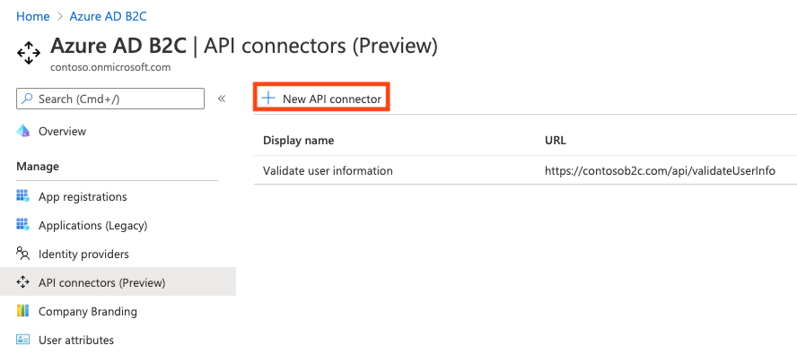
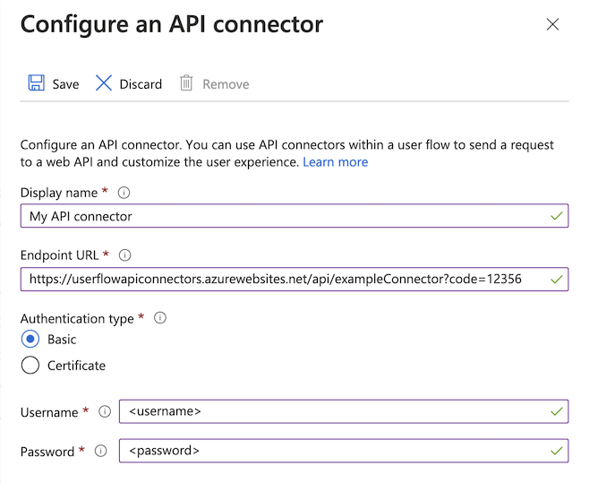
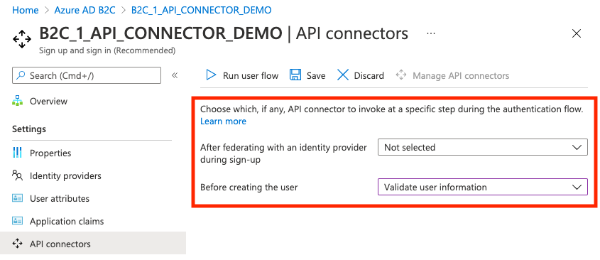
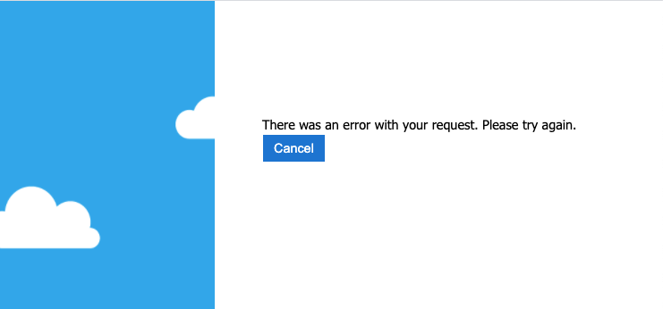
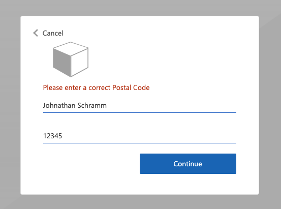
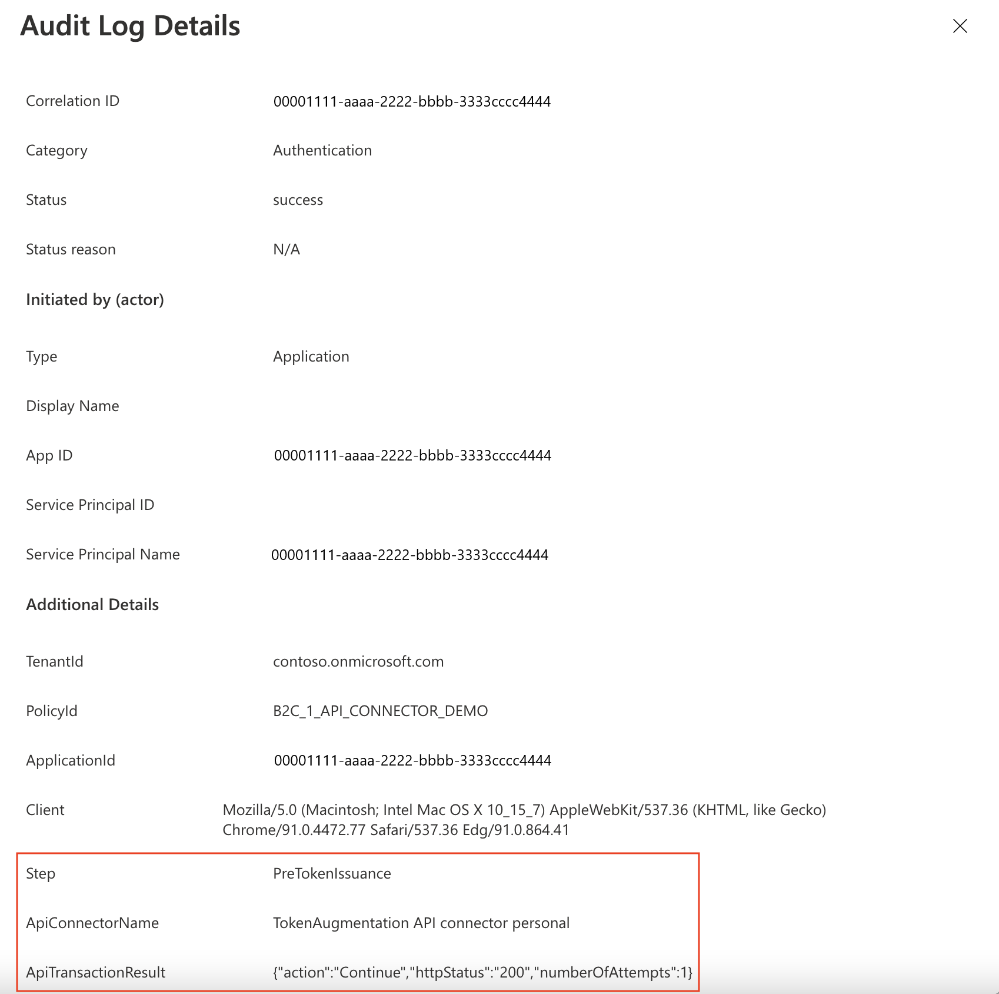

# Add an API connector to a sign-up user flow

[!INCLUDE [active-directory-b2c-choose-user-flow-or-custom-policy](../../includes/active-directory-b2c-choose-user-flow-or-custom-policy.md)]

As a developer or IT administrator, you can use API connectors to integrate your sign-up user flows with REST APIs to customize the sign-up experience and integrate with external systems. At the end of this walkthrough, you'll be able to create an Azure AD B2C user flow that interacts with [REST API services](api-connectors-overview.md) to modify your sign-up experiences. 

::: zone pivot="b2c-user-flow"
You can create an API endpoint using one of our [samples](api-connector-samples.md#api-connector-rest-api-samples).
::: zone-end

::: zone pivot="b2c-custom-policy"

In this scenario, we'll add the ability for users to enter a loyalty number into the Azure AD B2C sign-up page. The REST API validates whether the combination of email and loyalty number is mapped to a promotional code. If the REST API finds a promotional code for this user, it will be returned to Azure AD B2C. Finally, the promotional code will be inserted into the token claims for the application to consume.

You can also design the interaction as an orchestration step. This is suitable when the REST API will not be validating data on screen, and always return claims. For more information, see [Walkthrough: Integrate REST API claims exchanges in your Azure AD B2C user journey as an orchestration step](add-api-connector-token-enrichment.md).

::: zone-end

## Prerequisites

[!INCLUDE [active-directory-b2c-customization-prerequisites](../../includes/active-directory-b2c-customization-prerequisites.md)]

::: zone pivot="b2c-user-flow"

## Create an API connector

To use an [API connector](api-connectors-overview.md), you first create the API connector and then enable it in a user flow.

1. Sign in to the [Azure portal](https://portal.azure.com/).
1. Under **Azure services**, select **Azure AD B2C**.
1. Select **API connectors**, and then select **New API connector**.

   

1. Provide a display name for the call. For example, **Validate user information**.
1. Provide the **Endpoint URL** for the API call.
1. Choose the **Authentication type** and configure the authentication information for calling your API. Learn how to [Secure your API Connector](secure-rest-api.md).

   

1. Select **Save**.

## The request sent to your API
An API connector materializes as an **HTTP POST** request, sending user attributes ('claims') as key-value pairs in a JSON body. Attributes are serialized similarly to [Microsoft Graph](/graph/api/resources/user#properties) user properties. 

**Example request**
```http
POST <API-endpoint>
Content-type: application/json

{
 "email": "johnsmith@fabrikam.onmicrosoft.com",
 "identities": [
     {
     "signInType":"federated",
     "issuer":"facebook.com",
     "issuerAssignedId":"0123456789"
     }
 ],
 "displayName": "John Smith",
 "objectId": "11111111-0000-0000-0000-000000000000",
 "givenName":"John",
 "surname":"Smith",
 "jobTitle":"Supplier",
 "streetAddress":"1000 Microsoft Way",
 "city":"Seattle",
 "postalCode": "12345",
 "state":"Washington",
 "country":"United States",
 "extension_<extensions-app-id>_CustomAttribute1": "custom attribute value",
 "extension_<extensions-app-id>_CustomAttribute2": "custom attribute value",
 "step": "<step-name>",
 "client_id":"93fd07aa-333c-409d-955d-96008fd08dd9",
 "ui_locales":"en-US"
}
```

Only user properties and custom attributes listed in the **Azure AD B2C** > **User attributes** experience are available to be sent in the request.

Custom attributes exist in the **extension_\<extensions-app-id>_CustomAttribute**  format in the directory. Your API should expect to receive claims in this same serialized format. For more information on custom attributes, see [Define custom attributes in Azure AD B2C](user-flow-custom-attributes.md).

Additionally, these claims are typically sent in all requests:
- **UI Locales ('ui_locales')** -  An end-user's locale(s) as configured on their device. This can be used by your API to return internationalized responses.
- **Step ('step')** - The step or point on the user flow that the API connector was invoked for. Values include:
  - `PostFederationSignup` - corresponds to "After federating with an identity provider during sign-up"
  - `PostAttributeCollection` - corresponds to "Before creating the user"
  - `PreTokenIssuance` - corresponds to "Before sending the token (preview)". [Learn more about this step](add-api-connector-token-enrichment.md)
- **Client ID ('client_id')** - The `appId` value of the application that an end-user is authenticating to in a user flow. This is *not* the resource application's `appId` in access tokens.
- **Email Address ('email')** or [**identities ('identities')**](/graph/api/resources/objectidentity) - these claims can be used by your API to identify the end-user that is authenticating to the application.
  
> [!IMPORTANT]
> If a claim does not have a value at the time the API endpoint is called, the claim will not be sent to the API. Your API should be designed to explicitly check and handle the case in which a claim is not in the request.

## Enable the API connector in a user flow

Follow these steps to add an API connector to a sign-up user flow.

1. Sign in to the [Azure portal](https://portal.azure.com/).
1. Under **Azure services**, select **Azure AD B2C**.
1. Select **User flows**, and then select the user flow you want to add the API connector to.
1. Select **API connectors**, and then select the API endpoints you want to invoke at the following steps in the user flow:

   - **After federating with an identity provider during sign-up**
   - **Before creating the user**
   - **Before sending the token (preview)**

   

1. Select **Save**.

These steps only exist for **Sign up and sign in (Recommended)** and **Sign up (Recommended)** but only apply to the sign-up part of the experience.

## After federating with an identity provider during sign-up

An API connector at this step in the sign-up process is invoked immediately after the user authenticates with an identity provider (like Google, Facebook, and Microsoft Entra ID). This step precedes the ***attribute collection page***, which is the form presented to the user to collect user attributes. This step is not invoked if a user is registering with a local account.

### Example request sent to the API at this step
```http
POST <API-endpoint>
Content-type: application/json

{
 "email": "johnsmith@fabrikam.onmicrosoft.com",
 "identities": [ 
     {
     "signInType":"federated",
     "issuer":"facebook.com",
     "issuerAssignedId":"0123456789"
     }
 ],
 "displayName": "John Smith",
 "givenName":"John",
 "surname":"Smith",
 "step": "PostFederationSignup",
 "client_id":"<guid>",
 "ui_locales":"en-US"
}
```

The exact claims sent to the API depend on the information is provided by the identity provider. 'email' is always sent.

### Expected response types from the web API at this step

When the web API receives an HTTP request from Microsoft Entra ID during a user flow, it can return these responses:

- Continuation response
- Blocking response

#### Continuation response

A continuation response indicates that the user flow should continue to the next step: the attribute collection page.

In a continuation response, the API can return claims. If a claim is returned by the API, the claim does the following:

- Pre-fills the input field in the attribute collection page.

See an example of a [continuation response](#example-of-a-continuation-response).

#### Blocking Response

A blocking response exits the user flow. It can be purposely issued by the API to stop the continuation of the user flow by displaying a block page to the user. The block page displays the `userMessage` provided by the API.

See an example of a [blocking response](#example-of-a-blocking-response).

## Before creating the user

An API connector at this step in the sign-up process is invoked after the attribute collection page, if one is included. This step is always invoked before a user account is created.

### Example request sent to the API at this step

```http
POST <API-endpoint>
Content-type: application/json

{
 "email": "johnsmith@fabrikam.onmicrosoft.com",
 "identities": [
     {
     "signInType":"federated",
     "issuer":"facebook.com",
     "issuerAssignedId":"0123456789"
     }
 ],
 "displayName": "John Smith",
 "givenName":"John",
 "surname":"Smith",
 "jobTitle":"Supplier",
 "streetAddress":"1000 Microsoft Way",
 "city":"Seattle",
 "postalCode": "12345",
 "state":"Washington",
 "country":"United States",
 "extension_<extensions-app-id>_CustomAttribute1": "custom attribute value",
 "extension_<extensions-app-id>_CustomAttribute2": "custom attribute value",
 "step": "PostAttributeCollection",
 "client_id":"93fd07aa-333c-409d-955d-96008fd08dd9",
 "ui_locales":"en-US"
}
```

The claims that are sent to the API depend on the information is collected from the user or is provided by the identity provider.

### Expected response types from the web API at this step

When the web API receives an HTTP request from Microsoft Entra ID during a user flow, it can return these responses:

- Continuation response
- Blocking response
- Validation response

#### Continuation response

A continuation response indicates that the user flow should continue to the next step: create the user in the directory.

In a continuation response, the API can return claims. If a claim is returned by the API, the claim does the following:

- Overrides any value that has already been provided by a user in the attribute collection page.

To write claims to the directory on sign-up that shouldn't be collected from the user, you should still select the claims under **User attributes** of the user flow, which will by default ask the user for values, but you can use [custom JavaScript or CSS](customize-ui-with-html.md) to hide the input fields from an end user.

See an example of a [continuation response](#example-of-a-continuation-response).

#### Blocking Response
A blocking response exits the user flow. It can be purposely issued by the API to stop the continuation of the user flow by displaying a block page to the user. The block page displays the `userMessage` provided by the API.

See an example of a [blocking response](#example-of-a-blocking-response).

### Validation-error response
 When the API responds with a validation-error response, the user flow stays on the attribute collection page and a `userMessage` is displayed to the user. The user can then edit and resubmit the form. This type of response can be used for input validation.

See an example of a [validation-error response](#example-of-a-validation-error-response).

## Before sending the token (preview)

> [!IMPORTANT]
> API connectors used in this step are in preview. For more information about previews, see [Product Terms for Online Services](https://www.microsoft.com/licensing/terms/product/ForOnlineServices/all).

An API connector at this step is invoked when a token is about to be issued during sign-ins and sign-ups. An API connector for this step can be used to enrich the token with claim values from external sources.

### Example request sent to the API at this step

```http
POST <API-endpoint>
Content-type: application/json

{
 "clientId": "231c70e8-8424-48ac-9b5d-5623b9e4ccf3",
 "step": "PreTokenApplicationClaims",
 "ui_locales":"en-US",
 "email": "johnsmith@fabrikam.onmicrosoft.com",
 "identities": [
     {
     "signInType":"federated",
     "issuer":"facebook.com",
     "issuerAssignedId":"0123456789"
     }
 ],
 "displayName": "John Smith",
 "extension_<extensions-app-id>_CustomAttribute1": "custom attribute value",
 "extension_<extensions-app-id>_CustomAttribute2": "custom attribute value",
}
```

The claims that are sent to the API depend on the information defined for the user.

### Expected response types from the web API at this step

When the web API receives an HTTP request from Microsoft Entra ID during a user flow, it can return these responses:

- Continuation response

#### Continuation response

A continuation response indicates that the user flow should continue to the next step: issue the token.

In a continuation response, the API can return additional claims. A claim returned by the API that you want to return in the token must be a built-in claim or [defined as a custom attribute](user-flow-custom-attributes.md) and must be selected in the **Application claims** configuration of the user flow. 

The claim value in the token will be the value returned by the API, not the value in the directory. Some claim values cannot be overwritten by the API response. Claims that can be returned by the API correspond to the set found under **User attributes** with the exception of `email`.

See an example of a [continuation response](#example-of-a-continuation-response).

> [!NOTE]
> The API is only invoked during an initial authentication. When using refresh tokens to silently get new access or ID tokens, the token will include the values evaluated during the initial authentication. 

## Example responses

### Example of a continuation response

```http
HTTP/1.1 200 OK
Content-type: application/json

{
    "version": "1.0.0",
    "action": "Continue",
    "postalCode": "12349", // return claim
    "extension_<extensions-app-id>_CustomAttribute": "value" // return claim
}
```

| Parameter                                          | Type              | Required | Description                                                                                                                                                                                                                                                                            |
| -------------------------------------------------- | ----------------- | -------- | -------------------------------------------------------------------------------------------------------------------------------------------------------------------------------------------------------------------------------------------------------------------------------------- |
| version     | String | Yes      | The version of your API.                                                    |
| action                                             | String            | Yes      | Value must be `Continue`.                                                                                                                                                                                                                                                              |
| \<builtInUserAttribute>                            | \<attribute-type> | No       | Returned values can overwrite values collected from a user.                    |
| \<extension\_{extensions-app-id}\_CustomAttribute> | \<attribute-type> | No       | The claim does not need to contain `_<extensions-app-id>_`, it is *optional*. Returned values can overwrite values collected from a user. |

### Example of a blocking response

```http
HTTP/1.1 200 OK
Content-type: application/json

{
    "version": "1.0.0",
    "action": "ShowBlockPage",
    "userMessage": "There was a problem with your request. You are not able to sign up at this time. Please contact your system administrator",
}

```

| Parameter   | Type   | Required | Description                                                                |
| ----------- | ------ | -------- | -------------------------------------------------------------------------- |
| version     | String | Yes      | The version of your API.                                                    |
| action      | String | Yes      | Value must be `ShowBlockPage`                                              |
| userMessage | String | Yes      | Message to display to the user.                                            |

**End-user experience with a blocking response**



### Example of a validation-error response

```http
HTTP/1.1 400 Bad Request
Content-type: application/json

{
    "version": "1.0.0",
    "status": 400,
    "action": "ValidationError",
    "userMessage": "Please enter a valid Postal Code."
}
```

| Parameter   | Type    | Required | Description                                                                |
| ----------- | ------- | -------- | -------------------------------------------------------------------------- |
| version     | String  | Yes      | The version of your API.                                                    |
| action      | String  | Yes      | Value must be `ValidationError`.                                           |
| status      | Integer / String | Yes      | Must be value `400`, or `"400"` for a ValidationError response.  |
| userMessage | String  | Yes      | Message to display to the user.                                            |

> [!NOTE]
> HTTP status code has to be "400" in addition to the "status" value in the body of the response.

**End-user experience with a validation-error response**



::: zone-end

::: zone pivot="b2c-custom-policy"


## Prepare a REST API endpoint

For this walkthrough, you should have a REST API that validates whether an email address is registered in your back-end system with a loyalty ID. If registered, the REST API should return a registration promotion code, which the customer can use to buy goods within your application. Otherwise, the REST API should return an HTTP 409 error message: "Loyalty ID '{loyalty ID}' is not associated with '{email}' email address.".

The following JSON code illustrates the data Azure AD B2C will send to your REST API endpoint. 

```json
{
    "email": "User email address",
    "language": "Current UI language",
    "loyaltyId": "User loyalty ID"
}
```

Once your REST API validates the data, it must return an HTTP 200 (Ok), with the following JSON data:

```json
{
    "promoCode": "24534"
}
```

If the validation failed, the REST API must return an HTTP 409 (Conflict), with the `userMessage` JSON element. The IEF expects the `userMessage` claim that the REST API returns. This claim will be presented as a string to the user if the validation fails.

```json
{
    "version": "1.0.1",
    "status": 409,
    "userMessage": "LoyaltyId ID '1234' is not associated with 'david@contoso.com' email address."
}
```

The setup of the REST API endpoint is outside the scope of this article. We have created an [Azure Functions](../azure-functions/functions-reference.md) sample. You can access the complete Azure function code at [GitHub](https://github.com/azure-ad-b2c/rest-api/tree/master/source-code/azure-function).

## Define claims

A claim provides temporary storage of data during an Azure AD B2C policy execution. You can declare claims within the [claims schema](claimsschema.md) section. 

1. Open the extensions file of your policy. For example, <em>`SocialAndLocalAccounts/`**`TrustFrameworkExtensions.xml`**</em>.
1. Search for the [BuildingBlocks](buildingblocks.md) element. If the element doesn't exist, add it.
1. Locate the [ClaimsSchema](claimsschema.md) element. If the element doesn't exist, add it.
1. Add the following claims to the **ClaimsSchema** element.  

```xml
<ClaimType Id="loyaltyId">
  <DisplayName>Your loyalty ID</DisplayName>
  <DataType>string</DataType>
  <UserInputType>TextBox</UserInputType>
</ClaimType>
<ClaimType Id="promoCode">
  <DisplayName>Your promo code</DisplayName>
  <DataType>string</DataType>
  <UserInputType>Paragraph</UserInputType>
</ClaimType>
  <ClaimType Id="userLanguage">
  <DisplayName>User UI language (used by REST API to return localized error messages)</DisplayName>
  <DataType>string</DataType>
</ClaimType>
```

## Add the RESTful API technical profile 

A [Restful technical profile](restful-technical-profile.md) provides support for interfacing to your own RESTful service. Azure AD B2C sends data to the RESTful service in an `InputClaims` collection and receives data back in an `OutputClaims` collection. Find the **ClaimsProviders** element and add a new claims provider as follows:

```xml
<ClaimsProvider>
  <DisplayName>REST APIs</DisplayName>
  <TechnicalProfiles>
    <TechnicalProfile Id="REST-ValidateProfile">
      <DisplayName>Check loyaltyId Azure Function web hook</DisplayName>
      <Protocol Name="Proprietary" Handler="Web.TPEngine.Providers.RestfulProvider, Web.TPEngine, Version=1.0.0.0, Culture=neutral, PublicKeyToken=null" />
      <Metadata>
        <!-- Set the ServiceUrl with your own REST API endpoint -->
        <Item Key="ServiceUrl">https://your-account.azurewebsites.net/api/ValidateProfile?code=your-code</Item>
        <Item Key="SendClaimsIn">Body</Item>
        <!-- Set AuthenticationType to Basic or ClientCertificate in production environments -->
        <Item Key="AuthenticationType">None</Item>
        <!-- REMOVE the following line in production environments -->
        <Item Key="AllowInsecureAuthInProduction">true</Item>
      </Metadata>
      <InputClaims>
        <!-- Claims sent to your REST API -->
        <InputClaim ClaimTypeReferenceId="loyaltyId" />
        <InputClaim ClaimTypeReferenceId="email" />
        <InputClaim ClaimTypeReferenceId="userLanguage" PartnerClaimType="lang" DefaultValue="{Culture:LCID}" AlwaysUseDefaultValue="true" />
      </InputClaims>
      <OutputClaims>
        <!-- Claims parsed from your REST API -->
        <OutputClaim ClaimTypeReferenceId="promoCode" />
      </OutputClaims>
      <UseTechnicalProfileForSessionManagement ReferenceId="SM-Noop" />
    </TechnicalProfile>
  </TechnicalProfiles>
</ClaimsProvider>
```

In this example, the `userLanguage` will be sent to the REST service as `lang` within the JSON payload. The value of the `userLanguage` claim contains the current user language ID. For more information, see [claim resolver](claim-resolver-overview.md).

### Configure the RESTful API technical profile 

After you deploy your REST API, set the metadata of the `REST-ValidateProfile` technical profile to reflect your own REST API, including:

- **ServiceUrl**. Set the URL of the REST API endpoint.
- **SendClaimsIn**. Specify how the input claims are sent to the RESTful claims provider.
- **AuthenticationType**. Set the type of authentication being performed by the RESTful claims provider. 
- **AllowInsecureAuthInProduction**. In a production environment, make sure to set this metadata to `true`
	
See the [RESTful technical profile metadata](restful-technical-profile.md#metadata) for more configurations.

The comments above `AuthenticationType` and `AllowInsecureAuthInProduction` specify changes you should make when you move to a production environment. To learn how to secure your RESTful APIs for production, see [Secure RESTful API](secure-rest-api.md).

## Validate the user input

To obtain the user's loyalty number during sign-up, you must allow the user to enter this data on the screen. Add the **loyaltyId** output claim to the sign-up page by adding it to the existing sign-up technical profile section's `OutputClaims` element. Specify the entire list of output claims to control the order the claims are presented on the screen.  

Add the validation technical profile reference to the sign-up technical profile, which calls the `REST-ValidateProfile`. The new validation technical profile will be added to the top of the `<ValidationTechnicalProfiles>` collection defined in the base policy. This behavior means that only after successful validation, Azure AD B2C moves on to create the account in the directory.   

1. Find the **ClaimsProviders** element. Add a new claims provider as follows:

    ```xml
    <ClaimsProvider>
      <DisplayName>Local Account</DisplayName>
      <TechnicalProfiles>
        <TechnicalProfile Id="LocalAccountSignUpWithLogonEmail">
          <OutputClaims>
            <OutputClaim ClaimTypeReferenceId="email" PartnerClaimType="Verified.Email" Required="true"/>
            <OutputClaim ClaimTypeReferenceId="newPassword" Required="true"/>
            <OutputClaim ClaimTypeReferenceId="reenterPassword" Required="true"/>
            <OutputClaim ClaimTypeReferenceId="displayName"/>
            <OutputClaim ClaimTypeReferenceId="givenName"/>
            <OutputClaim ClaimTypeReferenceId="surName"/>
            <!-- Required to present the text box to collect the data from the user -->
            <OutputClaim ClaimTypeReferenceId="loyaltyId"/>
            <!-- Required to pass the promoCode returned from "REST-ValidateProfile" 
            to subsequent orchestration steps and token issuance-->
            <OutputClaim ClaimTypeReferenceId="promoCode" />
          </OutputClaims>
          <ValidationTechnicalProfiles>
            <ValidationTechnicalProfile ReferenceId="REST-ValidateProfile" />
          </ValidationTechnicalProfiles>
        </TechnicalProfile>
      </TechnicalProfiles>
    </ClaimsProvider>
    <ClaimsProvider>
      <DisplayName>Self Asserted</DisplayName>
      <TechnicalProfiles>
        <TechnicalProfile Id="SelfAsserted-Social">
          <InputClaims>
            <InputClaim ClaimTypeReferenceId="email" />
          </InputClaims>
            <OutputClaims>
            <OutputClaim ClaimTypeReferenceId="email" />
            <OutputClaim ClaimTypeReferenceId="displayName"/>
            <OutputClaim ClaimTypeReferenceId="givenName"/>
            <OutputClaim ClaimTypeReferenceId="surname"/>
            <!-- Required to present the text box to collect the data from the user -->
            <OutputClaim ClaimTypeReferenceId="loyaltyId"/>
            <!-- Required to pass the promoCode returned from "REST-ValidateProfile" 
            to subsequent orchestration steps and token issuance-->
            <OutputClaim ClaimTypeReferenceId="promoCode" />
          </OutputClaims>
          <ValidationTechnicalProfiles>
            <ValidationTechnicalProfile ReferenceId="REST-ValidateProfile"/>
          </ValidationTechnicalProfiles>
        </TechnicalProfile>
      </TechnicalProfiles>
    </ClaimsProvider>
    ```

## Include a claim in the token 

To return the promo code claim back to the relying party application, add an output claim to the <em>`SocialAndLocalAccounts/`**`SignUpOrSignIn.xml`**</em> file. The output claim will allow the claim to be added into the token after a successful user journey, and will be sent to the application. Modify the technical profile element within the relying party section to add the `promoCode` as an output claim.
 
```xml
<RelyingParty>
  <DefaultUserJourney ReferenceId="SignUpOrSignIn" />
  <TechnicalProfile Id="PolicyProfile">
    <DisplayName>PolicyProfile</DisplayName>
    <Protocol Name="OpenIdConnect" />
    <OutputClaims>
      <OutputClaim ClaimTypeReferenceId="displayName" />
      <OutputClaim ClaimTypeReferenceId="givenName" />
      <OutputClaim ClaimTypeReferenceId="surname" />
      <OutputClaim ClaimTypeReferenceId="email" />
      <OutputClaim ClaimTypeReferenceId="objectId" PartnerClaimType="sub"/>
      <OutputClaim ClaimTypeReferenceId="identityProvider" />
      <OutputClaim ClaimTypeReferenceId="tenantId" AlwaysUseDefaultValue="true" DefaultValue="{Policy:TenantObjectId}" />
      <OutputClaim ClaimTypeReferenceId="promoCode" DefaultValue="" />
    </OutputClaims>
    <SubjectNamingInfo ClaimType="sub" />
  </TechnicalProfile>
</RelyingParty>
```

## Test the custom policy

1. Sign in to the [Azure portal](https://portal.azure.com).
1. If you have access to multiple tenants, select the **Settings** icon in the top menu to switch to your Microsoft Entra ID tenant from the **Directories + subscriptions** menu.
1. Choose **All services** in the top-left corner of the Azure portal, and then search for and select **App registrations**.
1. Select **Identity Experience Framework**.
1. Select **Upload Custom Policy**, and then upload the policy files that you changed: *TrustFrameworkExtensions.xml*, and *SignUpOrSignin.xml*. 
1. Select the sign-up or sign-in policy that you uploaded, and click the **Run now** button.
1. You should be able to sign up using an email address.
1. Click on the **Sign-up now** link.
1. In the **Your loyalty ID**, type 1234, and click **Continue**. At this point, you should get a validation error message.
1. Change to another value and click **Continue**.
1. The token sent back to your application includes the `promoCode` claim.

```json
{
  "typ": "JWT",
  "alg": "RS256",
  "kid": "X5eXk4xyojNFum1kl2Ytv8dlNP4-c57dO6QGTVBwaNk"
}.{
  "exp": 1584295703,
  "nbf": 1584292103,
  "ver": "1.0",
  "iss": "https://contoso.b2clogin.com/f06c2fe8-709f-4030-85dc-38a4bfd9e82d/v2.0/",
  "aud": "e1d2612f-c2bc-4599-8e7b-d874eaca1ee1",
  "acr": "b2c_1a_signup_signin",
  "nonce": "defaultNonce",
  "iat": 1584292103,
  "auth_time": 1584292103,
  "name": "Emily Smith",
  "email": "emily@outlook.com",
  "given_name": "Emily",
  "family_name": "Smith",
  "promoCode": "84362"
  ...
}
```

::: zone-end

## Best practices and how to troubleshoot

::: zone pivot="b2c-user-flow"

### Using serverless cloud functions

Serverless functions, like [HTTP triggers in Azure Functions](../azure-functions/functions-bindings-http-webhook-trigger.md), provide a way create API endpoints to use with the API connector. You can use the serverless cloud function to, [for example](api-connector-samples.md#api-connector-rest-api-samples), perform validation logic and limit sign-ups to specific email domains. The serverless cloud function can also call and invoke other web APIs, data stores, and other cloud services for complex scenarios.

### Best practices
Ensure that:
* Your API is following the API request and response contracts as outlined above. 
* The **Endpoint URL** of the API connector points to the correct API endpoint.
* Your API explicitly checks for null values of received claims that it depends on.
* Your API implements an authentication method outlined in [secure your API Connector](secure-rest-api.md).
* Your API responds as quickly as possible to ensure a fluid user experience.
    * Azure AD B2C will wait for a maximum of *20 seconds* to receive a response. If none is received, it will make *one more attempt (retry)* at calling your API.
    * If using a serverless function or scalable web service, use a hosting plan that keeps the API "awake" or "warm" in production. For Azure Functions, it's recommended to use at minimum the [Premium plan](../azure-functions/functions-scale.md) in production.
* Ensure high availability of your API.
* Monitor and optimize performance of downstream APIs, databases, or other dependencies of your API.
  
[!INCLUDE [active-directory-b2c-https-cipher-tls-requirements](../../includes/active-directory-b2c-https-cipher-tls-requirements.md)]

### Use logging

In general, it's helpful to use the logging tools enabled by your web API service, like [Application insights](../azure-functions/functions-monitoring.md), to monitor your API for unexpected error codes, exceptions, and poor performance.
* Monitor for HTTP status codes that aren't HTTP 200 or 400.
* A 401 or 403 HTTP status code typically indicates there's an issue with your authentication. Double-check your API's authentication layer and the corresponding configuration in the API connector.
* Use more aggressive levels of logging (for example "trace" or "debug") in development if needed.
* Monitor your API for long response times. 

Additionally, Azure AD B2C logs metadata about the API transactions that happen during user authentications via a user flow. To find these:
1. Go to **Azure AD B2C**.
2. Under **Activities**, select **Audit logs**.
3. Filter the list view: For **Date**, select the time interval you want, and for **Activity**, select **An API was called as part of a user flow**.
4. Inspect individual logs. Each row represents an API connector attempting to be called during a user flow. If an API call fails and a retry occurs, it's still represented as a single row. The `numberOfAttempts` indicates the number of times your API was called. This value can be `1`or `2`. Other information about the API call is detailed in the logs.



::: zone-end

::: zone pivot="b2c-custom-policy"

### Using serverless cloud functions

Serverless cloud functions, like [HTTP triggers in Azure Functions](../azure-functions/functions-bindings-http-webhook-trigger.md), provide a simple, highly available, high performant way to create API endpoints to use as API connectors.

### Best practices
Ensure that:
* Your API explicitly checks for null values of received claims that it depends on.
* Your API implements an authentication method outlined in [secure your API Connector](secure-rest-api.md).
* Your API responds as quickly as possible to ensure a fluid user experience. 
    * If using a serverless function or scalable web service, use a hosting plan that keeps the API "awake" or "warm" in production. For Azure Functions, it's recommended to use at minimum the [Premium plan](../azure-functions/functions-scale.md)
* Ensure high availability of your API.
* Monitor and optimize performance of downstream APIs, databases, or other dependencies of your API.

[!INCLUDE [active-directory-b2c-https-cipher-tls-requirements](../../includes/active-directory-b2c-https-cipher-tls-requirements.md)]
 
### Use logging

In general, it's helpful to use the logging tools enabled by your web API service, like [Application insights](../azure-functions/functions-monitoring.md), to monitor your API for unexpected error codes, exceptions, and poor performance.
* Monitor for HTTP status codes that aren't HTTP 200 or 400.
* A 401 or 403 HTTP status code typically indicates there's an issue with your authentication. Double-check your API's authentication layer and the corresponding configuration in the API connector.
* Use more aggressive levels of logging (for example "trace" or "debug") in development if needed.
* Monitor your API for long response times.

::: zone-end

## Next steps

::: zone pivot="b2c-user-flow"

- Get started with our [samples](api-connector-samples.md#api-connector-rest-api-samples).
- [Secure your API Connector](secure-rest-api.md)

::: zone-end

::: zone pivot="b2c-custom-policy"

- [Walkthrough: Integrate REST API claims exchanges in your Azure AD B2C user journey as an orchestration step](add-api-connector-token-enrichment.md)
- [Secure your API Connector](secure-rest-api.md)
- [Reference: RESTful technical profile](restful-technical-profile.md)

::: zone-end
