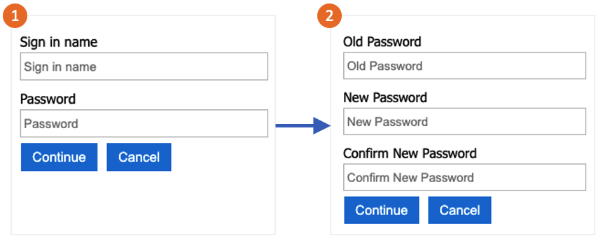

# Set up password change by using custom policies in Azure Active Directory B2C
 
[!INCLUDE [active-directory-b2c-choose-user-flow-or-custom-policy](../../includes/active-directory-b2c-choose-user-flow-or-custom-policy.md)]

You can configure Azure Active Directory B2C (Azure AD B2C) so that a user who is signed in with a local account can change their password without using email verification to prove their identity. 

The password change flow involves the following steps:

1. The user signs in to their local account. If the session is still active, Azure AD B2C authorizes the user and skips to the next step.
1. In **Old password**, the user verifies their old password. In **New password**, they create and confirm their new password.

     

> [!TIP]
> A user can use the password change flow that's described in this article only when they know their password and they want to change their password. We recommend that you also enable [self-service password reset](add-password-reset-policy.md) to support cases in which the user forgets their password.

::: zone pivot="b2c-user-flow"

[!INCLUDE [active-directory-b2c-limited-to-custom-policy](../../includes/active-directory-b2c-limited-to-custom-policy.md)]

::: zone-end

::: zone pivot="b2c-custom-policy"

## Prerequisites

* Complete the steps in [Get started with custom policies in Active Directory B2C](tutorial-create-user-flows.md?pivots=b2c-custom-policy).
* [Register a web application in Azure Active Directory B2C](tutorial-register-applications.md).

## Add the elements

1. Open your *TrustFrameworkExtensions.xml* file. Add the following **ClaimType** element to the [ClaimsSchema](claimsschema.md) element, with an identifier of `oldPassword`:

    ```xml
    <BuildingBlocks>
      <ClaimsSchema>
        <ClaimType Id="oldPassword">
          <DisplayName>Old Password</DisplayName>
          <DataType>string</DataType>
          <UserHelpText>Enter your old password</UserHelpText>
          <UserInputType>Password</UserInputType>
        </ClaimType>
      </ClaimsSchema>
    </BuildingBlocks>
    ```

1. A [ClaimsProvider](claimsproviders.md) element contains the technical profile that authenticates the user. Add the following claims providers to the **ClaimsProviders** element:

    ```xml
    <ClaimsProviders>
      <ClaimsProvider>
        <DisplayName>Local Account SignIn</DisplayName>
        <TechnicalProfiles>
          <TechnicalProfile Id="login-NonInteractive-PasswordChange">
            <DisplayName>Local Account SignIn</DisplayName>
            <InputClaims>
              <InputClaim ClaimTypeReferenceId="oldPassword" PartnerClaimType="password" Required="true" />
              </InputClaims>
            <IncludeTechnicalProfile ReferenceId="login-NonInteractive" />
          </TechnicalProfile>
        </TechnicalProfiles>
      </ClaimsProvider>
      <ClaimsProvider>
        <DisplayName>Local Account Password Change</DisplayName>
        <TechnicalProfiles>
          <TechnicalProfile Id="LocalAccountWritePasswordChangeUsingObjectId">
            <DisplayName>Change password (username)</DisplayName>
            <Protocol Name="Proprietary" Handler="Web.TPEngine.Providers.SelfAssertedAttributeProvider, Web.TPEngine, Version=1.0.0.0, Culture=neutral, PublicKeyToken=null" />
            <Metadata>
              <Item Key="ContentDefinitionReferenceId">api.selfasserted</Item>
            </Metadata>
            <InputClaims>
              <InputClaim ClaimTypeReferenceId="objectId" />
            </InputClaims>
            <OutputClaims>
              <OutputClaim ClaimTypeReferenceId="oldPassword" Required="true" />
              <OutputClaim ClaimTypeReferenceId="newPassword" Required="true" />
              <OutputClaim ClaimTypeReferenceId="reenterPassword" Required="true" />
            </OutputClaims>
            <ValidationTechnicalProfiles>
              <ValidationTechnicalProfile ReferenceId="login-NonInteractive-PasswordChange" />
              <ValidationTechnicalProfile ReferenceId="AAD-UserWritePasswordUsingObjectId" />
            </ValidationTechnicalProfiles>
          </TechnicalProfile>
        </TechnicalProfiles>
      </ClaimsProvider>
    </ClaimsProviders>
    ```

1. The [UserJourneys](userjourneys.md) element defines the path that the user takes when they interact with your application. Add the **UserJourneys** element if it doesn't exist, with the **UserJourney** identifier of `PasswordChange`:

    ```xml
    <UserJourneys>
      <UserJourney Id="PasswordChange">
        <OrchestrationSteps>
          <OrchestrationStep Order="1" Type="ClaimsProviderSelection" ContentDefinitionReferenceId="api.signuporsignin">
            <ClaimsProviderSelections>
              <ClaimsProviderSelection TargetClaimsExchangeId="LocalAccountSigninEmailExchange" />
            </ClaimsProviderSelections>
          </OrchestrationStep>
          <OrchestrationStep Order="2" Type="ClaimsExchange">
            <ClaimsExchanges>
              <ClaimsExchange Id="LocalAccountSigninEmailExchange" TechnicalProfileReferenceId="SelfAsserted-LocalAccountSignin-Email" />
            </ClaimsExchanges>
          </OrchestrationStep>
          <OrchestrationStep Order="3" Type="ClaimsExchange">
            <ClaimsExchanges>
              <ClaimsExchange Id="NewCredentials" TechnicalProfileReferenceId="LocalAccountWritePasswordChangeUsingObjectId" />
            </ClaimsExchanges>
          </OrchestrationStep>
          <OrchestrationStep Order="4" Type="ClaimsExchange">
            <ClaimsExchanges>
              <ClaimsExchange Id="AADUserReadWithObjectId" TechnicalProfileReferenceId="AAD-UserReadUsingObjectId" />
            </ClaimsExchanges>
          </OrchestrationStep>
          <OrchestrationStep Order="5" Type="SendClaims" CpimIssuerTechnicalProfileReferenceId="JwtIssuer" />
        </OrchestrationSteps>
        <ClientDefinition ReferenceId="DefaultWeb" />
      </UserJourney>
    </UserJourneys>
    ```

1. Save the *TrustFrameworkExtensions.xml* policy file.
1. Copy the *ProfileEdit.xml* file that you downloaded with the starter pack and name it *ProfileEditPasswordChange.xml*.
1. Open the new file and update the **PolicyId** attribute with a unique value. This value is the name of your policy. For example, *B2C_1A_profile_edit_password_change*.
1. Modify the **ReferenceId** attribute in **DefaultUserJourney** to match the ID of the new user journey that you created. For example, *PasswordChange*.
1. Save your changes.

## Upload and test the policy

1. Sign in to the [Azure portal](https://portal.azure.com/).
1. If you have access to multiple tenants, select the **Settings** icon in the top menu to switch to your Azure AD B2C tenant from the **Directories + subscriptions** menu.
1. Choose **All services** in the top-left corner of the Azure portal, and then search for and select **Azure AD B2C**.
1. Select **Identity Experience Framework**.
1. In **Custom Policies**, select **Upload Policy**.
1. Select **Overwrite the policy if it exists**, and then search for and select the *TrustFrameworkExtensions.xml* file.
1. Select **Upload**.
1. Repeat steps 5 through 7 for the relying party file, such as *ProfileEditPasswordChange.xml*.

## Run the policy

1. Open the policy that you changed. For example, *B2C_1A_profile_edit_password_change*.
1. For **Application**, select the application that you registered earlier. To see the token, the **Reply URL** should show `https://jwt.ms`.
1. Select **Run now**. In the new tab that opens, remove "&prompt=login" from the URL and refresh the tab. Then, sign in with the account you created earlier. A password change dialog gives you the option to change the password.

## Next steps

* Find the [sample policy on GitHub](https://github.com/Azure-Samples/active-directory-b2c-custom-policy-starterpack/tree/master/scenarios/password-change).
* Learn about how you can [configure password complexity in Azure AD B2C](password-complexity.md).
* Set up a [password reset flow](add-password-reset-policy.md).

::: zone-end
