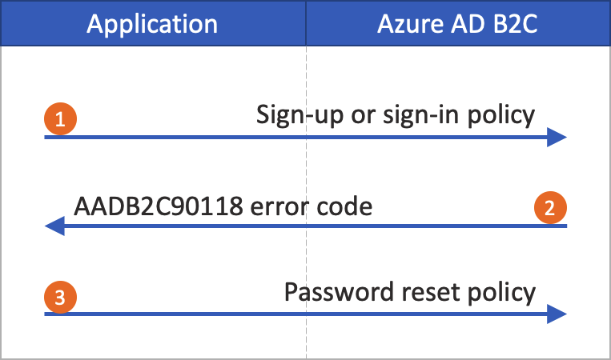

# Set up a password reset flow in Azure Active Directory B2C

[!INCLUDE [active-directory-b2c-choose-user-flow-or-custom-policy](../../includes/active-directory-b2c-choose-user-flow-or-custom-policy.md)]

In a [sign-up and sign-in journey](add-sign-up-and-sign-in-policy.md), a user can reset their own password by using the **Forgot your password?** link. This self-service password reset flow applies to local accounts in Azure Active Directory B2C (Azure AD B2C) that use an [email address](sign-in-options.md#email-sign-in) or a [username](sign-in-options.md#username-sign-in) with a password for sign-in.

The password reset flow involves the following steps:

1. On the sign-up and sign-in page, the user selects the **Forgot your password?** link. Azure AD B2C initiates the password reset flow.
1. In the next dialog that appears, the user enters their email address, and then selects **Send verification code**. Azure AD B2C sends a verification code to the user's email account. The user copies the verification code from the email, enters the code in the Azure AD B2C password reset dialog, and then selects **Verify code**.
1. The user can then enter a new password. (After the email is verified, the user can still select the **Change e-mail** button; see [Hide the change email button](#hide-the-change-email-button).)

:::image type="content" source="./media/add-password-reset-policy/password-reset-flow.png" alt-text="Diagram that shows three dialogs in the password reset flow." lightbox="./media/add-password-reset-policy/password-reset-flow.png":::

> [!TIP]
> A user can change their password by using the self-service password reset flow if they forget their password and want to reset it. You can also choose one of the following user flow options:
> - If a user knows their password and wants to change it, use a [password change flow](add-password-change-policy.md).
> - If you want to force a user to reset their password (for example, when they sign in for the first time, when their passwords have been reset by an admin, or after they've been migrated to Azure AD B2C with random passwords), use a [force password reset](force-password-reset.md) flow.

The default name of the **Change email** button in *selfAsserted.html* is **changeclaims**. To find the button name, on the sign-up page, inspect the page source by using a browser tool such as _Inspect_.

## Prerequisites

[!INCLUDE [active-directory-b2c-customization-prerequisites](../../includes/active-directory-b2c-customization-prerequisites.md)]

### Hide the change email button

After the email is verified, the user can still select **Change email**, enter another email address, and then repeat email verification. If you'd prefer to hide the **Change email** button, you can modify the CSS to hide the associated HTML elements in the dialog. For example, you can add the following CSS entry to selfAsserted.html and [customize the user interface by using HTML templates](customize-ui-with-html.md):

```html
<style type="text/css">
   .changeClaims
   {
     visibility: hidden;
   }
</style>
```

## Self-service password reset (recommended)

The new password reset experience is now part of the sign-up or sign-in policy. When the user selects the **Forgot your password?** link, they are immediately sent to the Forgot Password experience. Your application no longer needs to handle the [AADB2C90118 error code](#password-reset-policy-legacy), and you don't need a separate policy for password reset.

::: zone pivot="b2c-user-flow"

The self-service password reset experience can be configured for the Sign in (Recommended) or Sign up and sign in (Recommended) user flows. If you don't have one of these user flows set up, create a [sign-up or sign-in](add-sign-up-and-sign-in-policy.md) user flow.

To set up self-service password reset for the sign-up or sign-in user flow:

1. Sign in to the [Azure portal](https://portal.azure.com).
1. If you have access to multiple tenants, select the **Settings** icon in the top menu to switch to your Azure AD B2C tenant from the **Directories + subscriptions** menu.
1. In the Azure portal, search for and select **Azure AD B2C**.
1. Select **User flows**.
1. Select a sign-up or sign-in user flow (of type **Recommended**) that you want to customize.
1. In the menu under **Settings**, select **Properties**.
1. Under **Password configuration**, select **Self-service password reset**.
1. Select **Save**.
1. In the left menu under **Customize**, select **Page layouts**.
1. In **Page Layout Version**, select **2.1.3** or later.
1. Select **Save**.

::: zone-end

::: zone pivot="b2c-custom-policy"

The following sections describe how to add a self-service password experience to a custom policy. The sample is based on the policy files that are included in the [custom policy starter pack](./tutorial-create-user-flows.md?pivots=b2c-custom-policy#custom-policy-starter-pack).

> [!TIP]
> You can find a complete sample of the Sign Up and Sign In with Password Reset policy on [GitHub](https://github.com/azure-ad-b2c/samples/tree/master/policies/embedded-password-reset).

### Indicate that a user selected the Forgot your password? link

To indicate to the policy that a user selected the **Forgot your password?** link, define a Boolean claim. Use the claim to direct the user journey to the **Forgot Password** technical profile. The claim also can be issued to the token, so the application detects that the user signed in by using the Forgot Password user flow.

Declare your claims in the [claims schema](claimsschema.md). Open the extensions file of your policy, for example, in *SocialAndLocalAccounts/TrustFrameworkExtensions.xml*.

1. Search for the [BuildingBlocks](buildingblocks.md) element. If the element doesn't exist, add it.
1. Locate the [ClaimsSchema](claimsschema.md) element. If the element doesn't exist, add it.
1. Add the following claim to the **ClaimsSchema** element.

    ```xml
    <!-- 
    <BuildingBlocks>
      <ClaimsSchema> -->
        <ClaimType Id="isForgotPassword">
          <DisplayName>isForgotPassword</DisplayName>
          <DataType>boolean</DataType>
          <AdminHelpText>Whether the user has selected Forgot your Password</AdminHelpText>
        </ClaimType>
      <!--
      </ClaimsSchema>
    </BuildingBlocks> -->
    ```

### Upgrade the page layout version

[Page layout version](contentdefinitions.md#migrating-to-page-layout) 2.1.2 is required to enable the self-service password reset flow in the sign-up or sign-in journey. To upgrade the page layout version:

1. Open the base file of your policy, for example, *SocialAndLocalAccounts/TrustFrameworkBase.xml*.
1. Search for the [BuildingBlocks](buildingblocks.md) element. If the element doesn't exist, add it.
1. Locate the [ContentDefinitions](contentdefinitions.md) element. If the element doesn't exist, add it.
1. Modify the **DataURI** element within the **ContentDefinition** element to have the ID `api.signuporsignin`:

    ```xml
    <!-- 
    <BuildingBlocks>
      <ContentDefinitions> -->
        <ContentDefinition Id="api.signuporsignin">
          <DataUri>urn:com:microsoft:aad:b2c:elements:contract:unifiedssp:2.1.2</DataUri>
        </ContentDefinition>
      <!-- 
      </ContentDefinitions>
    </BuildingBlocks> -->
    ```

### Add the technical profiles
A claims transformation technical profile accesses the `isForgotPassword` claim. The technical profile is referenced later. When it's invoked, it sets the value of the `isForgotPassword` claim to `true`. 

1. Open the extensions file of your policy, for example, in *SocialAndLocalAccounts/TrustFrameworkExtensions.xml*.
1. Find the **ClaimsProviders** element (if the element doesn't exist, create it), and then add the following claims provider:

```xml
<!-- 
<ClaimsProviders> -->
  <ClaimsProvider>
    <DisplayName>Local Account</DisplayName>
    <TechnicalProfiles>
      <TechnicalProfile Id="ForgotPassword">
        <DisplayName>Forgot your password?</DisplayName>
        <Protocol Name="Proprietary" Handler="Web.TPEngine.Providers.ClaimsTransformationProtocolProvider, Web.TPEngine, Version=1.0.0.0, Culture=neutral, PublicKeyToken=null"/>
        <OutputClaims>
          <OutputClaim ClaimTypeReferenceId="isForgotPassword" DefaultValue="true" AlwaysUseDefaultValue="true"/>
        </OutputClaims>
        <UseTechnicalProfileForSessionManagement ReferenceId="SM-Noop" />
      </TechnicalProfile>
      <TechnicalProfile Id="SelfAsserted-LocalAccountSignin-Email">
        <Metadata>
          <Item Key="setting.forgotPasswordLinkOverride">ForgotPasswordExchange</Item>
        </Metadata>
      </TechnicalProfile>
      <TechnicalProfile Id="LocalAccountWritePasswordUsingObjectId">
        <UseTechnicalProfileForSessionManagement ReferenceId="SM-AAD" />
      </TechnicalProfile>
    </TechnicalProfiles>
  </ClaimsProvider>
<!-- 
</ClaimsProviders> -->
```

The **SelfAsserted-LocalAccountSignin-Email** technical profile **setting.forgotPasswordLinkOverride** defines the password reset claims exchange that executes in your user journey.

The **LocalAccountWritePasswordUsingObjectId** technical profile **UseTechnicalProfileForSessionManagement** `SM-AAD` session manager is required for the user to preform subsequent logins successfully under [SSO](./custom-policy-reference-sso.md) conditions.

### Add the password reset sub journey

The user can now sign in, sign up, and perform password reset in your user journey. To better organize the user journey, you can use a [sub journey](subjourneys.md) to handle the password reset flow.

The sub journey is called from the user journey and performs the specific steps that deliver the password reset experience to the user. Use the `Call` type sub journey so that when the sub journey is finished, control is returned to the orchestration step that initiated the sub journey.

1. Open the extensions file of your policy, such as *SocialAndLocalAccounts/TrustFrameworkExtensions.xml*.
1. Find the **SubJourneys** element. If the element doesn't exist, add it after the **User Journeys** element. Then, add the following sub journey:

```xml
<!--
<SubJourneys>-->
  <SubJourney Id="PasswordReset" Type="Call">
    <OrchestrationSteps>
      <!-- Validate user's email address. -->
      <OrchestrationStep Order="1" Type="ClaimsExchange">
        <ClaimsExchanges>
          <ClaimsExchange Id="PasswordResetUsingEmailAddressExchange" TechnicalProfileReferenceId="LocalAccountDiscoveryUsingEmailAddress" />
        </ClaimsExchanges>
      </OrchestrationStep>

      <!-- Collect and persist a new password. -->
      <OrchestrationStep Order="2" Type="ClaimsExchange">
        <ClaimsExchanges>
          <ClaimsExchange Id="NewCredentials" TechnicalProfileReferenceId="LocalAccountWritePasswordUsingObjectId" />
        </ClaimsExchanges>
      </OrchestrationStep>
    </OrchestrationSteps>
  </SubJourney>
<!--
</SubJourneys>-->
```

### Prepare your user journey

Next, to connect the **Forgot your password?** link to the **Forgot Password** sub journey you will need to reference the **Forgot Password** sub journey ID in the **ClaimsProviderSelection** element of the **CombinedSignInAndSignUp** step.

If you don't have your own custom user journey that has a **CombinedSignInAndSignUp** step, complete the following steps to duplicate an existing sign-up or sign-in user journey. Otherwise, continue to the next section.

1. In the starter pack, open the *TrustFrameworkBase.xml* file such as *SocialAndLocalAccounts/TrustFrameworkBase.xml*.
1. Find and copy the entire contents of the **UserJourney** element that includes `Id="SignUpOrSignIn"`.
1. Open *TrustFrameworkExtensions.xml* file, such as *SocialAndLocalAccounts/TrustFrameworkExtensions.xml*, and find the **UserJourneys** element. If the element doesn't exist, create it.
1. Create a child element of the **UserJourneys** element by pasting the entire contents of the **UserJourney** element you copied in step 2.
1. Rename the ID of the user journey. For example, `Id="CustomSignUpSignIn"`.

### Connect the Forgot Password link to the Forgot Password sub journey

In your user journey, you can represent the Forgot Password sub journey as a **ClaimsProviderSelection**. By adding this element, you connect the **Forgot your password?** link to the Forgot Password sub journey.

1. Open the *TrustFrameworkExtensions.xml* file, such as *SocialAndLocalAccounts/TrustFrameworkExtensions.xml*. 

1. In the user journey, find the orchestration step element that includes `Type="CombinedSignInAndSignUp"` or `Type="ClaimsProviderSelection"`. It's usually the first orchestration step. The **ClaimsProviderSelections** element contains a list of identity providers that a user can use to sign in. Add the following line:

    ```xml
    <ClaimsProviderSelection TargetClaimsExchangeId="ForgotPasswordExchange" />
    ```

1. In the next orchestration step, add a **ClaimsExchange** element by adding the following line:

    ```xml
    <ClaimsExchange Id="ForgotPasswordExchange" TechnicalProfileReferenceId="ForgotPassword" />
    ```

1. Add the following orchestration step between the current step and the next step. The new orchestration step you add checks whether the **isForgotPassword** claim exists. If the claim exists, it invokes the [password reset sub journey](#add-the-password-reset-sub-journey). 

    ```xml
    <OrchestrationStep Order="3" Type="InvokeSubJourney">
      <Preconditions>
        <Precondition Type="ClaimsExist" ExecuteActionsIf="false">
          <Value>isForgotPassword</Value>
          <Action>SkipThisOrchestrationStep</Action>
        </Precondition>
      </Preconditions>
      <JourneyList>
        <Candidate SubJourneyReferenceId="PasswordReset" />
      </JourneyList>
    </OrchestrationStep>
    ```

1. After you add the new orchestration step, renumber the steps sequentially without skipping any integers from 1 to N.

### Set the user journey to be executed

Now that you've modified or created a user journey, in the **Relying Party** section, specify the journey that Azure AD B2C will execute for this custom policy. 

1. Open the file that has the **Relying Party** element, such as *SocialAndLocalAccounts/SignUpOrSignin.xml*.   

1. In the [RelyingParty](relyingparty.md) element, find the **DefaultUserJourney** element. 

1. Update the **DefaultUserJourney ReferenceId** to match the ID of the user journey in which you added the **ClaimsProviderSelections**.

```xml
<RelyingParty>
  <DefaultUserJourney ReferenceId="CustomSignUpSignIn" />
  ...
</RelyingParty>
```

### Indicate the Forgot Password flow to your App

Your application might need to detect whether the user signed in by using the Forgot Password user flow. The **isForgotPassword** claim contains a Boolean value that indicates that they did. The claim can be issued in the token that's sent to your application. If necessary, add **isForgotPassword** to the output claims in the **Relying Party** section. Your application can check the **isForgotPassword** claim to determine whether the user resets their password.

```xml
<RelyingParty>
  <OutputClaims>
    ...
    <OutputClaim ClaimTypeReferenceId="isForgotPassword" DefaultValue="false" />
  </OutputClaims>
</RelyingParty>
```

### Upload the custom policy

1. Sign in to the [Azure portal](https://portal.azure.com).
1. If you have access to multiple tenants, select the **Settings** icon in the top menu to switch to the Azure AD B2C tenant from the **Directories + subscriptions** menu.
1. In the Azure portal, search for and select **Azure AD B2C**.
1. In the menu under **Policies**, select **Identity Experience Framework**.
1. Select **Upload custom policy**. In the following order, upload the policy files that you changed:
   1. The base file of your policy, for example *TrustFrameworkBase.xml*.  
   1. The extension policy, for example, *TrustFrameworkExtensions.xml*.
   1. The relying party policy, for example, *SignUpSignIn.xml*.

::: zone-end

### Test the password reset flow

1. Select a sign-up or sign-in user flow (Recommended type) that you want to test.
1. Select **Run user flow**.
1. For **Application**, select the web application named *webapp1* that you registered earlier. The **Reply URL** should show `https://jwt.ms`.
1. Select **Run user flow**.
1. On the sign-up or sign-in page, select **Forgot your password?**.
1. Verify the email address of the account that you created earlier, and then select **Continue**.
1. In the dialog that's shown, change the password for the user, and then select **Continue**. The token is returned to `https://jwt.ms` and the browser displays it.
1. Check the return token's **isForgotPassword** claim value. If it exists and is set to `true`, the user has reset the password.

## Password reset policy (legacy)

If the [self-service password reset](#self-service-password-reset-recommended) experience isn't enabled, selecting this link doesn't automatically trigger a password reset user flow. Instead, the error code `AADB2C90118` is returned to your application. Your application must handle this error code by reinitializing the authentication library to authenticate an Azure AD B2C password reset user flow.

The following diagram depicts the process:

1. In the application, the user selects **Sign in**. The app initiates an authorization request and redirects to Azure AD B2C so the user can finish signing in. The authorization request specifies a sign-up or sign-in policy name, such as *B2C_1_signup_signin*.
1. The user selects the **Forgot your password?** link. Azure AD B2C returns the `AADB2C90118` error code to the application.
1. The application handles the error code and initiates a new authorization request. The authorization request specifies the password reset policy name, such as *B2C_1_pwd_reset*.

    

You can see a basic [ASP.NET sample](https://github.com/AzureADQuickStarts/B2C-WebApp-OpenIDConnect-DotNet-SUSI), which demonstrates how user flows link.

::: zone pivot="b2c-user-flow"

### Create a password reset user flow

To let your application users reset their passwords, create a password reset user flow:

1. In the Azure portal, go to the Azure AD B2C tenant overview.
1. In the left menu under **Policies**, select **User flows**, and then select **New user flow**.
1. In **Create a user flow**, select the **Password reset** user flow.
1. Under **Select a version**, select **Recommended**, and then select **Create**.
1. For **Name**, enter a name for the user flow. For example, *passwordreset1*.
1. For **Identity providers**, enable **Reset password using username** or **Reset password using email address**.
1. Under **Multifactor authentication**, if you want to require users to verify their identities by using a second authentication method, select the method type and when to enforce multifactor authentication. [Learn more](multi-factor-authentication.md).
1. Under **Conditional access**, if you've configured conditional access policies for your Azure AD B2C tenant and you want to use them in this user flow, select the **Enforce conditional access policies** checkbox. You don't need to specify a policy name. [Learn more](conditional-access-user-flow.md?pivots=b2c-user-flow).
1. Under **Application claims**, select **Show more**. Choose the claims you want returned in the authorization tokens that are sent back to your application. For example, select **User's Object ID**.
1. Select **OK**.
1. Select **Create** to add the user flow. A prefix of *B2C_1* is automatically added to the name.

### Test the user flow

To test the user flow:

1. Select the user flow you created. On the user flow overview page, select **Run user flow**.
1. For **Application**, select the web application you wish to test, such as the one named *webapp1* if you registered that earlier. The **Reply URL** should be `https://jwt.ms`.
1. Select **Run user flow**, verify the email address of the account that you want to reset the password for, and then select **Continue**.
1. Change the password, and then select **Continue**. The token is returned to `https://jwt.ms` and the browser displays it.

::: zone-end

::: zone pivot="b2c-custom-policy"

### Create a password reset policy

Custom policies are a set of XML files that you upload to your Azure AD B2C tenant to define user journeys. We provide [starter packs](https://github.com/Azure-Samples/active-directory-b2c-custom-policy-starterpack) that have several pre-built policies, including sign up and sign in, password reset, and profile editing policies. For more information, see [Get started with custom policies in Azure AD B2C](tutorial-create-user-flows.md?pivots=b2c-custom-policy).

::: zone-end

## Troubleshoot Azure AD B2C user flows and custom policies
Your application needs to handle certain errors coming from Azure B2C service. Learn [how to troubleshoot Azure AD B2C's user flows and custom policies](troubleshoot.md).

## Next steps

Set up a [force password reset](force-password-reset.md).

[Sign-up and Sign-in with embedded password reset](https://github.com/azure-ad-b2c/samples/tree/master/policies/embedded-password-reset).
