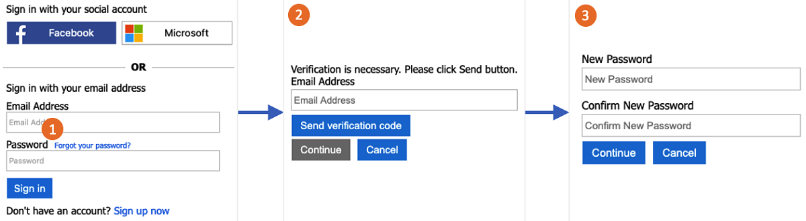

# Set up a password reset flow in Azure Active Directory B2C

[!INCLUDE [active-directory-b2c-choose-user-flow-or-custom-policy](../../includes/active-directory-b2c-choose-user-flow-or-custom-policy.md)]

## Password reset flow

The [sign-up and sign-in journey](add-sign-up-and-sign-in-policy.md) allows users to reset their own password using the **Forgot your password?** link. The password reset flow involves the following steps:

1. From the sign-up and sign-in page, the user clicks the **Forgot your password?** link. Azure AD B2C initiates the password reset flow. 
2. The user provides and verifies their email address with a Timed One Time Passcode.
3. The user can then enter a new password.



The password reset flow applies to local accounts in Azure AD B2C that use an [email address](identity-provider-local.md#email-sign-in) or [username](identity-provider-local.md#username-sign-in) with a password for sign-in.

A common practice after migrating users to Azure AD B2C with random passwords is to have the users verify their email addresses and reset their passwords during their first sign-in. It's also common to force the user to reset their password after an administrator changes their password; see [force password reset](force-password-reset.md) to enable this feature.

## Prerequisites

[!INCLUDE [active-directory-b2c-customization-prerequisites](../../includes/active-directory-b2c-customization-prerequisites.md)]

## Self-service password reset (recommended)

The new password reset experience is now part of the sign-up or sign-in policy. When the user selects the **Forgot your password?** link, they are immediately sent to the Forgot Password experience. Your application no longer needs to handle the [AADB2C90118 error code](#password-reset-policy-legacy), and you don't need a separate policy for password reset.

::: zone pivot="b2c-user-flow"

The self-service password reset experience can be configured for the **Sign-in (Recommended)** or **Sign up and sign in (Recommended)** user flows. If you don't have such a user flow, create a [sign In and Sign Up](add-sign-up-and-sign-in-policy.md) user flow. 

To enable self-service password reset for the sign-up or sign-in user flow:

1. Sign in to the [Azure portal](https://portal.azure.com).
1. Select the **Directory + Subscription** icon in the portal toolbar, and then select the directory that contains your Azure AD B2C tenant.
1. In the Azure portal, search for and select **Azure AD B2C**.
1. Select **User flows**.
1. Select a sign-up or sign-in user flow (of type **Recommended**) that you want to customize.
1. Under **Settings** in the left menu, select **Properties**.
1. Under **Password complexity**, select **Self-service password reset**.
1. Select **Save**.
1. Under **Customize** in the left menu, select **Page layouts**.
1. In the **Page Layout Version**, choose **2.1.2 - Current** or above.
1. Select **Save**.

::: zone-end

::: zone pivot="b2c-custom-policy"

The following sections describe how to add a self-service password experience to a custom policy. The sample is based on the policy files included in the [custom policy starter pack](./custom-policy-get-started.md). 

> [!TIP]
> You can find a complete sample of the "sign-up or sign-in with password reset" policy on [GitHub](https://github.com/azure-ad-b2c/samples/tree/master/policies/embedded-password-reset).

### Indicate a user selected the Forgot your password? link

To indicate to the policy that the user has selected the **Forgot your password?** link, define a boolean claim. This claim will be used to direct the user journey to the Forgot Password technical profile. This claim can also be issued to the token so the application is aware that the user signed in via the Forgot Password flow.

You declare your claims in the [claims schema](claimsschema.md). Open the extensions file of your policy. For example, <em>`SocialAndLocalAccounts/`**`TrustFrameworkExtensions.xml`**</em>.

1. Search for the [BuildingBlocks](buildingblocks.md) element. If the element doesn't exist, add it.
1. Locate the [ClaimsSchema](claimsschema.md) element. If the element doesn't exist, add it.
1. Add the following claim to the **ClaimsSchema** element. 

```XML
<!-- 
<BuildingBlocks>
  <ClaimsSchema> -->
    <ClaimType Id="isForgotPassword">
      <DisplayName>isForgotPassword</DisplayName>
      <DataType>boolean</DataType>
      <AdminHelpText>Whether the user has selected Forgot your Password</AdminHelpText>
    </ClaimType>
  <!--
  </ClaimsSchema>
</BuildingBlocks> -->
```

### Upgrade the page layout version

[Page layout version](contentdefinitions.md#migrating-to-page-layout) `2.1.2` is required to enable the self-service password reset flow within the sign-up or sign-in journey.

1. Search for the [BuildingBlocks](buildingblocks.md) element. If the element doesn't exist, add it.
1. Locate the [ContentDefinitions](contentdefinitions.md) element. If the element doesn't exist, add it.
1. Modify the **DataURI** element within the **ContentDefinition** element with Id **api.signuporsignin** as shown below.

```xml
<!-- 
<BuildingBlocks>
  <ContentDefinitions> -->
    <ContentDefinition Id="api.signuporsignin">
      <DataUri>urn:com:microsoft:aad:b2c:elements:contract:unifiedssp:2.1.2</DataUri>
    </ContentDefinition>
  <!-- 
  </ContentDefinitions>
</BuildingBlocks> -->
```

To initiate the `isForgotPassword` claim, a claims transformation technical profile is used. This technical profile will be referenced later. When invoked, it will set the value of the `isForgotPassword` claim to `true`. Find the `ClaimsProviders` element. If the element doesn't exist, add it. Then add the following claims provider:  

```xml
<!-- 
<ClaimsProviders> -->
  <ClaimsProvider>
    <DisplayName>Local Account</DisplayName>
    <TechnicalProfiles>
      <TechnicalProfile Id="ForgotPassword">
        <DisplayName>Forgot your password?</DisplayName>
        <Protocol Name="Proprietary" Handler="Web.TPEngine.Providers.ClaimsTransformationProtocolProvider, Web.TPEngine, Version=1.0.0.0, Culture=neutral, PublicKeyToken=null"/>
        <OutputClaims>
          <OutputClaim ClaimTypeReferenceId="isForgotPassword" DefaultValue="true" AlwaysUseDefaultValue="true"/>
        </OutputClaims>
      </TechnicalProfile>
      <TechnicalProfile Id="SelfAsserted-LocalAccountSignin-Email">
        <Metadata>
          <Item Key="setting.forgotPasswordLinkOverride">ForgotPasswordExchange</Item>
        </Metadata>
      </TechnicalProfile>
    </TechnicalProfiles>
  </ClaimsProvider>
<!-- 
</ClaimsProviders> -->
```

The `SelfAsserted-LocalAccountSignin-Email` technical profile `setting.forgotPasswordLinkOverride` definers the password reset claims exchange to be executed in your user journey. 

### Add the password reset sub journey

Your journey will now include the capability for the user to sign in, sign up, and perform password reset. To better organize the user journey, a [sub journey](subjourneys.md) can be used to handle the password reset flow.

The sub journey will be called from the user journey and will perform the specific steps to deliver the password reset experience to the user. Use the `Call` type sub journey so that once the sub journey completes, control is returned to the orchestration step that initiated the sub journey.

Find the `SubJourneys` element. If the element doesn't exist, add it after the `User Journeys` element. Then add the following sub journey:

```xml
<!--
<SubJourneys>-->
  <SubJourney Id="PasswordReset" Type="Call">
    <OrchestrationSteps>
      <!-- Validate user's email address. -->
      <OrchestrationStep Order="1" Type="ClaimsExchange">
        <ClaimsExchanges>
          <ClaimsExchange Id="PasswordResetUsingEmailAddressExchange" TechnicalProfileReferenceId="LocalAccountDiscoveryUsingEmailAddress" />
        </ClaimsExchanges>
      </OrchestrationStep>

      <!-- Collect and persist a new password. -->
      <OrchestrationStep Order="2" Type="ClaimsExchange">
        <ClaimsExchanges>
          <ClaimsExchange Id="NewCredentials" TechnicalProfileReferenceId="LocalAccountWritePasswordUsingObjectId" />
        </ClaimsExchanges>
      </OrchestrationStep>
    </OrchestrationSteps>
  </SubJourney>
<!--
</SubJourneys>-->
```

### Prepare your user journey

You'll need to connect the **Forgot your password?** link to the Forgot Password sub journey. To do this, reference the Forgot Password sub journey Id within the **ClaimsProviderSelection** element of the **CombinedSignInAndSignUp** step.

If you don't have your own custom user journey with a **CombinedSignInAndSignUp** step, use the following procedure to duplicate an existing sign-up or sign-in user journey. Otherwise, continue to the next section.

1. Open the *TrustFrameworkBase.xml* file from the starter pack.
2. Find and copy the entire contents of the **UserJourney** element that includes `Id="SignUpOrSignIn"`.
3. Open the *TrustFrameworkExtensions.xml* and find the **UserJourneys** element. If the element doesn't exist, add one.
4. Create a child element of the **UserJourneys** element by pasting the entire contents of the **UserJourney** element you copied in step 2.
5. Rename the Id of the user journey. For example, `Id="CustomSignUpSignIn"`.

### Connect the Forgot Password Link to the Forgot Password sub journey 

In your user journey, you can represent the Forgot Password sub journey as a **ClaimsProviderSelection**. Adding this element connects the **Forgot your password?** link to the Forgot Password sub journey.

1. In the user journey, find the orchestration step element that includes `Type="CombinedSignInAndSignUp"` or `Type="ClaimsProviderSelection"`. It's usually the first orchestration step. The **ClaimsProviderSelections** element contains a list of identity providers that a user can use to sign in. Add the following line:
    
    ```xml
    <ClaimsProviderSelection TargetClaimsExchangeId="ForgotPasswordExchange" />
    ```

1. In the next orchestration step, add a **ClaimsExchange** element. Add the following line:

    ```xml
    <ClaimsExchange Id="ForgotPasswordExchange" TechnicalProfileReferenceId="ForgotPassword" />
    ```
    
1. Add the following orchestration step between the current step, and the next step. The new orchestration step you add, checks whether the `isForgotPassword` claim exists. If the claim exists, it invokes the [password reset sub journey](#add-the-password-reset-sub-journey). 

    ```xml
    <OrchestrationStep Order="3" Type="InvokeSubJourney">
      <Preconditions>
        <Precondition Type="ClaimsExist" ExecuteActionsIf="false">
          <Value>isForgotPassword</Value>
          <Action>SkipThisOrchestrationStep</Action>
        </Precondition>
      </Preconditions>
      <JourneyList>
        <Candidate SubJourneyReferenceId="PasswordReset" />
      </JourneyList>
    </OrchestrationStep>
    ```
    
1. After you add the new orchestration step, renumber the steps sequentially without skipping any integers from 1 to N.

### Set the user journey to be executed

Now that you've modified or created a user journey, in the **Relying Party** section specify the journey that Azure AD B2C will execute for this custom policy. Within the [RelyingParty](relyingparty.md) element, find the **DefaultUserJourney** element. Update the  **DefaultUserJourney ReferenceId** to match the ID of the user journey in which you added the **ClaimsProviderSelections**.

```xml
<RelyingParty>
  <DefaultUserJourney ReferenceId="CustomSignUpSignIn" />
  ...
</RelyingParty>
```

### Indicate the Forgot Password flow to your App

Your application might need to detect whether the user signed in via the Forgot Password user flow. The **isForgotPassword** claim contains a boolean value that indicates this, which can be issued in the token sent to your application. If necessary, add `isForgotPassword` to the output claims in the **Relying Party** section. Your application can check the `isForgotPassword` claim to determine if the user resets their password.

```xml
<RelyingParty>
  <OutputClaims>
    ...
    <OutputClaim ClaimTypeReferenceId="isForgotPassword" DefaultValue="false" />
  </OutputClaims>
</RelyingParty>
```


### Upload the custom policy

1. Sign in to the [Azure portal](https://portal.azure.com).
1. Select the **Directory + Subscription** icon in the portal toolbar, and then select the directory that contains your Azure AD B2C tenant.
1. In the Azure portal, search for and select **Azure AD B2C**.
1. Under **Policies**, select **Identity Experience Framework**.
1. Select **Upload Custom Policy**, and then upload the two policy files that you changed in the following order:
   1. The extension policy, for example `TrustFrameworkExtensions.xml`.
   2. The relying party policy, for example `SignUpSignIn.xml`.

::: zone-end

### Test the password reset flow

1. Select a sign-up or sign-in user flow (of type Recommended) that you want to test.
1. Select **Run user flow**.
1. For **Application**, select the web application named *webapp1* that you previously registered. The **Reply URL** should show `https://jwt.ms`.
1. Select **Run user flow**.
1. From the sign-up or sign-in page, select **Forgot your password?**.
1. Verify the email address of the account that you previously created, and then select **Continue**.
1. You now have the opportunity to change the password for the user. Change the password and select **Continue**. The token is returned to `https://jwt.ms` and should be displayed to you.
1. Check the return token's `isForgotPassword` claim value. If exists and is set to true, this indicates the user has reset the password.

## Password reset policy (legacy)

If the [self-service password reset](#self-service-password-reset-recommended) experience is not enabled, clicking this link doesn't automatically trigger a password reset user flow. Instead, the error code `AADB2C90118` is returned to your application. Your application needs to handle this error code by reinitializing the authentication library to authenticate an Azure AD B2C password reset user flow.

In the following diagram:

1. From the application, the user clicks on sign-in. The app initiates an authorization request, and takes the user to Azure AD B2C to finish signing in. The authorization request specifies the sign-up or sign-in policy name, such as **B2C_1_signup_signin**.
1. The user selects the **Forgot your password?** link. Azure AD B2C returns the AADB2C90118 error code to the application.
1. The application handles the error code and initiates a new authorization request. The authorization request specifies the password reset policy name, such as **B2C_1_pwd_reset**.


To see an example, take a look at a [simple ASP.NET sample](https://github.com/AzureADQuickStarts/B2C-WebApp-OpenIDConnect-DotNet-SUSI), which demonstrates the linking of user flows.

::: zone pivot="b2c-user-flow"

### Create a password reset user flow

To let users of your application reset their password, you create a password reset user flow.

1. In the Azure AD B2C tenant overview menu, select **User flows**, and then select **New user flow**.
1. On the **Create a user flow** page, select the **Password reset** user flow. 
1. Under **Select a version**, select **Recommended**, and then select **Create**.
1. Enter a **Name** for the user flow. For example, *passwordreset1*.
1. For **Identity providers**, enable **Reset password using email address**.
1. Under **Application claims**, select **Show more** and choose the claims you want returned in the authorization tokens sent back to your application. For example, select **User's Object ID**.
1. Select **OK**.
1. Select **Create** to add the user flow. A prefix of *B2C_1* is automatically appended to the name.

### Test the user flow

1. Select the user flow you created to open its overview page, and then select **Run user flow**.
1. For **Application**, select the web application named *webapp1* that you previously registered. The **Reply URL** should show `https://jwt.ms`.
1. Click **Run user flow**, verify the email address of the account that you previously created, and then select **Continue**.
1. You can now change the password for the user. Change the password and select **Continue**. The token is returned to `https://jwt.ms` and should be displayed to you.

::: zone-end

::: zone pivot="b2c-custom-policy"

### Create a password reset policy

Custom policies are a set of XML files you upload to your Azure AD B2C tenant to define user journeys. We provide starter packs with several pre-built policies including: sign-up and sign-in, password reset, and profile editing policy. For more information, see [Get started with custom policies in Azure AD B2C](custom-policy-get-started.md).

::: zone-end

## Next steps

Set up a [force password reset](force-password-reset.md).
