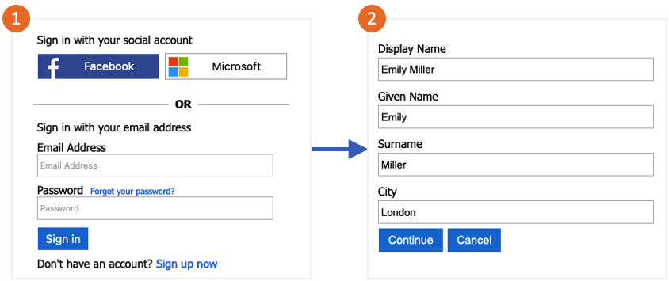

# Set up a profile editing flow in Azure Active Directory B2C

[!INCLUDE [active-directory-b2c-choose-user-flow-or-custom-policy](../../includes/active-directory-b2c-choose-user-flow-or-custom-policy.md)]

## Profile editing flow

Profile editing policy lets users manage their profile attributes, like display name, surname, given name, city, and others. The profile editing flow involves following steps: 

1. Sign-up or sign-in, with local or social account. If the session is still active, Azure AD B2C authorizes the user, and skips to the next step.
1. Azure AD B2C reads the user profile from the directory, and let the user edit the attributes.

## Prerequisites

If you haven't already done so, [register a web application in Azure Active Directory B2C](tutorial-register-applications.md).

::: zone pivot="b2c-user-flow"

## Create a profile editing user flow

If you want to enable users to edit their profile in your application, you use a profile editing user flow.

1. In the menu of the Azure AD B2C tenant overview page, select **User flows**, and then select **New user flow**.
1. On the **Create a user flow** page, select the **Profile editing** user flow. 
1. Under **Select a version**, select **Recommended**, and then select **Create**.
1. Enter a **Name** for the user flow. For example, *profileediting1*.
1. For **Identity providers**, select **Email sign-in**.
1. For **User attributes**, choose the attributes that you want the customer to be able to edit in their profile. For example, select **Show more**, and then choose both attributes and claims for **Display name** and **Job title**. Click **OK**.
1. Click **Create** to add the user flow. A prefix of *B2C_1* is automatically appended to the name.

### Test the user flow

1. Select the user flow you created to open its overview page, then select **Run user flow**.
1. For **Application**, select the web application named *webapp1* that you previously registered. The **Reply URL** should show `https://jwt.ms`.
1. Click **Run user flow**, and then sign in with the account that you previously created.
1. You now have the opportunity to change the display name and job title for the user. Click **Continue**. The token is returned to `https://jwt.ms` and should be displayed to you.

::: zone-end

::: zone pivot="b2c-custom-policy"

## Create a profile editing policy

Custom policies are a set of XML files you upload to your Azure AD B2C tenant to define user journeys. We provide starter packs with several pre-built policies including: sign-up and sign-in, password reset, and profile editing policy. For more information, see [Get started with custom policies in Azure AD B2C](custom-policy-get-started.md).

::: zone-end

## Next steps

* Add a [sign-in with social identity provider](add-identity-provider.md).