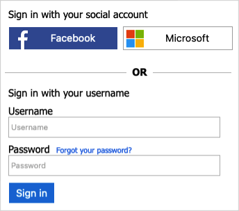

# Set up a sign-in flow in Azure Active Directory B2C

[!INCLUDE [active-directory-b2c-choose-user-flow-or-custom-policy](../../includes/active-directory-b2c-choose-user-flow-or-custom-policy.md)]

## Sign-in flow overview

The sign-in policy lets users:

* Sign in with an Azure AD B2C Local Account
* Users can sign-in with a social account
* Password reset
* Users cannot sign up for an Azure AD B2C Local Account. To create an account, an administrator can use the [Azure portal](manage-users-portal.md#create-a-consumer-user), or [Microsoft Graph API](microsoft-graph-operations.md).



## Prerequisites

- If you haven't already done so, [register a web application in Azure Active Directory B2C](tutorial-register-applications.md).
- Complete the steps in [Create user flows and custom policies in Azure Active Directory B2C](tutorial-create-user-flows.md).

::: zone pivot="b2c-user-flow"

## Create a sign-in user flow

To add sign-in policy:

1. Sign in to the [Azure portal](https://portal.azure.com).
1. Select the **Directories + Subscriptions** icon in the portal toolbar.
1. On the **Portal settings | Directories + subscriptions** page, find your Azure AD B2C directory in the **Directory name** list, and then select **Switch**.
1. In the Azure portal, search for and select **Azure AD B2C**.
1. Under **Policies**, select **User flows**, and then select **New user flow**.
1. On the **Create a user flow** page, select the **Sign in** user flow.
1. Under **Select a version**, select **Recommended**, and then select **Create**. ([Learn more](user-flow-versions.md) about user flow versions.)
1. Enter a **Name** for the user flow. For example, *signupsignin1*.
1. Under **Identity providers** select at least one identity provider:

   * Under **Local accounts**, select one of the following: **Email signin**, **User ID signin**, **Phone signin**, **Phone/Email signin**, **User ID/Email signin**, or **None**. [Learn more](sign-in-options.md).
   * Under **Social identity providers**, select any of the external social or enterprise identity providers you've set up. [Learn more](add-identity-provider.md).
1. Under **Multifactor authentication**, if you want to require users to verify their identity with a second authentication method, choose the method type and when  to enforce multi-factor authentication (MFA). [Learn more](multi-factor-authentication.md).
1. Under **Conditional access**, if you've configured Conditional Access policies for your Azure AD B2C tenant and you want to enable them for this user flow, select the **Enforce conditional access policies** check box. You don't need to specify a policy name. [Learn more](conditional-access-user-flow.md?pivots=b2c-user-flow).
1. Under **Application claims**, choose the claims you want returned to the application in the token. For the full list of values, select **Show more**, choose the values, and then select **OK**.
   > [!NOTE]
   > You can also [create custom attributes](user-flow-custom-attributes.md?pivots=b2c-user-flow) for use in your Azure AD B2C tenant.
1. Click **Create** to add the user flow. A prefix of *B2C_1* is automatically prepended to the name.

### Test the user flow

1. Select the user flow you created to open its overview page, then select **Run user flow**.
1. For **Application**, select the web application named *webapp1* that you previously registered. The **Reply URL** should show `https://jwt.ms`.
1. Click **Run user flow**.
1. You should be able to sign in with the account that you created (using MS Graph API), without the sign-up link. The returned token includes the claims that you selected.

::: zone-end

::: zone pivot="b2c-custom-policy"

## Remove the sign-up link

The **SelfAsserted-LocalAccountSignin-Email** technical profile is a [self-asserted](self-asserted-technical-profile.md), which is invoked during the sign-up or sign-in flow. To remove the sign-up link, set the `setting.showSignupLink` metadata to `false`. Override the SelfAsserted-LocalAccountSignin-Email technical profiles in the extension file.

1. Open the extensions file of your policy. For example, _`SocialAndLocalAccounts/`**`TrustFrameworkExtensions.xml`**_.
1. Find the `ClaimsProviders` element. If the element doesn't exist, add it.
1. Add the following claims provider to the `ClaimsProviders` element:

    ```xml
    <!--
    <ClaimsProviders> -->
      <ClaimsProvider>
        <DisplayName>Local Account</DisplayName>
        <TechnicalProfiles>
          <TechnicalProfile Id="SelfAsserted-LocalAccountSignin-Email">
            <Metadata>
              <Item Key="setting.showSignupLink">false</Item>
            </Metadata>
          </TechnicalProfile>
        </TechnicalProfiles>
      </ClaimsProvider>
    <!--
    </ClaimsProviders> -->
    ```

1. Within `<BuildingBlocks>` element, add the following [ContentDefinition](contentdefinitions.md) to reference the version 1.2.0, or newer data URI:

    ```xml
    <!-- 
    <BuildingBlocks> 
      <ContentDefinitions>-->
        <ContentDefinition Id="api.localaccountsignup">
          <DataUri>urn:com:microsoft:aad:b2c:elements:contract:unifiedssp:1.2.0</DataUri>
        </ContentDefinition>
      <!--
      </ContentDefinitions>
    </BuildingBlocks> -->
    ```

## Update and test your policy

1. Sign in to the [Azure portal](https://portal.azure.com).
1. Make sure you're using the directory that contains your Azure AD tenant by selecting the **Directories + subscriptions** icon in the portal toolbar.
1. On the **Portal settings | Directories + subscriptions** page, find your Azure AD directory in the **Directory name** list, and then select **Switch**.
1. Choose **All services** in the top-left corner of the Azure portal, and then search for and select **App registrations**.
1. Select **Identity Experience Framework**.
1. Select **Upload Custom Policy**, and then upload the policy file that you changed, *TrustFrameworkExtensions.xml*.
1. Select the sign-in policy that you uploaded, and click the **Run now** button.
1. You should be able to sign in with the account that you created (using MS Graph API), without the sign-up link.

::: zone-end

## Next steps

* Add a [sign-in with social identity provider](add-identity-provider.md).
* Set up a [password reset flow](add-password-reset-policy.md).
