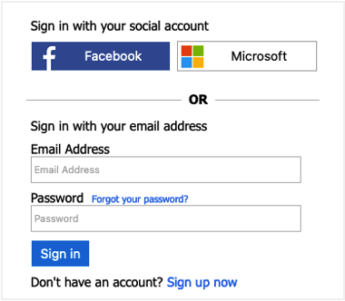
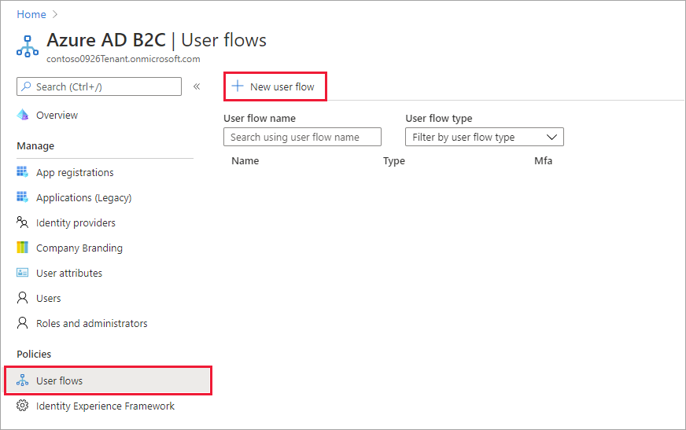
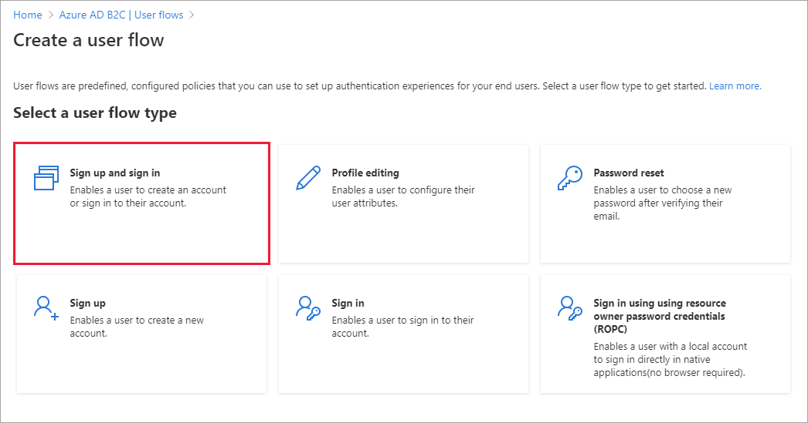
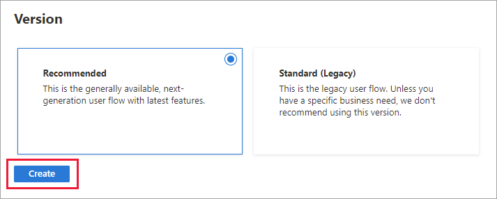
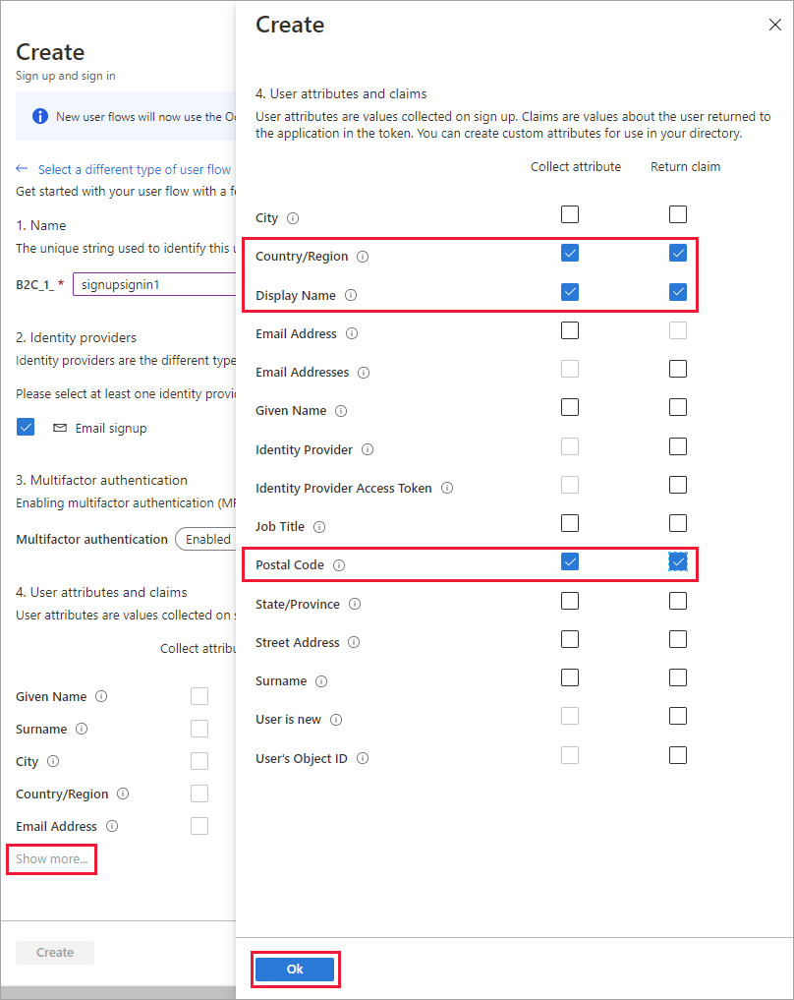

# Set up a sign-up and sign-in flow in Azure Active Directory B2C

[!INCLUDE [active-directory-b2c-choose-user-flow-or-custom-policy](../../includes/active-directory-b2c-choose-user-flow-or-custom-policy.md)]

## Sign-up and sign-in flow

Sign-up and sign-in policy lets users: 

* Sign-up with local account
* Sign-in with local account
* Sign-up or sign-in with a social account
* Password reset

Watch this video to learn how the user sign-up and sign-in policy works. 

>[!Video https://www.youtube.com/embed/c8rN1ZaR7wk]

## Prerequisites

- An Azure account with an active subscription. [Create an account for free](https://azure.microsoft.com/free/?WT.mc_id=A261C142F).
- If you don't have one already, [create an Azure AD B2C tenant](tutorial-create-tenant.md) that is linked to your Azure subscription.

::: zone pivot="b2c-user-flow"

## Create a sign-up and sign-in user flow

The sign-up and sign-in user flow handles both sign-up and sign-in experiences with a single configuration. Users of your application are led down the right path depending on the context.

1. Sign in to the [Azure portal](https://portal.azure.com).
1. Select the **Directories + Subscriptions** icon in the portal toolbar.
1. On the **Portal settings | Directories + subscriptions** page, find your Azure AD B2C directory in the **Directory name** list, and then select **Switch**.
1. In the Azure portal, search for and select **Azure AD B2C**.
1. Under **Policies**, select **User flows**, and then select **New user flow**.

    

1. On the **Create a user flow** page, select the **Sign up and sign in** user flow.

    

1. Under **Select a version**, select **Recommended**, and then select **Create**. ([Learn more](user-flow-versions.md) about user flow versions.)

    

1. Enter a **Name** for the user flow. For example, *signupsignin1*.
1. Under **Identity providers** select at least one identity provider:

   * Under **Local accounts**, select one of the following: **Email signup**, **User ID signup**, **Phone signup**, **Phone/Email signup**, or **None**. [Learn more](sign-in-options.md).
   * Under **Social identity providers**, select any of the external social or enterprise identity providers you've set up. [Learn more](add-identity-provider.md).
1. Under **Multifactor authentication**, if you want to require users to verify their identity with a second authentication method, choose the method type and when  to enforce multifactor authentication (MFA). [Learn more](multi-factor-authentication.md).
1. Under **Conditional access**, if you've configured Conditional Access policies for your Azure AD B2C tenant and you want to enable them for this user flow, select the **Enforce conditional access policies** check box. You don't need to specify a policy name. [Learn more](conditional-access-user-flow.md?pivots=b2c-user-flow).
1. Under **User attributes and token claims**, choose the attributes you want to collect from the user during sign-up and the claims you want returned in the token. For the full list of values, select **Show more**, choose the values, and then select **OK**.

   > [!NOTE]
   > You can also [create custom attributes](user-flow-custom-attributes.md?pivots=b2c-user-flow) for use in your Azure AD B2C tenant.

    

1. Select **Create** to add the user flow. A prefix of *B2C_1* is automatically prepended to the name.
1. Follow the steps to [handle the flow for "Forgot your password?"](add-password-reset-policy.md?pivots=b2c-user-flow.md#self-service-password-reset-recommended) within the sign-up or sign-in policy.

### Rearrange the sign up form
Learn [how to rearrange user flow input fields for local accounts](customize-ui.md#rearrange-input-fields-in-the-sign-up-form)

### Test the user flow

1. Select the user flow you created to open its overview page, then select **Run user flow**.
1. For **Application**, select the web application named *webapp1* that you previously registered. The **Reply URL** should show `https://jwt.ms`.
1. Click **Run user flow**, and then select **Sign up now**.

    

1. Enter a valid email address, click **Send verification code**, enter the verification code that you receive, then select **Verify code**.
1. Enter a new password and confirm the password.
1. Select your country and region, enter the name that you want displayed, enter a postal code, and then click **Create**. The token is returned to `https://jwt.ms` and should be displayed to you.
1. You can now run the user flow again and you should be able to sign in with the account that you created. The returned token includes the claims that you selected of country/region, name, and postal code.

> [!NOTE]
> The "Run user flow" experience is not currently compatible with the SPA reply URL type using authorization code flow. To use the "Run user flow" experience with these kinds of apps, register a reply URL of type "Web" and enable the implicit flow as described [here](tutorial-register-spa.md).

::: zone-end

::: zone pivot="b2c-custom-policy"

## Create a sign-up and sign-in policy

Custom policies are a set of XML files you upload to your Azure AD B2C tenant to define user journeys. We provide starter packs with several pre-built policies including: sign-up and sign-in, password reset, and profile editing policy. For more information, see [Get started with custom policies in Azure AD B2C](tutorial-create-user-flows.md?pivots=b2c-custom-policy).

::: zone-end

## Next steps

* Add a [sign-in with social identity provider](add-identity-provider.md).
* Set up a [password reset flow](add-password-reset-policy.md).
