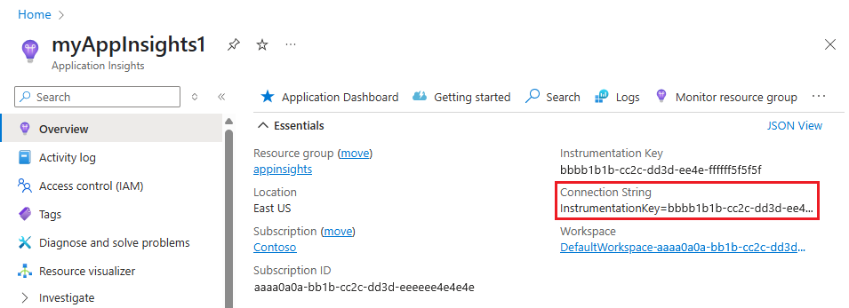

# Track user behavior in Azure AD B2C by using Application Insights

[!INCLUDE [active-directory-b2c-choose-user-flow-or-custom-policy](../../includes/active-directory-b2c-choose-user-flow-or-custom-policy.md)]

::: zone pivot="b2c-user-flow"

[!INCLUDE [active-directory-b2c-limited-to-custom-policy](../../includes/active-directory-b2c-limited-to-custom-policy.md)]

::: zone-end

::: zone pivot="b2c-custom-policy"

In Azure Active Directory B2C (Azure AD B2C), you can send event data directly to [Application Insights](../azure-monitor/app/app-insights-overview.md) by using the instrumentation key provided to Azure AD B2C. With an Application Insights technical profile, you can get detailed and customized event logs for your user journeys to:

- Gain insights on user behavior.
- Troubleshoot your own policies in development or in production.
- Measure performance.
- Create notifications from Application Insights.

## Overview

To enable custom event logs, add an Application Insights technical profile. In the technical profile, you define the Application Insights instrumentation key, the event name, and the claims to record. To post an event, add the technical profile as an orchestration step in a [user journey](userjourneys.md).

When you use Application Insights, consider the following:

- There's a short delay, typically less than five minutes, before new logs are available in Application Insights.
- Azure AD B2C allows you to choose which claims to record. Don't include claims with personal data.
- To record a user session, you can use a correlation ID to unify events.
- Call the Application Insights technical profile directly from a [user journey](userjourneys.md) or a [sub journey](subjourneys.md). Don't use an Application Insights technical profile as a [validation technical profile](validation-technical-profile.md).

## Prerequisites

[!INCLUDE [active-directory-b2c-customization-prerequisites-custom-policy](../../includes/active-directory-b2c-customization-prerequisites-custom-policy.md)]

## Create an Application Insights resource

When you use Application Insights with Azure AD B2C, all you need to do is create a resource and get the instrumentation key. For information, see [Create an Application Insights resource](/previous-versions/azure/azure-monitor/app/create-new-resource).

1. Sign in to the [Azure portal](https://portal.azure.com/).
1. If you have access to multiple tenants, select the **Settings** icon in the top menu to switch to your Microsoft Entra ID tenant from the **Directories + subscriptions** menu.
1. Choose **Create a resource** in the upper-left corner of the Azure portal, and then search for and select **Application Insights**.
1. Select **Create**.
1. For **Name**, enter a name for the resource.
1. For **Application Type**, select **ASP.NET web application**.
1. For **Resource Group**, select an existing group or enter a name for a new group.
1. Select **Create**.
1. Open the new Application Insights resource, expand **Essentials**, and copy the instrumentation key.



## Define claims

A claim provides temporary storage of data during an Azure AD B2C policy execution. You declare your claims in the [ClaimsSchema element](claimsschema.md).

1. Open the extensions file of your policy. The file might look similar to `SocialAndLocalAccounts/`**`TrustFrameworkExtensions.xml`**.
1. Search for the [BuildingBlocks](buildingblocks.md) element. If you don't see the element, add it.
1. Find the **ClaimsSchema** element. If you don't see the element, add it.
1. Add the following claims to the **ClaimsSchema** element:

   ```xml
   <ClaimType Id="EventType">
     <DisplayName>Event type</DisplayName>
     <DataType>string</DataType>
   </ClaimType>
   <ClaimType Id="EventTimestamp">
     <DisplayName>Event timestamp</DisplayName>
     <DataType>string</DataType>
   </ClaimType>
   <ClaimType Id="PolicyId">
     <DisplayName>Policy Id</DisplayName>
     <DataType>string</DataType>
   </ClaimType>
   <ClaimType Id="Culture">
     <DisplayName>Culture ID</DisplayName>
     <DataType>string</DataType>
   </ClaimType>
   <ClaimType Id="CorrelationId">
     <DisplayName>Correlation Id</DisplayName>
     <DataType>string</DataType>
   </ClaimType>
   <ClaimType Id="federatedUser">
     <DisplayName>Federated user</DisplayName>
     <DataType>boolean</DataType>
   </ClaimType>
   <ClaimType Id="parsedDomain">
     <DisplayName>Domain name</DisplayName>
     <DataType>string</DataType>
     <UserHelpText>The domain portion of the email address.</UserHelpText>
   </ClaimType>
   <ClaimType Id="userInLocalDirectory">
     <DisplayName>userInLocalDirectory</DisplayName>
     <DataType>boolean</DataType>
   </ClaimType>
   ```

## Add new technical profiles

Technical profiles can be considered functions in the custom policy. These functions use the [technical profile inclusion](technicalprofiles.md#include-technical-profile) approach, where a technical profile includes another technical profile and changes settings or adds new functionality. The following table defines the technical profiles that are used to open a session and post events.

| Technical profile | Task |
| ----------------- | -----|
| AppInsights-Common | The common technical profile with typical configuration. It includes the Application Insights instrumentation key, a collection of claims to record, and developer mode. The other technical profiles include the common technical profile and add more claims, such as the event name. |
| AppInsights-SignInRequest | Records a **SignInRequest** event with a set of claims when a sign-in request has been received. |
| AppInsights-UserSignUp | Records a **UserSignUp** event when the user triggers the sign-up option in a sign-up or sign-in journey. |
| AppInsights-SignInComplete | Records a **SignInComplete** event upon successful authentication, when a token has been sent to the relying party application. |

Open the *TrustFrameworkExtensions.xml* file from the starter pack. Add the technical profiles to the **ClaimsProvider** element:

```xml
<ClaimsProvider>
  <DisplayName>Application Insights</DisplayName>
  <TechnicalProfiles>
    <TechnicalProfile Id="AppInsights-Common">
      <DisplayName>Application Insights</DisplayName>
      <Protocol Name="Proprietary" Handler="Web.TPEngine.Providers.Insights.AzureApplicationInsightsProvider, Web.TPEngine, Version=1.0.0.0, Culture=neutral, PublicKeyToken=null" />
      <Metadata>
        <!-- The ApplicationInsights instrumentation key, which you use for logging the events -->
        <Item Key="InstrumentationKey">xxxxxxxx-xxxx-xxxx-xxxx-xxxxxxxxxxxx</Item>
        <Item Key="DeveloperMode">false</Item>
        <Item Key="DisableTelemetry ">false</Item>
      </Metadata>
      <InputClaims>
        <!-- Properties of an event are added through the syntax {property:NAME}, where NAME is the property being added to the event. DefaultValue can be either a static value or a value that's resolved by one of the supported DefaultClaimResolvers. -->
        <InputClaim ClaimTypeReferenceId="EventTimestamp" PartnerClaimType="{property:EventTimestamp}" DefaultValue="{Context:DateTimeInUtc}" />
        <InputClaim ClaimTypeReferenceId="tenantId" PartnerClaimType="{property:TenantId}" DefaultValue="{Policy:TrustFrameworkTenantId}" />
        <InputClaim ClaimTypeReferenceId="PolicyId" PartnerClaimType="{property:Policy}" DefaultValue="{Policy:PolicyId}" />
        <InputClaim ClaimTypeReferenceId="CorrelationId" PartnerClaimType="{property:CorrelationId}" DefaultValue="{Context:CorrelationId}" />
        <InputClaim ClaimTypeReferenceId="Culture" PartnerClaimType="{property:Culture}" DefaultValue="{Culture:RFC5646}" />
      </InputClaims>
    </TechnicalProfile>

    <TechnicalProfile Id="AppInsights-SignInRequest">
      <InputClaims>
        <!-- An input claim with a PartnerClaimType="eventName" is required. This is used by the AzureApplicationInsightsProvider to create an event with the specified value. -->
        <InputClaim ClaimTypeReferenceId="EventType" PartnerClaimType="eventName" DefaultValue="SignInRequest" />
      </InputClaims>
      <IncludeTechnicalProfile ReferenceId="AppInsights-Common" />
    </TechnicalProfile>

    <TechnicalProfile Id="AppInsights-UserSignUp">
      <InputClaims>
        <InputClaim ClaimTypeReferenceId="EventType" PartnerClaimType="eventName" DefaultValue="UserSignUp" />
      </InputClaims>
      <IncludeTechnicalProfile ReferenceId="AppInsights-Common" />
    </TechnicalProfile>
    
    <TechnicalProfile Id="AppInsights-SignInComplete">
      <InputClaims>
        <InputClaim ClaimTypeReferenceId="EventType" PartnerClaimType="eventName" DefaultValue="SignInComplete" />
        <InputClaim ClaimTypeReferenceId="federatedUser" PartnerClaimType="{property:FederatedUser}" DefaultValue="false" />
        <InputClaim ClaimTypeReferenceId="parsedDomain" PartnerClaimType="{property:FederationPartner}" DefaultValue="Not Applicable" />
        <InputClaim ClaimTypeReferenceId="identityProvider" PartnerClaimType="{property:IDP}" DefaultValue="Local" />
      </InputClaims>
      <IncludeTechnicalProfile ReferenceId="AppInsights-Common" />
    </TechnicalProfile>
  </TechnicalProfiles>
</ClaimsProvider>
```

> [!IMPORTANT]
> Change the instrumentation key in the `AppInsights-Common` technical profile to the GUID that your Application Insights resource provides.

## Add the technical profiles as orchestration steps

Add new orchestration steps that refer to the technical profiles.

> [!IMPORTANT]
> After you add the new orchestration steps, renumber the steps sequentially without skipping any integers from 1 to N.

1. Call `AppInsights-SignInRequest` as the second orchestration step. This step tracks that a sign-up or sign-in request has been received.

   ```xml
   <!-- Track that we have received a sign in request -->
   <OrchestrationStep Order="2" Type="ClaimsExchange">
     <ClaimsExchanges>
       <ClaimsExchange Id="TrackSignInRequest" TechnicalProfileReferenceId="AppInsights-SignInRequest" />
     </ClaimsExchanges>
   </OrchestrationStep>
   ```

1. Before the `SendClaims` orchestration step, add a new step that calls `AppInsights-UserSignup`. It's triggered when the user selects the sign-up button in a sign-up or sign-in journey.

   ```xml
   <!-- Handles the user selecting the sign-up link in the local account sign-in page -->
   <OrchestrationStep Order="8" Type="ClaimsExchange">
     <Preconditions>
       <Precondition Type="ClaimsExist" ExecuteActionsIf="false">
         <Value>newUser</Value>
         <Action>SkipThisOrchestrationStep</Action>
       </Precondition>
       <Precondition Type="ClaimEquals" ExecuteActionsIf="true">
         <Value>newUser</Value>
         <Value>false</Value>
         <Action>SkipThisOrchestrationStep</Action>
       </Precondition>
     </Preconditions>
     <ClaimsExchanges>
       <ClaimsExchange Id="TrackUserSignUp" TechnicalProfileReferenceId="AppInsights-UserSignup" />
     </ClaimsExchanges>
   </OrchestrationStep>
   ```

1. After the `SendClaims` orchestration step, call `AppInsights-SignInComplete`. This step shows a successfully completed journey.

   ```xml
   <!-- Track that we have successfully sent a token -->
   <OrchestrationStep Order="10" Type="ClaimsExchange">
     <ClaimsExchanges>
       <ClaimsExchange Id="TrackSignInComplete" TechnicalProfileReferenceId="AppInsights-SignInComplete" />
     </ClaimsExchanges>
   </OrchestrationStep>
   ```

## Upload your file, run the policy, and view events

Save and upload the *TrustFrameworkExtensions.xml* file. Then call the relying party policy from your application or use **Run Now** in the Azure portal. Wait for your events to be available in Application Insights.

1. Open the **Application Insights** resource in your Microsoft Entra tenant.
1. Select **Usage**, and then select **Events**.
1. Set **During** to **Last hour** and **By** to **3 minutes**. You might need to refresh the window to see the results.


## Collect more data

To fit your business needs, you might want to record more claims. To add a claim, first [define a claim](#define-claims), then add the claim to the input claims collection. Claims that you add to the **AppInsights-Common** technical profile appear in all events. Claims that you add to a specific technical profile appear only in that event. The input claim element contains the following attributes:

- **ClaimTypeReferenceId** is the reference to a claim type.
- **PartnerClaimType** is the name of the property that appears in Azure Insights. Use the syntax of `{property:NAME}`, where `NAME` is a property being added to the event.
- **DefaultValue** is a predefined value to be recorded, such as an event name. If a claim that is used in the user journey is empty, the default value is used. For example, the `identityProvider` claim is set by the federation technical profiles, such as Facebook. If the claim is empty, it indicates the user signed in with a local account. Thus, the default value is set to **Local**. You can also record a [claim resolver](claim-resolver-overview.md) with a contextual value, such as the application ID or the user IP address.

### Manipulate claims

You can use [input claims transformations](custom-policy-overview.md#manipulating-your-claims) to modify the input claims or generate new ones before sending them to Application Insights. In the following example, the technical profile includes the `CheckIsAdmin` input claims transformation.

```xml
<TechnicalProfile Id="AppInsights-SignInComplete">
  <InputClaimsTransformations>  
    <InputClaimsTransformation ReferenceId="CheckIsAdmin" />
  </InputClaimsTransformations>
  <InputClaims>
    <InputClaim ClaimTypeReferenceId="isAdmin" PartnerClaimType="{property:IsAdmin}"  />
    ...
  </InputClaims>
  <IncludeTechnicalProfile ReferenceId="AppInsights-Common" />
</TechnicalProfile>
```

### Add events

To add an event, create a new technical profile that includes the `AppInsights-Common` technical profile. Then add the new technical profile as an orchestration step to the [user journey](custom-policy-overview.md#orchestration-steps). Use the [Precondition](userjourneys.md#preconditions) element to trigger the event when you're ready. For example, report the event only when users run through multifactor authentication.

```xml
<TechnicalProfile Id="AppInsights-MFA-Completed">
  <InputClaims>
     <InputClaim ClaimTypeReferenceId="EventType" PartnerClaimType="eventName" DefaultValue="MFA-Completed" />
  </InputClaims>
  <IncludeTechnicalProfile ReferenceId="AppInsights-Common" />
</TechnicalProfile>
```

>[!Important]
>When you add an event to the user journey, remember to renumber the orchestration steps sequentially.

```xml
<OrchestrationStep Order="8" Type="ClaimsExchange">
  <Precondition Type="ClaimsExist" ExecuteActionsIf="true">
    <Value>isActiveMFASession</Value>
    <Action>SkipThisOrchestrationStep</Action>
    </Precondition>
  </Preconditions>
  <ClaimsExchanges>
    <ClaimsExchange Id="TrackUserMfaCompleted" TechnicalProfileReferenceId="AppInsights-MFA-Completed" />
  </ClaimsExchanges>
</OrchestrationStep>
```

## Enable developer mode

When you use Application Insights to define events, you can indicate whether developer mode is enabled. Developer mode controls how events are buffered. In a development environment with minimal event volume, enabling developer mode results in events being sent immediately to Application Insights. The default value is `false`. Don't enable developer mode in production environments.

To enable developer mode, change the `DeveloperMode` metadata to `true` in the `AppInsights-Common` technical profile:

```xml
<TechnicalProfile Id="AppInsights-Common">
  <Metadata>
    ...
    <Item Key="DeveloperMode">true</Item>
  </Metadata>
</TechnicalProfile>
```

## Disable telemetry

To disable Application Insights logs, change the `DisableTelemetry` metadata to `true` in the `AppInsights-Common` technical profile:

```xml
<TechnicalProfile Id="AppInsights-Common">
  <Metadata>
    ...
    <Item Key="DisableTelemetry">true</Item>
  </Metadata>
</TechnicalProfile>
```

## Next steps

Learn how to [create custom KPI dashboards using Azure Application Insights](../azure-monitor/app/overview-dashboard.md#create-custom-kpi-dashboards-using-application-insights).

::: zone-end
