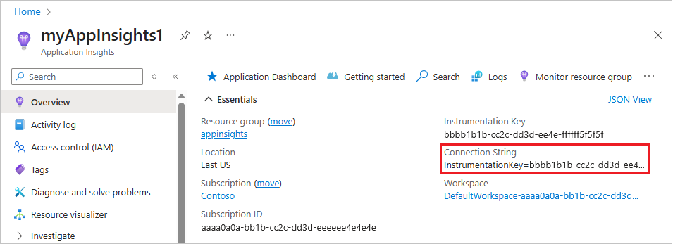

# Track user behavior in Azure Active Directory B2C using Application Insights

[!INCLUDE [active-directory-b2c-public-preview](../../includes/active-directory-b2c-public-preview.md)]

Azure Active Directory B2C (Azure AD B2C) supports sending event data directly to [Application Insights](../azure-monitor/app/app-insights-overview.md) by using the instrumentation key provided to Azure AD B2C.  With an Application Insights technical profile, you can get detailed and customized event logs for your user journeys to:

* Gain insights on user behavior.
* Troubleshoot your own policies in development or in production.
* Measure performance.
* Create notifications from Application Insights.

## How it works

The [Application Insights](application-insights-technical-profile.md) technical profile defines an event from Azure AD B2C. The profile specifies the name of the event, the claims that are recorded, and the instrumentation key. To post an event, the technical profile is then added as an orchestration step in a [user journey](userjourneys.md).

Application Insights can unify the events by using a correlation ID to record a user session. Application Insights makes the event and session available within seconds and presents many visualization, export, and analytical tools.

## Prerequisites

Complete the steps in [Get started with custom policies](custom-policy-get-started.md). You should have a working custom policy for sign-up and sign-in with local accounts.

## Create an Application Insights resource

When you're using Application Insights with Azure AD B2C, all you need to do is create a resource and get the instrumentation key. For information, see [Create an Application Insights resource](../azure-monitor/app/create-new-resource.md)

1. Sign in to the [Azure portal](https://portal.azure.com/).
2. Make sure you're using the directory that contains your Azure subscription by selecting the **Directory + subscription** filter in the top menu and choosing the directory that contains your subscription. This tenant is not your Azure AD B2C tenant.
3. Choose **Create a resource** in the top-left corner of the Azure portal, and then search for and select **Application Insights**.
4. Click **Create**.
5. Enter a **Name** for the resource.
6. For **Application Type**, select **ASP.NET web application**.
7. For **Resource Group**, select an existing group or enter a name for a new group.
8. Click **Create**.
4. After you create the Application Insights resource, open it, expand **Essentials**, and copy the instrumentation key.



## Define claims

A claim provides a temporary storage of data during an Azure AD B2C policy execution. The [claims schema](claimsschema.md) is the place where you declare your claims.

1. Open the extensions file of your policy. For example, <em>`SocialAndLocalAccounts/`**`TrustFrameworkExtensions.xml`**</em>.
1. Search for the [BuildingBlocks](buildingblocks.md) element. If the element doesn't exist, add it.
1. Locate the [ClaimsSchema](claimsschema.md) element. If the element doesn't exist, add it.
1. Add the following claims to the **ClaimsSchema** element. 

```xml
<ClaimType Id="EventType">
  <DisplayName>Event type</DisplayName>
  <DataType>string</DataType>
</ClaimType>
<ClaimType Id="EventTimestamp">
  <DisplayName>Event timestamp</DisplayName>
  <DataType>string</DataType>
</ClaimType>
<ClaimType Id="PolicyId">
  <DisplayName>Policy Id</DisplayName>
  <DataType>string</DataType>
</ClaimType>
<ClaimType Id="Culture">
  <DisplayName>Culture ID</DisplayName>
  <DataType>string</DataType>
</ClaimType>
<ClaimType Id="CorrelationId">
  <DisplayName>Correlation Id</DisplayName>
  <DataType>string</DataType>
</ClaimType>
<ClaimType Id="federatedUser">
  <DisplayName>Federated user</DisplayName>
  <DataType>boolean</DataType>
</ClaimType>
<ClaimType Id="parsedDomain">
  <DisplayName>Domain name</DisplayName>
  <DataType>string</DataType>
  <UserHelpText>The domain portion of the email address.</UserHelpText>
</ClaimType>
<ClaimType Id="userInLocalDirectory">
  <DisplayName>userInLocalDirectory</DisplayName>
  <DataType>boolean</DataType>
</ClaimType>
```

## Add new technical profiles

Technical profiles can be considered functions in the Identity Experience Framework of Azure AD B2C. This table defines the technical profiles that are used to open a session and post events.

| Technical Profile | Task |
| ----------------- | -----|
| AppInsights-Common | The common set of parameters to be included in all Azure Insights technical profiles. |
| AppInsights-SignInRequest | Records a `SignInRequest` event with a set of claims when a sign-in request has been received. |
| AppInsights-UserSignUp | Records a `UserSignUp` event when the user triggers the sign-up option in a sign-up/sign-in journey. |
| AppInsights-SignInComplete | Records a `SignInComplete` event on successful completion of an authentication, when a token has been sent to the relying party application. |

Add the profiles to the *TrustFrameworkExtensions.xml* file from the starter pack. Add these elements to the **ClaimsProviders** element:

```xml
<ClaimsProvider>
  <DisplayName>Application Insights</DisplayName>
  <TechnicalProfiles>
    <TechnicalProfile Id="AppInsights-Common">
      <DisplayName>Application Insights</DisplayName>
      <Protocol Name="Proprietary" Handler="Web.TPEngine.Providers.Insights.AzureApplicationInsightsProvider, Web.TPEngine, Version=1.0.0.0, Culture=neutral, PublicKeyToken=null" />
      <Metadata>
        <!-- The ApplicationInsights instrumentation key which will be used for logging the events -->
        <Item Key="InstrumentationKey">xxxxxxxx-xxxx-xxxx-xxxx-xxxxxxxxxxxx</Item>
        <Item Key="DeveloperMode">false</Item>
        <Item Key="DisableTelemetry ">false</Item>
      </Metadata>
      <InputClaims>
        <!-- Properties of an event are added through the syntax {property:NAME}, where NAME is property being added to the event. DefaultValue can be either a static value or a value that's resolved by one of the supported DefaultClaimResolvers. -->
        <InputClaim ClaimTypeReferenceId="EventTimestamp" PartnerClaimType="{property:EventTimestamp}" DefaultValue="{Context:DateTimeInUtc}" />
        <InputClaim ClaimTypeReferenceId="PolicyId" PartnerClaimType="{property:Policy}" DefaultValue="{Policy:PolicyId}" />
        <InputClaim ClaimTypeReferenceId="CorrelationId" PartnerClaimType="{property:CorrelationId}" DefaultValue="{Context:CorrelationId}" />
        <InputClaim ClaimTypeReferenceId="Culture" PartnerClaimType="{property:Culture}" DefaultValue="{Culture:RFC5646}" />
      </InputClaims>
    </TechnicalProfile>

    <TechnicalProfile Id="AppInsights-SignInRequest">
      <InputClaims>
        <!-- An input claim with a PartnerClaimType="eventName" is required. This is used by the AzureApplicationInsightsProvider to create an event with the specified value. -->
        <InputClaim ClaimTypeReferenceId="EventType" PartnerClaimType="eventName" DefaultValue="SignInRequest" />
      </InputClaims>
      <IncludeTechnicalProfile ReferenceId="AppInsights-Common" />
    </TechnicalProfile>

    <TechnicalProfile Id="AppInsights-UserSignUp">
      <InputClaims>
        <InputClaim ClaimTypeReferenceId="EventType" PartnerClaimType="eventName" DefaultValue="UserSignUp" />
      </InputClaims>
      <IncludeTechnicalProfile ReferenceId="AppInsights-Common" />
    </TechnicalProfile>
    
    <TechnicalProfile Id="AppInsights-SignInComplete">
      <InputClaims>
        <InputClaim ClaimTypeReferenceId="EventType" PartnerClaimType="eventName" DefaultValue="SignInComplete" />
        <InputClaim ClaimTypeReferenceId="federatedUser" PartnerClaimType="{property:FederatedUser}" DefaultValue="false" />
        <InputClaim ClaimTypeReferenceId="parsedDomain" PartnerClaimType="{property:FederationPartner}" DefaultValue="Not Applicable" />
      </InputClaims>
      <IncludeTechnicalProfile ReferenceId="AppInsights-Common" />
    </TechnicalProfile>
  </TechnicalProfiles>
</ClaimsProvider>
```

> [!IMPORTANT]
> Change the instrumentation key in the `AppInsights-Common` technical profile to the GUID that your Application Insights resource provides.

## Add the technical profiles as orchestration steps

Call `AppInsights-SignInRequest` as orchestration step 2 to track that a sign-in/sign-up request has been received:

```xml
<!-- Track that we have received a sign in request -->
<OrchestrationStep Order="1" Type="ClaimsExchange">
  <ClaimsExchanges>
    <ClaimsExchange Id="TrackSignInRequest" TechnicalProfileReferenceId="AppInsights-SignInRequest" />
  </ClaimsExchanges>
</OrchestrationStep>
```

Immediately *before* the `SendClaims` orchestration step, add a new step that calls `AppInsights-UserSignup`. It's triggered when the user selects the sign-up button in a sign-up/sign-in journey.

```xml
<!-- Handles the user clicking the sign up link in the local account sign in page -->
<OrchestrationStep Order="8" Type="ClaimsExchange">
  <Preconditions>
    <Precondition Type="ClaimsExist" ExecuteActionsIf="false">
      <Value>newUser</Value>
      <Action>SkipThisOrchestrationStep</Action>
    </Precondition>
    <Precondition Type="ClaimEquals" ExecuteActionsIf="true">
      <Value>newUser</Value>
      <Value>false</Value>
      <Action>SkipThisOrchestrationStep</Action>
    </Precondition>
  </Preconditions>
  <ClaimsExchanges>
    <ClaimsExchange Id="TrackUserSignUp" TechnicalProfileReferenceId="AppInsights-UserSignup" />
  </ClaimsExchanges>
</OrchestrationStep>
```

Immediately after the `SendClaims` orchestration step, call `AppInsights-SignInComplete`. This step shows a successfully completed journey.

```xml
<!-- Track that we have successfully sent a token -->
<OrchestrationStep Order="10" Type="ClaimsExchange">
  <ClaimsExchanges>
    <ClaimsExchange Id="TrackSignInComplete" TechnicalProfileReferenceId="AppInsights-SignInComplete" />
  </ClaimsExchanges>
</OrchestrationStep>
```

> [!IMPORTANT]
> After you add the new orchestration steps, renumber the steps sequentially without skipping any integers from 1 to N.


## Upload your file, run the policy, and view events

Save and upload the *TrustFrameworkExtensions.xml* file. Then, call the relying party policy from your application or use **Run Now** in the Azure portal. In seconds, your events are available in Application Insights.

1. Open the **Application Insights** resource in your Azure Active Directory tenant.
2. Select **Usage** > **Events**.
3. Set **During** to **Last hour** and **By** to **3 minutes**.  You might need to select **Refresh** to view results.


## [Optional] Collect more data

Add claim types and events to your user journey to fit your needs. You can use [claim resolvers](claim-resolver-overview.md) or any string claim type, add the claims by adding an **Input Claim** element to the Application Insights event or to the AppInsights-Common technical profile.

- **ClaimTypeReferenceId** is the reference to a claim type.
- **PartnerClaimType** is the name of the property that appears in Azure Insights. Use the syntax of `{property:NAME}`, where `NAME` is property being added to the event.
- **DefaultValue** use any string value or the claim resolver.

```XML
<InputClaim ClaimTypeReferenceId="app_session" PartnerClaimType="{property:app_session}" DefaultValue="{OAUTH-KV:app_session}" />
<InputClaim ClaimTypeReferenceId="loyalty_number" PartnerClaimType="{property:loyalty_number}" DefaultValue="{OAUTH-KV:loyalty_number}" />
<InputClaim ClaimTypeReferenceId="language" PartnerClaimType="{property:language}" DefaultValue="{Culture:RFC5646}" />
```

## Next steps

- Learn more about [Application Insights](application-insights-technical-profile.md) technical profile in the IEF reference. 
