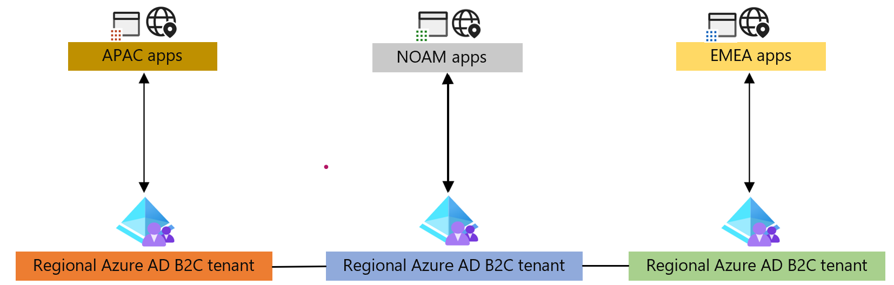
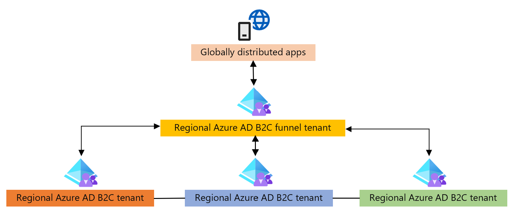

# Azure Active Directory B2C global identity framework

[Azure Active Directory B2C](overview.md) is a customer identity access management (CIAM) solution capable of supporting millions of users and billions of authentications per day. It takes care of the scaling and safety of the authentication platform, monitoring, and automatically handling threats like denial-of-service, password spray, or brute force attacks.

Azure Active Directory B2C (Azure AD B2C) is a separate service from [Azure Active Directory (Azure AD)](../active-directory/fundamentals/active-directory-whatis.md). It's built on the same technology as Azure AD but for a different purpose. It allows businesses to build customer facing applications, and then allows self-service sign-up to applications.

Azure AD B2C is a globally distributed service made up of several components:

* Directory

* [Application registrations](tutorial-register-applications.md?tabs=app-reg-ga)

* [User flows and custom policies](user-flow-overview.md)

* [Sign-in options](sign-in-options.md)

* [Keys](tokens-overview.md)

When creating an Azure AD B2C solution, you must provide a location to host the service. This location only pertains to the region in which the user profile data will be stored, while the rest of the service that processes your sign-in runs globally.

You typically deploy an Azure AD B2C tenant in the region closest to your user base. This makes it easier to maintain compliance with data residency laws, as the user profile is only replicated in the [selected region](https://learn.microsoft.com/en-us/azure/active-directory-b2c/data-residency). This also provides the best performance during sign-in, as network latencies are optimized to the directory store.

When your Azure AD B2C directory requires to service users across the globe, the regional structure poses a challenge. You must determine which location to create the Azure AD B2C tenant in. Any users outside the selected region may not be compliant with data residency requirements and may also experience increased latency when verifying their credentials or reading their user profile data.

For example, consider an application that supports users in Australia and North America, and Azure AD B2C directory is created in the North America region. Users who sign-in from Australia may face longer processing times to complete their authentication.

To better meet data residency requirements and mitigate performance issues, you must deploy multiple Azure AD B2C tenants. By placing a tenant in each region where your business operates, the operations into the directory are optimized for latency. However, by doing so, the solution creates additional overheads to configure, manage and protect these sensitive tenant resources in each region. Additional overheads include:

* Tenant administration

* Tenant isolation resulting in an end user experience that doesn’t feel global

* Billing

* CI/CD processes to manage policies/app registrations/keys

This document proposes architectures with Azure AD B2C that best accommodate solutions for customers who serve users across the globe. The solutions serve the following requirements:

* Users can maintain the same set of credentials, no matter from where in the world they access applications.

* Consistent performance and latency no matter where users authenticate from.

* Make it easy for customers to deliver processes, frameworks, or SDKs to their developer teams with least possible configuration required.

* User profiles can be maintained while users travel around the world. This creates more value in the analytics generated by user interactions within any service.

* Customer user data is stored in regional data stores.

The following are two approaches to consider when implementing an identity platform using Azure AD B2C tenants for a globally operating business model.

* The first approach uses geographical regions as the boundary and applications are configured specifically for the region.

* The second approach has a global boundary for the applications and uses an additional Azure AD B2C tenant to orchestrate interaction between regional tenants.

## Regional tenant orchestration

In this model, applications are either hosted per region, or have a per region configurations to connect to a regional tenant. Applications directly send the user to a region-specific tenant. Cross tenant communication is used to perform cross tenant authentications, or profile updates across tenants, when the user may have travelled to a different region.

## Funnel tenant orchestration

In this model, an Azure AD B2C tenant funnels users to regional Azure AD B2C tenants. The funnel tenant functions as a redirect orchestrator to other Azure AD B2C tenants. This is handled by a globally distributed component of the Azure AD B2C service, therefore performance is unaffected. This redirection is performed using OpenId Connect identity provider federations.

Cross tenant communication is used to perform cross tenant authentications, or profile updates across tenants. The funnel tenant provides applications a single endpoint to communicate with.

### Next steps

* [Azure AD B2C global identity design considerations](azure-ad-b2c-global-identity-design-considerations.md)

* [Azure AD B2C global identity proof of concept](azure-ad-b2c-global-identity-proof-of-concept.md)
