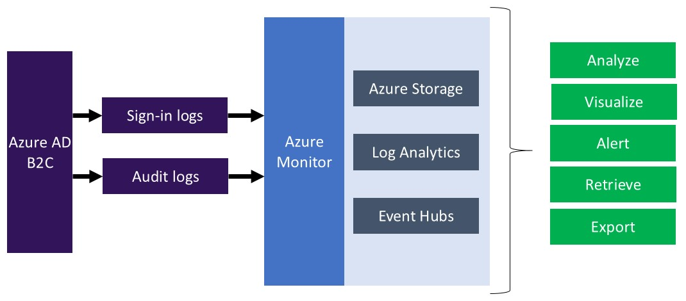
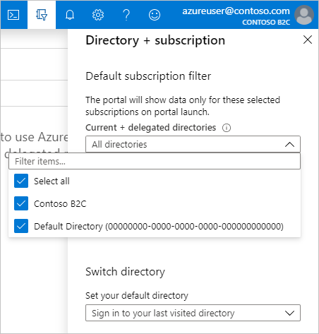
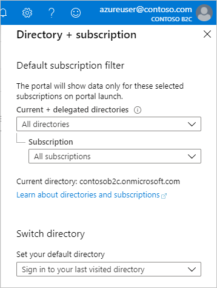
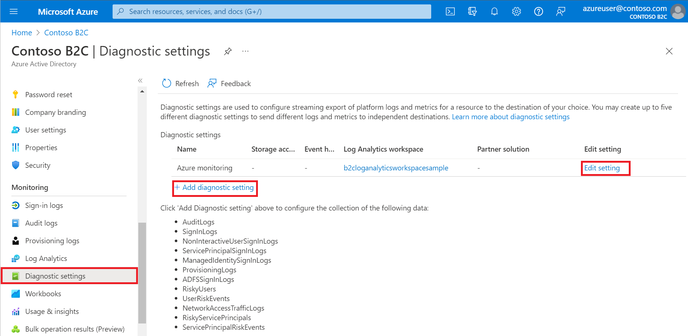

# Monitor Azure AD B2C with Azure Monitor

Use Azure Monitor to route Azure Active Directory B2C (Azure AD B2C) sign-in and [auditing](view-audit-logs.md) logs to different monitoring solutions. You can retain the logs for long-term use or integrate with third-party security information and event management (SIEM) tools to gain insights into your environment.

You can route log events to:

* An Azure [storage account](../storage/blobs/storage-blobs-introduction.md).
* A [Log Analytics workspace](../azure-monitor/platform/resource-logs-collect-workspace.md) (to analyze data, create dashboards, and alert on specific events).
* An Azure [event hub](../event-hubs/event-hubs-about.md) (and integrate with your Splunk and Sumo Logic instances).



## Prerequisites

To complete the steps in this article, you deploy an Azure Resource Manager template by using the Azure PowerShell module.

* [Azure PowerShell module](https://docs.microsoft.com/powershell/azure/install-az-ps) version 6.13.1 or higher

You can also use the [Azure Cloud Shell](https://shell.azure.com), which includes the latest version of the Azure PowerShell module.

## Delegated resource management

Azure AD B2C leverages [Azure Active Directory monitoring](../active-directory/reports-monitoring/overview-monitoring.md). To enable *Diagnostic settings* in Azure Active Directory within your Azure AD B2C tenant, you use [delegated resource management](../lighthouse/concepts/azure-delegated-resource-management.md).

You authorize a user or group in your Azure AD B2C directory (the **Service Provider**) to configure the Azure Monitor instance within the tenant that contains your Azure subscription (the **Customer**). To create the authorization, you deploy an [Azure Resource Manager](../azure-resource-manager/index.yml) template to your Azure AD tenant containing the subscription. The following sections walk you through the process.

## Create or choose resource group

This is the resource group containing the destination Azure storage account, event hub, or Log Analytics workspace to receive data from Azure Monitor. You specify the resource group name when you deploy the Azure Resource Manager template.

[Create a resource group](../azure-resource-manager/management/manage-resource-groups-portal.md#create-resource-groups) or choose an existing one in the Azure Active Directory (Azure AD) tenant that contains your Azure subscription, *not* the directory that contains your Azure AD B2C tenant.

This example uses a resource group named *azure-ad-b2c-monitor* in the *Central US* region.

## Delegate resource management

Next, gather the following information:

**Directory ID** of your Azure AD B2C directory (also known as the tenant ID).

1. Sign in to the [Azure portal](https://portal.azure.com/) as a user with the *User administrator* role (or higher).
1. Select the **Directory + Subscription** icon in the portal toolbar, and then select the directory that contains your Azure AD B2C tenant.
1. Select **Azure Active Directory**, select **Properties**.
1. Record the **Directory ID**.

**Object ID** of the Azure AD B2C group or user you want to give *Contributor* permission to the resource group you created earlier in the directory containing your subscription.

To make management easier, we recommend using Azure AD user *groups* for each role, allowing you to add or remove individual users to the group rather than assigning permissions directly to that user. In this walkthrough, you add a user.

1. With **Azure Active Directory** still selected in the Azure portal, select **Users**, and then select a user.
1. Record the user's **Object ID**.

### Create an Azure Resource Manager template

To onboard your Azure AD tenant (the **Customer**), create an [Azure Resource Manager template](../lighthouse/how-to/onboard-customer.md) for your offer with the following information. The `mspOfferName` and `mspOfferDescription` values are visible when you view offer details in the [Service providers page](../lighthouse/how-to/view-manage-service-providers.md) of the Azure portal.

| Field   | Definition |
|---------|------------|
| `mspOfferName`                     | A name describing this definition. For example, *Azure AD B2C Managed Services*. This value is displayed to the customer as the title of the offer. |
| `mspOfferDescription`              | A brief description of your offer. For example, *Enables Azure Monitor in Azure AD B2C*.|
| `rgName`                           | The name of the resource group you create earlier in your Azure AD tenant. For example, *azure-ad-b2c-monitor*. |
| `managedByTenantId`                | The **Directory ID** of your Azure AD B2C tenant (also known as the tenant ID). |
| `authorizations.value.principalId` | The **Object ID** of the B2C group or user that will have access to resources in this Azure subscription. For this walkthrough, specify the user's Object ID that you recorded earlier. |

Download the Azure Resource Manager template and parameter files:

- [rgDelegatedResourceManagement.json](https://github.com/Azure/Azure-Lighthouse-samples/blob/master/templates/rg-delegated-resource-management/rgDelegatedResourceManagement.json)
- [rgDelegatedResourceManagement.parameters.json](https://github.com/Azure/Azure-Lighthouse-samples/blob/master/templates/rg-delegated-resource-management/rgDelegatedResourceManagement.parameters.json)

Next, update the parameters file with the values you recorded earlier. The following JSON snippet shows an example of an Azure Resource Manager template parameters file. For `authorizations.value.roleDefinitionId`, use the [built-in role](../role-based-access-control/built-in-roles.md) value for the *Contributor role*, `b24988ac-6180-42a0-ab88-20f7382dd24c`.

```JSON
{
    "$schema": "https://schema.management.azure.com/schemas/2015-01-01/deploymentParameters.json#",
    "contentVersion": "1.0.0.0",
    "parameters": {
        "mspOfferName": {
            "value": "Azure AD B2C Managed Services"
        },
        "mspOfferDescription": {
            "value": "Enables Azure Monitor in Azure AD B2C"
        },
        "rgName": {
            "value": "azure-ad-b2c-monitor"
        },
        "managedByTenantId": {
            "value": "<Replace with DIRECTORY ID of Azure AD B2C tenant (tenant ID)>"
        },
        "authorizations": {
            "value": [
                {
                    "principalId": "<Replace with user's OBJECT ID>",
                    "principalIdDisplayName": "Azure AD B2C tenant administrator",
                    "roleDefinitionId": "b24988ac-6180-42a0-ab88-20f7382dd24c"
                }
            ]
        }
    }
}
```

### Deploy the Azure Resource Manager templates

Once you've updated your parameters file, deploy the Azure Resource Manager template into the Azure tenant as a subscription-level deployment. Because this is a subscription-level deployment, it cannot be initiated in the Azure portal. You can deploy by using the Azure PowerShell module or the Azure CLI. The Azure PowerShell method is shown below.

Sign in to the directory containing your subscription by using [Connect-AzAccount](/powershell/azure/authenticate-azureps). Use the `-tenant` flag to force authentication to the correct directory.

```PowerShell
Connect-AzAccount -tenant contoso.onmicrosoft.com
```

Use the [Get-AzSubscription](/powershell/module/az.accounts/get-azsubscription) cmdlet to list the subscriptions that the current account can access under the Azure AD tenant. Record the ID of the subscription you want to project into your Azure AD B2C tenant.

```PowerShell
Get-AzSubscription
```

Next, switch to the subscription you want to project into the Azure AD B2C tenant:

``` PowerShell
Select-AzSubscription <subscription ID>
```

Finally, deploy the Azure Resource Manager template and parameter files you downloaded and updated earlier. Replace the `Location`, `TemplateFile`, and `TemplateParameterFile` values accordingly.

```PowerShell
New-AzDeployment -Name "AzureADB2C" `
                 -Location "centralus" `
                 -TemplateFile "C:\Users\azureuser\Documents\rgDelegatedResourceManagement.json" `
                 -TemplateParameterFile "C:\Users\azureuser\Documents\rgDelegatedResourceManagement.parameters.json" `
                 -Verbose
```

Successful deployment of the template produces output similar to the following (output truncated for brevity):

```Console
PS /usr/csuser/clouddrive> New-AzDeployment -Name "AzureADB2C" `
>>                  -Location "centralus" `
>>                  -TemplateFile "rgDelegatedResourceManagement.json" `
>>                  -TemplateParameterFile "rgDelegatedResourceManagement.parameters.json" `
>>                  -Verbose
WARNING: Breaking changes in the cmdlet 'New-AzDeployment' :
WARNING:  - The cmdlet 'New-AzSubscriptionDeployment' is replacing this cmdlet.


WARNING: NOTE : Go to https://aka.ms/azps-changewarnings for steps to suppress this breaking change warning, and other information on breaking changes in Azure PowerShell.
VERBOSE: 7:25:14 PM - Template is valid.
VERBOSE: 7:25:15 PM - Create template deployment 'AzureADB2C'
VERBOSE: 7:25:15 PM - Checking deployment status in 5 seconds
VERBOSE: 7:25:42 PM - Resource Microsoft.ManagedServices/registrationDefinitions '44444444-4444-4444-4444-444444444444' provisioning status is succeeded
VERBOSE: 7:25:48 PM - Checking deployment status in 5 seconds
VERBOSE: 7:25:53 PM - Resource Microsoft.Resources/deployments 'rgAssignment' provisioning status is running
VERBOSE: 7:25:53 PM - Checking deployment status in 5 seconds
VERBOSE: 7:25:59 PM - Resource Microsoft.ManagedServices/registrationAssignments '11111111-1111-1111-1111-111111111111' provisioning status is running
VERBOSE: 7:26:17 PM - Checking deployment status in 5 seconds
VERBOSE: 7:26:23 PM - Resource Microsoft.ManagedServices/registrationAssignments '11111111-1111-1111-1111-111111111111' provisioning status is succeeded
VERBOSE: 7:26:23 PM - Checking deployment status in 5 seconds
VERBOSE: 7:26:29 PM - Resource Microsoft.Resources/deployments 'rgAssignment' provisioning status is succeeded

DeploymentName          : AzureADB2C
Location                : centralus
ProvisioningState       : Succeeded
Timestamp               : 1/31/20 7:26:24 PM
Mode                    : Incremental
TemplateLink            :
Parameters              :
                          Name                   Type                       Value
                          =====================  =========================  ==========
                          mspOfferName           String                     Azure AD B2C Managed Services
                          mspOfferDescription    String                     Enables Azure Monitor in Azure AD B2C
...
```

After you deploy the template, it can take a few minutes for the resource projection to complete. You may need to wait a few minutes (typically no more than five) before moving on to the next section to select the subscription.

## Select your subscription

Once you've deployed the template and have waited a few minutes for the resource projection to complete, associate your subscription to your Azure AD B2C directory with the following steps.

1. **Sign out** of the Azure portal if you're currently signed in. This and the following step are done to refresh your credentials in the portal session.
1. Sign in to the [Azure portal](https://portal.azure.com) with your Azure AD B2C administrative account.
1. Select the **Directory + Subscription** icon in the portal toolbar.
1. Select the directory that contains your subscription.

    
1. Verify that you've selected the correct directory and subscription. In this example, all directories and subscriptions are selected.

    

## Configure diagnostic settings

Diagnostic settings define where logs and metrics for a resource should be sent. Possible destinations are:

- [Azure storage account](../azure-monitor/platform/resource-logs-collect-storage.md)
- [Event hubs](../azure-monitor/platform/resource-logs-stream-event-hubs.md) solutions.
- [Log Analytics workspace](../azure-monitor/platform/resource-logs-collect-workspace.md)

If you haven't already, create an instance of your chosen destination type in the resource group you specified in the [Azure Resource Manager template](#create-an-azure-resource-manager-template).

### Create diagnostic settings

You're ready to [Create diagnostic settings](../active-directory/reports-monitoring/overview-monitoring.md) in the Azure portal.

To configure monitoring settings for Azure AD B2C activity logs:

1. Sign in to the [Azure portal](https://portal.azure.com/).
1. Select the **Directory + Subscription** icon in the portal toolbar, and then select the directory that contains your Azure AD B2C tenant.
1. Select **Azure Active Directory**
1. Under **Monitoring**, select **Diagnostic settings**.
1. If there are existing settings on the resource, you will see a list of settings already configured. Either select **Add diagnostic setting** to add a new setting, or **Edit** setting to edit an existing one. Each setting can have no more than one of each of the destination types..

    

1. Give your setting a name if it doesn't already have one.
1. Check the box for each destination to send the logs. Select **Configure** to specify their settings as described in the following table.

    | Setting | Description |
    |:---|:---|
    | Archive to a storage account | Name of storage account. |
    | Stream to an event hub | The namespace where the event hub is created (if this is your first time streaming logs) or streamed to (if there are already resources that are streaming that log category to this namespace).
    | Send to Log Analytics | Name of workspace. |

1. Select **AuditLogs** and **SignInLogs**.
1. Select **Save**.

## Next steps

For more information about adding and configuring diagnostic settings in Azure Monitor, see [Tutorial: Collect and analyze resource logs from an Azure resource](../azure-monitor/insights/monitor-azure-resource.md).

For information about streaming Azure AD logs to an event hub, see [Tutorial: Stream Azure Active Directory logs to an Azure event hub](../active-directory/reports-monitoring/tutorial-azure-monitor-stream-logs-to-event-hub.md).
