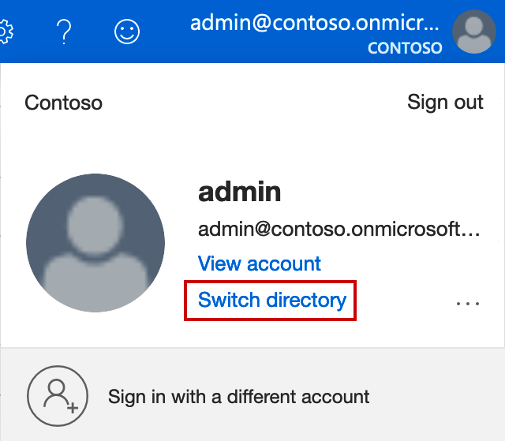
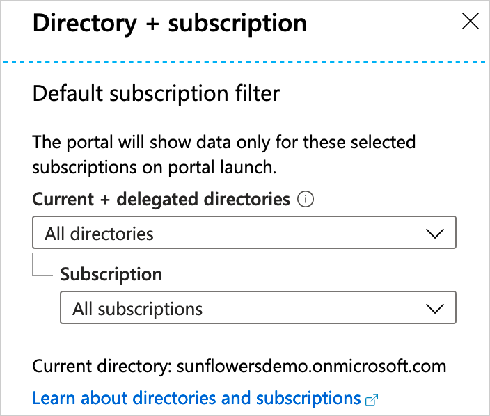

# Monitor Azure AD B2C with Azure Monitor

With Azure Active Directory B2C (Azure AD B2C) monitoring, you can route your Azure AD B2C activity logs to different monitoring solutions. You can either retain them for long-term use or integrate with third-party Security Information and Event Management (SIEM) tools to gain insights into your environment.

Currently, you can route the logs to:

- An Azure storage account.
- An Azure event hub (and integrate with your Splunk and Sumologic instances).
- Azure Log Analytics workspace (to analyze data, create dashboards and alert on specific events).


## Prerequisites

To complete the steps in this article, you deploy an Azure Resource Manager template by using the Azure PowerShell module.

* [Azure PowerShell module](https://docs.microsoft.com/powershell/azure/install-az-ps) version 6.13.1 or higher

You can also use the [Azure Cloud Shell](https://shell.azure.com) which includes the latest version of the Azure PowerShell module.

## Delegated resource management

Azure AD B2C leverages [Azure Active Directory monitoring](../active-directory/reports-monitoring/overview-monitoring.md). To enable **Diagnostic settings** to use Azure Monitor for your Azure AD B2C directory, you use [delegated resource management](../lighthouse/concepts/azure-delegated-resource-management.md).

## Create a resource group

In the Azure AD tenant that contains your subscription (not the directory that contains your Azure AD B2C tenant), [create a resource group](../azure-resource-manager/management/manage-resource-groups-portal.md#create-resource-groups). Use the following values:

- **Subscription**: Select your Azure subscription.
- **Resource group**: Enter name for the resource group. For example, *azure-ad-b2c-monitor*.
- **Region**: Select an Azure location. For example, *Central US*.

## Delegate resource management

Start by gathering the following information.

**Directory ID** of your Azure AD B2C directory.

* To get the directory ID, sign in to the [Azure portal](https://portal.azure.com/) as a user with the *User administrator* role (or higher), and then use the **Directory + Subscription** filter to switch to the directory that contains your Azure AD B2C tenant. Select **Azure Active Directory**, select **Properties**, and then record the **Directory ID**.

**Object ID** of Azure AD B2C user or group that you want to give contributor permission to the subscription.

* With **Azure Active Directory** still selected in the Azure portal, select **Users**, and then select a user. Record the users's **Object ID**.

  You authorize the user in the Azure AD B2C directory to configure Azure Monitor, which is hosted in an Azure Subscription within another tenant, by [deploying an Azure Resource Manager template to your Azure AD tenant](../lighthouse/how-to/onboard-customer.md) for one or more specific subscriptions or resource groups.

### Create an Azure Resource Manager template

To onboard your Azure AD tenant, you'll need to create an [Azure Resource Manager](https://docs.microsoft.com/azure/azure-resource-manager/) template for your offer with the following information. The **mspOfferName** and **mspOfferDescription** values are visible to the you when viewing offer details in the [Service providers page](https://docs.microsoft.com/azure/lighthouse/how-to/view-manage-service-providers) of the Azure portal.

|Field  |Definition  |
|---------|---------|
| `mspOfferName`     |A name describing this definition. This value is displayed to the customer as the title of the offer.         |
| `mspOfferDescription`     |A brief description of your offer (for example, "Contoso Azure AD subscription")      |
| `rgName`| The name of the resource group you create earlier in your Azure AD tenant `azure-ad-b2c-monitor` |
| `managedByTenantId`     |Your Azure AD B2C tenant ID         |
| `authorizations.value.principalId`     |The Azure AD B2C user or group Object Id which will have access to resources within this Azure Subscription.     |

Download the Azure resource manager template and parameter files:

- [rgDelegatedResourceManagement.json](https://raw.githubusercontent.com/Azure/Azure-Lighthouse-samples/master/Azure-Delegated-Resource-Management/templates/rg-delegated-resource-management/rgDelegatedResourceManagement.json)
- [rgDelegatedResourceManagement.parameters.json](https://raw.githubusercontent.com/Azure/Azure-Lighthouse-samples/master/Azure-Delegated-Resource-Management/templates/rg-delegated-resource-management/rgDelegatedResourceManagement.parameters.json)

The following is an example of an Azure Resource Manager Template parameters file. For the authorizations.value.roleDefinitionId you can use the **Contributor role** `b24988ac-6180-42a0-ab88-20f7382dd24c`. See the list of [Built-in roles for Azure resources](https://docs.microsoft.com/azure/role-based-access-control/built-in-roles)

```JSON
{
    "$schema": "https://schema.management.azure.com/schemas/2015-01-01/deploymentParameters.json#",
    "contentVersion": "1.0.0.0",
    "parameters": {
        "mspOfferName": {
            "value": "Azure AD B2C Managed Services"
        },
        "mspOfferDescription": {
            "value": "Azure AD B2C Managed Services"
        },
        "rgName": {
            "value": "azure-ad-b2c-monitor"
        },
        "managedByTenantId": {
            "value": "<Replace with your B2C tenant Id>"
        },
        "authorizations": {
            "value": [
                {
                    "principalId": "<Replace with the group or user object id>",
                    "principalIdDisplayName": "Azure AD B2C tenant administrator",
                    "roleDefinitionId": "b24988ac-6180-42a0-ab88-20f7382dd24c"
                }
            ]
        }
    }
}
```

### Deploy the Azure Resource Manager templates

Once you have updated your parameter file, you must deploy the Azure Resource Manager template into the Azure tenant as a subscription-level deployment. A separate deployment is needed for each subscription that you want to onboard to Azure delegated resource management (or for each subscription that contains resource groups that you want to onboard).

Because this is a subscription-level deployment, it cannot be initiated in the Azure portal. The deployment may be done by using PowerShell or Azure CLI, as shown below. Learn more bout [Onboard a customer to Azure delegated resource management](https://docs.microsoft.com/azure/lighthouse/how-to/onboard-customer#deploy-the-azure-resource-manager-templates). Note: In this case, the **Customer** is your Azure AD tenant, while the **Service Provider** is your Azure AD B2C tenant.

Log in with [Connect-AzAccount](https://docs.microsoft.com/powershell/azure/authenticate-azureps?view=azps-3.1.0) to your subscription, with into the Azure AD tenant. You can use the `-tenant` flag to force the authentication to the correct Azure AD.

```PowerShell
Connect-AzAccount
```

Or to force the authentication against the appropriate tenant

```PowerShell
Connect-AzAccount -tenant contoso.onmicrosoft.com
```

Use the [Get-AzSubscription](https://docs.microsoft.com/powershell/module/az.accounts/get-azsubscription?view=azps-3.1.0) cmdlet to list the subscriptions that the current account can access under the Azure AD tenant. Copy the Id of the subscription you want to project into Azure AD B2C tenant.

```PowerShell
Get-AzSubscription
```

Then switch to the subscription you want to project to Azure AD B2C tenant, using the Select-AzSubscription

``` PowerShell
Select-AzSubscription <subscription Id>
```

Deploy Azure Resource Manager template using template and parameter file locally, using the [New-AzDeployment](https://docs.microsoft.com/powershell/module/az.resources/new-azdeployment?view=azps-3.1.0)

```PowerShell
New-AzDeployment -Name "AzureADB2C" `
                 -Location "centralus" `
                 -TemplateFile "C:\Users\david\Documents\rgDelegatedResourceManagement.json" `
                 -TemplateParameterFile "C:\Users\david\Documents\rgDelegatedResourceManagement.parameters.json" `
                 -Verbose
```

### Confirm successful onboarding (optional)

When a customer subscription (Azure AD) has successfully been onboarded to Azure delegated resource management, users in the service provider's (Azure AD B2C) tenant will be able to see the subscription and its resources (if they have been granted access to it through the process above, either individually or as a member of an Azure AD group with the appropriate permissions). To confirm this, check to make sure the subscription appears in one of the following ways.

In the Azure AD B2C tenant:

1. Navigate to the [My customers page](../lighthouse/how-to/view-manage-customers.md).
2. Select **Customers**.
3. Confirm that you can see the subscription(s) with the offer name you provided in the Resource Manager template.

> [!IMPORTANT]
> In order to see the delegated subscription in [My customers](../lighthouse/how-to/view-manage-customers.md), users in the service provider's tenant must have been granted the [Reader](../../role-based-access-control/built-in-roles.md#reader) role (or another built-in role which includes Reader access) when the subscription was onboarded for Azure delegated resource management.

In the Azure AD tenant:

1. Navigate to the [Service providers page](view-manage-service-providers.md).
2. Select **Service provider offers**.
3. Confirm that you can see the subscription(s) with the offer name you provided in the Resource Manager template.

> [!NOTE]
> It may take a few minutes after your deployment is complete before the updates are reflected in the Azure portal.

## Select your subscription

To associate an existing subscription to your Azure AD directory, follow these steps:

1. Sign in to the Azure portal with your Azure AD B2C administrative account.
1. Select the Directory + Subscription icon in the portal toolbar

    

1. select the directory that contains your Azure AD B2C tenant.

    

## Next steps

After you delegate permissions to your Azure AD B2C user or group, you can [Create diagnostic settings in Azure portal](https://docs.microsoft.com/azure/active-directory/reports-monitoring/overview-monitoring).

To configure monitoring settings for Azure AD B2C activity logs, first sign-in to the [Azure portal](https://portal.azure.com), then select **Azure Active Directory**. From here, you can access the **Diagnostic settings** configuration page in two ways:

- Select **Diagnostic settings** from the **Monitoring** section.

    
- Select **+Add diagnostic setting**.