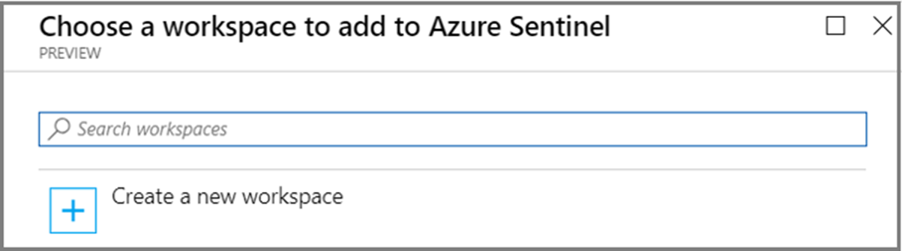

# Tutorial: How to perform Security Analytics for Azure AD B2C with Sentinel

You can further secure your Azure AD B2C environment by routing logs and audit information to Azure Sentinel. Azure Sentinel is a cloud-native **Security Information Event Management (SIEM) and Security Orchestration Automated Response (SOAR)** solution. Azure Sentinel provides alert detection, threat visibility, proactive hunting, and threat response for **Azure AD B2C**.

By utilizing Azure Sentinel in conjunction with Azure AD B2C, you can:
1. Detect previously undetected threats, and minimize false positives using Microsoft's analytics and unparalleled threat intelligence.
1. Investigate threats with artificial intelligence, and hunt for suspicious activities at scale, tapping into years of cyber security work at Microsoft.
1. Respond to incidents rapidly with built-in orchestration and automation of common tasks.
1. Meet security and compliance requirements for your organization.

In this tutorial, you’ll learn:
1. How to transfer the B2C logs to Azure Monitor so they land in a Log Analytics workspace.
1. Enable Azure Sentinel the LA workspace.
1. Create a sample rule that will trigger an incident.
1. 9And lastly, configure some automated response.

## Deployment overview

### Configure AAD B2C with Azure Monitor

Follow steps 1 to 5 of the [Monitor Azure AD B2C with Azure monitor](./azure-monitor.md) to configure Azure AD B2C to send logs to Azure Monitor. 

### Deploy an Azure Sentinel instance
> [!IMPORTANT]
> To enable Azure Sentinel, you need **contributor permissions** to the subscription in which the Azure Sentinel workspace resides. To use Azure Sentinel, you need either contributor or reader permissions on the resource group that the workspace belongs to.

1.	Sign into the Azure portal. Make sure that the subscription where the LA workspace created in the previous step is selected.

2.	Search for and select **Azure Sentinel**.

3.	Select **Add**.


4.	Select the workspace created in the previous step. 


5. Select Add **Azure Sentinel**.
> [!NOTE]
> You can run Azure Sentinel on more than one workspace, but the data is isolated to a single workspace. For additional details on enabling Sentinel, please see this [QuickStart](https://docs.microsoft.com/en-us/azure/sentinel/quickstart-onboard). 

## Create a Sentinel Rule

Now that you've enabled Sentinel you'll want to be notified when something suspicious occurs in your B2C tenant.
>[!NOTE] 
>Azure Sentinel provides out-of-the-box, built-in templates to help you create threat detection rules designed by Microsoft's team of security experts and analysts. Rules created from these templates automatically search across your data for any suspicious activity. Because today there is no native Azure AD B2C connector we will not use native rules in our example, hence for our scenario you will create our own rule.


# OLD DOCO from WARD Deployment overview

## 1. Configure Azure AD B2C with Azure Monitor

Follow steps 1 to 5 of the [Monitor Azure AD B2C with Azure monitor](./azure-monitor.md) to configure Azure AD B2C to send logs to Azure Monitor. 

## 3. Configure Azure Sentinel for Azure AD B2C

Once you've configured your Azure AD B2C instance to send logs to Log Analytics, you need to deploy an Azure Sentinel instance.

### 3.1 Setup an Azure Sentinel instance

1. Sign in to the [Azure portal](https://portal.azure.com).
1. Select the **Directory + Subscription** icon in the portal toolbar, and then select the directory that contains your **Azure AD tenant**.
1. Enter **Azure Sentinel** in the **Search resource, services and docs** at the top of the portal. 
1. Click on **Create**
1. Select the log analytics workspace the Azure AD B2C are being sent to

### 3.2 Configuration Azure Sentinel to process Azure AD B2C logs

1. Open up the Azure Sentinel instance
1. Select **Data Connectors**
1. In the list find **Azure Active Directory**. If the status is green, the connector is connected.
1. Select **Open Connector Page**
1. Under **Configuration** select the **Sign-In Logs** and **Audit Logs**
1. Select **Apply Changes**


## 4. Using Azure Sentinel and Azure AD B2C

Now you have deployed the instance, you have to do this thing.

1. Sign in to the [Azure portal](https://portal.azure.com).
1. Etc.
1. etc.

## 3. Visualize your data - or do Sentinel stuff here?

Now you can visualize your Sentinel data and configure automated response to attacks or something?

### 3.1 Create a Sentinel Query

Log queries help you to fully leverage the value of the data collected in Azure Monitor Logs. A powerful query language allows you to join data from multiple tables, aggregate large sets of data, and perform complex operations with minimal code. Virtually any question can be answered and analysis performed as long as the supporting data has been collected, and you understand how to construct the right query. For more information, see [Get started with log queries in Azure Monitor](../azure-monitor/logs/get-started-queries.md).

1. From **Log Analytics workspace**, select **Logs**
1. In the query editor, paste the following [Kusto Query Language](/azure/data-explorer/kusto/query/) query. This query shows policy usage by operation over the past x days. The default duration is set to 90 days (90d). Notice that the query is focused only on the operation where a token/code is issued by policy.

    ```kusto
    AuditLogs
    | where TimeGenerated  > ago(90d)
    | where OperationName contains "issue"
    | extend  UserId=extractjson("$.[0].id",tostring(TargetResources))
    | extend Policy=extractjson("$.[1].value",tostring(AdditionalDetails))
    | summarize SignInCount = count() by Policy, OperationName
    | order by SignInCount desc  nulls last
    ```

1. Select **Run**. The query results are displayed at the bottom of the screen.
1. To save your query for later use, select **Save**.

   

1. Fill in the following details:

    - **Name** - Enter the name of your query.
    - **Save as** - Select `query`.
    - **Category** - Select `Log`.

1. Select **Save**.

You can also change your query to visualize the data by using the [render](/azure/data-explorer/kusto/query/renderoperator?pivots=azuremonitor) operator.

```kusto
AuditLogs
| where TimeGenerated  > ago(90d)
| where OperationName contains "issue"
| extend  UserId=extractjson("$.[0].id",tostring(TargetResources))
| extend Policy=extractjson("$.[1].value",tostring(AdditionalDetails))
| summarize SignInCount = count() by Policy
| order by SignInCount desc  nulls last
| render  piechart
```

**** - Picture of sentinel stuff here

For more samples, see the Azure AD B2C [SIEM GitHub repo](https://aka.ms/b2csiem).

### 3.2 Create a Sentinel Alert

Once you've configured you Sentinel stuff, you can now configure automated alerts blah blah.

Follow the instructions below to create a new workbook using a JSON Gallery Template. This workbook provides a **User Insights** and **Authentication** dashboard for Azure AD B2C tenant.

1. From the **Log Analytics workspace**, select **Workbooks**.
1. etc.
1. etc.

## Create automated actions based off alerts

Alerts are created by alert rules in Azure Monitor and can automatically run saved queries or custom log searches at regular intervals. You can create alerts based on specific performance metrics or when certain events are created, absence of an event, or a number of events are created within a particular time window. For example, alerts can be used to notify you when average number of sign-in exceeds a certain threshold. For more information, see [Create alerts](../azure-monitor/alerts/tutorial-response.md).


Use the following instructions to create a new Azure Alert, which will send an [email notification](../azure-monitor/alerts/action-groups.md#configure-notifications) whenever there is a 25% drop in the **Total Requests** compare to previous period. Alert will run every 5 minutes and look for the drop within last 24 hours windows. The alerts are created using Kusto query language.


1. From **Log Analytics workspace**, select **Logs**. 
1. Create a new **Kusto query** by using the query below.

    ```kusto
    let start = ago(24h);
    let end = now();
    let threshold = -25; //25% decrease in total requests.
    AuditLogs
    | serialize TimeGenerated, CorrelationId, Result
    | make-series TotalRequests=dcount(CorrelationId) on TimeGenerated in range(start, end, 1h)
    | mvexpand TimeGenerated, TotalRequests
    | where TotalRequests > 0
    | serialize TotalRequests, TimeGenerated, TimeGeneratedFormatted=format_datetime(todatetime(TimeGenerated), 'yyyy-M-dd [hh:mm:ss tt]')
    | project   TimeGeneratedFormatted, TotalRequests, PercentageChange= ((toreal(TotalRequests) - toreal(prev(TotalRequests,1)))/toreal(prev(TotalRequests,1)))*100
    | order by TimeGeneratedFormatted
    | where PercentageChange <= threshold   //Trigger's alert rule if matched.
    ```

1. Select **Run**, to test the query. You should see the results if there is a drop of 25% or more in the total requests within the past 24 hours.
1. To create an alert rule based on the query above, use the **+ New alert rule** option available in the toolbar.
1. On the **Create an alert rule** page, select **Condition name** 
1. On the **Configure signal logic** page, set following values and then use **Done** button to save the changes.
    * Alert logic: Set **Number of results** **Greater than** **0**.
    * Evaluation based on: Select **1440** for Period (in minutes) and **5** for Frequency (in minutes) 

    

After the alert is created, go to **Log Analytics workspace** and select **Alerts**. This page displays all the alerts that have been triggered in the duration set by **Time range** option.  

### Configure action groups

Azure Monitor and Service Health alerts use action groups to notify users that an alert has been triggered. You can include sending a voice call, SMS, email; or triggering various types of automated actions. Follow the guidance [Create and manage action groups in the Azure portal](../azure-monitor/alerts/action-groups.md)

Here is an example of an alert notification email. 

   

## Multiple tenants

Something something cross tenant sentinel logs or something?.

When working with multiple Log Analytics workspaces, use [Cross Workspace Query](../azure-monitor/logs/cross-workspace-query.md) to create queries that work across multiple workspaces. For example, the following query performs a join of two Audit logs from different tenants based on the same Category (for example, Authentication):

```kusto
workspace("AD-B2C-TENANT1").AuditLogs
| join  workspace("AD-B2C-TENANT2").AuditLogs
  on $left.Category== $right.Category
```

## Change the data retention period

Azure Monitor Logs are designed to scale and support collecting, indexing, and storing massive amounts of data per day from any source in your enterprise or deployed in Azure. By default, logs are retained for 30 days, but retention duration can be increased to up to two years. Learn how to [manage usage and costs with Azure Monitor Logs](../azure-monitor/logs/manage-cost-storage.md). After you select the pricing tier, you can [Change the data retention period](../azure-monitor/logs/manage-cost-storage.md#change-the-data-retention-period).

## Next steps

* Find more samples in the Azure AD B2C [SIEM gallery](https://aka.ms/b2csiem). 

* For more information about adding and configuring diagnostic settings in Azure Monitor, see [Tutorial: Collect and analyze resource logs from an Azure resource](../azure-monitor/essentials/monitor-azure-resource.md).

* For information about streaming Azure AD logs to an event hub, see [Tutorial: Stream Azure Active Directory logs to an Azure event hub](../active-directory/reports-