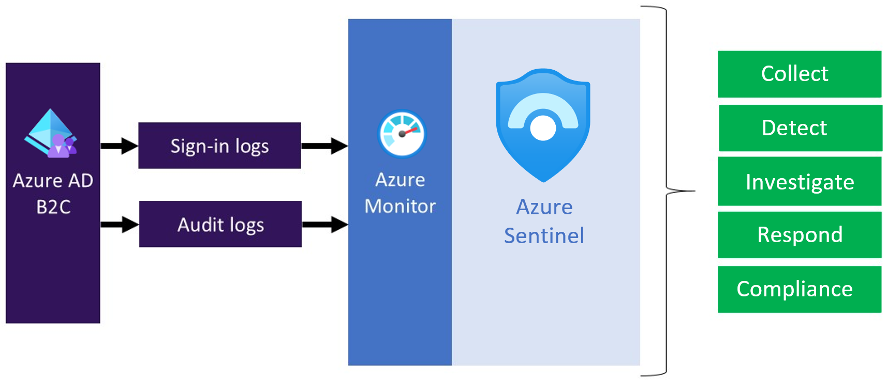

# Secure Azure AD B2C with Azure Sentinel

You can further secure your Azure AD B2C environment by routing logs and audit information to Azure Sentinel. Azure Sentinel is a cloud-native *security information event management (SIEM)* and *security orchestration automated response (SOAR)* solution. Azure Sentinel provides alert detection, threat visibility, proactive hunting, and threat response for Azure AD B2C.


By utilizing Azure Sentinel in conjunction with Azure AD B2C, you can:


* Detect previously undetected threats, and minimize false positives using Microsoft's analytics and unparalleled threat intelligence. 
* Investigate threats with artificial intelligence, and hunt for suspicious activities at scale, tapping into years of cyber security work at Microsoft.
* Respond to incidents rapidly with built-in orchestration and automation of common tasks.
* Meet security and compliance requirements for your organization. 



In this article, you learn how to transfer the logs to an Azure Log Analytics workspace, configure an Azure Sentinel (instance?) and lastly **<do sentinel things?>**.

> [!IMPORTANT]
> You will require an account that has admin permissions in the Azure AD B2C tenant. As part of the deployment process, this account will be granted access to a resource group containing the log analytics workspace used by Azure Sentinel. 


## 1. Deployment overview

Azure AD B2C leverages [Azure Active Directory monitoring](../active-directory/reports-monitoring/overview-monitoring.md). Because an Azure AD B2C tenant, unlike Azure AD tenants, cannot have a subscription associated with it, we need to take some additional steps to enable the integration between Azure AD B2C and Log Analytics which is where we will send the logs.  
To enable *Diagnostic settings* in Azure Active Directory within your Azure AD B2C tenant, you use [Azure Lighthouse](../lighthouse/overview.md) to [delegate a resource](../lighthouse/concepts/architecture.md), which allows your Azure AD B2C (the **Service Provider**) to manage an Azure AD (the **Customer**) resource. 

>[!TIP]
> Azure Lighthouse is typically used to manage resources for multiple customers. However, it can also be used to manage resources **within an enterprise which has multiple Azure AD tenants of its own**, which is exactly what we are doing here, except that we are only delegating the management of single resource group.

After you complete the steps in this article, you will have created a new resource group and have access to that same resource group that containing the [Log Analytics workspace](../azure-monitor/logs/quick-create-workspace.md) from your **Azure AD B2C** portal. This will allow you to transfer the logs from Azure AD B2C to your Log Analytics workspace.

During this deployment, you'll authorize a user or group in your Azure AD B2C directory to configure the Log Analytics workspace instance that will be used by Azure Sentinel. To create the authorization, you deploy an [Azure Resource Manager](../azure-resource-manager/index.yml) template to your to the subscription containing Log Analytics and Azure Sentinel.

In summary, you will use Azure Lighthouse to allow a user or group in your Azure AD B2C tenant to manage a resource group in a subscription associated with a different tenant. After this authorization is completed, the subscription and log analytics workspace can be selected as a target in the Diagnostic settings in Azure AD B2C. 

## 2. Deployment of Azure AD B2C and Azure Sentinel integration

In the context of this article, Azure Sentinel, its Log Analytics workspace, the containing resource group are all contained with a standard Azure subscription which is associated with a regular Azure AD tenant. 

Azure AD B2C is a separate tenant which may, or may not be associated with that subscription. 

### 2.1 Create or choose resource group

First, create, or choose a resource group that contains the destination Log Analytics workspace that will receive data from Azure AD B2C. You'll specify the resource group name when you deploy the Azure Resource Manager template.

1. Sign in to the [Azure portal](https://portal.azure.com).
1. Select the **Directory + Subscription** icon in the portal toolbar, and then select the directory that contains your **Azure AD tenant**.
1. [Create a resource group](../azure-resource-manager/management/manage-resource-groups-portal.md#create-resource-groups) or choose an existing one. This example uses a resource group named *azure-ad-b2c-monitor*.

### 2.2 Create a Log Analytics workspace

A **Log Analytics workspace** is a unique environment for Azure Monitor log data. You'll use this Log Analytics workspace to collect data from Azure AD B2C [audit logs](view-audit-logs.md). 

1. Sign in to the [Azure portal](https://portal.azure.com).
1. Select the **Directory + Subscription** icon in the portal toolbar, and then select the directory that contains your **Azure AD tenant**.
1. [Create a Log Analytics workspace](../azure-monitor/logs/quick-create-workspace.md). This example uses a Log Analytics workspace named *AzureAdB2C*, in a resource group named *azure-ad-b2c-monitor*.

### 2.3. Delegate resource management

In this step, you choose your Azure AD B2C tenant as a **service provider**. You also define the authorizations you need to assign the appropriate Azure built-in roles to groups in your Azure AD tenant.

#### 2.3.1 Get your Azure AD B2C tenant ID

First, get the **Tenant ID** of your Azure AD B2C directory (also known as the directory ID).

1. Sign in to the [Azure portal](https://portal.azure.com/).
1. Select the **Directory + Subscription** icon in the portal toolbar, and then select the directory that contains your **Azure AD B2C** tenant.
1. Select **Azure Active Directory**, select **Overview**.
1. Record the **Tenant ID**.

#### 2.3.2 Select a security group

Now select an Azure AD B2C group or user to which you want to give permission to the resource group you created earlier in the directory containing your subscription.  

To make management easier, we recommend using an Azure AD *group* for each role, allowing you to add or remove individual users to the group rather than assigning permissions directly to that user. In this walkthrough, we'll add a security group.

> [!IMPORTANT]
> In order to add permissions for an Azure AD group, the **Group type** must be set to **Security**. This option is selected when the group is created. For more information, see [Create a basic group and add members using Azure Active Directory](../active-directory/fundamentals/active-directory-groups-create-azure-portal.md).

1. With **Azure Active Directory** still selected in your **Azure AD B2C** directory, select **Groups** 
and then select a group. If you don't have an existing group, create a **Security** group, then add members. For more information, follow the procedure [Create a basic group and add members using Azure Active Directory](../active-directory/fundamentals/active-directory-groups-create-azure-portal.md). 
1. Select **Overview**, and record the group's **Object ID**.


>[!Important]
> After the authorization has been setup (following steps) users in this group will have contributor access to the resource group specified. This is required to allow these users to configure the diagnostic settings in Azure AD B2C. This group membership is not the recommended way of configuring access to Azure Sentinel and the Log Analytics workspace. That access should be controlled directly within the containing subscription using the usual methods. 
 

1.  and then select a group. If you don't have an existing group, create a **Security** group, then add members. For more information, follow the procedure [Create a basic group and add members using Azure Active Directory](../active-directory/fundamentals/active-directory-groups-create-azure-portal.md). 
1. Select **Overview**, and record the group's **Object ID**.

#### 2.3.3 Deploy the authorization

Currently, the Azure Lighthouse GUI does not permit the creation of custom authorizations and delegations. This delegation must be deployed using an Azure Resource Manager template which can be easily deployed to the target subscription. 
The net effect if this deployment is that the specified group from the Azure AD B2C tenant (previously created) will be granted contributor access to the target resource group (containing the Log Analytics workspace). This in turn will allow users in that group to configure the Diagnostic settings in Azure AD B2C.  

 Deploy the template from the GitHub sample by using the **Deploy to Azure** button, which opens the Azure portal and lets you configure and deploy the template directly in the portal. For these steps, make sure you're signed in to your Azure AD tenant (not the Azure AD B2C tenant).

1. Sign in to the [Azure portal](https://portal.azure.com).
2. Select the **Directory + Subscription** icon in the portal toolbar, and then select the directory that contains your **Azure AD** tenant.
3. Use the **Deploy to Azure** button to open the Azure portal and deploy the template directly in the portal. For more information, see [create an Azure Resource Manager template](../lighthouse/how-to/onboard-customer.md#create-an-azure-resource-manager-template).

   [](   https://portal.azure.com/#create/Microsoft.Template/uri/https%3A%2F%2Fraw.githubusercontent.com%2Fazure-ad-b2c%2Fsiem%2Fmaster%2Ftemplates%2FrgDelegatedResourceManagement.json)

5. On the **Custom deployment** page, enter the following information:

   | Field   | Definition |
   |---------|------------|
   | Subscription |  Select the directory that contains the Azure subscription where the *azure-ad-b2c-monitor* resource group was created. |
   | Region| Select the region where the resource will be deployed.  | 
   | Msp Offer Name| A name describing this definition. For example, *Azure AD B2C Sentinel*. This is name that will be displayed in Azure Lighthouse. |
   | Msp Offer Description| A brief description of your offer. For example, *Enables Azure Sentinel and Azure AD B2C integration*.|
   | Managed By Tenant Id| The **Tenant ID** of your Azure AD B2C tenant (also known as the directory ID). |
   |Authorizations|Specify a JSON array of objects that include the Azure AD `principalId`, `principalIdDisplayName`, and Azure `roleDefinitionId`. The `principalId` is the **Object ID** of the B2C group or user that will have access to resources in this Azure subscription. For this walkthrough, specify the group's Object ID that you recorded earlier. For the `roleDefinitionId`, use the [built-in role](../role-based-access-control/built-in-roles.md) value for the *Contributor role*, `b24988ac-6180-42a0-ab88-20f7382dd24c`.|
   | Rg Name | The name of the resource group you create earlier in your Azure AD tenant. For example, *azure-ad-b2c-monitor*. |

   The following example demonstrates an Authorizations array with one security group.

   ```json
   [
       {
           "principalId": "<Replace with group's OBJECT ID>",
           "principalIdDisplayName": "Azure AD B2C tenant administrators",
           "roleDefinitionId": "b24988ac-6180-42a0-ab88-20f7382dd24c"
       }
   ]
   ```

After you deploy the template, it can take a few minutes (typically no more than five) for the resource projection to complete. You can verify the deployment in your Azure AD tenant and get the details of the resource projection. For more information, see [View and manage service providers](../lighthouse/how-to/view-manage-service-providers.md).

### 2.4 Select your subscription

After you've deployed the template and waited a few minutes for the resource projection to complete, follow these steps to associate your subscription with your Azure AD B2C directory.

>[!Note]
> These steps are required in order to select the subscription and log analytics workspace when configuring the Diagnostic settings in Azure AD B2C. 

1. Sign out of the Azure portal if you're currently signed in (this allows your session credentials to be refreshed in the next step).
2. Sign in to the [Azure portal](https://portal.azure.com) with your **Azure AD B2C** administrative account. This account must be a member of the security group you specified in the [Delegate resource management](#3-delegate-resource-management) step.
3. Select the **Directory + Subscription** icon in the portal toolbar.
4. Select the Azure AD directory that contains the Azure subscription and the *azure-ad-b2c-monitor* resource group you created.

    

1. Verify that you've selected the correct directory and subscription. In this example, all directories and all subscriptions are selected.

    

>[!Tip]
> If the subscription does not show up in the list, sign out and sign back in. 

### 2.5 Configure diagnostic settings

To configure monitoring settings for Azure AD B2C activity logs:

1. Sign in to the [Azure portal](https://portal.azure.com/) with your Azure AD B2C administrative account. This account must be a member of the security group you specified in the [Select a security group](#232-select-a-security-group) step.
1. Select the **Directory + Subscription** icon in the portal toolbar, and then select the directory that contains your Azure AD B2C tenant.
1. Select **Azure Active Directory**
1. Under **Monitoring**, select **Diagnostic settings**.
1. If there are existing settings for the resource, you will see a list of settings already configured. Either select **Add diagnostic setting** to add a new setting, or select **Edit** to edit an existing setting. Each setting can have no more than one of each of the destination types.

    

1. Give your setting a name if it doesn't already have one.
1. Check the box for each destination to send the logs. Select **Configure** to specify their settings **as described in the following table**.
1. Select **Send to Log Analytics**, and then select the **Name of workspace** you created earlier (`AzureAdB2C`).
1. Select **AuditLogs** and **SignInLogs**.
1. Select **Save**.

> [!NOTE]
> It can take up to 15 minutes after an event is emitted for it to [appear in a Log Analytics workspace](../azure-monitor/logs/data-ingestion-time.md). Also, learn more about [Active Directory reporting latencies](../active-directory/reports-monitoring/reference-reports-latencies.md), which can impact the staleness of data and play an important role in reporting.

If you see the error message "To setup Diagnostic settings to use Azure Monitor for your Azure AD B2C directory, you need to set up delegated resource management," make sure you sign-in with a user who is a member of the [security group](#232-select-a-security-group). If you cannot select the subscription, make sure you follow the instructions for [select your subscription](#24-select-your-subscription), and sign out and back in. 

## 3. Configure Azure Sentinel for Azure AD B2C

Once you've configured your Azure AD B2C instance to send logs to Log Analytics, you need to deploy an Azure Sentinel instance.

### 3.1 Setup an Azure Sentinel instance

1. Sign in to the [Azure portal](https://portal.azure.com).
1. Select the **Directory + Subscription** icon in the portal toolbar, and then select the directory that contains your **Azure AD tenant**.
1. Enter **Azure Sentinel** in the **Search resource, services and docs** at the top of the portal. 
1. Click on **Create**
1. Select the log analytics workspace the Azure AD B2C are being sent to

### 3.2 Configuration Azure Sentinel to process Azure AD B2C logs

1. Open up the Azure Sentinel instance
1. Select **Data Connectors**
1. In the list find **Azure Active Directory**. If the status is green, the connector is connected.
1. Select **Open Connector Page**
1. Under **Configuration** select the **Sign-In Logs** and **Audit Logs**
1. Select **Apply Changes**


## 4. Using Azure Sentinel and Azure AD B2C

Now you have deployed the instance, you have to do this thing.

1. Sign in to the [Azure portal](https://portal.azure.com).
1. Etc.
1. etc.

## 3. Visualize your data - or do Sentinel stuff here?

Now you can visualize your Sentinel data and configure automated response to attacks or something?

### 3.1 Create a Sentinel Query

Log queries help you to fully leverage the value of the data collected in Azure Monitor Logs. A powerful query language allows you to join data from multiple tables, aggregate large sets of data, and perform complex operations with minimal code. Virtually any question can be answered and analysis performed as long as the supporting data has been collected, and you understand how to construct the right query. For more information, see [Get started with log queries in Azure Monitor](../azure-monitor/logs/get-started-queries.md).

1. From **Log Analytics workspace**, select **Logs**
1. In the query editor, paste the following [Kusto Query Language](/azure/data-explorer/kusto/query/) query. This query shows policy usage by operation over the past x days. The default duration is set to 90 days (90d). Notice that the query is focused only on the operation where a token/code is issued by policy.

    ```kusto
    AuditLogs
    | where TimeGenerated  > ago(90d)
    | where OperationName contains "issue"
    | extend  UserId=extractjson("$.[0].id",tostring(TargetResources))
    | extend Policy=extractjson("$.[1].value",tostring(AdditionalDetails))
    | summarize SignInCount = count() by Policy, OperationName
    | order by SignInCount desc  nulls last
    ```

1. Select **Run**. The query results are displayed at the bottom of the screen.
1. To save your query for later use, select **Save**.

   

1. Fill in the following details:

    - **Name** - Enter the name of your query.
    - **Save as** - Select `query`.
    - **Category** - Select `Log`.

1. Select **Save**.

You can also change your query to visualize the data by using the [render](/azure/data-explorer/kusto/query/renderoperator?pivots=azuremonitor) operator.

```kusto
AuditLogs
| where TimeGenerated  > ago(90d)
| where OperationName contains "issue"
| extend  UserId=extractjson("$.[0].id",tostring(TargetResources))
| extend Policy=extractjson("$.[1].value",tostring(AdditionalDetails))
| summarize SignInCount = count() by Policy
| order by SignInCount desc  nulls last
| render  piechart
```

**** - Picture of sentinel stuff here

For more samples, see the Azure AD B2C [SIEM GitHub repo](https://aka.ms/b2csiem).

### 3.2 Create a Sentinel Alert

Once you've configured you Sentinel stuff, you can now configure automated alerts blah blah.

Follow the instructions below to create a new workbook using a JSON Gallery Template. This workbook provides a **User Insights** and **Authentication** dashboard for Azure AD B2C tenant.

1. From the **Log Analytics workspace**, select **Workbooks**.
1. etc.
1. etc.

## Create automated actions based off alerts

Alerts are created by alert rules in Azure Monitor and can automatically run saved queries or custom log searches at regular intervals. You can create alerts based on specific performance metrics or when certain events are created, absence of an event, or a number of events are created within a particular time window. For example, alerts can be used to notify you when average number of sign-in exceeds a certain threshold. For more information, see [Create alerts](../azure-monitor/alerts/tutorial-response.md).


Use the following instructions to create a new Azure Alert, which will send an [email notification](../azure-monitor/alerts/action-groups.md#configure-notifications) whenever there is a 25% drop in the **Total Requests** compare to previous period. Alert will run every 5 minutes and look for the drop within last 24 hours windows. The alerts are created using Kusto query language.


1. From **Log Analytics workspace**, select **Logs**. 
1. Create a new **Kusto query** by using the query below.

    ```kusto
    let start = ago(24h);
    let end = now();
    let threshold = -25; //25% decrease in total requests.
    AuditLogs
    | serialize TimeGenerated, CorrelationId, Result
    | make-series TotalRequests=dcount(CorrelationId) on TimeGenerated in range(start, end, 1h)
    | mvexpand TimeGenerated, TotalRequests
    | where TotalRequests > 0
    | serialize TotalRequests, TimeGenerated, TimeGeneratedFormatted=format_datetime(todatetime(TimeGenerated), 'yyyy-M-dd [hh:mm:ss tt]')
    | project   TimeGeneratedFormatted, TotalRequests, PercentageChange= ((toreal(TotalRequests) - toreal(prev(TotalRequests,1)))/toreal(prev(TotalRequests,1)))*100
    | order by TimeGeneratedFormatted
    | where PercentageChange <= threshold   //Trigger's alert rule if matched.
    ```

1. Select **Run**, to test the query. You should see the results if there is a drop of 25% or more in the total requests within the past 24 hours.
1. To create an alert rule based on the query above, use the **+ New alert rule** option available in the toolbar.
1. On the **Create an alert rule** page, select **Condition name** 
1. On the **Configure signal logic** page, set following values and then use **Done** button to save the changes.
    * Alert logic: Set **Number of results** **Greater than** **0**.
    * Evaluation based on: Select **1440** for Period (in minutes) and **5** for Frequency (in minutes) 

    

After the alert is created, go to **Log Analytics workspace** and select **Alerts**. This page displays all the alerts that have been triggered in the duration set by **Time range** option.  

### Configure action groups

Azure Monitor and Service Health alerts use action groups to notify users that an alert has been triggered. You can include sending a voice call, SMS, email; or triggering various types of automated actions. Follow the guidance [Create and manage action groups in the Azure portal](../azure-monitor/alerts/action-groups.md)

Here is an example of an alert notification email. 

   

## Multiple tenants

Something something cross tenant sentinel logs or something?.

When working with multiple Log Analytics workspaces, use [Cross Workspace Query](../azure-monitor/logs/cross-workspace-query.md) to create queries that work across multiple workspaces. For example, the following query performs a join of two Audit logs from different tenants based on the same Category (for example, Authentication):

```kusto
workspace("AD-B2C-TENANT1").AuditLogs
| join  workspace("AD-B2C-TENANT2").AuditLogs
  on $left.Category== $right.Category
```

## Change the data retention period

Azure Monitor Logs are designed to scale and support collecting, indexing, and storing massive amounts of data per day from any source in your enterprise or deployed in Azure. By default, logs are retained for 30 days, but retention duration can be increased to up to two years. Learn how to [manage usage and costs with Azure Monitor Logs](../azure-monitor/logs/manage-cost-storage.md). After you select the pricing tier, you can [Change the data retention period](../azure-monitor/logs/manage-cost-storage.md#change-the-data-retention-period).

## Next steps

* Find more samples in the Azure AD B2C [SIEM gallery](https://aka.ms/b2csiem). 

* For more information about adding and configuring diagnostic settings in Azure Monitor, see [Tutorial: Collect and analyze resource logs from an Azure resource](../azure-monitor/essentials/monitor-azure-resource.md).

* For information about streaming Azure AD logs to an event hub, see [Tutorial: Stream Azure Active Directory logs to an Azure event hub](../active-directory/reports-