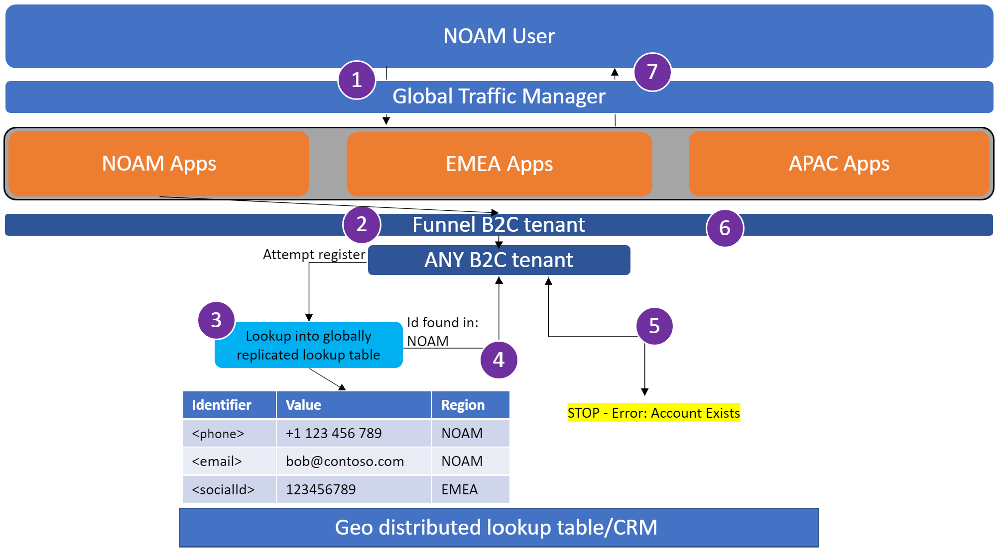
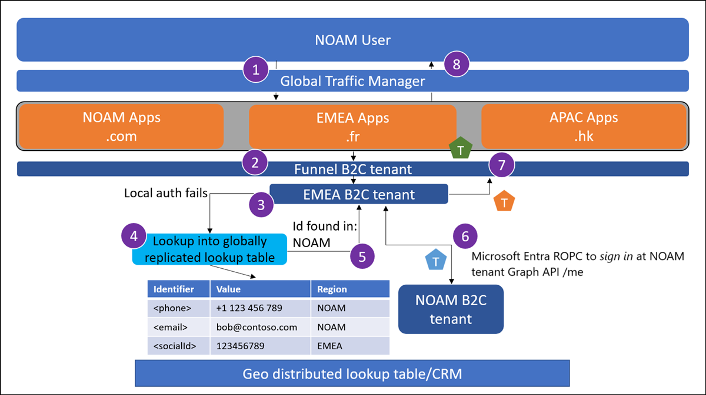
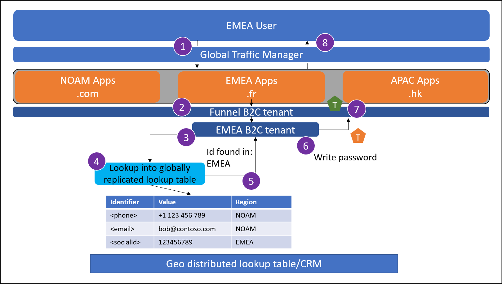
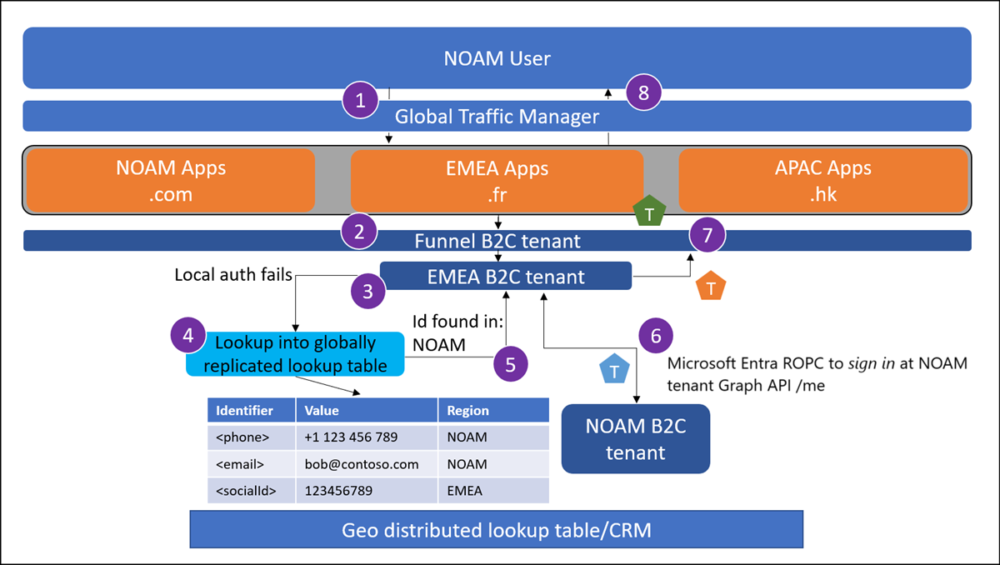
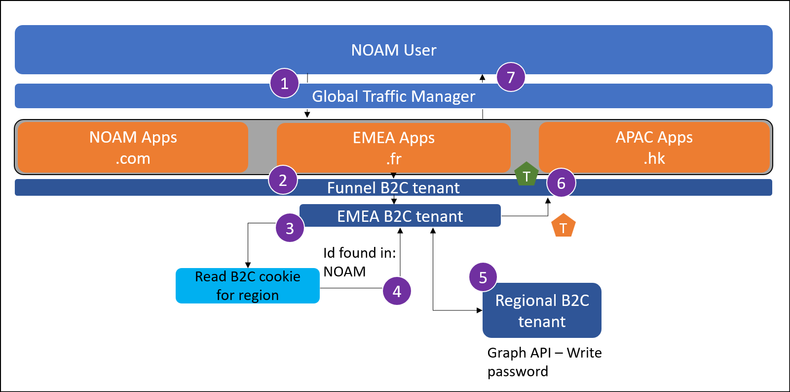
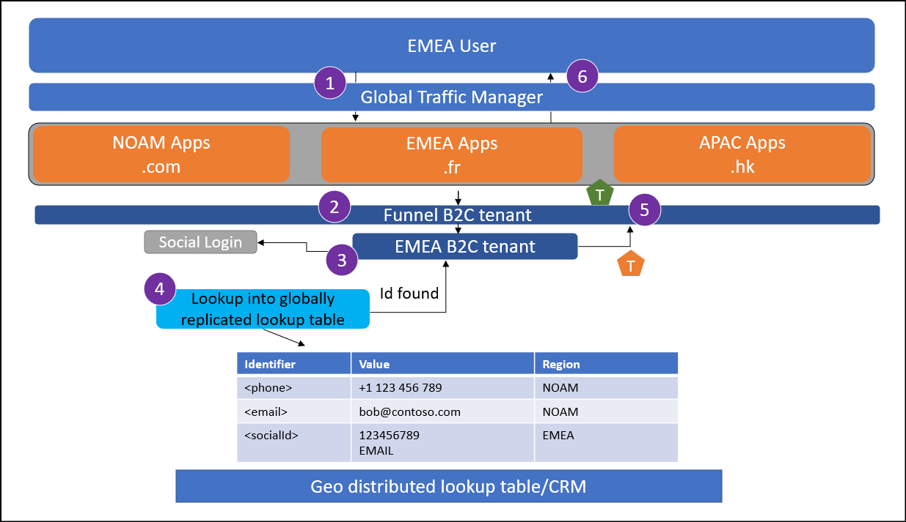
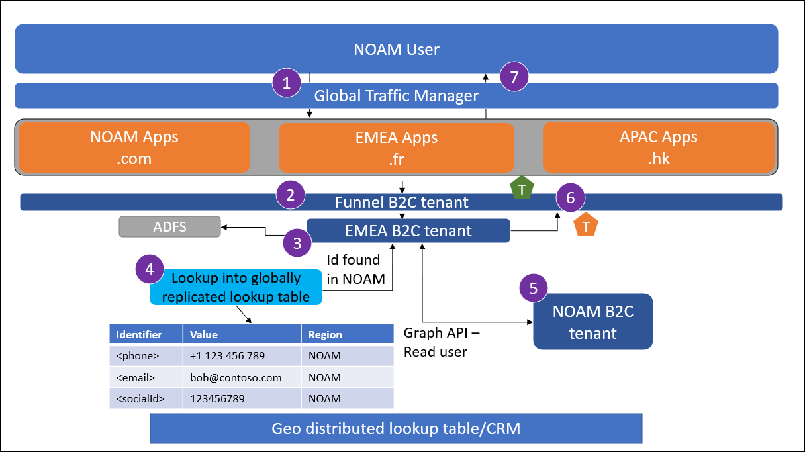
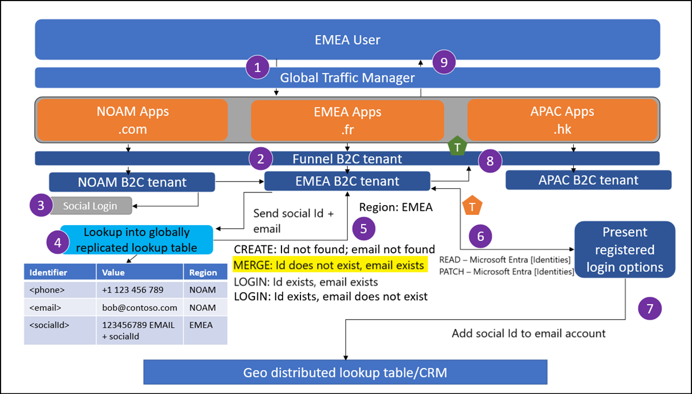
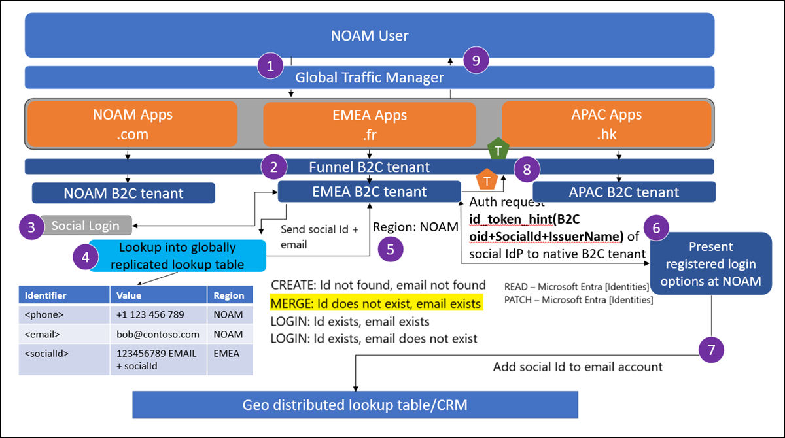

# Build a global identity solution with funnel-based approach

In this article, we describe the scenarios for funnel-based design approach. Before starting to design, it's recommended that you review the [capabilities](b2c-global-identity-solutions.md#capabilities-and-considerations), and [performance](b2c-global-identity-solutions.md#performance) of both funnel and region-based design approach. This article will further help determine which design may fit best for your organization.

The designs account for:

* Local Account sign up and sign in
* Federated account sign up and sign in
* Authenticating local accounts for users signing in from outside their registered region, supported by cross tenant API based authentication
* Authenticating federated accounts for users signing in from outside their registered region, supported by cross tenant API based look up
* Prevents sign up from multiple different regions
* Applications in each region have a single endpoint to connect with

## Local account sign-in use cases

The following use cases are typical in a global Azure AD B2C environment. The local account use cases also cover accounts where the user travels. We provide a diagram and workflow steps for each use case.

### Local user sign-up

This use case demonstrates how a user from their home country/region performs a sign-up with an Azure AD B2C Local Account.

1. A user from Europe, Middle East, and Africa (EMEA) attempts to sign up at **myapp.fr**. If the user isn't being sent to their local application instance, the traffic manager enforces a redirect.

1. The user reaches the Global Funnel Azure AD B2C tenant. This tenant is configured to redirect to a regional Azure AD B2C tenant based on defined criteria using OpenId federation. This can be a lookup based on Application clientId.

1. The user attempts to sign up. The sign-up process checks the global lookup table to determine if the user exists in any of the regional Azure AD B2C tenants.

1. The user isn't found in the global lookup table. The user's account is written into Azure AD B2C, and a record is created into the global lookup table to track the region in which the user signed-up.

1. The regional tenant issues a token back to the funnel tenant.

1. The funnel tenant issues a token to the application.

### Existing local user attempts sign up

This use case demonstrates how a user re-registering the same email from their own country/region, or a different region, is blocked.

1. A user from EMEA attempts to sign up at **myapp.fr**. If the user isn't being sent to their local application instance, the traffic manager enforces a redirect.

1. The user reaches the Global Funnel Azure AD B2C tenant. This tenant is configured to redirect to a regional Azure AD B2C tenant based on some criteria using OpenId federation. This can be a lookup based on Application clientId.

1. The user attempts to sign up. The sign-up process checks the global lookup table to determine if the user exists in any of the regional Azure AD B2C tenants.

1. The user's email is found in the global lookup table, indicating the user has registered this email in the solution at some prior point in time.

1. The user is presented with an error, indicating their account exists.

### Local user sign-in

This use case demonstrates how a user from their home country/region performs a sign-in with an Azure AD B2C local account.

1. A user from EMEA attempts to sign in at **myapp.fr**. If the user isn't being sent to their local application instance, the traffic manager enforces a redirect.

1. The user reaches the global funnel Azure AD B2C tenant. This tenant is configured to redirect to a regional Azure AD B2C tenant based on some criteria using OpenId federation. This can be a lookup based on application clientId.

1. The user enters their credentials at the regional tenant.

1. The regional tenant issues a token back to the funnel tenant.

1. The funnel tenant issues a token to the application.

### Traveling user sign-in

This use case demonstrates how a user can travel across regions and maintain their user profile and credentials stored in their regional tenant respective to their sign-up.

1. A user from North America (NOAM) attempts to sign in at **myapp.fr** while they are on holiday in France. If the user isn't being sent to their local application instance, the traffic manager enforces a redirect.

1. The user reaches the global funnel Azure AD B2C tenant. This tenant is configured to redirect to a regional Azure AD B2C tenant based on some criteria using OpenId federation. This can be a lookup based on Application clientId.

1. The user enters their credentials at the regional tenant.

1. The regional tenant performs a lookup into the global lookup table, since the user's email wasn't found in the EMEA Azure AD B2C directory.

1. The user's email is located to have been signed up in NOAM Azure AD B2C tenant.

1. The EMEA Azure AD B2C tenant performs a Microsoft Entra ROPC flow against the NOAM Azure AD B2C tenant to verify credentials.
   >[!NOTE]
   >This call will also fetch a token for the user to perform a Graph API call. The EMEA Azure AD B2C tenant performs a Graph API call to the NOAM Azure AD B2C tenant to fetch the user's profile. This call is authenticated by the access token for Graph API acquired in the last step.

1. The regional tenant issues a token back to the funnel tenant.

1. The funnel tenant issues a token to the application.

### Local user forgot password

This use case demonstrates how a user can reset their password when they are within their home country/region.

1. A user from EMEA attempts to sign in at **myapp.fr**. If the user isn't being sent to their local application instance, the traffic manager enforces a redirect.

1. The user reaches the global funnel Azure AD B2C tenant. This tenant is configured to redirect to a regional Azure AD B2C tenant based on some criteria using OpenId federation. This can be a lookup based on application clientId.

1. The user arrives at the EMEA Azure AD B2C tenant and selects **forgot password**. The user enters and verifies their email.

1. Email lookup is performed to determine which regional tenant the user exists in.

1. The user provides a new password.

1. The new password is written into the EMEA Azure AD B2C tenant.

1. The regional tenant issues a token back to the funnel tenant.

1. The funnel tenant issues a token to the application.

### Traveling user forgot password

This use case demonstrates how a user can reset their password when they're traveling away from the region in which they registered their account.

1. A user from NOAM attempts to sign in at **myapp.fr** since they are on holiday in France. If the user isn't being sent to their local application instance, the traffic manager enforces a redirect.

1. The user reaches the global funnel Azure AD B2C tenant. This tenant is configured to redirect to a regional Azure AD B2C tenant based on some criteria using OpenId federation. This can be a lookup based on application clientId.

1. The user arrives at the EMEA Azure AD B2C tenant and selects **forgot password**. The user enters and verifies their email.

1. Email lookup is performed to determine which regional tenant the user exists in.

1. The email is found to exist in the NOAM Azure AD B2C tenant. The user provides a new password.

1. The new password is written into the NOAM Azure AD B2C tenant through a Graph API call.

1. The regional tenant issues a token back to the funnel tenant.

1. The funnel tenant issues a token to the application.

### Local user password change

This use case demonstrates how a user can change their password after they've logged into the region in which they registered their account.

1. A user from EMEA attempts selects **change password** after logging into **myapp.fr**.

1. The user reaches the global funnel Azure AD B2C tenant. This tenant is configured to redirect to a regional Azure AD B2C tenant based on some criteria using OpenId federation. This can be a lookup based on application clientId.

1. The user arrives at the EMEA Azure AD B2C tenant, and the  Single-Sign On (SSO) cookie set allows the user to change their password immediately.

1. New password is written to the users account in the EMEA Azure AD B2C tenant.

1. The regional tenant issues a token back to the funnel tenant.

1. The funnel tenant issues a token to the application.

### Traveling user password change

This use case demonstrates how a user can change their password after they've logged in, away from the region in which they registered their account.

1. A user from NOAM attempts **change password** after logging into **myapp.fr**.

1. The user reaches the global funnel Azure AD B2C tenant. This tenant is configured to redirect to a regional Azure AD B2C tenant based on some criteria using OpenId federation. This can be a lookup based on application clientId.

1. The user arrives at the EMEA Azure AD B2C tenant, and the SSO cookie set allows the user to change their password immediately.

1. The user's email is found to be in the NOAM tenant after checking the global lookup table.

1. The new password is written to the users account in the NOAM Azure AD B2C tenant by MS Graph API call.

1. The regional tenant issues a token back to the funnel tenant.

1. The funnel tenant issues a token to the application.

## Federated Identity Provider authentications

The following use cases show examples of using federated identities to sign up or sign in as an Azure AD B2C client.

### Local federated ID sign-up

This use case demonstrates how a user can sign up to the service from their local region using a federated ID.

1. A user from EMEA attempts to sign up at **myapp.fr**. If the user isn't being sent to their local application instance, the traffic manager enforces a redirect.

1. The user reaches the global funnel Azure AD B2C tenant. This tenant is configured to redirect to a regional Azure AD B2C tenant based on some criteria using OpenId federation. This can be a lookup based on application clientId.

1. The user selects to sign in with a federated Identity Provider (IdP).

1. Perform a lookup into the global lookup table.
   * **If account linking is in scope**: Proceed if the federated IdP identifier nor the email that came back from the federated IdP doesn't exist in the lookup table.

   * **If account linking is not in scope**: Proceed if the federated IdP identifier that came back from the federated IdP doesn't exist in the lookup table.

1. Write the users account to the EMEA Azure AD B2C tenant.

1. The regional tenant issues a token back to the funnel tenant.

1. The funnel tenant issues a token to the application.

### Local federated user sign-in

This use case demonstrates how a user from their local region signs into the service using a federated ID.

1. A user from EMEA attempts to sign in at **myapp.fr**. If the user isn't being sent to their local application instance, the traffic manager enforces a redirect.

2. The user reaches the global funnel Azure AD B2C tenant. This tenant is configured to redirect to a regional Azure AD B2C tenant based on some criteria using OpenId federation. This can be a lookup based on Application clientId.

3. The user selects to sign in with a federated identity provider.

4. Perform a lookup into the global lookup table and confirm the user's federated ID is registered in EMEA.

5. The regional tenant issues a token back to the funnel tenant.

6. The funnel tenant issues a token to the application.

### Traveling federated user sign-in

This use case demonstrates how a user can sign into their account with a federated IdP, whilst located away from the region in which they signed up in.

1. A user from NOAM attempts to sign in at **myapp.fr**. If the user isn't being sent to their local application instance, the traffic manager enforces a redirect.

1. The user reaches the global funnel Azure AD B2C tenant. This tenant is configured to redirect to a regional Azure AD B2C tenant based on some criteria using OpenId federation. This can be a lookup based on Application clientId.

1. The user selects to sign in with a federated identity provider.

    >[!NOTE]
   >Use the same App Id from the App Registration at the Social IdP across all Azure AD B2C regional tenants. This ensures that the ID coming back from the Social IdP is always the same.

1. Perform a lookup into the global lookup table and determine the user's federated ID is registered in NOAM.

1. Read the account data from the NOAM Azure AD B2C tenant using MS Graph API.

1. The regional tenant issues a token back to the funnel tenant.

1. The funnel tenant issues a token to the application.

### Account linking with matching criteria

This use case demonstrates how users are able to perform account linking when matching criteria is satisfied. The matching criteria is typically the users email address. When the matching criteria of a sign in from a new identity provider has the same value for an existing account in Azure AD B2C, the account linking process can begin.

1. A user from EMEA attempts to sign in at **myapp.fr**. If the user isn't being sent to their local application instance, the traffic manager enforces a redirect.

1. The user reaches the global funnel Azure AD B2C tenant. This tenant is configured to redirect to a regional Azure AD B2C tenant based on some criteria using OpenId federation. This can be a lookup based on Application clientId.

1. The user selects to sign in with a federated identity provider/social IdP.

1. A lookup is performed into the global lookup table for the ID returned from the federated IdP.

1. Where the ID doesn't exist, but the email from the federated IdP does exist in EMEA Azure AD B2C – this is an account linking use case.

1. Read the user from the directory and determine which authentication methods are enabled on the account. Present a screen for the user to sign in with an existing authentication method on this account.

1. Once the user proves they own the account in Azure AD B2C, add the new social ID to the existing account, and add the social ID to the account in the global lookup table.

1. The regional tenant issues a token back to the funnel tenant.

1. The funnel tenant issues a token to the application.  

### Traveling user account linking with matching criteria

This use case demonstrates how nonlocal users are able to perform account linking when matching criteria is satisfied. The matching criteria is typically the users email address. When the matching criteria of a sign in from a new identity provider has the same value for an existing account in Azure AD B2C, the account linking process can begin.

1. A user from NOAM attempts to sign in at **myapp.fr**. If the user isn't being sent to their local application instance, the traffic manager enforces a redirect.

1. The user reaches the Global Funnel Azure AD B2C tenant. This tenant is configured to redirect to a regional Azure AD B2C tenant based on some criteria using OpenId federation. This can be a lookup based on Application clientId.

1. The user selects to sign in with a federated identity provider/social IdP.

1. A lookup is performed into the global lookup table for the ID returned from the federated IdP.

1. Where the ID doesn't exist, and the email from the federated IdP exists in another region - this is a traveling user account linking use case.

1. Create an id_token_hint link asserting the users currently collected claims. Bootstrap a journey into the NOAM Azure AD B2C tenant using federation. The user proves that they own the account via the NOAM Azure AD B2C tenant.
   >[!NOTE]
   >This method is used to re-use existing account linking logic in the home tenant and reduce external API calls to manipulate the identities collection. A custom policy sample which utilizes id_token_hint can be found [here](https://github.com/azure-ad-b2c/samples/tree/master/policies/invite).

1. Once the user proves they own the account in Azure AD B2C, add the new social ID to the existing account by making a Graph API call to the NOAM Azure AD B2C tenant. Add the social ID to the account in the global lookup table.

1. The regional tenant issues a token back to the funnel tenant.

1. The funnel tenant issues a token to the application.

## Next steps

- [Azure AD B2C global identity solutions](b2c-global-identity-solutions.md)

- [Build a global identity solution with region-based approach](b2c-global-identity-region-based-design.md)

- [Azure AD B2C global identity proof of concept region-based configuration](b2c-global-identity-proof-of-concept-regional.md)

- [Azure AD B2C global identity proof of concept funnel-based configuration](b2c-global-identity-proof-of-concept-funnel.md)
