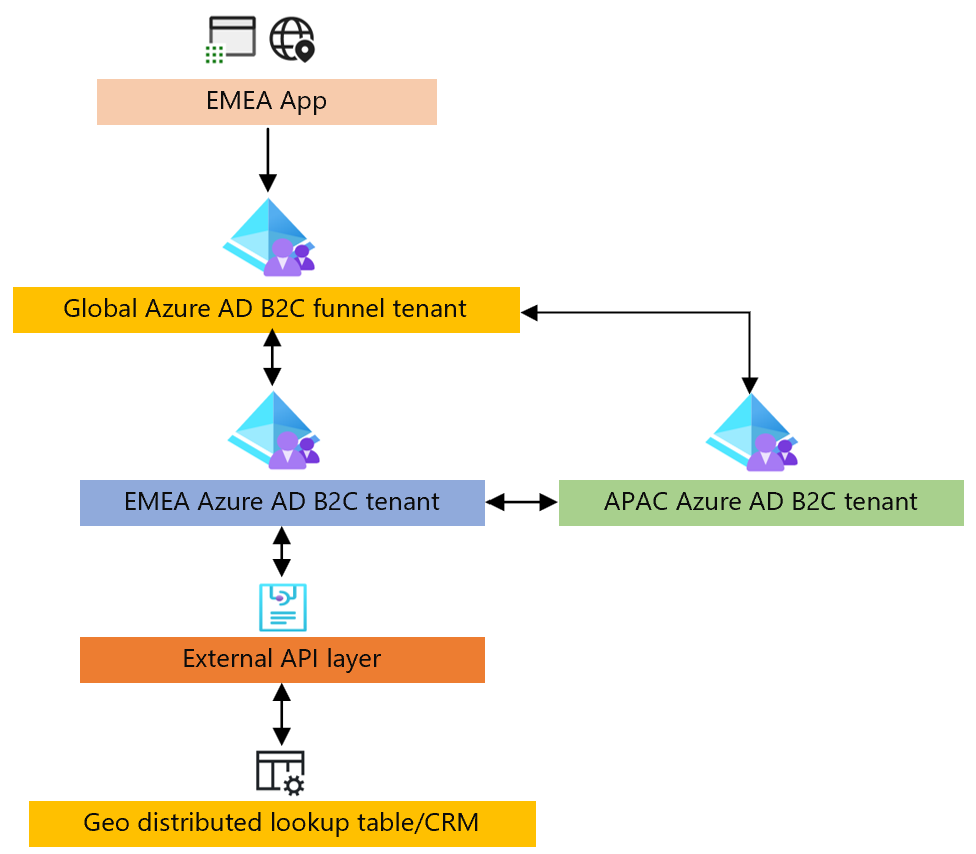

# Azure Active Directory B2C global identity framework proof of concept for funnel-based configuration

The following section describes how to create proof of concept implementations for funnel-based orchestration. The completed Azure Active Directory B2C (Azure AD B2C) custom policies can be found [here](https://github.com/azure-ad-b2c/samples/tree/master/policies/global-architecture-model/funnel-based-approach).

## Funnel-based approach

The following block diagram shows the proof of concept. The guidance will show how to configure the Azure AD B2C tenants. The External API layer and Geo distributed lookup table isn't included as part of this guide.




## Funnel tenant

1. [Create a tenant.](../active-directory-b2c/tutorial-create-tenant.md)

1. [Configure federations to each Azure AD B2C tenant/policy combination](../active-directory-b2c/tutorial-create-user-flows.md?pivots=b2c-user-flow)

1. Configure client_id mapping to region – use [lookup claim transformation](general-transformations.md) to emulate.

   ```xml
   <ClaimsTransformation Id="ClientIdToRegion" TransformationMethod="LookupValue">
     <InputClaims>
       <InputClaim ClaimTypeReferenceId="regionFromURL" TransformationClaimType="inputParameterId" />
     </InputClaims>
     <InputParameters>
       <InputParameter Id="0dd7579e-fb90-4178-bc36-77a3fe658683" DataType="string" Value="APAC" />
       <InputParameter Id="7e7f5403-b3d7-41cc-85fc-130ab6fd9361" DataType="string" Value="NOAM" />
       <InputParameter Id="4ea5d578-9c51-4091-96d1-58e15e98e9b9" DataType="string" Value="EMEA" />
       <InputParameter Id="errorOnFailedLookup" DataType="boolean" Value="false" />
     </InputParameters>
     <OutputClaims>
       <OutputClaim ClaimTypeReferenceId="sendToRegion" TransformationClaimType="outputClaim" />
     </OutputClaims>
   </ClaimsTransformation>
   ```

1. Configure federations to be enabled based on client_id – region mapping.

   ```xml
   <TechnicalProfile Id="HRDLogic">
     <DisplayName>ParseDomainHint</DisplayName>
     <Protocol Name="Proprietary" Handler="Web.TPEngine.Providers.ClaimsTransformationProtocolProvider, Web.TPEngine, Version=1.0.0.0, Culture=neutral, PublicKeyToken=null" />
     <Metadata>
       <Item Key="IncludeClaimResolvingInClaimsHandling">true</Item>
     </Metadata>
     <InputClaims>
       <InputClaim ClaimTypeReferenceId="regionFromURL" DefaultValue="{OIDC:ClientId}" AlwaysUseDefaultValue="true" />
     </InputClaims>
     <OutputClaims>
       <OutputClaim ClaimTypeReferenceId="sendToRegion" />
       <OutputClaim ClaimTypeReferenceId="identityProviders" />
     </OutputClaims>
     <OutputClaimsTransformations>
       <OutputClaimsTransformation ReferenceId="ClientIdToRegion" />
       <OutputClaimsTransformation ReferenceId="CreateidentityProvidersCollection" />
     </OutputClaimsTransformations>
     <UseTechnicalProfileForSessionManagement ReferenceId="SM-Noop" />
   </TechnicalProfile>
   ```

## Regional tenant

1. [Create a tenant.](../active-directory-b2c/tutorial-create-tenant.md)

1. [Create an application registration](../active-directory-b2c/tutorial-register-applications.md?tabs=app-reg-ga) to establish federation with funnel tenant.

## Sign in

1. Configure identifier to region lookup via global lookup table, use [lookup claim transformation](general-transformations.md) to emulate.

   ```xml
   <ClaimsTransformation Id="UserIdToRegion" TransformationMethod="LookupValue">
     <InputClaims>
       <InputClaim ClaimTypeReferenceId="signInName" TransformationClaimType="inputParameterId" />
     </InputClaims>
     <InputParameters>
       <InputParameter Id="bob@noam.com" DataType="string" Value="NOAM" />
       <InputParameter Id="bob@noam1.com" DataType="string" Value="NOAM" />
       <InputParameter Id="john@emea.com" DataType="string" Value="EMEA" />
       <InputParameter Id="john@emea1.com" DataType="string" Value="EMEA" />
       <InputParameter Id="alice@apac.com" DataType="string" Value="APAC" />
       <InputParameter Id="alice@apac1.com" DataType="string" Value="APAC" />
       <InputParameter Id="errorOnFailedLookup" DataType="boolean" Value="false" />
     </InputParameters>
     <OutputClaims>
       <OutputClaim ClaimTypeReferenceId="userLookupRegion" TransformationClaimType="outputClaim" />
     </OutputClaims>
   </ClaimsTransformation>
   ```

1. Configure API based authentication for traveling user, and MS Graph API call to fetch users profile.
   1. Check credentials and get MS Graph API token from respective tenant. Register **Native** app registration in each regional tenant with permissions to MS Graph API for delegated permission: *user.read*.

      ```xml
      <TechnicalProfile Id="REST-login-NonInteractive-APAC">
        <DisplayName>non interactive authentication to APAC</DisplayName>
        <Protocol Name="Proprietary" Handler="Web.TPEngine.Providers.RestfulProvider, Web.TPEngine, Version=1.0.0.0, Culture=neutral, PublicKeyToken=null" />
        <Metadata>
          <Item Key="ServiceUrl">https://login.microsoftonline.com/b2capac.onmicrosoft.com/oauth2/v2.0/token</Item>
          <Item Key="AuthenticationType">None</Item>
          <Item Key="SendClaimsIn">Form</Item>
          <Item Key="AllowInsecureAuthInProduction">true</Item>
        </Metadata>
        <InputClaims>
          <InputClaim ClaimTypeReferenceId="apac_client_id" PartnerClaimType="client_id" DefaultValue="cf3f6898-9a79-426a-ba16-10e1a377c843" />
          <InputClaim ClaimTypeReferenceId="ropc_grant_type" PartnerClaimType="grant_type" DefaultValue="password" />
          <InputClaim ClaimTypeReferenceId="signInName" PartnerClaimType="username" />
          <InputClaim ClaimTypeReferenceId="password" />
          <InputClaim ClaimTypeReferenceId="scope" DefaultValue="https://graph.microsoft.com/.default" AlwaysUseDefaultValue="true" />
          <InputClaim ClaimTypeReferenceId="nca" PartnerClaimType="nca" DefaultValue="1" />
        </InputClaims>
        <OutputClaims>
          <OutputClaim ClaimTypeReferenceId="bearerToken" PartnerClaimType="access_token" />
        </OutputClaims>
        <UseTechnicalProfileForSessionManagement ReferenceId="SM-Noop" />
      </TechnicalProfile>
      ```

   1. Read profile via MS Graph API for traveling user.

      ```xml
      <TechnicalProfile Id="Azure AD-Read-User-MSGraph">
        <DisplayName>revoke my refresh token</DisplayName>
        <Protocol Name="Proprietary" Handler="Web.TPEngine.Providers.RestfulProvider, Web.TPEngine, Version=1.0.0.0, Culture=neutral, PublicKeyToken=null" />
        <Metadata>
          <Item Key="ServiceUrl">https://graph.microsoft.com/beta/me</Item>
          <Item Key="AuthenticationType">Bearer</Item>
          <Item Key="UseClaimAsBearerToken">bearerToken</Item>
          <Item Key="SendClaimsIn">Url</Item>
          <Item Key="DebugMode">true</Item>
        </Metadata>
        <InputClaims>
          <InputClaim ClaimTypeReferenceId="bearerToken" />
        </InputClaims>
        <OutputClaims>
          <OutputClaim ClaimTypeReferenceId="objectId" PartnerClaimType="id" />
          <OutputClaim ClaimTypeReferenceId="givenName" />
          <OutputClaim ClaimTypeReferenceId="surName" />
          <OutputClaim ClaimTypeReferenceId="displayName" />
          <OutputClaim ClaimTypeReferenceId="userPrincipalName" PartnerClaimType="upn" />
          <OutputClaim ClaimTypeReferenceId="authenticationSource" DefaultValue="localAccountAuthentication" />
        </OutputClaims>
        <UseTechnicalProfileForSessionManagement ReferenceId="SM-Noop" />
      </TechnicalProfile>
      ```

## Sign up

Write users region to global lookup table.
   > [!NOTE]
   > No setup due to hardcoded lookup table.

## Password reset

1. Configure identifier to region lookup via global lookup table.
   > [!NOTE]
   > No setup due to hardcoded lookup table.

1. Configure cross tenant password reset via REST API call.
   >[!NOTE]
   >Will require brokering API using client_credential authentication and User Admin role applied to the service principal.

## Next steps

- [Azure AD B2C global identity proof of concept regional-based configuration](b2c-global-identity-proof-of-concept-regional.md)

- [Azure AD B2C global identity solutions](b2c-global-identity-solutions.md)

- [Build a global identity solution with funnel-based approach](./b2c-global-identity-funnel-based-design.md)

- [Build a global identity solution with region-based approach](./b2c-global-identity-funnel-based-design.md)
