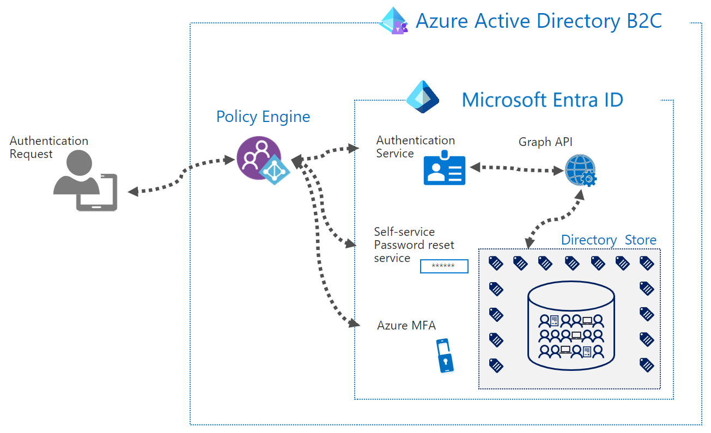

# Azure Active Directory B2C global identity framework

[Azure Active Directory B2C](overview.md) is a customer identity access management (CIAM) solution capable of supporting millions of users and billions of authentications per day. It takes care of the scaling and safety of the authentication platform, monitoring, and automatically handling threats like denial-of-service, password spray, or brute force attacks.

Azure Active Directory B2C (Azure AD B2C) is a separate service from [Microsoft Entra ID](../active-directory/fundamentals/whatis.md). It's built on the same technology as Microsoft Entra ID but for a different purpose. It allows businesses to build customer facing applications, and then allows self-service sign-up to applications.

Azure AD B2C is a globally distributed service made up of several components:

* Directory

* [Application registrations](tutorial-register-applications.md?tabs=app-reg-ga)

* [User flows and custom policies](user-flow-overview.md)

* [Sign-in options](sign-in-options.md)

* [Keys](tokens-overview.md)

When creating an Azure AD B2C solution, you must provide a location to host the service. This location only pertains to the region in which the user profile data will be stored, while the rest of the service that processes your sign-in runs globally.

You typically deploy an Azure AD B2C tenant in the region closest to your user base. This makes it easier to maintain compliance with data residency laws, as the user profile is only replicated in the [selected region](data-residency.md). This also provides the best performance during sign-in, as network latencies are optimized to the directory store.

When your Azure AD B2C directory requires to service users across the globe, the regional structure poses a challenge. You must determine which location to create the Azure AD B2C tenant in. Any users outside the selected region may not be compliant with data residency requirements and may also experience increased latency when verifying their credentials or reading their user profile data.

For example, consider an application that supports users in Australia and North America, and Azure AD B2C directory is created in the North America region. Users who sign-in from Australia may face longer processing times to complete their authentication.

To better meet data residency requirements and mitigate performance issues, you must deploy multiple Azure AD B2C tenants. By placing a tenant in each region where your business operates, the operations into the directory are optimized for latency. However, by doing so, the solution creates other overheads to configure, manage and protect these sensitive tenant resources in each region. Other overheads include:

* Tenant administration

* Tenant isolation resulting in an end user experience that doesn't feel global

* Billing

* CI/CD processes to manage policies/app registrations/keys

This document proposes architectures with Azure AD B2C that best accommodate solutions for customers who serve users across the globe. The solutions serve the following requirements:

* Users can maintain the same set of credentials, no matter from where in the world they access applications.

* Consistent performance and latency no matter where users authenticate from.

* Make it easy for customers to deliver processes, frameworks, or SDKs to their developer teams with least possible configuration required.

* User profiles can be maintained while users travel around the world. This creates more value in the analytics generated by user interactions within any service.

* Customer user data is stored in regional data stores.

The following are two approaches to consider when implementing an identity platform using Azure AD B2C tenants for a globally operating business model.

* The first approach uses geographical regions as the boundary and applications are configured specifically for the region.

* The second approach has a global boundary for the applications and uses an additional Azure AD B2C tenant to orchestrate interaction between regional tenants.

## Regional tenant orchestration

In this model, applications are either hosted per region, or have a per region configurations to connect to a regional tenant. Applications directly send the user to a region-specific tenant. Cross tenant communication is used to perform cross tenant authentications, or profile updates across tenants, when the user may have traveled to a different region.

## Funnel tenant orchestration

In this model, an Azure AD B2C tenant funnels users to regional Azure AD B2C tenants. The funnel tenant functions as a redirect orchestrator to other Azure AD B2C tenants. This is handled by a globally distributed component of the Azure AD B2C service, therefore performance is unaffected. This redirection is performed using OpenId Connect identity provider federations.

Cross tenant communication is used to perform cross tenant authentications, or profile updates across tenants. The funnel tenant provides applications a single endpoint to communicate with.

The architecture you decide to model the solution after, requires making choices based on the trade-offs between the two models described. For example, the funnel model enables you to maintain a single instance of applications. The following section describes the capabilities, selection criteria, and performance that might impact the design you choose.

## Capabilities and considerations

The following table describes the capabilities provided using a regional versus funnel-based design:

| Capability| Region-based| Funnel-based |
| - | - | - |
| Supports local account sign-up and sign-in| |  |
| Supports federated account sign-up and sign-in| |  |
| Supports authenticating local accounts for users signing in from outside their registered region| |  |
| Supports authenticating federated accounts for users signing in from outside their registered region using cross-tenant API-based look up| |  |
| Prevents sign up from multiple different regions| |  |
| Applications in each region have a set of endpoints to connect with| |  |
| All applications connect to a single set of endpoints, regardless of which region they're hosted| |  |
| Supports fine-grained Conditional Access policies.| |  |
| Optimized for cost.| |  |

Based on the capabilities, the following considerations must be taken into account:

* When using the region-based approach, the primary consideration is that the approach requires applications spanning multiple regions to have respective configurations for each regional Azure AD B2C tenant.

* When using the funnel-based approach

  * There's a double-token cost

  * There's an additional HTTP redirect introduced

  * Custom domains are required on many tenants

  * Conditional Access is applied at the tenant level, not application level

  * Single sign out through multiple IdPs might introduce challenges

The approach you choose will be based on the number of applications you host and the specific requirements for access to the applications.

## Performance

The performance advantage of using multiple tenants, in either the regional or funnel-based configuration, will be an improvement over using a single Azure AD B2C tenant for globally operating businesses.

When using the funnel-based approach, the funnel tenant is located in one specific region and serve users globally. Since the funnel tenants operation utilizes a global component of the Azure AD B2C service, it maintains a consistent level of performance regardless of where users log in from.

As shown in the diagram above, the Azure AD B2C tenant in the funnel-based approach will only utilize the Policy Engine to perform the redirection to regional Azure AD B2C tenants. The Azure AD B2C Policy Engine component is globally distributed. Therefore, the funnel isn't constrained from a performance perspective, regardless of where the Azure AD B2C funnel tenant is provisioned. A performance loss is encountered due to the extra redirect between funnel and regional tenants in the funnel-based approach.

In the regional-based approach, since each user is directed to their most local Azure AD B2C, performance is consistent for all users logging in.

The regional tenants will perform directory calls into the Directory Store, which is the only regionalized component in both the funnel-based and regional-based architectures.

Additional latency is only encountered when the user has performed an authentication in a different region from which they had signed-up in. This is because, calls will be made across regions to reach the Directory Store where their profile lives to complete their authentication.

## Next steps

- [Azure AD B2C global identity proof of concept regional-based configuration](b2c-global-identity-proof-of-concept-regional.md)

- [Azure AD B2C global identity proof of concept funnel-based configuration](b2c-global-identity-proof-of-concept-funnel.md)

- [Build a global identity solution with funnel-based approach](b2c-global-identity-funnel-based-design.md)

- [Build a global identity solution with region-based approach](b2c-global-identity-region-based-design.md)
