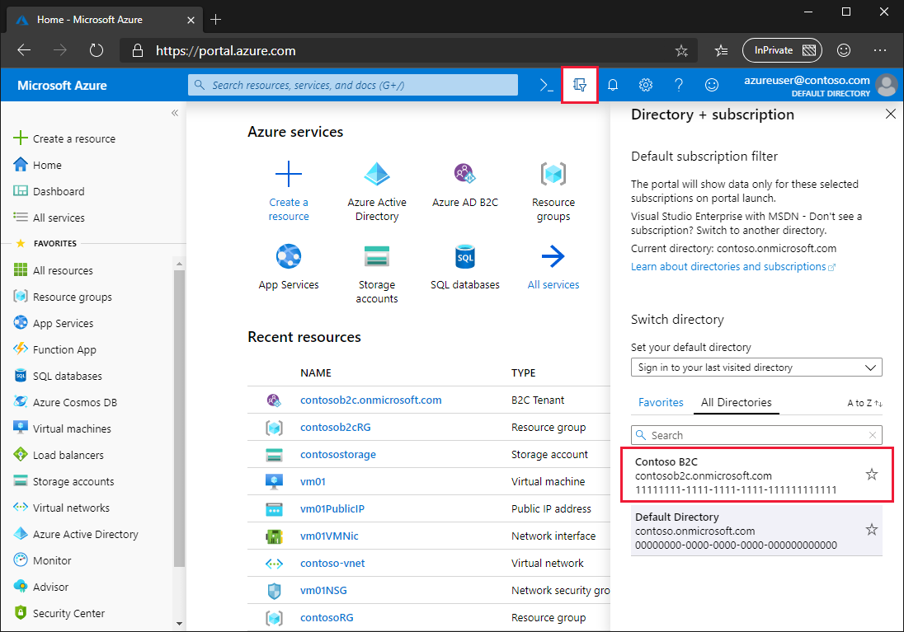

# Billing model for Azure Active Directory B2C

Azure Active Directory B2C (Azure AD B2C) usage is billed to a linked Azure subscription and uses a monthly active users (MAU) billing model. Learn how to link an Azure AD B2C resource to a subscription and how the MAU billing model works in the following sections.

> [!IMPORTANT]
> This article does not contain pricing information. For the latest information about usage billing and pricing, see [Azure Active Directory B2C pricing](https://azure.microsoft.com/pricing/details/active-directory-b2c/).

## Monthly active users (MAU) billing

Azure AD B2C billing is metered on the count of unique users with authentication activity within a calendar month, known as monthly active users (MAU) billing.

Starting **01 November 2019**, all newly created Azure AD B2C tenants are billed per-monthly active users (MAU). Existing tenants that are [linked to a subscription](#link-an-azure-ad-b2c-tenant-to-a-subscription) on or after 01 November 2019 will be billed per-monthly active users (MAU).

If you have an existing Azure AD B2C tenant that was linked to a subscription prior to 01 November 2019, you can choose to do one of the following:

* Upgrade to the monthly active users (MAU) billing model, or
* Stay on the per-authentication billing model

### Upgrade to monthly active users billing model

Azure subscription owners that have administrative access to the Azure AD B2C resource can switch to the MAU billing model. Billing options are configured in your Azure AD B2C resource.

The switch to monthly active users (MAU) billing is **irreversible**. Once you convert an Azure AD B2C resource to the MAU-based billing model, you cannot revert that resource to the per-authentication billing model.

Here's how to make the switch to MAU billing for an existing Azure AD B2C resource:

1. Sign in to the [Azure portal](https://portal.azure.com) as the subscription owner.
1. Select the **Directory + subscription** filter in the top menu, and then select the Azure AD B2C directory that you want to upgrade to MAU billing. 
    
1. In the left menu, select **Azure AD B2C**. Or, select **All services** and search for and select **Azure AD B2C**.
1. On the **Overview** page of the Azure AD B2C tenant, select the link under **Resource name**. You're directed to the Azure AD B2C resource in your Azure AD tenant. 
    
1. On the **Overview** page of the Azure AD B2C resource, under **Billable Units**, select the **Per Authentication (Change to MAU)** link. 
    
1. Select **Confirm** to complete the upgrade to MAU billing. 
    

### What to expect when you transition to MAU billing from per-authentication billing

MAU-based metering is enabled as soon as you, the subscription/resource owner, confirm the change. Your monthly bill will reflect the units of authentication billed until the change, and new units of MAU starting with the change.

Users are not double-counted during the transition month. Unique active users who authenticate prior to the change are charged a per-authentication rate in a calendar month. Those same users are not included in the MAU calculation for the remainder of the subscription's billing cycle. For example:

* The Contoso B2C tenant has 1,000 users. 250 users are active in any given month. The subscription administrator changes from per-authentication to monthly active users (MAU) on the 10th of the month.
* Billing for 1st-10th is billed using the per-authentication model.
  * If 100 users sign in during this period (1st-10th), those users are tagged as *paid for the month*.
* Billing from the 10th (the effective time of transition) is  billed at the MAU rate.
  * If an additional 150 users sign in during this period (10th-30th), only the additional 150 are billed.
  * The continued activity of the first 100 users does not impact billing for the remainder of the calendar month.

During the billing period of the transition, the subscription owner will likely see entries for both methods (per-authentication and per-MAU) appear in their Azure subscription billing statement:

* An entry for the usage until the date/time of change that reflects per-authentication.
* An entry for the usage after the change that reflects monthly active users (MAU).

For the latest information about usage billing and pricing for Azure AD B2C, see [Azure Active Directory B2C pricing](https://azure.microsoft.com/pricing/details/active-directory-b2c/).

## Link an Azure AD B2C tenant to a subscription

Usage charges for Azure Active Directory B2C (Azure AD B2C) are billed to an Azure subscription. When an Azure AD B2C tenant is created, the tenant administrator needs to explicitly link the Azure AD B2C tenant to an Azure subscription.

The subscription link is achieved by creating an Azure AD B2C *resource* within the target Azure subscription. Several Azure AD B2C resources can be created in a single Azure subscription, along with other Azure resources like virtual machines, Storage accounts, and Logic Apps. You can see all of the resources within a subscription by going to the Azure Active Directory (Azure AD) tenant that the subscription is associated with.

A subscription linked to an Azure AD B2C tenant can be used for the billing of Azure AD B2C usage or other Azure resources, including additional Azure AD B2C resources. It cannot be used to add other Azure license-based services or Office 365 licenses within the Azure AD B2C tenant.

### Prerequisites

* [Azure subscription](https://azure.microsoft.com/free/)
* [Azure AD B2C tenant](tutorial-create-tenant.md) that you want to link to a subscription
  * You must be a tenant administrator
  * The tenant must not already be linked to a subscription

### Create the link

1. Sign in to the [Azure portal](https://portal.azure.com).
1. Select the **Directory + subscription** filter in the top menu, and then select the directory that contains the Azure subscription you'd like to use (*not* the directory containing the Azure AD B2C tenant).
1. Select **Create a resource**, enter `Active Directory B2C` in the **Search the Marketplace** field, and then select **Azure Active Directory B2C**.
1. Select **Create**
1. Select **Link an existing Azure AD B2C Tenant to my Azure subscription**.
1. Select an **Azure AD B2C Tenant** from the dropdown. Only tenants for which you are a global administrator and that are not already linked to a subscription are shown. The **Azure AD B2C Resource name** field is populated with the domain name of the Azure AD B2C tenant you select.
1. Select an active Azure **Subscription** of which you are an administrator.
1. Under **Resource group**, select **Create new**, and then specify the **Resource group location**. The resource group settings here have no impact on your Azure AD B2C tenant location, performance, or billing status.
1. Select **Create**.
    

After you complete these steps for an Azure AD B2C tenant, your Azure subscription is billed in accordance with your Azure Direct or Enterprise Agreement details, if applicable.

### Manage your Azure AD B2C tenant resources

After you create the Azure AD B2C resource in an Azure subscription, you should see a new resource of the type "B2C tenant" appear with your other Azure resources.

You can use this resource to:

* Navigate to the subscription to review billing information
* Get the Azure AD B2C tenant's tenant ID in GUID format
* Go to your Azure AD B2C tenant
* Submit a support request
* Move your Azure AD B2C tenant resource to another Azure subscription or resource group

### Regional restrictions

If you've established regional restrictions for Azure resource creation in your subscription, that restriction may prevent you from creating the Azure AD B2C resource.

To mitigate this issue, relax your regional restrictions.

## Azure Cloud Solution Providers (CSP) subscriptions

Azure Cloud Solution Providers (CSP) subscriptions are supported in Azure AD B2C. The functionality is available using APIs or the Azure portal for Azure AD B2C and for all Azure resources. CSP subscription administrators can link, move, and delete relationships with Azure AD B2C as done with other Azure resources.

The management of Azure AD B2C using role-based access control is not affected by the association between the Azure AD B2C tenant and an Azure CSP subscription. Role-based access control is achieved by using tenant-based roles, not subscription-based roles.

## Change the Azure AD B2C tenant billing subscription

Azure AD B2C tenants can be moved to another subscription if the source and destination subscriptions exist within the same Azure Active Directory tenant.

To learn how to move Azure resources like your Azure AD B2C tenant to another subscription, see [Move resources to new resource group or subscription](../azure-resource-manager/management/move-resource-group-and-subscription.md).

Before you initiate the move, be sure to read the entire article to fully understand the limitations and requirements for such a move. In addition to instructions for moving resources, it includes critical information like a pre-move checklist and how to validate the move operation.

## Next steps

For the latest pricing information, see [Azure Active Directory B2C pricing](https://azure.microsoft.com/pricing/details/active-directory-b2c/).
