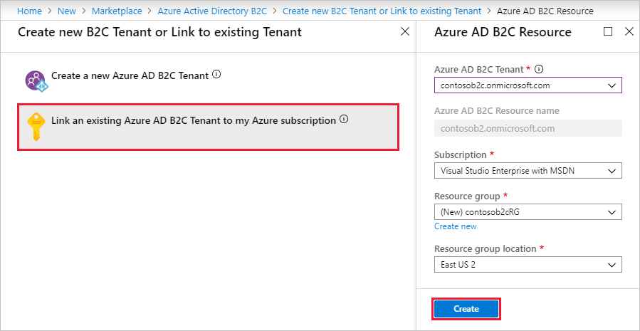
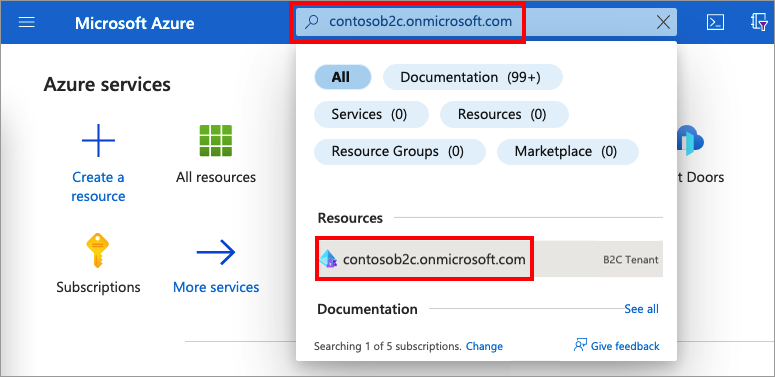
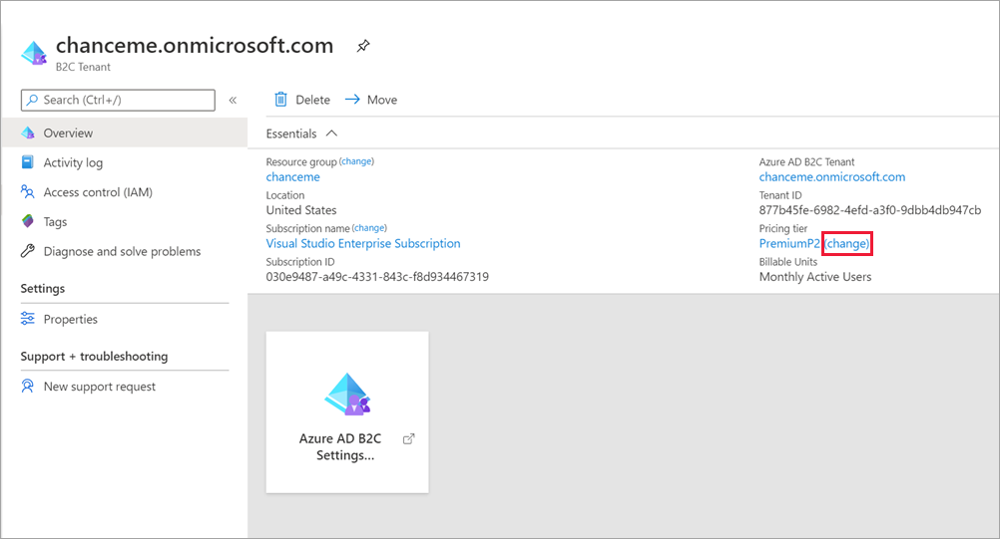
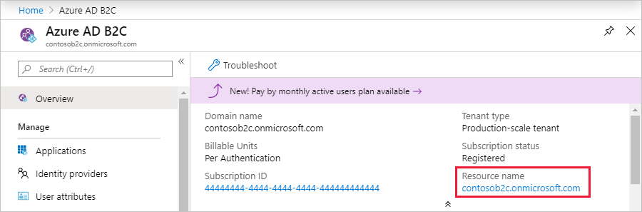
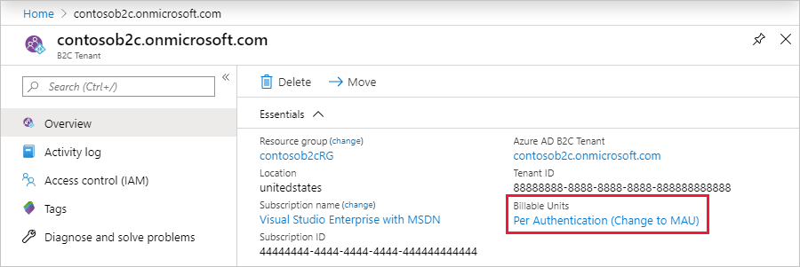

# Billing model for Azure Active Directory B2C

Azure Active Directory B2C (Azure AD B2C) pricing is based on monthly active users (MAU), which is the count of unique users with authentication activity within a calendar month. This billing model applies to both Azure AD B2C tenants and [Microsoft Entra guest user collaboration (B2B)](../active-directory/external-identities/external-identities-pricing.md). MAU billing helps you reduce costs by offering a free tier and flexible, predictable pricing. 

In this article, learn about MAU and Go Local billing, linking Azure AD B2C tenants to a subscription, and changing the pricing tier.

## MAU overview

A monthly active user (MAU) is a unique user that performs an authentication within a given month. A user that authenticates at least once within a given month is counted as one MAU. Customers aren't charged for a MAU’s subsequent authentications during the month, nor for inactive users. Authentications may include:

- Active, interactive sign in by the user. For example, [sign-up or sign in](add-sign-up-and-sign-in-policy.md), [self-service password reset](add-password-reset-policy.md), or any type of [user flow](user-flow-overview.md) or [custom policy](custom-policy-overview.md).
- Passive, non-interactive sign in such as [single sign-on (SSO)](session-behavior.md), or any type of token acquisition. For example, authorization code flow, token refresh, or [resource owner password credentials flow](add-ropc-policy.md).

If Azure AD B2C [Go-Local add-on](data-residency.md#go-local-add-on) is available in your country/region, and you enable it, you'll be charged per MAU, which is an added charge to your Azure AD B2C [Premium P1 or P2 pricing](https://azure.microsoft.com/pricing/details/active-directory-b2c/) license. Learn more [About Local Data Residency add-on](#about-go-local-add-on)  

Also, if you choose to provide higher levels of assurance by using Multi-factor Authentication (MFA) for Voice and SMS, you'll be charged a worldwide flat fee for each MFA attempt that month, whether the sign in is successful or unsuccessful. 
 

> [!IMPORTANT]
> This article does not contain pricing details. For the latest information about usage billing and pricing, see [Azure Active Directory B2C pricing](https://azure.microsoft.com/pricing/details/active-directory-b2c/). See also [Azure AD B2C region availability and data residency](data-residency.md) for details about where the Azure AD B2C service is available and where user data is stored.

## What do I need to do?

To take advantage of MAU billing, your Azure AD B2C tenant must be linked to an Azure subscription. You might also need to switch your Azure AD B2C tenant to another pricing tier if you want to use Azure AD B2C Premium P2 features, like risk-based Conditional Access policies.

|If your tenant is:  |You need to:  |
|---------|---------|
| An Azure AD B2C tenant already billed on a per-MAU basis     | Do nothing. When users authenticate to your Azure AD B2C tenant, you'll be automatically billed using the MAU-based billing model.        |
| An Azure AD B2C tenant not yet linked to a subscription     |  [Link your Azure AD B2C tenant to a subscription](#link-an-azure-ad-b2c-tenant-to-a-subscription) to activate MAU billing.     |
| An Azure AD B2C tenant that was linked to a subscription before November 1, 2019    | [Switch to MAU billing (recommended)](#switch-to-mau-billing-pre-november-2019-azure-ad-b2c-tenants), or stay on the per-authentication billing model.     |
| An Azure AD B2C tenant and you want to use premium features  (like risk-based Conditional Access policies)    | [Change to a Microsoft Entra pricing tier](#change-your-azure-ad-pricing-tier) that supports the features you want to use.        |
|  |  |

## About the monthly active users (MAU) billing model

MAU billing went into effect for Azure AD B2C tenants on **November 1, 2019**. Any Azure AD B2C tenants that you created and linked to a subscription on or after that date have been billed on a per-MAU basis. 

- If you have an Azure AD B2C tenant that hasn't been linked to a subscription, link it now. 
- If you have an existing Azure AD B2C tenant that was linked to a subscription before November 1, 2019, upgrade to the monthly active users (MAU) billing model. You can also choose to stay on the per-authentication billing model.
  
Your Azure AD B2C tenant must also be linked to the appropriate Azure pricing tier based on the features you want to use. Premium features require Azure AD B2C [Premium P1 or P2 pricing](https://azure.microsoft.com/pricing/details/active-directory-b2c/). You might need to upgrade your pricing tier as you use new features. For example, for risk-based Conditional Access policies, you’ll need to select the Azure AD B2C Premium P2 pricing tier for your tenant.

> [!NOTE]
> Your first 50,000 MAUs per month are free for both Premium P1 and Premium P2 features, but the **free tier doesn’t apply to free trial, credit-based, or sponsorship subscriptions**. Once the free trial period or credits expire for these types of subscriptions, you'll begin to be charged for Azure AD B2C MAUs. To determine the total number of MAUs, we combine MAUs from all your tenants (both Microsoft Entra ID and Azure AD B2C) that are linked to the same subscription.

## About Go-Local add-on 

Azure AD B2C's [Go-Local add-on](data-residency.md#go-local-add-on) enables you to create Azure AD B2C tenant within the country/region you choose when you [create your Azure AD B2C](tutorial-create-tenant.md). *Go-Local* refers to Microsoft’s commitment to allow some customers to configure some services to store their data at rest in the Geo of the customer’s choice, typically a country/region. This feature isn't available in all countries/regions. 

> [!NOTE]
> If you enable  Go-Local add-on, the 50,000 free MAUs per month given by your Azure AD B2C subscription doesn't apply for  Go-Local add-on. You'll incur a charge per MAU, on the Go-Local add-on from the first MAU. However, you'll continue to enjoy free 50,000 MAUs per month on the other features available on your Azure AD B2C [Premium P1 or P2 pricing](https://azure.microsoft.com/pricing/details/active-directory-b2c/). 

## Link an Azure AD B2C tenant to a subscription

Usage charges for Azure AD B2C are billed to an Azure subscription. You need to explicitly link an Azure AD B2C tenant to an Azure subscription by creating an Azure AD B2C *resource* within the target Azure subscription. Several Azure AD B2C resources can be created in a single Azure subscription, along with other Azure resources like virtual machines, and storage accounts. You can see all of the resources within a subscription by going to the Microsoft Entra tenant that the subscription is associated with.

A subscription linked to an Azure AD B2C tenant can be used for the billing of Azure AD B2C usage or other Azure resources, including additional Azure AD B2C resources. It can't be used to add other Azure license-based services or Office 365 licenses within the Azure AD B2C tenant.

[!INCLUDE [active-directory-b2c-choose-user-flow-or-custom-policy](../../includes/active-directory-b2c-create-subscription.md)]

### Prerequisites

* [Azure subscription](https://azure.microsoft.com/free/)
* [Azure AD B2C tenant](tutorial-create-tenant.md) that you want to link to a subscription
  * You must be a tenant administrator
  * The tenant must not already be linked to a subscription
  * The tenant must not be created in Azure Government environment

### Create the link

1. Sign in to the [Azure portal](https://portal.azure.com).
1. If you have access to multiple tenants, select the **Settings** icon in the top menu to switch to your Azure AD B2C tenant from the **Directories + subscriptions** menu.
1. Select **Create a resource**, and then, in the **Search services and Marketplace** field, search for and select **Azure Active Directory B2C**.
1. Select **Create**.
1. Select **Link an existing Azure AD B2C Tenant to my Azure subscription**.
1. Select an **Azure AD B2C Tenant** from the dropdown. Only tenants for which you're a global administrator and that aren't already linked to a subscription are shown. The **Azure AD B2C Resource name** field is populated with the domain name of the Azure AD B2C tenant you select.
1. Select an active Azure **Subscription** of which you're an owner.
1. Under **Resource group**, select **Create new**, and then specify the **Resource group location**. The resource group settings here have no impact on your Azure AD B2C tenant location, performance, or billing status.
1. Select **Create**.

    

After you complete these steps for an Azure AD B2C tenant, your Azure subscription is billed based on your Azure Direct or Enterprise Agreement details, if applicable.

## Change your Microsoft Entra pricing tier

A tenant must be linked to the appropriate Azure pricing tier based on the features you want to use with your Azure AD B2C tenant. Premium features require Azure AD B2C Premium P1 or P2, as described in the [Azure Active Directory B2C pricing](https://azure.microsoft.com/pricing/details/active-directory-b2c/). 

In some cases, you'll need to upgrade your pricing tier as you use new features. For example, if you want to use [Identity Protection](conditional-access-identity-protection-overview.md), risk-based Conditional Access policies, and any future Premium P2 capabilities with Azure AD B2C.

To change your pricing tier, follow these steps:

1. Sign in to the [Azure portal](https://portal.azure.com/).

1. If you have access to multiple tenants, select the **Settings** icon in the top menu to switch to your Microsoft Entra ID tenant from the **Directories + subscriptions** menu.

1. In the search box at the top of the portal, enter the name of your Azure AD B2C tenant. Then select the tenant in the search results under **Resources**.
    
    

1. On the resource **Overview** page, under **Pricing tier**, select **change**.

   
 
1. Select the pricing tier that includes the features you want to enable.

   

Learn about the [Microsoft Entra ID features, which are supported in Azure AD B2C](supported-azure-ad-features.md). 
 

## Switch to MAU billing (pre-November 2019 Azure AD B2C tenants)

If you linked your Azure AD B2C tenant to a subscription before **November 1, 2019**, the previous per-authentication billing model is being used. We recommend you upgrade to the monthly active users (MAU) billing model. Billing options are configured in your Azure AD B2C resource.

The switch to monthly active users (MAU) billing is **irreversible**. Once you convert an Azure AD B2C resource to the MAU-based billing model, you can't revert that resource to the per-authentication billing model.

Here's how to make the switch to MAU billing for an existing Azure AD B2C resource:

1. Sign in to the [Azure portal](https://portal.azure.com) as the subscription owner with administrative access to the Azure AD B2C resource.
1. If you have access to multiple tenants, select the **Settings** icon in the top menu to switch to your Microsoft Entra ID tenant from the **Directories + subscriptions** menu.
1. In the left menu, select **Azure AD B2C**. Or, select **All services** and search for and select **Azure AD B2C**.
1. On the **Overview** page of the Azure AD B2C tenant, select the link under **Resource name**. You're directed to the Azure AD B2C resource in your Microsoft Entra tenant. 

    

1. On the **Overview** page of the Azure AD B2C resource, under **Billable Units**, select the **Per Authentication (Change to MAU)** link. 

    

1. Select **Confirm** to complete the upgrade to MAU billing. 

    

### What to expect when you transition to MAU billing from per-authentication billing

MAU-based metering is enabled as soon as you, the subscription/resource owner, confirm the change. Your monthly bill will reflect the units of authentication billed until the change, and new units of MAU starting with the change.

Users aren't double-counted during the transition month. Unique active users who authenticate prior to the change are charged a per-authentication rate in a calendar month. Those same users aren't included in the MAU calculation for the rest of the subscription's billing cycle. For example:

* The Contoso B2C tenant has 1,000 users. 250 users are active in any given month. The subscription administrator changes from per-authentication to monthly active users (MAU) on the 10th of the month.
* Billing for 1st-10th is billed using the per-authentication model.
  * If 100 users sign in during this period (1st-10th), those users are tagged as *paid for the month*.
* Billing from the 10th (the effective time of transition) is  billed at the MAU rate.
  * If an additional 150 users sign in during this period (10th-30th), only the additional 150 are billed.
  * The continued activity of the first 100 users doesn't impact billing for the rest of the calendar month.

During the billing period of the transition, the subscription owner will likely see entries for both methods (per-authentication and per-MAU) appear in their Azure subscription billing statement:

* An entry for the usage until the date/time of change that reflects per-authentication.
* An entry for the usage after the change that reflects monthly active users (MAU).

For the latest information about usage billing and pricing, see [Azure Active Directory B2C pricing](https://azure.microsoft.com/pricing/details/active-directory-b2c/).

## Manage your Azure AD B2C tenant resources

After you create the Azure AD B2C resource in an Azure subscription, you should see a new resource of the type "B2C tenant" appear with your other Azure resources.

You can use this resource to:

* Navigate to the subscription to review billing information
* Get the Azure AD B2C tenant's tenant ID in GUID format
* Go to your Azure AD B2C tenant
* Submit a support request
* Move your Azure AD B2C tenant resource to another Azure subscription or resource group

### Regional restrictions

If you've established regional restrictions for Azure resource creation in your subscription, that restriction may prevent you from creating the Azure AD B2C resource.

To mitigate this issue, relax your regional restrictions.

## Azure Cloud Solution Providers (CSP) subscriptions

Azure Cloud Solution Providers (CSP) subscriptions are supported in Azure AD B2C. The functionality is available using APIs or the Azure portal for Azure AD B2C and for all Azure resources. CSP subscription administrators can link, move, and delete relationships with Azure AD B2C as done with other Azure resources.

The management of Azure AD B2C using role-based access control isn't affected by the association between the Azure AD B2C tenant and an Azure CSP subscription. Role-based access control is achieved by using tenant-based roles, not subscription-based roles.

## Change the Azure AD B2C tenant billing subscription

### Move using Azure Resource Manager

Azure AD B2C tenants can be moved to another subscription using Azure Resource Manager if the source and destination subscriptions exist within the same Microsoft Entra tenant.

To learn how to move Azure resources like your Azure AD B2C tenant to another subscription, see [Move resources to new resource group or subscription](../azure-resource-manager/management/move-resource-group-and-subscription.md).

Before you start the move, be sure to read the entire article to fully understand the limitations and requirements for such a move. In addition to instructions for moving resources, it includes critical information like a pre-move checklist and how to validate the move operation.

### Move by unlinking and relinking

If the source and destination subscriptions are associated with different Microsoft Entra tenants, you can't perform the move via Azure Resource Manager as explained above. However, you can still achieve the same result by unlinking the Azure AD B2C tenant from the source subscription and relinking it to the destination subscription. This method is safe because the only object you delete is the *billing link*, not the Azure AD B2C tenant itself. None of the users, apps, user flows, etc. will be affected.

1. In the Azure AD B2C directory itself, [invite a guest user](user-overview.md#guest-user) from the destination Microsoft Entra tenant (the one that the destination Azure subscription is linked to) and ensure this user has the **Global administrator** role in Azure AD B2C.
1. Navigate to the *Azure resource* representing Azure AD B2C in your source Azure subscription as explained in the [Manage your Azure AD B2C tenant resources](#manage-your-azure-ad-b2c-tenant-resources) section above. Don't switch to the actual Azure AD B2C tenant.
1. Select the **Delete** button on the **Overview** page. This action *doesn't* delete the related Azure AD B2C tenant's users or applications. It merely removes the billing link from the source subscription.
1. Sign in to the Azure portal with the user account that was added as an administrator in Azure AD B2C in step 1. Then navigate to the destination Azure subscription, which is linked to the destination Microsoft Entra tenant. 
1. Re-establish the billing link in the destination subscription by following the [Create the link](#create-the-link) procedure above.
1. Your Azure AD B2C resource has now moved to the destination Azure subscription (linked to the target Microsoft Entra ID) and will be billed through this subscription from now on.

## Next steps

For the latest pricing information, see [Azure Active Directory B2C pricing](https://azure.microsoft.com/pricing/details/active-directory-b2c/).
