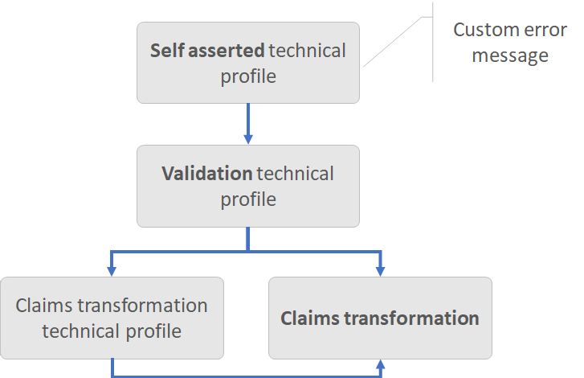

# Boolean claims transformations

This article provides examples for using the boolean claims transformations of the Identity Experience Framework schema in Azure Active Directory B2C (Azure AD B2C). For more information, see [claims transformations](claimstransformations.md).

## AndClaims

Computes an `And` operation of two boolean input claims, and sets the output claim with result of the operation. Check out the [Live demo](https://github.com/azure-ad-b2c/unit-tests/tree/main/claims-transformation/boolean#andclaims) of this claims transformation.

| Element  | TransformationClaimType  | Data Type  | Notes |
|-------| ------------------------ | ---------- | ----- |
| InputClaim | inputClaim1 | boolean | The first claim to evaluate. |
| InputClaim | inputClaim2  | boolean | The second claim to evaluate. |
|OutputClaim | outputClaim | boolean | The claim that will be produced after this claims transformation has been invoked (true or false). |


### Example of AndClaims

The following claims transformation demonstrates how to `And` two boolean claims: `isEmailNotExist`, and `isSocialAccount`. The output claim `presentEmailSelfAsserted` is set to `true` if the values of both input claims are `true`.

```xml
<ClaimsTransformation Id="CheckWhetherEmailBePresented" TransformationMethod="AndClaims">
  <InputClaims>
    <InputClaim ClaimTypeReferenceId="isEmailNotExist" TransformationClaimType="inputClaim1" />
    <InputClaim ClaimTypeReferenceId="isSocialAccount" TransformationClaimType="inputClaim2" />
  </InputClaims>
  <OutputClaims>
    <OutputClaim ClaimTypeReferenceId="presentEmailSelfAsserted" TransformationClaimType="outputClaim" />
  </OutputClaims>
</ClaimsTransformation>
```

- Input claims:
  - **inputClaim1**: true
  - **inputClaim2**: false
- Output claims:
  - **outputClaim**: false


## AssertBooleanClaimIsEqualToValue

Checks that boolean values of two claims are equal, and throws an exception if they aren't. Check out the [Live demo](https://github.com/azure-ad-b2c/unit-tests/tree/main/claims-transformation/boolean#assertbooleanclaimisequaltovalue) of this claims transformation.

| Element | TransformationClaimType  | Data Type  | Notes |
| ---- | ------------------------ | ---------- | ----- |
| inputClaim | inputClaim | boolean | The claim to be checked. |
| InputParameter |valueToCompareTo | boolean | The value to compare (true or false). |

The **AssertBooleanClaimIsEqualToValue** claims transformation is always executed from a [validation technical profile](validation-technical-profile.md) that is called by a [self-asserted technical profile](self-asserted-technical-profile.md). The **UserMessageIfClaimsTransformationBooleanValueIsNotEqual** self-asserted technical profile metadata controls the error message that the technical profile presents to the user. The error messages can be [localized](localization-string-ids.md#claims-transformations-error-messages).



### Example of AssertBooleanClaimIsEqualToValue

The following claims transformation demonstrates how to check the value of a boolean claim with a `true` value. If the value of the `accountEnabled` claim is false, an error message is thrown.

```xml
<ClaimsTransformation Id="AssertAccountEnabledIsTrue" TransformationMethod="AssertBooleanClaimIsEqualToValue">
  <InputClaims>
    <InputClaim ClaimTypeReferenceId="accountEnabled" TransformationClaimType="inputClaim" />
  </InputClaims>
  <InputParameters>
    <InputParameter Id="valueToCompareTo" DataType="boolean" Value="true" />
  </InputParameters>
</ClaimsTransformation>
```

- Input claims:
  - **inputClaim**: false
  - **valueToCompareTo**: true
- Result: Error thrown

### Calling the AssertBooleanClaimIsEqualToValue claims transformation

The following `Example-AssertBoolean` validation technical profile calls the `AssertAccountEnabledIsTrue` claims transformation.

```xml
<TechnicalProfile Id="Example-AssertBoolean">
  <DisplayName>Unit test</DisplayName>
  <Protocol Name="Proprietary" Handler="Web.TPEngine.Providers.ClaimsTransformationProtocolProvider, Web.TPEngine, Version=1.0.0.0, Culture=neutral, PublicKeyToken=null" />
  <OutputClaims>
    <OutputClaim ClaimTypeReferenceId="ComparisonResult" DefaultValue="false" />
  </OutputClaims>
  <OutputClaimsTransformations>
    <OutputClaimsTransformation ReferenceId="AssertAccountEnabledIsTrue" />
  </OutputClaimsTransformations>
  <UseTechnicalProfileForSessionManagement ReferenceId="SM-Noop" />
</TechnicalProfile>
```

The self-asserted technical profile calls the validation `Example-AssertBoolean` technical profile.

```xml
<TechnicalProfile Id="SelfAsserted-AssertDateTimeIsGreaterThan">
  <DisplayName>Example</DisplayName>
  <Protocol Name="Proprietary" Handler="Web.TPEngine.Providers.SelfAssertedAttributeProvider, Web.TPEngine, Version=1.0.0.0, Culture=neutral, PublicKeyToken=null" />
  <Metadata>
    <Item Key="ContentDefinitionReferenceId">api.selfasserted</Item>
    <Item Key="UserMessageIfClaimsTransformationBooleanValueIsNotEqual">Custom error message if account is disabled.</Item>
  </Metadata>
  ...
  <ValidationTechnicalProfiles>
    <ValidationTechnicalProfile ReferenceId="Example-AssertBoolean" />
  </ValidationTechnicalProfiles>
</TechnicalProfile>
```

## CompareBooleanClaimToValue

Checks that boolean value of a claim is equal to `true` or `false`, and return the result of the compression. Check out the [Live demo](https://github.com/azure-ad-b2c/unit-tests/tree/main/claims-transformation/boolean#comparebooleanclaimtovalue) of this claims transformation.

| Element | TransformationClaimType  | Data Type  | Notes |
| ---- | ------------------------ | ---------- | ----- |
| InputClaim | inputClaim | boolean | The claim to be compared. |
| InputParameter |valueToCompareTo | boolean | The value to compare (true or false). |
| OutputClaim | compareResult | boolean | The claim that is produced after this claims transformation has been invoked. |

### Example of CompareBooleanClaimToValue

The following claims transformation demonstrates how to check the value of a boolean claim with a `true` value. If the value of the `IsAgeOver21Years` claim is equal to `true`, the claims transformation returns `true`, otherwise `false`.

```xml
<ClaimsTransformation Id="AssertAccountEnabled" TransformationMethod="CompareBooleanClaimToValue">
  <InputClaims>
    <InputClaim ClaimTypeReferenceId="IsAgeOver21Years" TransformationClaimType="inputClaim" />
  </InputClaims>
  <InputParameters>
    <InputParameter Id="valueToCompareTo" DataType="boolean" Value="true" />
  </InputParameters>
  <OutputClaims>
    <OutputClaim  ClaimTypeReferenceId="accountEnabled" TransformationClaimType="compareResult"/>
  </OutputClaims>
</ClaimsTransformation>
```

- Input claims:
  - **inputClaim**: false
- Input parameters:
  - **valueToCompareTo**: true
- Output claims:
  - **compareResult**: false

## NotClaims

Computes a `Not` operation of the boolean input claim and sets the output claim with result of the operation. Check out the [Live demo](https://github.com/azure-ad-b2c/unit-tests/tree/main/claims-transformation/boolean#notclaims) of this claims transformation.

| Element | TransformationClaimType | Data Type | Notes |
| ---- | ----------------------- | --------- | ----- |
| InputClaim | inputClaim | boolean | The claim to be operated. |
| OutputClaim | outputClaim | boolean | The claim that is produced after this claims transformation has been invoked (true or false). |

### Example of NotClaims

The following claims transformation demonstrates how to perform logical negation on a claim.

```xml
<ClaimsTransformation Id="CheckWhetherEmailBePresented" TransformationMethod="NotClaims">
  <InputClaims>
    <InputClaim ClaimTypeReferenceId="userExists" TransformationClaimType="inputClaim" />
  </InputClaims>
  <OutputClaims>
    <OutputClaim ClaimTypeReferenceId="userExists" TransformationClaimType="outputClaim" />
  </OutputClaims>
</ClaimsTransformation>
```

- Input claims:
  - **inputClaim**: false
- Output claims:
  - **outputClaim**: true

## OrClaims

Computes an `Or` of two boolean claims and sets the output claim with result of the operation. Check out the [Live demo](https://github.com/azure-ad-b2c/unit-tests/tree/main/claims-transformation/boolean#orclaims) of this claims transformation.

| Element | TransformationClaimType | Data Type | Notes |
| ---- | ----------------------- | --------- | ----- |
| InputClaim | inputClaim1 | boolean | The first claim to evaluate. |
| InputClaim | inputClaim2 | boolean | The second claim to evaluate. |
| OutputClaim | outputClaim | boolean | The claim that will be produced after this claims transformation has been invoked (true or false). |

### Example of OrClaims

The following claims transformation demonstrates how to `Or` two boolean claims.

```xml
<ClaimsTransformation Id="CheckWhetherEmailBePresented" TransformationMethod="OrClaims">
  <InputClaims>
    <InputClaim ClaimTypeReferenceId="isLastTOSAcceptedNotExists" TransformationClaimType="inputClaim1" />
    <InputClaim ClaimTypeReferenceId="isLastTOSAcceptedGreaterThanNow" TransformationClaimType="inputClaim2" />
  </InputClaims>
  <OutputClaims>
    <OutputClaim ClaimTypeReferenceId="presentTOSSelfAsserted" TransformationClaimType="outputClaim" />
  </OutputClaims>
</ClaimsTransformation>
```

- Input claims:
  - **inputClaim1**: true
  - **inputClaim2**: false
- Output claims:
  - **outputClaim**: true

## Next steps

- Find more [claims transformation samples](https://github.com/azure-ad-b2c/unit-tests/tree/main/claims-transformation/boolean) on the Azure AD B2C community GitHub repo
