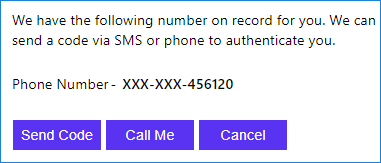
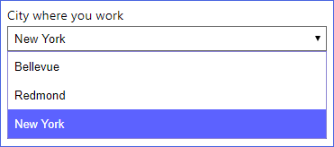
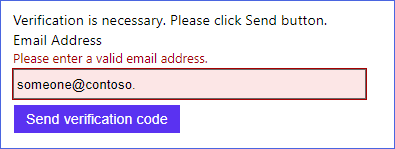
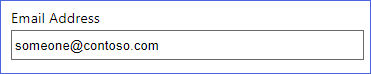
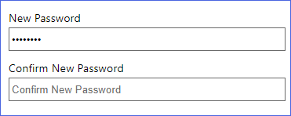
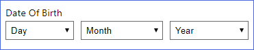
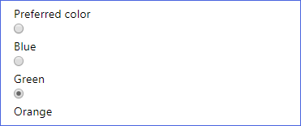
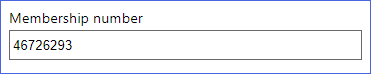
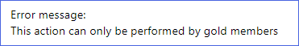

# ClaimsSchema

[!INCLUDE [active-directory-b2c-advanced-audience-warning](../../includes/active-directory-b2c-advanced-audience-warning.md)]

The **ClaimsSchema** element defines the claim types that can be referenced as part of the policy. Claims schema is the place where you declare your claims. A claim can be first name, last name, display name, phone number and more. ClaimsSchema element contains list of **ClaimType** elements. The **ClaimType** element contains the **Id** attribute, which is the claim name.

```XML
<BuildingBlocks>
  <ClaimsSchema>
    <ClaimType Id="Id">
      <DisplayName>Surname</DisplayName>
      <DataType>string</DataType>
      <DefaultPartnerClaimTypes>
        <Protocol Name="OAuth2" PartnerClaimType="family_name" />
        <Protocol Name="OpenIdConnect" PartnerClaimType="family_name" />
        <Protocol Name="SAML2" PartnerClaimType="http://schemas.xmlsoap.org/ws/2005/05/identity/claims/surname" />
      </DefaultPartnerClaimTypes>
      <UserHelpText>Your surname (also known as family name or last name).</UserHelpText>
      <UserInputType>TextBox</UserInputType>
```

## ClaimType

The **ClaimType** element contains the following attribute:

| Attribute | Required | Description |
| --------- | -------- | ----------- |
| Id | Yes | An identifier that's used for the claim type. Other elements can use this identifier in the policy. |

The **ClaimType** element contains the following elements:

| Element | Occurrences | Description |
| ------- | ----------- | ----------- |
| DisplayName | 1:1 | The title that's displayed to users on various screens. The value can be [localized](localization.md). |
| DataType | 1:1 | The type of the claim. |
| DefaultPartnerClaimTypes | 0:1 | The partner default claim types to use for a specified protocol. The value can be overwritten in the **PartnerClaimType** specified in the **InputClaim** or **OutputClaim** elements. Use this element to specify the default name for a protocol.  |
| Mask | 0:1 | An optional string of masking characters that can be applied when displaying the claim. For example, the phone number 324-232-4343 can be masked as XXX-XXX-4343. |
| UserHelpText | 0:1 | A description of the claim type that can be helpful for users to understand its purpose. The value can be [localized](localization.md). |
| UserInputType | 0:1 | The type of input control that should be available to the user when manually entering the claim data for the claim type. See the user input types defined later in this page. |
| AdminHelpText | 0:1 | A description of the claim type that can be helpful for administrators to understand its purpose. |
| Restriction | 0:1 | The value restrictions for this claim, such as a regular expression (Regex) or a list of acceptable values. The value can be [localized](localization.md). |
PredicateValidationReference| 0:1 | A reference to a **PredicateValidationsInput** element. The **PredicateValidationReference** elements enable you to perform a validation process to ensure that only properly formed data is entered. For more information, see [Predicates](predicates.md). |


### DataType

The **DataType** element supports the following values:

| Type | Description |
| ------- | ----------- |
|boolean|Represents a Boolean (`true` or `false`) value.|
|date| Represents an instant in time, typically expressed as a date of a day. The value of the date follows ISO 8601 convention.|
|dateTime|Represents an instant in time, typically expressed as a date and time of day. The value of the date follows ISO 8601 convention.|
|duration|Represents a time interval in years, months, days, hours, minutes, and seconds. The format of is `PnYnMnDTnHnMnS`, where `P` indicates positive, or `N` for negative value. `nY` is the number of years followed by a literal `Y`. `nMo` is the number of months followed by a literal `Mo`. `nD` is the number of days followed by a literal `D`. Examples: `P21Y` represents 21 years. `P1Y2Mo` represents one year, and two months. `P1Y2Mo5D` represents one year, two months, and five days.  `P1Y2M5DT8H5M620S` represents one year, two months, five days, eight hours, five minutes, and twenty seconds.  |
|phoneNumber|Represents a phone number. |
|int| Represents number between -2,147,483,648 and 2,147,483,647|
|long| Represents number between -9,223,372,036,854,775,808 to 9,223,372,036,854,775,807 |
|string| Represents text as a sequence of UTF-16 code units.|
|stringCollection|Represents a collection of `string`.|
|userIdentity| Represents a user identity.|
|userIdentityCollection|Represents a collection of `userIdentity`.|

### DefaultPartnerClaimTypes

The **DefaultPartnerClaimTypes** may contain the following element:

| Element | Occurrences | Description |
| ------- | ----------- | ----------- |
| Protocol | 1:n | List of protocols with their default partner claim type name. |

The **Protocol** element contains the following attributes:

| Attribute | Required | Description |
| --------- | -------- | ----------- |
| Name | Yes | The name of a valid protocol supported by Azure AD B2C. Possible values are:  OAuth1, OAuth2, SAML2, OpenIdConnect. |
| PartnerClaimType | Yes | The claim type name to be used. |

In the following example, when the Identity Experience Framework interacts with a SAML2 identity provider or relying party application, the **surname** claim is mapped to `http://schemas.xmlsoap.org/ws/2005/05/identity/claims/surname`, with OpenIdConnect and OAuth2, the claim is mapped to `family_name`.

```XML
<ClaimType Id="surname">
  <DisplayName>Surname</DisplayName>
  <DataType>string</DataType>
  <DefaultPartnerClaimTypes>
    <Protocol Name="OAuth2" PartnerClaimType="family_name" />
    <Protocol Name="OpenIdConnect" PartnerClaimType="family_name" />
    <Protocol Name="SAML2" PartnerClaimType="http://schemas.xmlsoap.org/ws/2005/05/identity/claims/surname" />
  </DefaultPartnerClaimTypes>
</ClaimType>
```

As a result, the JWT token issued by Azure AD B2C, emits the `family_name` instead of ClaimType name **surname**.

```JSON
{
  "sub": "6fbbd70d-262b-4b50-804c-257ae1706ef2",
  "auth_time": 1535013501,
  "given_name": "David",
  "family_name": "Williams",
  "name": "David Williams",
}
```

### Mask

The **Mask** element contains the following attributes:

| Attribute | Required | Description |
| --------- | -------- | ----------- |
| `Type` | Yes | The type of the claim mask. Possible values: `Simple` or `Regex`. The `Simple` value indicates that a simple text mask is applied to the leading portion of a string claim. The `Regex` value indicates that a regular expression is applied to the string claim as whole.  If the `Regex` value is specified, an optional attribute must also be defined with the regular expression to use. |
| `Regex` | No | If **`Type`** is set to `Regex`, specify the regular expression to use.

The following example configures a **PhoneNumber** claim with the `Simple` mask:

```XML
<ClaimType Id="PhoneNumber">
  <DisplayName>Phone Number</DisplayName>
  <DataType>string</DataType>
  <Mask Type="Simple">XXX-XXX-</Mask>
  <UserHelpText>Your telephone number.</UserHelpText>
</ClaimType>
```

The Identity Experience Framework renders the phone number while hiding the first six digits:



The following example configures a **AlternateEmail** claim with the `Regex` mask:

```XML
<ClaimType Id="AlternateEmail">
  <DisplayName>Please verify the secondary email linked to your account</DisplayName>
  <DataType>string</DataType>
  <Mask Type="Regex" Regex="(?&lt;=.).(?=.*@)">*</Mask>
  <UserInputType>Readonly</UserInputType>
</ClaimType>
```

The Identity Experience Framework renders only the first letter of the email address and the email domain name:


### Restriction

The **Restriction** element may contain the following attribute:

| Attribute | Required | Description |
| --------- | -------- | ----------- |
| MergeBehavior | No | The method used to merge enumeration values with a ClaimType in a parent policy with the same identifier. Use this attribute when you overwrite a claim specified in the base policy. Possible values: `Append`, `Prepend`, or `ReplaceAll`. The `Append` value is a collection of data that should be appended to the end of the collection specified in the parent policy. The `Prepend` value is a collection of data that should be added before the collection specified in the parent policy. The `ReplaceAll` value is a collection of data specified in the parent policy that should be ignored. |

The **Restriction** element contains the following elements:

| Element | Occurrences | Description |
| ------- | ----------- | ----------- |
| Enumeration | 1:n | The available options in the user interface for the user to select for a claim, such as a value in a dropdown. |
| Pattern | 1:1 | The regular expression to use. |

#### Enumeration

The **Enumeration** element defines available options for the user to select for a claim in the user interface, such as a value in a `CheckboxMultiSelect`, `DropdownSingleSelect`, or `RadioSingleSelect`. Alternatively, you can define and localize available options with [LocalizedCollections](localization.md#localizedcollections) element. To look up an item from a claim **Enumeration** collection, use [GetMappedValueFromLocalizedCollection](string-transformations.md#getmappedvaluefromlocalizedcollection) claims transformation.

The **Enumeration** element contains the following attributes:

| Attribute | Required | Description |
| --------- | -------- | ----------- |
| Text | Yes | The display string that is shown to the user in the user interface for this option. |
|Value | Yes | The claim value that is associated with selecting this option. |
| SelectByDefault | No | Indicates whether or not this option should be selected by default in the UI. Possible values: True or False. |

The following example configures a **city** dropdown list claim with a default value set to `New York`:

```XML
<ClaimType Id="city">
  <DisplayName>city where you work</DisplayName>
  <DataType>string</DataType>
  <UserInputType>DropdownSingleSelect</UserInputType>
  <Restriction>
    <Enumeration Text="Bellevue" Value="bellevue" SelectByDefault="false" />
    <Enumeration Text="Redmond" Value="redmond" SelectByDefault="false" />
    <Enumeration Text="New York" Value="new-york" SelectByDefault="true" />
  </Restriction>
</ClaimType>
```

Dropdown city list with a default value set to New York:



### Pattern

The **Pattern** element can contain the following attributes:

| Attribute | Required | Description |
| --------- | -------- | ----------- |
| RegularExpression | Yes | The regular expression that claims of this type must match in order to be valid. |
| HelpText | No | An error message for users if the regular expression check fails. |

The following example configures an **email** claim with regular expression input validation and help text:

```XML
<ClaimType Id="email">
  <DisplayName>Email Address</DisplayName>
  <DataType>string</DataType>
  <DefaultPartnerClaimTypes>
	<Protocol Name="OpenIdConnect" PartnerClaimType="email" />
  </DefaultPartnerClaimTypes>
  <UserHelpText>Email address that can be used to contact you.</UserHelpText>
  <UserInputType>TextBox</UserInputType>
  <Restriction>
	<Pattern RegularExpression="^[a-zA-Z0-9.!#$%&amp;'^_`{}~-]+@[a-zA-Z0-9-]+(?:\.[a-zA-Z0-9-]+)*$" HelpText="Please enter a valid email address." />
	</Restriction>
 </ClaimType>
```

The Identity Experience Framework renders the email address claim with email format input validation:



### UserInputType

Azure AD B2C supports a variety of user input types, such as a textbox, password, and dropdown list that can be used when manually entering claim data for the claim type. You must specify the **UserInputType** when you collect information from the user by using a [self-asserted technical profile](self-asserted-technical-profile.md) and [display controls](display-controls.md).

The **UserInputType** element available user input types:

| UserInputType | Supported ClaimType | Description |
| --------- | -------- | ----------- |
|CheckboxMultiSelect| `string` |Multi select drop-down box. The claim value is represented in a comma delimiter string of the selected values. |
|DateTimeDropdown | `date`, `dateTime` |Drop-downs to select a day, month, and year. |
|DropdownSingleSelect |`string` |Single select drop-down box. The claim value is the selected value.|
|EmailBox | `string` |Email input field. |
|Paragraph | `boolean`, `date`, `dateTime`, `duration`, `int`, `long`, `string`|A field that shows text only in a paragraph tag. |
|Password | `string` |Password text box.|
|RadioSingleSelect |`string` | Collection of radio buttons. The claim value is the selected value.|
|Readonly | `boolean`, `date`, `dateTime`, `duration`, `int`, `long`, `string`| Read-only text box. |
|TextBox |`boolean`, `int`, `string` |Single-line text box. |


#### TextBox

The **TextBox** user input type is used to provide a single-line text box.


```XML
<ClaimType Id="displayName">
  <DisplayName>Display Name</DisplayName>
  <DataType>string</DataType>
  <UserHelpText>Your display name.</UserHelpText>
  <UserInputType>TextBox</UserInputType>
</ClaimType>
```

#### EmailBox

The **EmailBox** user input type is used to provide a basic email input field.



```XML
<ClaimType Id="email">
  <DisplayName>Email Address</DisplayName>
  <DataType>string</DataType>
  <UserHelpText>Email address that can be used to contact you.</UserHelpText>
  <UserInputType>EmailBox</UserInputType>
  <Restriction>
    <Pattern RegularExpression="^[a-zA-Z0-9!#$%&amp;'+^_`{}~-]+(?:\.[a-zA-Z0-9!#$%&amp;'+^_`{}~-]+)*@(?:[a-zA-Z0-9](?:[a-zA-Z0-9-]*[a-zA-Z0-9])?\.)+[a-zA-Z0-9](?:[a-zA-Z0-9-]*[a-zA-Z0-9])?$" HelpText="Please enter a valid email address." />
  </Restriction>
</ClaimType>
```

#### Password

The **Password** user input type is used to record a password entered by the user.



```XML
<ClaimType Id="password">
  <DisplayName>Password</DisplayName>
  <DataType>string</DataType>
  <UserHelpText>Enter password</UserHelpText>
  <UserInputType>Password</UserInputType>
</ClaimType>
```

#### DateTimeDropdown

The **DateTimeDropdown** user input type is used to provide a set of drop-downs to select a day, month, and year. You can use Predicates and PredicateValidations elements to control the minimum and maximum date values. For more information, see the **Configure a date range** section of [Predicates and PredicateValidations](predicates.md).



```XML
<ClaimType Id="dateOfBirth">
  <DisplayName>Date Of Birth</DisplayName>
  <DataType>date</DataType>
  <UserHelpText>The date on which you were born.</UserHelpText>
  <UserInputType>DateTimeDropdown</UserInputType>
</ClaimType>
```

#### RadioSingleSelect

The **RadioSingleSelect** user input type is used to provide a collection of radio buttons that allows the user to select one option.



```XML
<ClaimType Id="color">
  <DisplayName>Preferred color</DisplayName>
  <DataType>string</DataType>
  <UserInputType>RadioSingleSelect</UserInputType>
  <Restriction>
    <Enumeration Text="Blue" Value="Blue" SelectByDefault="false" />
    <Enumeration Text="Green " Value="Green" SelectByDefault="false" />
    <Enumeration Text="Orange" Value="Orange" SelectByDefault="true" />
  </Restriction>
</ClaimType>
```

#### DropdownSingleSelect

The **DropdownSingleSelect** user input type is used to provide a drop-down box that allows the user to select one option.


```XML
<ClaimType Id="city">
  <DisplayName>City where you work</DisplayName>
  <DataType>string</DataType>
  <UserInputType>DropdownSingleSelect</UserInputType>
  <Restriction>
    <Enumeration Text="Bellevue" Value="bellevue" SelectByDefault="false" />
    <Enumeration Text="Redmond" Value="redmond" SelectByDefault="false" />
    <Enumeration Text="New York" Value="new-york" SelectByDefault="true" />
  </Restriction>
</ClaimType>
```

#### CheckboxMultiSelect

The **CheckboxMultiSelect** user input type is used to provide a collection of checkboxes that allows the user to select multiple options.


```XML
<ClaimType Id="languages">
  <DisplayName>Languages you speak</DisplayName>
  <DataType>string</DataType>
  <UserInputType>CheckboxMultiSelect</UserInputType>
  <Restriction>
    <Enumeration Text="English" Value="English" SelectByDefault="true" />
    <Enumeration Text="France " Value="France" SelectByDefault="false" />
    <Enumeration Text="Spanish" Value="Spanish" SelectByDefault="false" />
  </Restriction>
</ClaimType>
```

#### Readonly

The **Readonly** user input type is used to provide a readonly field to display the claim and value.



```XML
<ClaimType Id="membershipNumber">
  <DisplayName>Membership number</DisplayName>
  <DataType>string</DataType>
  <UserHelpText>Your membership number (read only)</UserHelpText>
  <UserInputType>Readonly</UserInputType>
</ClaimType>
```


#### Paragraph

The **Paragraph** user input type is used to provide a field that shows text only in a paragraph tag.  For example, &lt;p&gt;text&lt;/p&gt;. A **Paragraph** user input type `OutputClaim` of self-asserted technical profile, must set the `Required` attribute `false` (default).



```XML
<ClaimType Id="responseMsg">
  <DisplayName>Error message: </DisplayName>
  <DataType>string</DataType>
  <AdminHelpText>A claim responsible for holding response messages to send to the relying party</AdminHelpText>
  <UserHelpText>A claim responsible for holding response messages to send to the relying party</UserHelpText>
  <UserInputType>Paragraph</UserInputType>
  <Restriction>
    <Enumeration Text="B2C_V1_90001" Value="You cannot sign in because you are a minor" />
    <Enumeration Text="B2C_V1_90002" Value="This action can only be performed by gold members" />
    <Enumeration Text="B2C_V1_90003" Value="You have not been enabled for this operation" />
  </Restriction>
</ClaimType>
```
