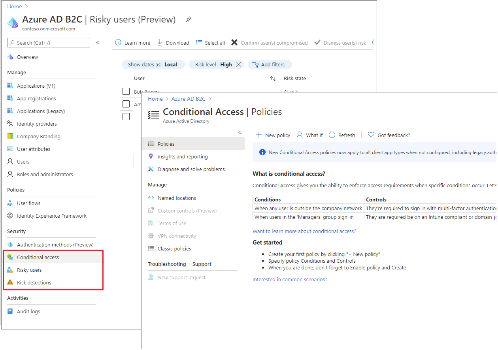

# Identity Protection and Conditional Access for Azure AD B2C

Enhance the security of Azure Active Directory B2C (Azure AD B2C) with Microsoft Entra ID Protection and Conditional Access. The Identity Protection risk-detection features, including risky users and risky sign-ins, are automatically detected and displayed in your Azure AD B2C tenant. You can create Conditional Access policies that use these risk detections to determine actions and enforce organizational policies. Together, these capabilities give Azure AD B2C application owners greater control over risky authentications and access policies.
  
If you're already familiar with [Identity Protection](../active-directory/identity-protection/overview-identity-protection.md) and [Conditional Access](../active-directory/conditional-access/overview.md) in Microsoft Entra ID, using these capabilities with Azure AD B2C will be a familiar experience, with the minor differences discussed in this article.

> [!NOTE]
> Azure AD B2C **Premium P2** is required to create risky sign-in policies. **Premium P1** tenants can create a policy that is based on location, application, user-based, or group-based policies. For more information, see [Change your Azure AD B2C pricing tier](billing.md#change-your-azure-ad-pricing-tier).

## Benefits of Identity Protection and Conditional Access for Azure AD B2C

By pairing Conditional Access policies with Identity Protection risk detection, you can respond to risky authentications with the appropriate policy action.

- **Gain a new level of visibility into the authentication risks for your apps and your customer base**. With signals from billions of monthly authentications across Microsoft Entra ID and Microsoft Account, the risk detection algorithms will now flag authentications as low, medium, or high risk for your local consumer or citizen authentications.
- **Automatically address risks by configuring your own adaptive authentication**. For specified applications, you can require a specific set of users to provide a second authentication factor, as in multi-factor authentication (MFA). Or you can block access based on the risk level detected. As with other Azure AD B2C experiences, you can customize resulting end-user experience  with your organization’s voice, style, and brand. You can also display mitigation alternatives if the user isn't able to gain access.
- **Control access based on location, groups, and apps**.  Conditional Access can also be used to control non-risk based situations. For example, you can require MFA for customers accessing a specific app, or block access from specified geographies.
- **Integrate with Azure AD B2C user flows and Identity Experience Framework custom policies**. Use your existing customized experiences and add the controls you need to interface with Conditional Access. You can also implement advanced scenarios for granting access, such as  knowledge-based access or your own preferred MFA provider.

## Feature differences and limitations

Identity Protection and Conditional Access in Azure AD B2C generally work the same way as in Microsoft Entra ID, with the following exceptions:

- Microsoft Defender for Cloud isn't available in Azure AD B2C.

- Identity Protection and Conditional Access aren't supported for ROPC server-to-server flows in Azure AD B2C tenants.

- In Azure AD B2C tenants, Identity Protection risk detections are available for both local and social identities, such as Google or Facebook. For social identities, Conditional Access must be activated. Detection is limited because the social account credentials are managed by the external identity provider.

- In Azure AD B2C tenants, a subset of the Identity Protection risk detections is available. See [Investigate risk with Identity Protection](identity-protection-investigate-risk.md), and [Add Conditional Access to user flows](conditional-access-user-flow.md).

- The Conditional Access device compliance feature isn't available in Azure AD B2C tenants.

## Integrate Conditional Access with user flows and custom policies

In Azure AD B2C, you can trigger Conditional Access conditions from built-in user flows. You can also incorporate Conditional Access into custom policies. As with other aspects of the B2C user flow, end-user experience messaging can be customized according to your organization's voice, brand, and mitigation alternatives. See [Add Conditional Access to user flows](conditional-access-user-flow.md).

## Microsoft Graph API

You can also manage Conditional Access policies in Azure AD B2C with Microsoft Graph API. For details, see the [Conditional Access documentation](../active-directory/conditional-access/overview.md) and the [Microsoft Graph operations](microsoft-graph-operations.md#conditional-access).

## Next steps

- [Add Conditional Access to user flows](conditional-access-user-flow.md)
- [Learn about Identity Protection in Microsoft Entra ID](../active-directory/identity-protection/overview-identity-protection.md)
- [Learn about Conditional Access](../active-directory/conditional-access/overview.md)
