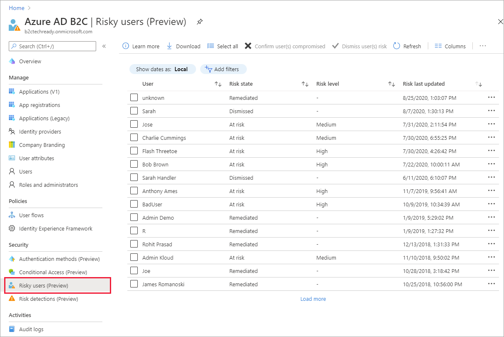
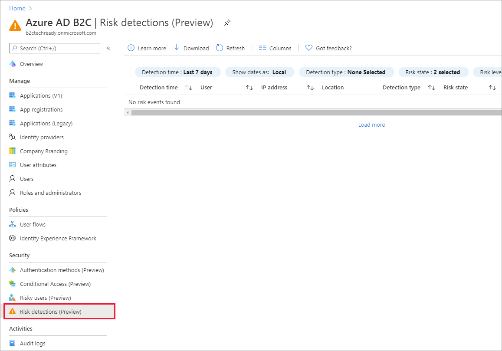
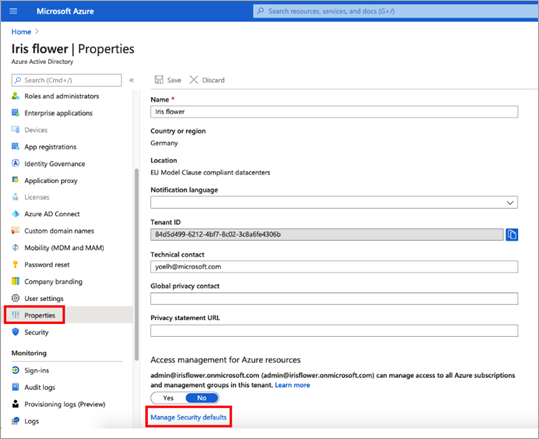
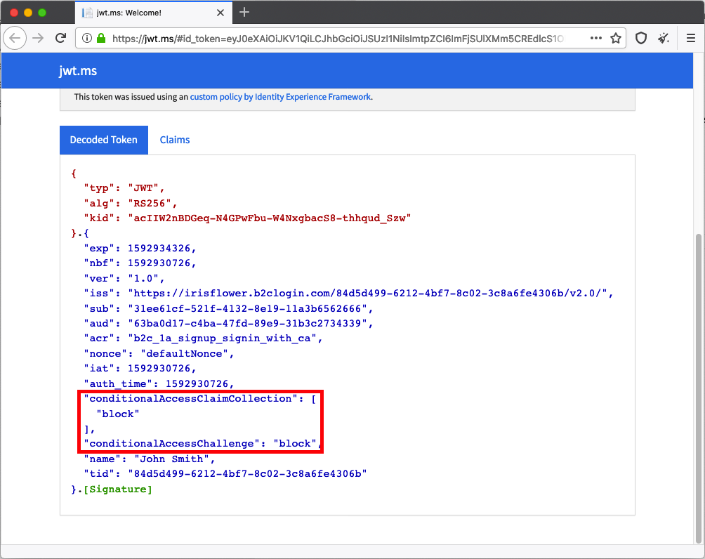

# Set up Identity Protection and Conditional Access in Azure AD B2C

[!INCLUDE [b2c-public-preview-feature](../../includes/active-directory-b2c-public-preview.md)]

Identity Protection provides ongoing risk detection for your Azure AD B2C tenant. If your Azure AD B2C tenant pricing tier is Premium P2, you can view detailed Identity Protection risk events in the Azure portal. You can also use [Conditional Access](../active-directory/conditional-access/overview.md) policies based on these risk detections to determine actions and enforce organizational policies.

## Prerequisites

- Your Azure AD B2C tenant must be [linked to an Azure AD subscription](billing.md#link-an-azure-ad-b2c-tenant-to-a-subscription).
- Azure AD B2C Premium P2 is required to use sign-in and user risk-based Conditional Access. If necessary, [change your Azure AD B2C pricing tier to Premium P2](https://aka.ms/exid-pricing-tier). 
- To manage Identity Protection and Conditional Access in your B2C tenant, you'll need an account that is assigned the Global Administrator role or the Security administrator role.
- To use these features in your tenant, you first need to switch to the Azure AD B2C Premium P2 pricing tier.

## Set up Identity Protection

Identity Protection is on by default. To be able to view Identity Protection risk events in your Azure AD B2C tenant, simply link your Azure AD B2C tenant to an Azure AD subscription and select the Azure AD B2C Premium P2 pricing tier. You can view detailed risk event reports in the Azure portal.

### Supported Identity Protection risk detections

The following risk detections are currently supported for Azure AD B2C:  

|Risk detection type  |Description  |
|---------|---------|
| Atypical travel     | Sign in from an atypical location based on the user's recent sign-ins.        |
|Anonymous IP address     | Sign in from an anonymous IP address (for example: Tor browser, anonymizer VPNs)        |
|Unfamiliar sign-in properties     | Sign in with properties we've not seen recently for the given user.        |
|Malware linked IP address     | Sign in from a malware linked IP address         |
|Azure AD threat intelligence     | Microsoft's internal and external threat intelligence sources have identified a known attack pattern        |

## View risk events for your Azure AD B2C tenant

1. Sign in to the [Azure portal](https://portal.azure.com/).

1. Select the **Directory + Subscription** icon in the portal toolbar, and then select the directory that contains your Azure AD B2C tenant.

1. In the Azure portal, search for and select **Azure AD B2C**.

1. Under **Security**, select **Risky users (Preview)**.

   

1. Under **Security**, select **Risk detections (Preview)**.

   

## Add a Conditional Access policy 

To add a Conditional Access policy based on the Identity Protection risk detections, make sure security defaults are disabled for your Azure AD B2C tenant, and then create Conditional Access policies.

### To disable security defaults

1. Sign in to the [Azure portal](https://portal.azure.com/).

2. Select the **Directory + Subscription** icon in the portal toolbar, and then select the directory that contains your Azure AD B2C tenant.

3. In the Azure portal, search for and select **Azure Active Directory**.

4. Select **Properties**, and then select **Manage Security defaults**.

   

5. Under Enable Security defaults, select No. 

   

### To create a Conditional Access policy

1. Sign in to the [Azure portal](https://portal.azure.com/).

1. Select the **Directory + Subscription** icon in the portal toolbar, and then select the directory that contains your Azure AD B2C tenant.

1. In the Azure portal, search for and select **Azure AD B2C**.

1. Under **Security**, select **Conditional Access (Preview)**. The **Conditional Access Policies** page opens. 

1. Select **New policy** and follow the Azure AD Conditional Access documentation to create a new policy. The following is an example:

   - [Sign-in risk-based Conditional Access: Enable with Conditional Access policy](../active-directory/conditional-access/howto-conditional-access-policy-risk.md#enable-with-conditional-access-policy)

   > [!IMPORTANT]
   > When selecting the users you want to apply the policy to, don't select **All users** only, or you could block yourself from signing in.

## Test the Conditional Access Policy

1. Create a Conditional Access policy as noted above, with the following settings:
   
   - For **Users and groups**, select the test user. Don't select **All users** or you'll block yourself from signing in.
   - For **Cloud apps or actions**, choose **Select apps**, and then choose your relying party application.
   - For Conditions, select **Sign-in risk** and **High**, **Medium**, and **Low** risk levels.
   - For **Grant**, choose **Block access**.

      

1. Enable your test Conditional Access policy by selecting **Create**.

1. Simulate a risky sign-in by using the [Tor browser](https://www.torproject.org/download/). 

1. In the jwt.ms decoded token for the attempted sign-in, you should see that the sign-in was blocked:

   

## Review Conditional Access Outcomes in the Audit Report

To review the result of a Conditional Access event:

1. Sign in to the [Azure portal](https://portal.azure.com/).

2. Select the **Directory + Subscription** icon in the portal toolbar, and then select the directory that contains your Azure AD B2C tenant.

3. In the Azure portal, search for and select **Azure AD B2C**.

4. Under **Activities**, select **Audit logs**.

5. Filter the audit log by setting **Category** to **B2C** and setting **Activity Resource Type** to **IdentityProtection**. Then select **Apply**.

6. Review audit activity for up to the last 7 days. The following types of activity are included:

   - **Evaluate conditional access policies**: This audit log entry indicates that a Conditional Access evaluation was performed during an authentication.
   - **Remediate user**: This entry indicates that the grant or requirements of a Conditional Access policy were met by the end user, and this activity was reported to the risk engine to reduce the risk of (mitigate) the user.

7. Select an **Evaluate conditional access policy** log entry in the list to open the **Activity Details: Audit log** page, which shows the audit log identifiers, along with this information in the **Additional Details** section:

   - ConditionalAccessResult: The grant required by the conditional policy evaluation.
   - AppliedPolicies: A list of all the Conditional Access policies where the conditions were met and the policies are ON.
   - ReportingPolicies: A list of the Conditional Access policies that were set to report-only mode and where the conditions were met.

## Next steps

[Add Conditional Access to a user flow](conditional-access-user-flow.md).
