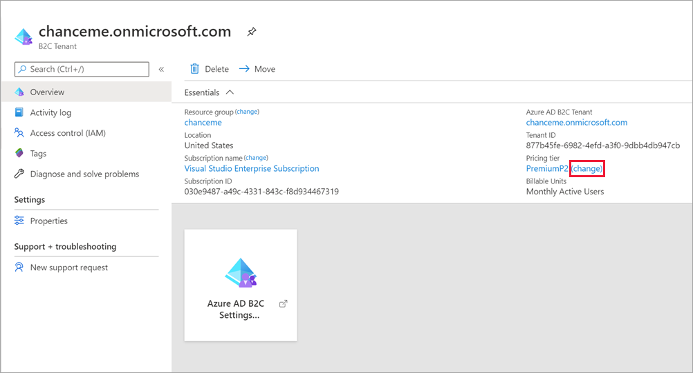
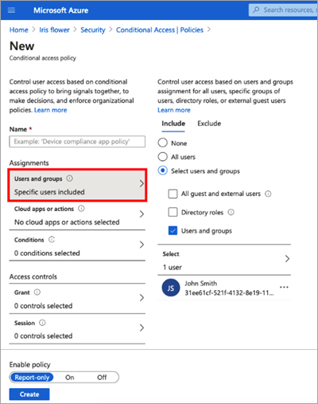
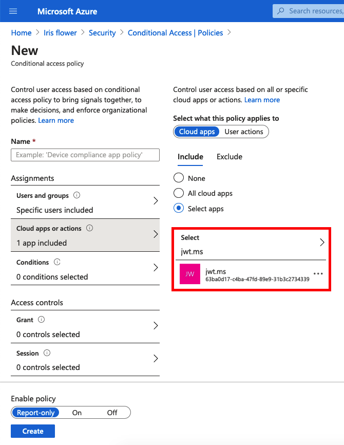
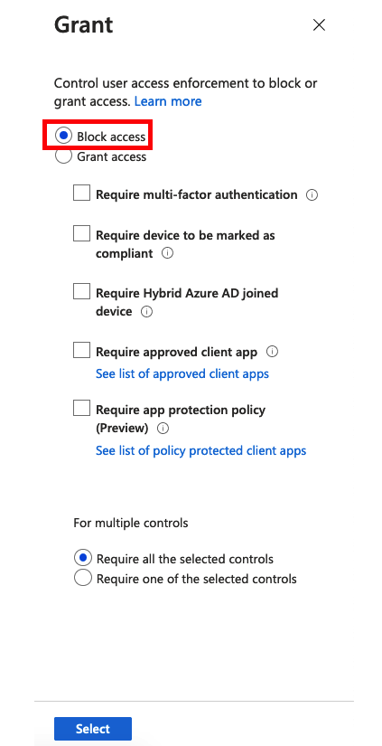

# Set up Identity Protection and Conditional Access in Azure AD B2C

[!INCLUDE [b2c-public-preview-feature](../../includes/active-directory-b2c-public-preview.md)]

> [!NOTE]
> You can also use Microsoft Graph API for Conditional Access.

## Prerequisites

- Your Azure AD B2C tenant must be [linked to an Azure AD subscription](billing.md#link-an-azure-ad-b2c-tenant-to-a-subscription).
- To use sign-in and user risk-based Conditional Access, Azure AD Premium P2 is required.
- To manage Identity Protection and Conditional Access in your B2C tenant, you'll need an account that is assigned the Global Administrator role or the Security administrator role.

### To select the Azure AD Premium P2 pricing tier

To use these features in your tenant, you first need to switch to the Azure AD Premium P2 pricing tier. 

1. Go to the Azure AD subscription that hosts your Azure AD B2C tenant.
2. Search for the Azure AD B2C resource.
3. In the resource overview, under Pricing tier, select **change**.

   
 
4. Select **Azure AD Premium P2**.

   

## Set up Identity Protection

Once your tenant is linked to an Azure AD subscription the Azure AD Premium P2 pricing tier is selected, Identity Protection is on by default. You will begin to receive ongoing notifications about risk events. The following risk detections are currently supported for Azure AD B2C:  

|Risk detection type  |Description  |
|---------|---------|
| Atypical travel     | Sign in from an atypical location based on the user's recent sign-ins.        |
|Anonymous IP address     | Sign in from an anonymous IP address (for example: Tor browser, anonymizer VPNs)        |
|Unfamiliar sign-in properties     | Sign in with properties we've not seen recently for the given user.        |
|Malware linked IP address     | Sign in from a malware linked IP address         |
|Azure AD threat intelligence     | Microsoft's internal and external threat intelligence sources have identified a known attack pattern        |

You can create [Conditional Access](https://docs.microsoft.com/azure/active-directory/conditional-access/overview) policies that use these risk detections to determine actions and enforce organizational policies.

## Add a Conditional Access policy 

To add a conditional access policy, follow these steps.

1. Disable the security defaults.

   

1. Create a new Conditional Access policy.

1. Select the users you want to apply the policy to. 

   > [!IMPORTANT]
   > Don't select **All users** or you could block yourself from signing in.

   

1. For the clouds app or action, select your relying party application.

    

1. Select the condition

1. Under **Access controls**, For the grant select block - MUST be block

    

1. Enable your conditional access policy by clicking “Create.”

## Simulate a risky sign-in

Use the [Tor browser](https://www.torproject.org/download/) 

## Next steps 