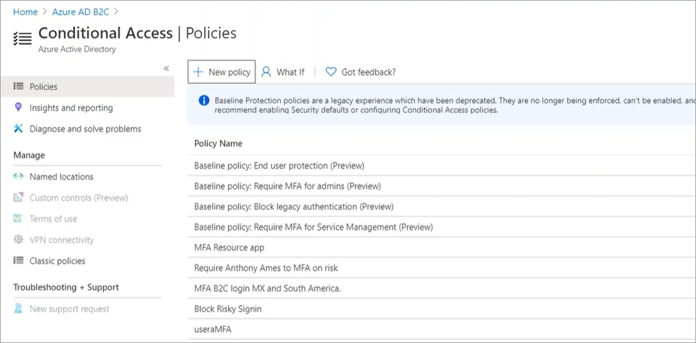

# Identity Protection and Conditional Access for Azure Active Directory B2C

Enhance the security of Azure Active Directory B2C (Azure AD B2C) with Azure AD Identity Protection and Conditional Access. The risk-detection features of [Identity Protection](https://docs.microsoft.com/azure/active-directory/identity-protection/overview-identity-protection), including risky users and risky sign-ins, are automatically detected an displayed in your Azure AD B2C tenant. You can create [Conditional Access](https://docs.microsoft.com/azure/active-directory/conditional-access/overview) policies that use these risk detections to determine actions and enforce organizational policies. Together, these capabilities give application owners significantly greater control over risky authentications and access policies.

> [!NOTE]
> To use sign-in and user risk-based Conditional access, Azure AD Premium P2 is required.
  
If you're already familiar with Identity Protection and Conditional Access in Azure AD, using these capabilities with Azure AD B2C will be a familiar experience, with the minor differences discussed in this article.

## Benefits of Identity Protection and Conditional Access for Azure AD B2C  

By using Conditional Access policies, you can apply the right access controls when needed to keep your organization secure and stay out of your user's way when not needed.

- **Gain a new level of visibility into the authentication risks for your apps and your customer base**. With signal from billions of monthly authentications across Azure AD and Microsoft Account, the risk detections algorithms will now flag authentications as low, medium or high risk for your local consumer/citizen authentications.
- **Automatically address risks by configuring your own adaptive authentication**. When active, a specific set of users, using specified applications, will be required to provide a second factor (MFA) or may be blocked from access depending on the risk level detected. The resulting end user experiences can be 100% customized, like the rest of B2C, to present your organization’s voice, style, brand, and to present mitigation alternatives if access is lost. 
- **Additional controls based on location, groups, and apps**.  Conditional access can also be used to control non-risk based situations such as a need to MFA customers accessing one app, but not the other, or blocking access from specified geographies.
- **Integrated with Azure AD B2C userflows and Identity Experience Framework custom policies**. Leverage all you existing work on customizing experiences and just add additional controls to interface with Conditional Access. Advanced cases are possible such as implementing your own grants (e.g. knowledge based access, or your own preferred MFA provider) to grant access.

## Feature differences and limitations

Identity Protection and Conditional Access in Azure AD B2C generally work the same as in Azure AD, with the following differences and limitations:

- The Security Center is not available in Azure AD B2C.

- In Azure AD B2C tenants, Identity Protection and Conditional Access are not supported in ROPC server-to-server flows.

- In Azure AD B2C tenants, Identity Protection risk detections are available for local B2C accounts only, and not for social identities (Google, Facebook, etc). 

- The following Identity Protection detections are not yet available for Azure AD B2C:

  - TBD

- The following features of Conditional Access are not available in Azure AD B2C:

  - Device compliance
  - TBD
 
## User flows and Conditional Access

## Custom policies and Conditional Access

## Next steps

- [Building a Conditional Access policy piece by piece](concept-conditional-access-policies.md)
- [Plan your Conditional Access deployment](plan-conditional-access.md)
- [Learn about Identity Protection](../identity-protection/overview-v2.md)
- [Learn about Microsoft Cloud App Security](/cloud-app-security/what-is-cloud-app-security)
- [Learn about Microsoft Intune](/intune/index)
