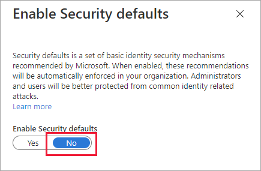
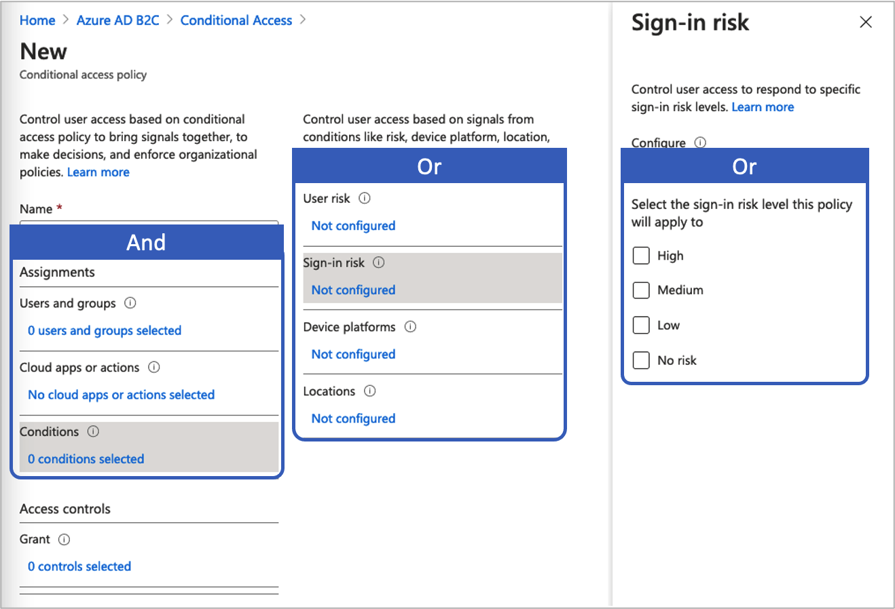
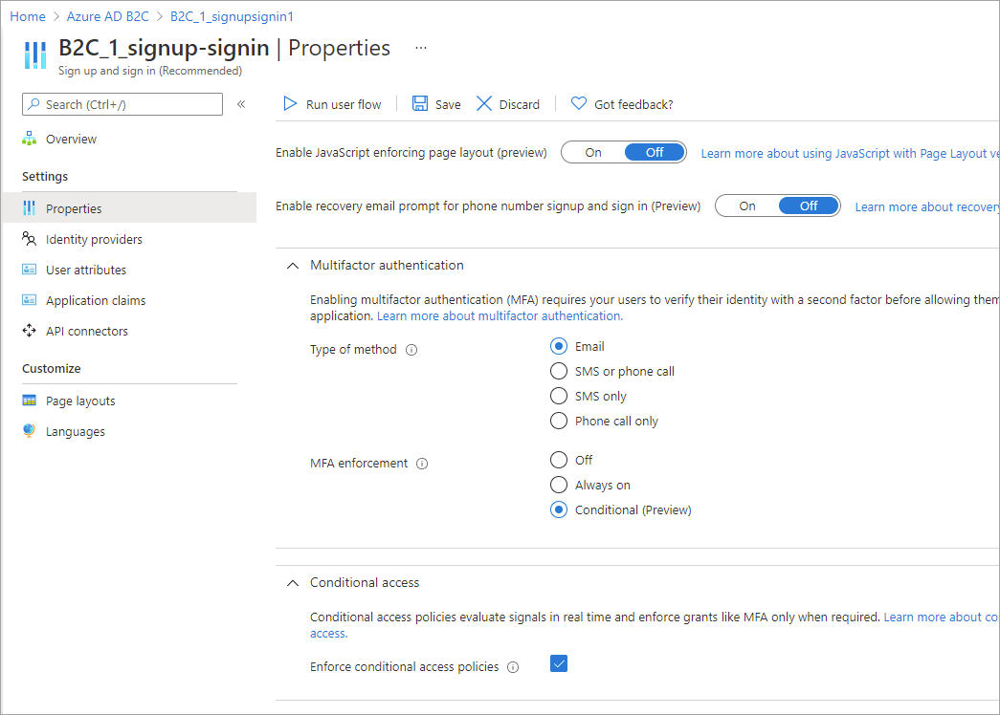

# Add Conditional Access to user flows in Azure Active Directory B2C

[!INCLUDE [active-directory-b2c-choose-user-flow-or-custom-policy](../../includes/active-directory-b2c-choose-user-flow-or-custom-policy.md)]
Conditional Access can be added to your Azure Active Directory B2C (Azure AD B2C) user flows or custom policies to manage risky sign-ins to your applications. Azure Active Directory (Azure AD) Conditional Access is the tool used by Azure AD B2C to bring signals together, make decisions, and enforce organizational policies.

Automating risk assessment with policy conditions means risky sign-ins are identified immediately and then either remediated or blocked.

## Service overview

Azure AD B2C evaluates each sign-in event and ensures that all policy requirements are met before granting the user access. During this **Evaluation** phase, the Conditional Access service evaluates the signals collected by Identity Protection risk detections during sign-in events. The outcome of this evaluation process is a set of claims that indicates whether the sign-in should be granted or blocked. The Azure AD B2C policy uses these claims to act within the user flow. An example is blocking access or challenging the user with a specific remediation like multifactor authentication (MFA). “Block access” overrides all other settings.
::: zone pivot="b2c-custom-policy"
The following example shows a Conditional Access technical profile that is used to evaluate the sign-in threat.

```xml
<TechnicalProfile Id="ConditionalAccessEvaluation">
  <DisplayName>Conditional Access Provider</DisplayName>
  <Protocol Name="Proprietary" Handler="Web.TPEngine.Providers.ConditionalAccessProtocolProvider, Web.TPEngine, Version=1.0.0.0, Culture=neutral, PublicKeyToken=null" />
  <Metadata>
    <Item Key="OperationType">Evaluation</Item>
  </Metadata>
  ...
</TechnicalProfile>
```

To ensure that Identity Protection signals are evaluated properly, you'll want to call the `ConditionalAccessEvaluation` technical profile for all users, including both [local and social accounts](technical-overview.md#consumer-accounts). Otherwise, Identity Protection will indicate an incorrect degree of risk associated with users.
::: zone-end
In the *Remediation* phase that follows, the user is challenged with MFA. Once complete, Azure AD B2C informs Identity Protection that the identified sign-in threat has been remediated and by which method. In this example, Azure AD B2C signals that the user has successfully completed the multifactor authentication challenge.
The remediation may also happen through other channels. For example, when the account's password is reset, either by the administrator or by the user. You can check the user *Risk state* in the [risky users report](identity-protection-investigate-risk.md#navigating-the-risky-users-report).
::: zone pivot="b2c-custom-policy"
> [!IMPORTANT]
> To remediate the risk successfully within the journey, make sure the *Remediation* technical profile is called after the *Evaluation* technical profile is executed. If  *Evaluation* is invoked without *Remediation*, the risk state will be *At risk*.
When the *Evaluation* technical profile recommendation returns `Block`, the call to the *Evaluation* technical profile is not required. The risk state is set to *At risk*.
The following example shows a Conditional Access technical profile used to remediate the identified threat:

```xml
<TechnicalProfile Id="ConditionalAccessRemediation">
  <DisplayName>Conditional Access Remediation</DisplayName>
  <Protocol Name="Proprietary" Handler="Web.TPEngine.Providers.ConditionalAccessProtocolProvider, Web.TPEngine, Version=1.0.0.0, Culture=neutral, PublicKeyToken=null"/>
  <Metadata>
    <Item Key="OperationType">Remediation</Item>
  </Metadata>
  ...
</TechnicalProfile>
```

::: zone-end

## Components of the solution

These are the components that enable Conditional Access in Azure AD B2C:

- **User flow** or **custom policy** that guides the user through the sign-in and sign-up process.
- **Conditional Access policy** that brings signals together to make decisions and enforce organizational policies. When a user signs into your application via an Azure AD B2C policy, the Conditional Access policy uses Azure AD Identity Protection signals to identify risky sign-ins and presents the appropriate remediation action.
- **Registered application** that directs users to the appropriate Azure AD B2C user flow or custom policy.
- [TOR Browser](https://www.torproject.org/download/) to simulate a risky sign-in.

## Service limitations and considerations

When using the Azure AD Conditional Access, consider the following:

- Identity Protection is available for both local and social identities, such as Google or Facebook. For social identities, you need to manually activate Conditional Access. Detection is limited because social account credentials are managed by the external identity provider.
- In Azure AD B2C tenants, only a subset of [Azure AD Conditional Access](../active-directory/conditional-access/overview.md) policies is available.

## Prerequisites

[!INCLUDE [active-directory-b2c-customization-prerequisites-custom-policy](../../includes/active-directory-b2c-customization-prerequisites-custom-policy.md)]

## Pricing tier

Azure AD B2C **Premium P2** is required to create risky sign-in policies. **Premium P1** tenants can create a policy that is based on location, application, user-based, or group-based policies. For more information, see [Change your Azure AD B2C pricing tier](billing.md#change-your-azure-ad-pricing-tier)

## Prepare your Azure AD B2C tenant

To add a Conditional Access policy, disable security defaults:

1. Sign in to the [Azure portal](https://portal.azure.com).
1. Make sure you're using the directory that contains your Azure AD B2C tenant. Select the **Directories + subscriptions** icon in the portal toolbar.
1. On the **Portal settings | Directories + subscriptions** page, find your Azure AD B2C directory in the **Directory name** list, and then select **Switch**.
1. Under **Azure services**, select **Azure Active Directory**. Or use the search box to find and select **Azure Active Directory**.
1. Select **Properties**, and then select **Manage Security defaults**.

   

1. Under **Enable Security defaults**, select **No**.

   

## Add a Conditional Access policy

A Conditional Access policy is an if-then statement of assignments and access controls. A Conditional Access policy brings signals together to make decisions and enforce organizational policies. 

> [!TIP]
> In this step you configure the conditional access policy. We recommend you to use one of the following templates: [Template 1: Sign-in risk-based Conditional Access](#template-1-sign-in-risk-based-conditional-access), [Template 2: User risk-based Conditional Access](#template-2-user-risk-based-conditional-access), or [Template 3: Block locations with Conditional Access](#template-3-block-locations-with-conditional-access). You can configure the conditional access policy through Azure portal, or MS Graph API.

The logical operator between the assignments is *And*. The operator in each assignment is *Or*.


To add a Conditional Access policy:

1. In the Azure portal, search for and select **Azure AD B2C**.
1. Under **Security**, select **Conditional Access**. The **Conditional Access Policies** page opens.
1. Select **+ New policy**.
1. Enter a name for the policy, such as *Block risky sign-in*.
1. Under **Assignments**, choose **Users and groups**, and then select the one of the following supported configurations:

    | Include  |License   |   Notes|
    |---|---|---|
    |**All users**    | P1, P2  | This policy will affect all of your users. To be sure not to lock yourself out, exclude your administrative account by choosing **Exclude**, selecting **Directory roles**, and then selecting **Global Administrator** in the list. You can also select **Users and Groups** and then select your account in the **Select excluded users** list.  |

1. Select **Cloud apps or actions**, and then **Select apps**. Browse for your [relying party application](tutorial-register-applications.md).
1. Select **Conditions**, and then select from the following conditions. For example, select **Sign-in risk** and **High**, **Medium**, and **Low** risk levels.

    |Condition|License   |Notes   |
    |---|---|---|
    | **User risk**  | P2  |User risk represents the probability that a given identity or account is compromised.   |
    | **Sign-in risk**   | P2  |Sign-in risk represents the probability that a given authentication request isn't authorized by the identity owner.   |
    | **Device platforms**  |Not supported   |Characterized by the operating system that runs on a device. For more information, see [Device platforms](../active-directory/conditional-access/concept-conditional-access-conditions.md#device-platforms).   |
    | **Locations**  |P1, P2   |Named locations may include the public IPv4 network information, country or region, or unknown areas that don't map to specific countries or regions. For more information, see [Locations](../active-directory/conditional-access/concept-conditional-access-conditions.md#locations).   |

3. Under **Access controls**, select **Grant**. Then select whether to block or grant access:

    |Option   | License  | Notes  |
    |---|---|---|
    | **Block access**  |P1, P2| Prevents access based on the conditions specified in this conditional access policy.  |  
    | **Grant access** with **Require multi-factor authentication**  | P1, P2| Based on the conditions specified in this conditional access policy, the user is required to go through Azure AD B2C multifactor authentication. |  

4. Under **Enable policy**, select one of the following:

    | Option  | License  | Notes  |
    |---|---|---|
    |**Report-only**    | P1, P2  | Report-only allows administrators to evaluate the impact of Conditional Access policies before enabling them in their environment. We recommend you check policy with this state, and determine the impact to end users without requiring multifactor authentication or blocking users. For more information, see [Review Conditional Access outcomes in the audit report](#review-conditional-access-outcomes-in-the-audit-report)  |
    |**On**   |  P1, P2 |The access policy is evaluated and not enforced.   |
    |**Off**    | P1, P2  | The access policy is not activated and has no effect on the users.  |

5. Enable your test Conditional Access policy by selecting **Create**.

## Template 1: Sign-in risk-based Conditional Access

Most users have a normal behavior that can be tracked, when they fall outside of this norm it could be risky to allow them to just sign in. You may want to block that user or maybe just ask them to perform multifactor authentication to prove that they are really who they say they are. A sign-in risk represents the probability that a given authentication request isn't authorized by the identity owner. Azure AD B2C tenants with P2 licenses can create Conditional Access policies incorporating Azure AD Identity Protection sign-in risk detections.

Note the limitations on Identity Protection detections for B2C. If risk is detected, users can perform multifactor authentication to self-remediate and close the risky sign-in event to prevent unnecessary noise for administrators.

Configure Conditional Access through the Azure portal or Microsoft Graph APIs to enable a sign-in risk-based Conditional Access policy requiring MFA when the sign-in risk is medium or high.

   1. Under **Include**, select **All users**.
   2. Under **Exclude**, select **Users and groups** and choose your organization's emergency access or break-glass accounts.
   3. Select **Done**.
6. Under **Cloud apps or actions** > **Include**, select **All cloud apps**.
7. Under **Conditions** > **Sign-in risk**, set **Configure** to **Yes**. Under **Select the sign-in risk level this policy will apply to** 
   1. Select **High** and **Medium**.
   2. Select **Done**.
8. Under **Access controls** > **Grant**, select **Grant access**, **Require multi-factor authentication**, and select **Select**.
9. Confirm your settings and set **Enable policy** to **On**.
10. Select **Create** to create to enable your policy.

### Enable template 1 with Conditional Access APIs (optional)

Create a sign-in risk-based Conditional Access policy with MS Graph APIs. For more information, see [Conditional Access APIs](../active-directory/conditional-access/howto-conditional-access-apis.md#microsoft-graph-apis).
The following template can be used to create a Conditional Access policy with display name "Template 1: Require MFA for medium+ sign-in risk" in report-only mode.

```json
{
    "displayName": "Template 1: Require MFA for medium+ sign-in risk",
    "state": "enabledForReportingButNotEnforced",
    "conditions": {
        "signInRiskLevels": [ "high" ,
            "medium"
        ],
        "applications": {
            "includeApplications": [
                "All"
            ]
        },
        "users": {
            "includeUsers": [
                "All"
            ],
            "excludeUsers": [
                "f753047e-de31-4c74-a6fb-c38589047723"
            ]
        }
    },
    "grantControls": {
        "operator": "OR",
        "builtInControls": [
            "mfa"
        ]
    }
}
```

## Template 2: User risk-based Conditional Access

Identity Protection can calculate what it believes is normal for a user's behavior and use that to base decisions for their risk. User risk is a calculation of probability that an identity has been compromised. B2C tenants with P2 licenses can create Conditional Access policies incorporating user risk. When a user is detected as at risk, you can require that they securely change their password to remediate the risk and gain access to their account. We highly recommend setting up a user risk policy to require a secure password change so users can self-remediate.

Learn more about [user risk in Identity Protection](../active-directory/identity-protection/concept-identity-protection-risks.md), taking into account the [limitations on Identity Protection detections for B2C](identity-protection-investigate-risk.md#service-limitations-and-considerations).

Configure Conditional Access through Azure portal or Microsoft Graph APIs to enable a user risk-based Conditional Access policy requiring multifactor authentication (MFA) and password change when user risk is medium OR high.

To configure your user based conditional access:

1. Sign in to the **Azure portal**.
2. Browse to **Azure AD B2C** > **Security** > **Conditional Access**.
3. Select **New policy**.
4. Give your policy a name. We recommend that organizations create a meaningful standard for the names of their policies.
5. Under **Assignments**, select **Users and groups**.
   1. Under **Include**, select **All users**.
   2. Under **Exclude**, select **Users and groups** and choose your organization's emergency access or break-glass accounts. 
   3. Select **Done**.
6. Under **Cloud apps or actions** > **Include**, select **All cloud apps**.
7. Under **Conditions** > **User risk**, set **Configure** to **Yes**. Under **Configure user risk levels needed for policy to be enforced** 
   1. Select **High** and **Medium**.
   2. Select **Done**.
8. Under **Access controls** > **Grant**, select **Grant access**, **Require password change**, and select **Select**. **Require multi-factor authentication** will also be required by default.
9. Confirm your settings and set **Enable policy** to **On**.
10. Select **Create** to create to enable your policy.

### Enable template 2 with Conditional Access APIs (optional)

To create a user risk-based Conditional Access policy with Conditional Access APIs, refer to the documentation for [Conditional Access APIs](../active-directory/conditional-access/howto-conditional-access-apis.md#microsoft-graph-apis).

The following template can be used to create a Conditional Access policy with display name "Template 2: Require secure password change for medium+ user risk" in report-only mode.

```json
{
    "displayName": "Template 2: Require secure password change for medium+ user risk",
    "state": "enabledForReportingButNotEnforced",
    "conditions": {
        "userRiskLevels": [ "high" ,
            "medium"
        ],
        "applications": {
            "includeApplications": [
                "All"
            ]
        },
        "users": {
            "includeUsers": [
                "All"
            ],
            "excludeUsers": [
                "f753047e-de31-4c74-a6fb-c38589047723"
            ]
        }
    },
    "grantControls": {
        "operator": "AND",
        "builtInControls": [
            "mfa",
            "passwordChange"
        ]
    }
}
```

## Template 3: Block locations with Conditional Access

With the location condition in Conditional Access, you can control access to your cloud apps based on the network location of a user. Configure Conditional Access via the Azure portal or Microsoft Graph APIs to enable a Conditional Access policy blocking access to specific locations. For more information, see [Using the location condition in a Conditional Access policy](../active-directory/conditional-access/location-condition.md)

### Define locations

1. Sign in to the **Azure portal**.
2. Browse to **Azure AD B2C** > **Security** > **Conditional Access** > **Named Locations**.
3. Select **Countries location** or **IP ranges location**
4. Give your location a name.
5. Provide the IP ranges or select the Countries/Regions for the location you are specifying. If you choose Countries/Regions, you can optionally choose to include unknown areas.
6. Choose **Save**.

To enable with condition access policy:

1. Sign in to the **Azure portal**.
2. Browse to **Azure AD B2C** > **Security** > **Conditional Access**.
3. Select **New policy**.
4. Give your policy a name. We recommend that organizations create a meaningful standard for the names of their policies.
5. Under **Assignments**, select **Users and groups**.
   1. Under **Include**, select **All users**.
   2. Under **Exclude**, select **Users and groups** and choose your organization's emergency access or break-glass accounts. 
   3. Select **Done**.
6. Under **Cloud apps or actions** > **Include**, select **All cloud apps**.
7. Under **Conditions** > **Location**
   1. Set **Configure** to **Yes**.
   2. Under **Include**, select **Selected locations**
   3. Select the named location you created.
   4. Click **Select**
8. Under **Access controls** > select **Block Access**, and select **Select**.
9. Confirm your settings and set **Enable policy** to **On**.
10. Select **Create** to create to enable your policy.

### Enable template 3 with Conditional Access APIs (optional)

To create a location-based Conditional Access policy with Conditional Access APIs,  refer to the documentation for [Conditional Access APIs](../active-directory/conditional-access/howto-conditional-access-apis.md#microsoft-graph-apis). To set up Named Locations, refer to the documentations for [Named Locations](/graph/api/resources/namedlocation).

The following template can be used to create a Conditional Access policy with display name "Template 3: Block unallowed locations" in report-only mode.

```json
{
    "displayName": "Template 3: Block unallowed locations",
    "state": "enabledForReportingButNotEnforced",
    "conditions": {
        "applications": {
            "includeApplications": [
                "All"
            ]
        },
        "users": {
            "includeUsers": [
                "All"
            ],
            "excludeUsers": [
                "f753047e-de31-4c74-a6fb-c38589047723"
            ]
        },
        "locations": {
            "includeLocations": [
                "b5c47916-b835-4c77-bd91-807ec08bf2a3"
          ]
        }
    },
    "grantControls": {
        "operator": "OR",
        "builtInControls": [
            "block"
        ]
    }
}
```

## Add Conditional Access to a user flow

After you've added the Azure AD Conditional Access policy, enable Conditional Access in your user flow or custom policy. When you enable Conditional Access, you don't need to specify a policy name.
Multiple Conditional Access policies may apply to an individual user at any time. In this case, the most strict access control policy takes precedence. For example, if one policy requires MFA while the other blocks access, the user will be blocked.

## Enable multifactor authentication (optional)

When adding Conditional Access to a user flow, consider using **Multi-factor authentication (MFA)**. Users can use a one-time code via SMS or voice, a one-time password via email, or a time-based one-time password (TOTP) code via an authenticator app for multifactor authentication. MFA settings are configured separately from Conditional Access settings. You can choose from these MFA options:

- **Off** - MFA is never enforced during sign-in, and users are not prompted to enroll in MFA during sign-up or sign-in.
- **Always on** - MFA is always required, regardless of your Conditional Access setup. During sign-up, users are prompted to enroll in MFA. During sign-in, if users aren't already enrolled in MFA, they're prompted to enroll.
- **Conditional** - During sign-up and sign-in, users are prompted to enroll in MFA (both new users and existing users who aren't enrolled in MFA). During sign-in, MFA is enforced only when an active Conditional Access policy evaluation requires it:
   - If the result is an MFA challenge with no risk, MFA is enforced. If the user isn't already enrolled in MFA, they're prompted to enroll.
   - If the result is an MFA challenge due to risk *and* the user is not enrolled in MFA, sign-in is blocked.
   > [!NOTE]
   > With general availability of Conditional Access in Azure AD B2C, users are now prompted to enroll in an MFA method during sign-up. Any sign-up user flows you created prior to general availability won't automatically reflect this new behavior, but you can include the behavior by creating new user flows.

::: zone pivot="b2c-user-flow"

To enable Conditional Access for a user flow, make sure the version supports Conditional Access. These user flow versions are labeled **Recommended**.

1. Sign in to the [Azure portal](https://portal.azure.com).
1. Make sure you're using the directory that contains your Azure AD B2C tenant. Select the **Directories + subscriptions** icon in the portal toolbar.
1. On the **Portal settings | Directories + subscriptions** page, find your Azure AD B2C directory in the **Directory name** list, and then select **Switch**.
1. Under **Azure services**, select **Azure AD B2C**. Or use the search box to find and select **Azure AD B2C**.
1. Under **Policies**, select **User flows**. Then select the user flow.
1. Select **Properties** and make sure the user flow supports Conditional Access by looking for the setting labeled **Conditional Access**.
   
1. In the **Multifactor authentication** section, select the desired **Type of method**, and then under **MFA enforcement**, select **Conditional**.
1. In the **Conditional access** section, select the **Enforce conditional access policies** check box.
1. Select **Save**.

::: zone-end

::: zone pivot="b2c-custom-policy"

## Add Conditional Access to your policy

1. Get the example of a conditional access policy on [GitHub](https://github.com/azure-ad-b2c/samples/tree/master/policies/conditional-access).
1. In each file, replace the string `yourtenant` with the name of your Azure AD B2C tenant. For example, if the name of your B2C tenant is *contosob2c*, all instances of `yourtenant.onmicrosoft.com` become `contosob2c.onmicrosoft.com`.
1. Upload the policy files.

### Configure claim other than phone number to be used for MFA

In the Conditional Access policy above, the `DoesClaimExist` claim transformation method checks if a claim contains a value, for example if the `strongAuthenticationPhoneNumber` claim contains a phone number. 
The claims transformation isn't limited to the `strongAuthenticationPhoneNumber` claim. Depending on the scenario, you can use any other claim. In the following XML snippet, the `strongAuthenticationEmailAddress` claim is checked instead. The claim you choose must have a valid value, otherwise the `IsMfaRegistered` claim will be set to `False`. When set to `False`, the Conditional Access policy evaluation returns a `Block` grant type, preventing the user from completing user flow.

```xml
 <ClaimsTransformation Id="IsMfaRegisteredCT" TransformationMethod="DoesClaimExist">
  <InputClaims>
    <InputClaim ClaimTypeReferenceId="strongAuthenticationEmailAddress" TransformationClaimType="inputClaim" />
  </InputClaims>
  <OutputClaims>
    <OutputClaim ClaimTypeReferenceId="IsMfaRegistered" TransformationClaimType="outputClaim" />
  </OutputClaims>
 </ClaimsTransformation>
```

## Test your custom policy

1. Select the `B2C_1A_signup_signin_with_ca` or `B2C_1A_signup_signin_with_ca_whatif` policy to open its overview page. Then select **Run user flow**. Under **Application**, select *webapp1*. The **Reply URL** should show `https://jwt.ms`.
1. Copy the URL under **Run user flow endpoint**.
1. To simulate a risky sign-in, open the [Tor Browser](https://www.torproject.org/download/) and use the URL you copied in the previous step to sign in to the registered app.
1. Enter the requested information in the sign-in page, and then attempt to sign in. The token is returned to `https://jwt.ms` and should be displayed to you. In the jwt.ms decoded token, you should see that the sign-in was blocked.

::: zone-end
::: zone pivot="b2c-user-flow"

## Test your user flow

1. Select the user flow you created to open its overview page, and then select **Run user flow**. Under **Application**, select *webapp1*. The **Reply URL** should show `https://jwt.ms`.
1. Copy the URL under **Run user flow endpoint**.
1. To simulate a risky sign-in, open the [Tor Browser](https://www.torproject.org/download/) and use the URL you copied in the previous step to sign in to the registered app.
1. Enter the requested information in the sign-in page, and then attempt to sign in. The token is returned to `https://jwt.ms` and should be displayed to you. In the jwt.ms decoded token, you should see that the sign-in was blocked.

::: zone-end

## Review Conditional Access outcomes in the audit report

To review the result of a Conditional Access event:

1. Sign in to the [Azure portal](https://portal.azure.com).
1. Make sure you're using the directory that contains your Azure AD B2C tenant. Select the **Directories + subscriptions** icon in the portal toolbar.
1. On the **Portal settings | Directories + subscriptions** page, find your Azure AD B2C directory in the **Directory name** list, and then select **Switch**.
1. Under **Azure services**, select **Azure AD B2C**. Or use the search box to find and select **Azure AD B2C**.
1. Under **Activities**, select **Audit logs**.
1. Filter the audit log by setting **Category** to **B2C** and setting **Activity Resource Type** to **IdentityProtection**. Then select **Apply**.
1. Review audit activity for up to the last seven days. The following types of activity are included:
   - **Evaluate conditional access policies**: This audit log entry indicates that a Conditional Access evaluation was performed during an authentication.
   - **Remediate user**: This entry indicates that the grant or requirements of a Conditional Access policy were met by the end user, and this activity was reported to the risk engine to mitigate (reduce the risk of) the user.
1. Select an **Evaluate conditional access policy** log entry in the list to open the **Activity Details: Audit log** page, which shows the audit log identifiers, along with this information in the **Additional Details** section:
   - **ConditionalAccessResult**: The grant required by the conditional policy evaluation.
   - **AppliedPolicies**: A list of all the Conditional Access policies where the conditions were met and the policies are ON.
   - **ReportingPolicies**: A list of the Conditional Access policies that were set to report-only mode and where the conditions were met.
   
## Next steps

[Customize the user interface in an Azure AD B2C user flow](customize-ui-with-html.md)
