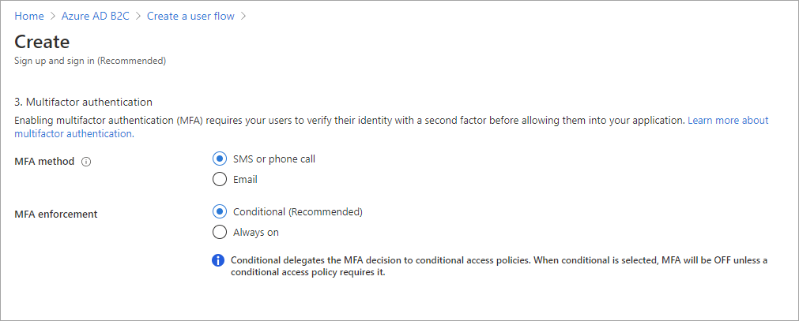
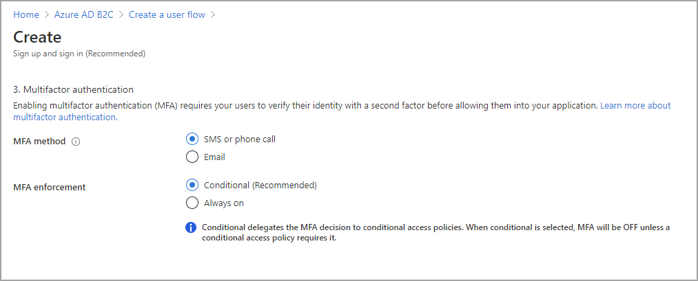
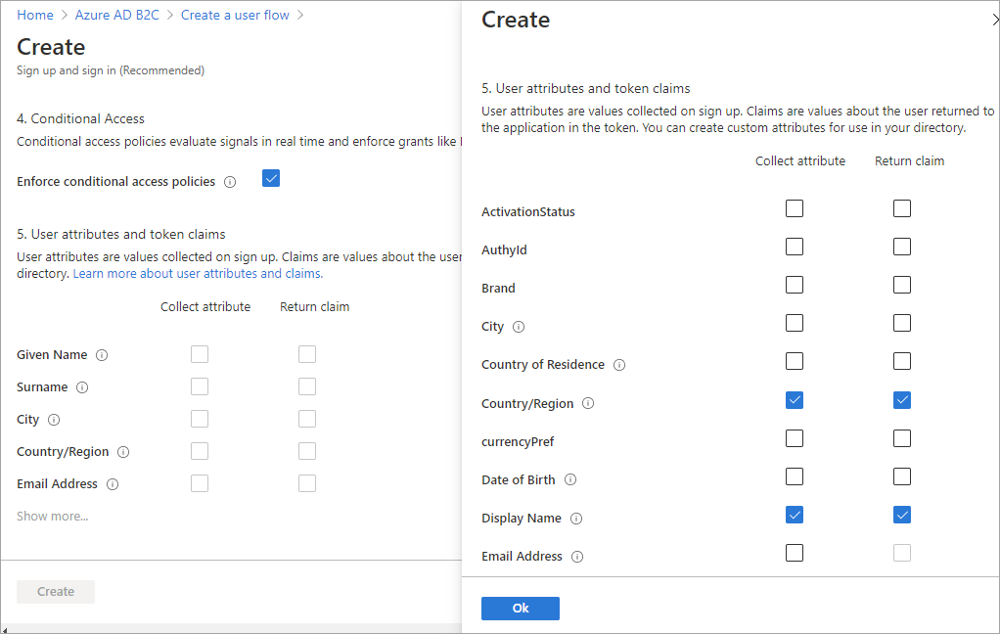

# Add Conditional Access to user flows in Azure Active Directory B2C

[!INCLUDE [b2c-public-preview-feature](../../includes/active-directory-b2c-public-preview.md)]

Conditional Access can be added to your Azure Active Directory B2C user flows to manage risky sign-ins to your applications. The integration of Identity Protection and Conditional Access in Azure AD B2C lets you set up policies that identify risky sign-in behavior and enforce policies that require further action from the user or administrator. These are the components that enable Conditional Access in Azure AD B2C user flows:

- **User flow**. Create a user flow that guides the user through the sign-in and sign-up process. In the user flow settings,  indicate whether to activate Conditional Access policies when a user follows the user flow.
- **Application that directs users to the user flow**. Configure your app to direct users to the appropriate sign-up and sign-in user flow by specifying the user flow endpoint in the app.
- **Conditional Access policy**. [Create a Conditional Access policy](conditional-access-identity-protection-setup.md) and specify the apps you want the policy to apply to. When the user follows the sign-in or sign-up user flow for your app, the Conditional Access policy uses Identity Protection signals to identify risky sign-ins, and presents the appropriate remediation action if necessary.

Conditional Access is supported in the latest versions of user flows. You can add Conditional Access policies to new user flows as you create them, or you can add them to existing user flows as long as the version supports Conditional Access. When adding Conditional Access to an existing user flow, there are two settings you'll need to review:

- **Multi-factor authentication (MFA)**: Users can now use a one-time code via SMS or voice, or a one-time password via email for multi-factor authentication. MFA settings are independent from Conditional Access settings. You can set MFA to **Always On** so that MFA is always required regardless of your Conditional Access setup. Or, you can set MFA to **Conditional** so that MFA is required only when an active Conditional Access Policy requires it.

- **Conditional Access**: This setting should always be **On**. Typically you would only turn this setting **Off** during troubleshooting or migration, or for legacy implementations.

Learn more about [Identity Protection and Conditional Access](conditional-access-identity-protection-overview.md) in Azure AD B2C, or see [how to set it up](conditional-access-identity-protection-setup.md).

## Add Conditional Access to a new user flow

1. Sign in to the [Azure portal](https://portal.azure.com).
1. Select the **Directory + Subscription** icon in the portal toolbar, and then select the directory that contains your Azure AD B2C tenant.
1. In the Azure portal, search for and select **Azure AD B2C**.
1. Under **Policies**, select **User flows**, and then select **New user flow**.
1. On the **Create a user flow** page, select the user flow type.
1. Under **Select a version**, select **Recommended**, and then select **Create**. ([Learn more](user-flow-versions.md) about user flow versions.)

    

1. Enter a **Name** for the user flow. For example, *signupsignin1*.
1. In the **Identity providers** section, select the identity providers you want to allow for this user flow.
2. In the **Multifactor authentication** section, select the desired **MFA method**, and then under **MFA enforcement** select **Conditional (Recommended)**.
 
   

1. In the **Conditional Access** section, select the **Enforce conditional access policies** check box.

   

1. In the **User attributes and claims** section, choose the claims and attributes that you want to collect and send from the user during sign-up. For example, select **Show more**, and then choose attributes and claims for **Country/Region** and **Display Name**. Select **OK**.

    

1. Click **Create** to add the user flow. A prefix of *B2C_1* is automatically prepended to the name.

## Add Conditional Access to an existing user flow

> [!NOTE]
> The existing user flow must be a version that supports Conditional Access. These user flow versions are labeled **Recommended**.

1. Sign in to the [Azure portal](https://portal.azure.com).

1. Select the **Directory + Subscription** icon in the portal toolbar, and then select the directory that contains your Azure AD B2C tenant.

1. In the Azure portal, search for and select **Azure AD B2C**.

1. Under **Policies**, select **User flows**. Then select the user flow.

1. Select **Properties** and make sure the user flow supports Conditional Access by selecting **Properties** and looking for the setting labeled **Conditional Access**.
 
   

1. In the **Multifactor authentication** section, select the desired **MFA method**, and then under **MFA enforcement** select **Conditional (Recommended)**.
 
1. In the **Conditional Access** section, select the **Enforce conditional access policies** check box.

1. Select **Save**.

## Test the user flow

To test Conditional Access in your user flow, [create a Conditional Access policy](conditional-access-identity-protection-setup.md) and enable Conditional Access in your user flow as described above. 

### Prerequisites

- Azure AD B2C Premium 2 is required to create risky sign-in policies. Premium P1 tenants can create location, app, or group-based policies.
- For testing purposes, you can [register the test web application](tutorial-register-applications.md) `https://jwt.ms`, which is a Microsoft-owned web application that displays the decoded contents of a token (the contents of the token never leave your browser). 
- To simulate a risky sign-in, download the TOR Browser and attempt to sign in to the user flow endpoint.
- Using the following settings, [create a Conditional Access policy](conditional-access-identity-protection-setup.md):
   
   - For **Users and groups**, select the test user (don't select **All users** or you could block yourself from signing in).
   - For **Cloud apps or actions**, choose **Select apps**, and then choose your relying party application.
   - For Conditions, select **Sign-in risk** and **High**, **Medium**, and **Low** risk levels.
   - For **Grant**, choose **Block access**.

      

### Run the user flow

1. Select the user flow you created to open its overview page, then select **Run user flow**. Under **Application**, select *webapp1*. The **Reply URL** should show `https://jwt.ms`.

   

1. Copy the URL under **Run user flow endpoint**.

1. To simulate a risky sign-in, open the [Tor Browser](https://www.torproject.org/download/) and use the URL you copied in the preview step to sign in to the registered app.

1. Enter the requested information in the sign-in page, and then attempt to sign in. The token is returned to `https://jwt.ms` and should be displayed to you. In the jwt.ms decoded token, you should see that the sign-in was blocked:

   

## Next steps

[Customize the user interface in an Azure AD B2C user flow](customize-ui-overview.md)
