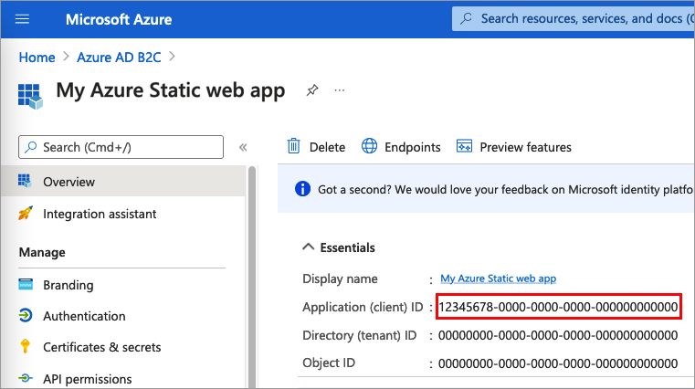

# Configure authentication in an Azure Static Web App by using Azure AD B2C

This article explains how to add Azure Active Directory B2C (Azure AD B2C) authentication functionality to an Azure Static Web App. For more information, check out the [Custom authentication in Azure Static Web Apps](../static-web-apps/authentication-custom.md) article.

## Overview

OpenID Connect (OIDC) is an authentication protocol that's built on OAuth 2.0. Use the OIDC to securely sign users in to an Azure Static Web App. The sign in flow involves the following steps:

1. Users go to the Azure Static Web App and select **Sign-in**. 
1. The Azure Static Web App initiates an authentication request and redirects users to Azure AD B2C.
1. Users [sign up or sign in](add-sign-up-and-sign-in-policy.md) and [reset the password](add-password-reset-policy.md). Alternatively, they can sign in with a [social account](add-identity-provider.md).
1. After users sign in successfully, Azure AD B2C returns an ID token to the Azure Static Web App.
1. Azure Static Web App validates the ID token, reads the claims, and returns a secure page to users.

When the access token expires or the app session is invalidated, Azure Static Web App initiates a new authentication request and redirects users to Azure AD B2C. If the Azure AD B2C [SSO session](session-behavior.md) is active, Azure AD B2C issues an access token without prompting users to sign in again. If the Azure AD B2C session expires or becomes invalid, users are prompted to sign in again.

## Prerequisites
- A premium Azure subscription. 
- If you haven't created an app yet, follow the guidance how to create an [Azure Static Web App](../static-web-apps/overview.md).
- Familiarize yourself with the Azure Static Web App [staticwebapp.config.json](../static-web-apps/configuration.md) configuration file.
- Familiarize yourself with the Azure Static Web App [App Settings](../static-web-apps/application-settings.md).

## Step 1: Configure your user flow

[!INCLUDE [active-directory-b2c-app-integration-add-user-flow](../../includes/active-directory-b2c-app-integration-add-user-flow.md)]

## Step 2: Register a web application

To enable your application to sign in with Azure AD B2C, register your app in the Azure AD B2C directory. The app that you register establishes a trust relationship between the app and Azure AD B2C.  

During app registration, you specify a *redirect URI*. The redirect URI is the endpoint to which users are redirected by Azure AD B2C after they authenticate with Azure AD B2C. The app registration process generates an *application ID*, also known as the *client ID*, that uniquely identifies your app. After your app is registered, Azure AD B2C uses both the application ID and the redirect URI to create authentication requests. You also create a *client secret*, which your app uses to securely acquire the tokens.

### Step 2.1: Register the app

To register your application, follow these steps:

1. Sign in to the [Azure portal](https://portal.azure.com).
1. Make sure you're using the directory that contains your Azure AD B2C tenant. Select the **Directories + subscriptions** icon in the portal toolbar.
1. On the **Portal settings | Directories + subscriptions** page, find your Azure AD B2C directory in the **Directory name** list, and then select **Switch**.
1. In the Azure portal, search for and select **Azure AD B2C**.
1. Select **App registrations**, and then select **New registration**.
1. Under **Name**, enter a name for the application (for example, *My Azure Static web app*).
1. Under **Supported account types**, select **Accounts in any identity provider or organizational directory (for authenticating users with user flows)**.
1. Under **Redirect URI**, select **Web** and then, in the URL box, enter `https://<YOUR_SITE>/.auth/login/aadb2c/callback`. Replace the `<YOUR_SITE>` with your Azure Static Web App name. For example: `https://witty-island-11111111.azurestaticapps.net/.auth/login/aadb2c/callback`. If you configured an [Azure Static Web App's custom domains](../static-web-apps/custom-domain.md), use the custom domain in the redirect URI. For example, `https://www.example.com/.auth/login/aadb2c/callback`
1. Under **Permissions**, select the **Grant admin consent to openid and offline access permissions** checkbox.
1. Select **Register**.
1. Select **Overview**.
1. Record the **Application (client) ID** for later use, when you configure the web application.

      

### Step 2.2: Create a client secret

1. In the **Azure AD B2C - App registrations** page, select the application you created, for example *My Azure Static web app*.
1. In the left menu, under **Manage**, select **Certificates & secrets**.
1. Select **New client secret**.
1. Enter a description for the client secret in the **Description** box. For example, *clientsecret1*.
1. Under **Expires**, select a duration for which the secret is valid, and then select **Add**.
1. Record the secret's **Value** for use in your client application code. This secret value is never displayed again after you leave this page. You use this value as the application secret in your application's code.

## Step 3: Configure the Azure Static App

Once the application is registered with Azure AD B2C, create the following application secrets in the Azure Static Web App's  [application settings](../static-web-apps/application-settings.md). You can configure application settings via the Azure portal or with the Azure CLI. For more information, check out the [Configure application settings for Azure Static Web Apps](../static-web-apps/application-settings.md#configure-application-settings) article.

Add the following keys to the app settings:

| Setting Name | Value |
| --- | --- |
| `AADB2C_PROVIDER_CLIENT_ID` | The Web App  (client) ID from [step 2.1](#step-21-register-the-app). |
| `AADB2C_PROVIDER_CLIENT_SECRET` | The Web App  (client) secret from [step 2.2](#step-22-create-a-client-secret). |

> [!IMPORTANT]
> Application secrets are sensitive security credentials. Don't share this secret with anyone, distribute it within a client application, or check into source control.

### 3.1 Add an OpenID Connect identity provider

Once you've added the app ID and secret, use the following steps to add the Azure AD B2C as OpenId Connect identity provider.

1. Add an `auth` section of the [configuration file](../static-web-apps/configuration.md) with a configuration block for the OIDC providers, and your provider definition.

   ```json
   {
     "auth": {
       "identityProviders": {
         "customOpenIdConnectProviders": {
           "aadb2c": {
             "registration": {
               "clientIdSettingName": "AADB2C_PROVIDER_CLIENT_ID",
               "clientCredential": {
                 "clientSecretSettingName": "AADB2C_PROVIDER_CLIENT_SECRET"
               },
               "openIdConnectConfiguration": {
                 "wellKnownOpenIdConfiguration": "https://<TENANT_NAME>.b2clogin.com/<TENANT_NAME>.onmicrosoft.com/<POLICY_NAME>/v2.0/.well-known/openid-configuration"
               }
             },
             "login": {
               "nameClaimType": "http://schemas.xmlsoap.org/ws/2005/05/identity/claims/name",
               "scopes": [],
               "loginParameterNames": []
             }
           }
         }
       }
     }
   }
   ```

1. Replace `<TENANT_NAME>` with the first part of your Azure AD B2C [tenant name]( tenant-management-read-tenant-name.md#get-your-tenant-name) (for example, `https://contoso.b2clogin.com/contoso.onmicrosoft.com`).
1. Replace `<POLICY_NAME>` with the user flows or custom policy you created in [step 1](#step-1-configure-your-user-flow).

## Step 4: Check the Azure Static Web APP

1. Navigate to `/.auth/login/aadb2c`. The `/.auth/login` points the Azure Static app login endpoint. The `aadb2c` references to your [OpenID Connect identity provider](#31-add-an-openid-connect-identity-provider).  The following URL demonstrates an Azure Static app login endpoint: `https://witty-island-11111111.azurestaticapps.net/.auth/login/aadb2c`.
1. Complete the sign up or sign in process.
1. In your browser debugger, [run the following JavaScript in the Console](/microsoft-edge/devtools-guide-chromium/console/console-javascript). The JavaScript code will present information about the sign in user.

    ```javascript
    async function getUserInfo() {
      const response = await fetch('/.auth/me');
      const payload = await response.json();
      const { clientPrincipal } = payload;
      return clientPrincipal;
    }
    
    await getUserInfo();
    ```

> [!TIP]
> If you can't run the above JavaScript code in your browser, navigate to the following URL `https://<app-name>.azurewebsites.net/.auth/me`. Replace the `<app-name>` with your Azure Web App.

## Next steps

* After successful authentication, you can show display name on the navigation bar. To view the claims that the Azure AD B2C token returns to your app, check out [Accessing user information in Azure Static Web Apps](../static-web-apps/user-information.md).
* Learn how to [customize and enhance the Azure AD B2C authentication experience for your web app](enable-authentication-azure-static-app-options.md).
