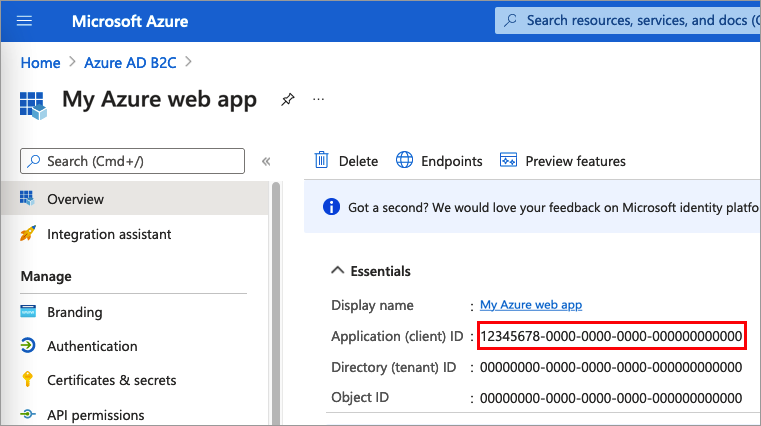

# Configure authentication in an Azure Web App by using Azure AD B2C

This article explains how to add Azure Active Directory B2C (Azure AD B2C) authentication functionality to an Azure Web App. For more information, check out the [configure your App Service or Azure Functions app to login using an OpenID Connect provider](../app-service/configure-authentication-provider-openid-connect.md) article.

## Overview

OpenID Connect (OIDC) is an authentication protocol that's built on OAuth 2.0. Use the OIDC to securely sign users in to an Azure Web App. The sign-in flow involves the following steps:

1. Users go to the Azure Web App and select **Sign-in**. 
1. The Azure Web App initiates an authentication request and redirects users to Azure AD B2C.
1. Users [sign up or sign in](add-sign-up-and-sign-in-policy.md) and [reset the password](add-password-reset-policy.md). Alternatively, they can sign in with a [social account](add-identity-provider.md).
1. After users sign in successfully, Azure AD B2C returns an ID token to the Azure Web App.
1. Azure Web App validates the ID token, reads the claims, and returns a secure page to users.

When the ID token expires or the app session is invalidated, Azure Web App initiates a new authentication request and redirects users to Azure AD B2C. If the Azure AD B2C [SSO session](session-behavior.md) is active, Azure AD B2C issues an access token without prompting users to sign in again. If the Azure AD B2C session expires or becomes invalid, users are prompted to sign in again.

## Prerequisites

- If you haven't created an app yet, follow the guidance how to create an [Azure Web App](../app-service/quickstart-dotnetcore.md).

## Step 1: Configure your user flow

[!INCLUDE [active-directory-b2c-app-integration-add-user-flow](../../includes/active-directory-b2c-app-integration-add-user-flow.md)]

## Step 2: Register a web application

To enable your application to sign in with Azure AD B2C, register your app in the Azure AD B2C directory. Registering your app establishes a trust relationship between the app and Azure AD B2C.  

During app registration, you'll specify the *redirect URI*. The redirect URI is the endpoint to which users are redirected by Azure AD B2C after they authenticate with Azure AD B2C. The app registration process generates an *application ID*, also known as the *client ID*, that uniquely identifies your app. After your app is registered, Azure AD B2C uses both the application ID and the redirect URI to create authentication requests. You also create a client secret, which your app uses to securely acquire the tokens.

### Step 2.1: Register the app

To register your application, follow these steps:

1. Sign in to the [Azure portal](https://portal.azure.com).
1. Make sure you're using the directory that contains your Azure AD B2C tenant. Select the **Directories + subscriptions** icon in the portal toolbar.
1. On the **Portal settings | Directories + subscriptions** page, find your Azure AD B2C directory in the **Directory name** list, and then select **Switch**.
1. In the Azure portal, search for and select **Azure AD B2C**.
1. Select **App registrations**, and then select **New registration**.
1. Under **Name**, enter a name for the application (for example, *My Azure web app*).
1. Under **Supported account types**, select **Accounts in any identity provider or organizational directory (for authenticating users with user flows)**.
1. Under **Redirect URI**, select **Web** and then, in the URL box, enter `https://<YOUR_SITE>/.auth/login/aadb2c/callback`. Replace the `<YOUR_SITE>` with your Azure Web App name. For example: `https://contoso.azurewebsites.net/.auth/login/aadb2c/callback`. If you configured an [Azure Web App's custom domains](../app-service/app-service-web-tutorial-custom-domain.md), user the custom domain in the redirect URI. For example, `https://www.contoso.com/.auth/login/aadb2c/callback`
1. Under **Permissions**, select the **Grant admin consent to openid and offline access permissions** checkbox.
1. Select **Register**.
1. Select **Overview**.
1. Record the **Application (client) ID** for later use, when you configure the web application.

      

### Step 2.2: Create a client secret

1. In the **Azure AD B2C - App registrations** page, select the application you created, for example *My Azure web app*.
1. In the left menu, under **Manage**, select **Certificates & secrets**.
1. Select **New client secret**.
1. Enter a description for the client secret in the **Description** box. For example, *clientsecret1*.
1. Under **Expires**, select a duration for which the secret is valid, and then select **Add**.
1. Record the secret's **Value** for use in your client application code. This secret value is never displayed again after you leave this page. You use this value as the application secret in your application's code.

## Step 3: Configure the Azure App

1. Sign in to the [Azure portal](https://portal.azure.com).
1. Make sure you're using the directory that contains your Microsoft Entra tenant (not the Azure AD B2C tenant). Select the **Directories + subscriptions** icon in the portal toolbar.
1. On the **Portal settings | Directories + subscriptions** page, find the Microsoft Entra directory in the **Directory name** list, and then select **Switch**.
1. Navigate to your Azure web app.
1. Select **Authentication** in the menu on the left. Select **Add identity provider**.
1. Select **OpenID Connect** in the identity provider dropdown.
1. For **OpenID provider name** type `aadb2c`.
1. For **Metadata entry**, select **Document URL**. Then for the **Document URL** provide the following URL:
 
    ```http
    https://<TENANT_NAME>.b2clogin.com/<TENANT_NAME>.onmicrosoft.com/<POLICY_NAME>/v2.0/.well-known/openid-configuration
    ```

    1. Replace `<TENANT_NAME>` with the first part of your Azure AD B2C [tenant name]( tenant-management-read-tenant-name.md#get-your-tenant-name) (for example, `https://contoso.b2clogin.com/contoso.onmicrosoft.com`). If you have a [custom domains](custom-domain.md) configure, you can use that custom domain. Replace your B2C tenant name, contoso.onmicrosoft.com, in the authentication request URL with your tenant ID GUID. For example, you can change `https://fabrikamb2c.b2clogin.com/contoso.onmicrosoft.com/` to `https://account.contosobank.co.uk/<tenant ID GUID>/`.

    1. Replace the `<POLICY_NAME>` with the user flows or custom policy you created in [step 1](#step-1-configure-your-user-flow).

1. For the  **Client ID** provide the Web App (client) ID from [step 2.1](#step-21-register-the-app).
1. For the  **Client Secret** provide the Web App (client) secret from [step 2.2](#step-22-create-a-client-secret).

    > [!TIP]
    > Your client secret will be stored as an app setting to ensure secrets are stored in a secure fashion. You can update that setting later to use [Key Vault references](../app-service/app-service-key-vault-references.md) if you wish to manage the secret in Azure Key Vault.
    
1. Keep the rest of the settings with the default values.
1. Press the **Add** button to finish setting up the identity provider. 

## Step 4: Check the Azure Web app

1. In your browser, navigate to your Azure Web App using `https://<app-name>.azurewebsites.net` . Replace the `<app-name>` with your Azure Web App. 
1. Complete the sign up or sign in process.
1. In your browser, navigate you the following URL `https://<app-name>.azurewebsites.net/.auth/me` to see the information about the signed in user. Replace the `<app-name>` with your Azure Web App.

## Retrieve tokens in app code

From your server code, the provider-specific tokens are injected into the request header, so you can easily access them. The following table shows possible token header names:


|Header name  |Description  |
|---------|---------|
|X-MS-CLIENT-PRINCIPAL-NAME| The user's display name. |
|X-MS-CLIENT-PRINCIPAL-ID| The ID token sub claim. |
|X-MS-CLIENT-PRINCIPAL-IDP| The identity provider name, `aadb2c`.|
|X-MS-TOKEN-AADB2C-ID-TOKEN| The ID token issued by Azure AD B2C|

## Next steps

* After successful authentication, you can show display name on the navigation bar. To view the claims that the Azure AD B2C token returns to your app, check out the [Work with user identities in Azure App Service authentication](../app-service/configure-authentication-user-identities.md).
* Learn how to [Work with OAuth tokens in Azure App Service authentication](../app-service/configure-authentication-oauth-tokens.md).
