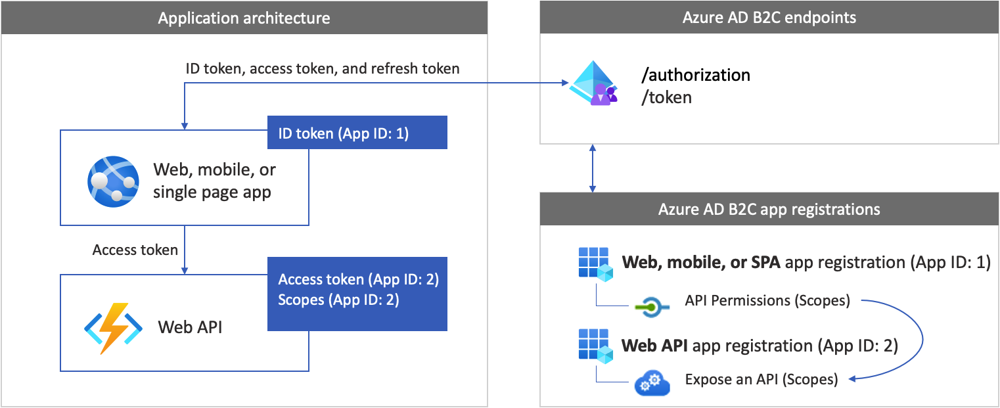

# Configure authentication in a sample Node.js web API by using Azure Active Directory B2C

In this article, you'll learn how to configure a sample Node.js web application to call a sample Node.js web API. The web API needs to be protected by Azure AD B2C itself. In this setup, a web app, such as *App ID: 1* calls a web API, such as *App ID: 2*. Users authenticate into the web app to acquire an access token, which is then used to call a protected web API.

## Overview

Token-based authentication ensures that requests to a web API are accompanied by a valid access token.

The web app completes the following events:

- It authenticates users with Azure AD B2C.

- It acquires an access token with the required permissions (scopes) for the web API endpoint.

- It passes the access token as a bearer token in the authentication header of the HTTP request. It uses the format:

```http
Authorization: Bearer <token>
```

The web API completes the following events: 

- It reads the bearer token from the authorization header in the HTTP request.

- It validates the token.

- It validates the permissions (scopes) in the token.

- It responds to the HTTP request. If the token isn't valid, the web API endpoint responds with a `401 Unauthorized` HTTP error.

### App registration overview

To enable your app to sign in with Azure AD B2C and call a web API, you must register two applications in the Azure AD B2C directory.  

- The **web application** registration enables your app to sign in with Azure AD B2C. During registration, you specify the *redirect URI*. The redirect URI is the endpoint to which users are redirected by Azure AD B2C after they complete authentication. The app registration process generates an *application ID*, also known as the *client ID*, which uniquely identifies your app. You'll also generate a *client secret* for your app. Your app uses the client secret to exchange an authorization code for an access token. 

- The **web API** registration enables your app to call a secure web API. The registration includes the web API *scopes*. The scopes provide a way to manage permissions to protected resources, such as your web API. You grant the web application permissions to the web API scopes. When an access token is requested, your app specifies the desired permissions in the scope parameter of the request.

The application registrations and the application architecture are described in the following diagram:

 

## Prerequisites

- [Node.js](https://nodejs.org).

- [Visual Studio Code](https://code.visualstudio.com/download) or another code editor.


## Step 1: Configure your user flow

[!INCLUDE [active-directory-b2c-app-integration-add-user-flow](../../includes/active-directory-b2c-app-integration-add-user-flow.md)]

## Step 2: Register your web app and API

In this step, you create the web and the web API application registrations, and you specify the scopes of your web API.

### Step 2.1: Register the web API application

[!INCLUDE [active-directory-b2c-app-integration-register-api](../../includes/active-directory-b2c-app-integration-register-api.md)]


### Step 2.2: Configure scopes

[!INCLUDE [active-directory-b2c-app-integration-api-scopes](../../includes/active-directory-b2c-app-integration-api-scopes.md)]


### Step 2.3: Register the web app

To create the SPA registration, do the following:

1. Sign in to the [Azure portal](https://portal.azure.com).
1. If you have access to multiple tenants, select the **Settings** icon in the top menu to switch to your Azure AD B2C tenant from the **Directories + subscriptions** menu.
1. Search for and select **Azure AD B2C**.
1. Select **App registrations**, and then select **New registration**.
1. Enter a **Name** for the application (for example, *App ID: 1*).
1. Under **Supported account types**, select **Accounts in any identity provider or organizational directory (for authenticating users with user flows)**. 
1. Under **Redirect URI**, select **Web**, and then enter `http://localhost:3000/redirect` in the URL text box
1. Under **Permissions**, select the **Grant admin consent to openid and offline access permissions** checkbox.
1. Select **Register**.

### Step 2.4: Create a client secret

1. In the **Azure AD B2C - App registrations** page, select the application you created, for example *App ID: 1*.
1. In the left menu, under **Manage**, select **Certificates & secrets**.
1. Select **New client secret**.
1. Enter a description for the client secret in the **Description** box. For example, *clientsecret1*.
1. Under **Expires**, select a duration for which the secret is valid, and then select **Add**.
1. Record the secret's **Value** for use in your client application code. This secret value is never displayed again after you leave this page. You use this value as the application secret in your application's code.


### Step 2.5: Grant API permissions to the web app

[!INCLUDE [active-directory-b2c-app-integration-grant-permissions](../../includes/active-directory-b2c-app-integration-grant-permissions.md)]

## Step 3: Get the web app sample code

This sample demonstrates how a web application can use Azure AD B2C for user sign-up and sign-in. Then the app acquires an access token and calls a protected web API. 

To get the web app sample code, you can do either of the following: 

* [Download a zip file](https://github.com/Azure-Samples/active-directory-b2c-msal-node-sign-in-sign-out-webapp/archive/main.zip). You'll extract the zip file to get the sample web app. 

* Clone the sample from GitHub by running the following command:

    ```bash
    git clone https://github.com/Azure-Samples/active-directory-b2c-msal-node-sign-in-sign-out-webapp.git
    ```

### Step 3.1: Install app dependencies

1. Open a console window, and change to the directory that contains the Node.js sample app. For example:
    
    ```bash
        cd active-directory-b2c-msal-node-sign-in-sign-out-webapp/call-protected-api
    ```
1. Run the following commands to install app dependencies:

    ```bash
        npm install && npm update
    ```

### Step 3.2: Configure the sample web app

Open your web app in a code editor such as Visual Studio Code. Under the `call-protected-api` folder, open the `.env` file. This file contains information about your Azure AD B2C identity provider. Update the following app settings:

|Key  |Value  |
|---------|---------|
|`APP_CLIENT_ID`|The **Application (client) ID** for the web app you registered in [step 2.3](#step-23-register-the-web-app). |
|`APP_CLIENT_SECRET`|The client secret value for the web app you created in [step 2.4](#step-24-create-a-client-secret) |
|`SIGN_UP_SIGN_IN_POLICY_AUTHORITY`|The **Sign in and sign up** user flow authority for the user flow you created in [step 1](#step-1-configure-your-user-flow) such as `https://<your-tenant-name>.b2clogin.com/<your-tenant-name>.onmicrosoft.com/<sign-in-sign-up-user-flow-name>`. Replace `<your-tenant-name>` with the name of your tenant and `<sign-in-sign-up-user-flow-name>` with the name of your Sign in and Sign up user flow such as `B2C_1_susi`. Learn how to [Get your tenant name]( tenant-management-read-tenant-name.md#get-your-tenant-name). |
|`AUTHORITY_DOMAIN`| The Azure AD B2C authority domain such as `https://<your-tenant-name>.b2clogin.com`. Replace `<your-tenant-name>` with the name of your tenant.|
|`APP_REDIRECT_URI`| The application redirect URI where Azure AD B2C will return authentication responses (tokens). It matches the **Redirect URI** you set while registering your app in Azure portal. This URL need to be publicly accessible. Leave the value as is.|
|`LOGOUT_ENDPOINT`| The Azure AD B2C sign out endpoint such as `https://<your-tenant-name>.b2clogin.com/<your-tenant-name>.onmicrosoft.com/<sign-in-sign-up-user-flow-name>/oauth2/v2.0/logout?post_logout_redirect_uri=http://localhost:3000`. Replace `<your-tenant-name>` with the name of your tenant and `<sign-in-sign-up-user-flow-name>` with the name of your Sign in and Sign up user flow such as `B2C_1_susi`.|

After the update, your final configuration file should look similar to the following sample:

:::code language="text" source="~/active-directory-b2c-msal-node-sign-in-sign-out-webapp/call-protected-api/.env":::

## Step 4: Get the web API sample code

Now that the web API is registered and you've defined its scopes, configure the web API code to work with your Azure AD B2C tenant. 

To get the web API sample code, do one of the following:

* [Download a \*.zip archive](https://github.com/Azure-Samples/active-directory-b2c-javascript-nodejs-webapi/archive/master.zip).

* Clone the sample web API project from GitHub by running the following command:

    ```bash
    git clone https://github.com/Azure-Samples/active-directory-b2c-javascript-nodejs-webapi.git
    ```

* You can also go directly to the [Azure-Samples/active-directory-b2c-javascript-nodejs-webapi](https://github.com/Azure-Samples/active-directory-b2c-javascript-nodejs-webapi) project on GitHub.

### Step 4.1: Update the web API

1. In your code editor, open the `config.json` file.

1. Modify the variable values with the user flow and application registration you created earlier: 

    - For `tenantName`, use the [name of your tenant name]( tenant-management-read-tenant-name.md#get-your-tenant-name) such as `fabrikamb2c`.
    
    - For `clientID`, use the **Application (Client) ID** for the web API you created in [step 2.1](#step-21-register-the-web-api-application).
    
    - For `policyName`, use the name of the **Sing in and sign up** user flow you created in [step 1](#step-1-configure-your-user-flow) such as `B2C_1_susi`.
   
   After the update, your code should look similar to the following sample: 
    
    *config.json*:

    :::code language="json" source="~/active-directory-b2c-javascript-nodejs-webapi/config.json":::

### Step 4.2: Install app dependencies

1. Open a console window, and change to the directory that contains the Node.js web API sample. For example:

    ```console
    cd active-directory-b2c-javascript-nodejs-webapi
    ```

1. Run the following commands:

    ```console
    npm install && npm update
    ```

## Step 5: Run the web app and API

You're now ready to test the web application's scoped access to the web API. Run both the Node.js web API and the sample web application on your local machine. 

1. In your terminal, navigate to the sample web API and run start the Node.js web API server. For example:
`
    ```console
    cd active-directory-b2c-javascript-nodejs-webapi
    node index.js
    ```

    The console window displays the port number of where the application is hosted.

    ```console
    Listening on port 5000...
    ```

1. In another terminal instance, navigate to the sample web app and run start the Node.js web app server. For example:

    ```
        cd active-directory-b2c-msal-node-sign-in-sign-out-webapp/call-protected-api
        node index.js
    ```

    The console window displays the port number of where the application is hosted.

    ```console
    Msal Node Auth Code Sample app listening on port !3000
    ```
1. In your browser, go to `http://localhost:3000`. You should see the page with two buttons, **Sign in to call PROTECTED API** and **Or call the ANONYMOUS API**.

    :::image type="content" source="./media/tutorial-call-api-using-access-token/sign-in-call-api.png" alt-text="Web page for sign in to call protected A P I.":::

1. To call the anonymous API, select the **Or call the ANONYMOUS API**. The API responds with JSON object with `date` key such as:     

    ```json
        {"date":"2022-01-27T14:21:22.681Z"}
    ```
    The anonymous API is an unprotected endpoint in the web API. You don't need an access token to access it. 

1. To call the protected API endpoint, select the **Sign in to call PROTECTED API** button. You're prompted to sign in. 

1. Enter your sign-in credentials, such as email address and password. If you don't have an account, select **Sign up now** to create an account. After you successfully sign in or sign up, you should see the following page with **Call the PROTECTED API** button.


    :::image type="content" source="./media/tutorial-call-api-using-access-token/signed-in-to-call-api.png" alt-text="Web page for signed to call protected A P I.":::

1. To call the protected API, select the **Call the PROTECTED API** button. The API responds with JSON object with a `name` key whose value is your account's surname such as:

    ```json
        {"name": "User 1"} 
    ``` 

## Next steps  

Learn how to [Enable authentication in your own web API by using Azure AD B2C](enable-authentication-in-node-web-app-with-api.md)
