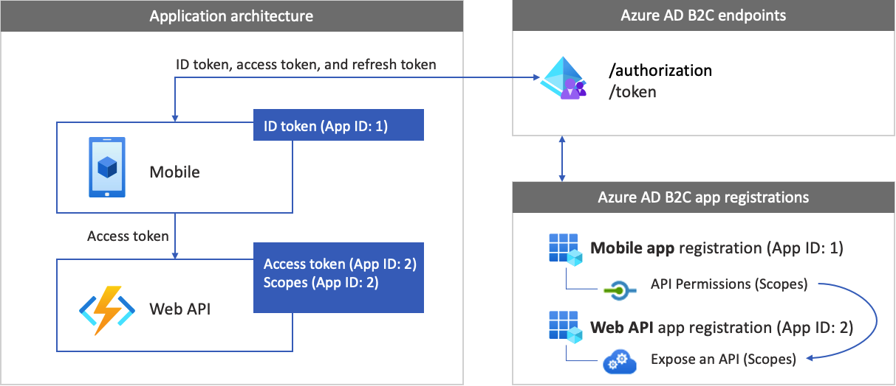
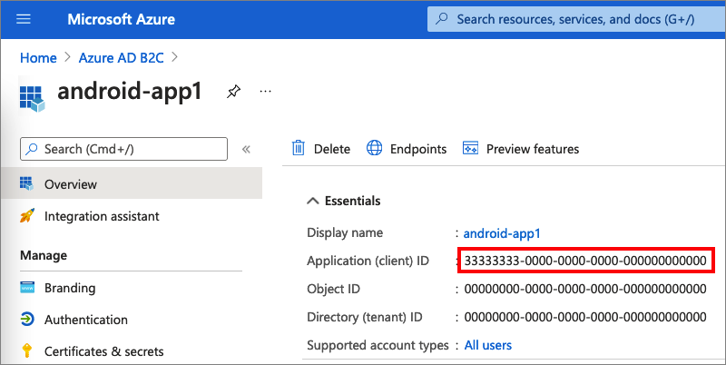
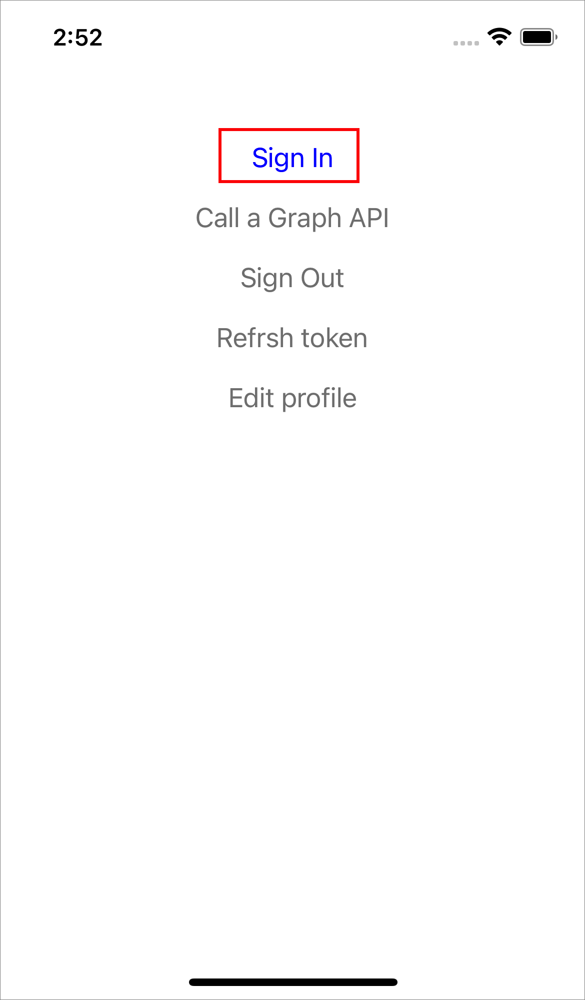
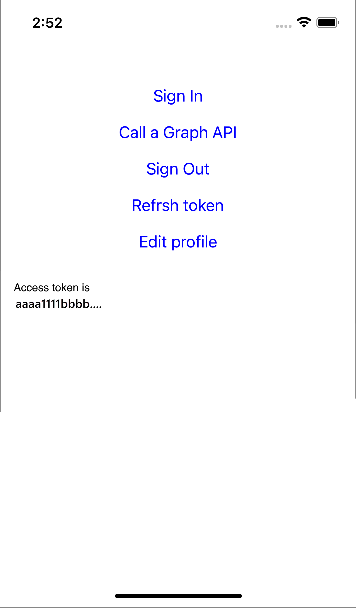

# Configure authentication in a sample iOS Swift application using Azure Active Directory B2C

This article uses a sample [iOS Swift](https://developer.apple.com/swift/) application to illustrate how to add Azure Active Directory B2C (Azure AD B2C) authentication to your mobile apps.

## Overview

OpenID Connect (OIDC) is an authentication protocol built on OAuth 2.0, which you can securely use to sign-in in a user to an application. This mobile app sample uses [MSAL](../active-directory/develop/msal-overview.md) library with OpenId Connect authorization code PKCE flow. The MSAL library is a Microsoft provided library that simplifies adding authentication and authorization support to mobile apps. 

The sign-in flow involves following steps:

1. The user opens the app and selects **sign-in**.
1. The app opens the mobile device's system browser, and starts an authentication request to Azure AD B2C.
1. The user [signs up or signs in](add-sign-up-and-sign-in-policy.md), [resets the password](add-password-reset-policy.md), or signs in with a [social account](add-identity-provider.md).
1. Upon successful sign-in, Azure AD B2C returns an authorization code to the app.
1. The app takes the following actions:
    1. Exchanges the authorization code for an ID token, access token and refresh token.
    1. Reads the ID token claims.
    1. Stores the tokens to an in-memory cache for later use.

### App registration overview

To enable your app to sign in with Azure AD B2C and call a web API, register two applications in the Azure AD B2C directory.  

- The **mobile application** registration enables your app to sign in with Azure AD B2C. During app registration, specify the *Redirect URI*. The redirect URI is the endpoint to which the user is redirected by Azure AD B2C after they authenticate with Azure AD B2C. The app registration process generates an *Application ID*, also known as the *client ID*, that uniquely identifies your mobile app. For example, **App ID: 1**.

- The  **web API** registration enables your app to call a protected web API. The registration exposes the web API permissions (scopes). The app registration process generates an *Application ID* that uniquely identifies your web API.  For example, **App ID: 2**. Grant your mobile app (App ID: 1) permissions to the web API scopes (App ID: 2). 


The following diagrams describe the apps registration and the application architecture.

 

### Call to a web API

[!INCLUDE [active-directory-b2c-app-integration-call-api](../../includes/active-directory-b2c-app-integration-call-api.md)]

### Sign-out

[!INCLUDE [active-directory-b2c-app-integration-sign-out-flow](../../includes/active-directory-b2c-app-integration-sign-out-flow.md)]

## Prerequisites

A computer that's running: 

- [Xcode](https://developer.apple.com/xcode/) 13, or above.
- [CocoaPods](https://cocoapods.org/) dependency manager for Swift and Objective-C Cocoa projects.


## Step 1: Configure your user flow

[!INCLUDE [active-directory-b2c-app-integration-add-user-flow](../../includes/active-directory-b2c-app-integration-add-user-flow.md)]

## Step 2: Register mobile applications

In this step, create the mobile app and the web API application registration, and specify the scopes of your web API.

### 2.1 Register the web API app

[!INCLUDE [active-directory-b2c-app-integration-register-api](../../includes/active-directory-b2c-app-integration-register-api.md)]

### 2.2 Configure web API app scopes

[!INCLUDE [active-directory-b2c-app-integration-api-scopes](../../includes/active-directory-b2c-app-integration-api-scopes.md)]


### 2.3 Register the mobile app

Follow these steps to create the mobile app registration:

1. Select **App registrations**, and then select **New registration**.
1. Enter a **Name** for the application. For example, *iOs-app1*.
1. Under **Supported account types**, select **Accounts in any identity provider or organizational directory (for authenticating users with user flows)**. 
1. Under **Redirect URI**, select **Public client/native (mobile & desktop)**, and then enter: `msauth.com.microsoft.identitysample.MSALiOS://auth`.
1. Select **Register**.
1. After the app registration is completed, select **Overview**.
1. Record the **Application (client) ID** for use in a later step when you configure the mobile application.
      


### 2.4 Grant the mobile app permissions for the web API

[!INCLUDE [active-directory-b2c-app-integration-grant-permissions](../../includes/active-directory-b2c-app-integration-grant-permissions.md)]

## Step 3: Configure the sample web API

This sample acquires an access token with the relevant scopes the mobile app can use for a web API.  To call a web API from code, follow these steps:

1. Use an existing web API, or create a new one. For more information, see [Enable authentication in your own web API using Azure AD B2C](enable-authentication-web-api.md).
1. Change the sample code to [call a web API](enable-authentication-iOs-app.md#call-a-web-api).

After you configure the web API, copy the URI of the web API endpoint. You will use the web API endpoint in the next steps.

> [!TIP]
> If you don't have a web API, you can still run this sample. In this case, the app returns the access token but won't be able to call the web API. 

## Step 4: Get the iOS mobile app sample

1. [Download the zip file](https://github.com/Azure-Samples/active-directory-b2c-ios-swift-native-msal/archive/refs/heads/vNext.zip), or clone the sample web application from [GitHub repo](https://github.com/Azure-Samples/active-directory-b2c-ios-swift-native-msal). 

    ```bash
    git clone https://github.com/Azure-Samples/active-directory-b2c-ios-swift-native-msal/tree/vNext.git
    ``` 

1. Use [CocoaPods](https://cocoapods.org/) to install the MSAL library. In a terminal window, navigate to the project root folder. This folder contains the `podfile`. Run the following command:

    ```bash
    pod install
    ```

1. Open `MSALiOS.xcworkspace` workspace with Xcode.


## Step 5: Configure the sample mobile app

Open the `ViewController.swift` file. The `ViewController` class members contain information about your Azure AD B2C identity provider. The mobile app uses this information to establish a trust relationship with Azure AD B2C, sign the user in and out, acquire tokens, and validate them. 

Update the following members:

|Key  |Value  |
|---------|---------|
|kTenantName| Your Azure AD B2C tenant full [tenant name](tenant-management.md#get-your-tenant-name). For example, `contoso.onmicrosoft.com`.|
|kAuthorityHostName|The first part of your Azure AD B2C [tenant name](tenant-management.md#get-your-tenant-name). For example, `contoso.b2clogin.com`.|
|kClientID|The mobile application ID from [step 2.3](#23-register-the-mobile-app).|
|kRedirectUri|The mobile application redirect URI from [step 2.3](#23-register-the-mobile-app), `msauth.com.microsoft.identitysample.MSALiOS://auth`.|
|kSignupOrSigninPolicy| The sign-up or sign-in user flow or custom policy you created in [step 1](#step-1-configure-your-user-flow).|
|kEditProfilePolicy|The edit profile user flow or custom policy you created in [step 1](#step-1-configure-your-user-flow).|
|kGraphURI| (Optional) the web API endpoint you created in [Step 3](#step-3-configure-the-sample-web-api). For example, `https://contoso.azurewebsites.net/hello`.|
| kScopes | The web API scopes you created in [step 2.4](#24-grant-the-mobile-app-permissions-for-the-web-api).| 


## Step 6: Run and test the mobile app

1. Build and run the project with a [simulator of a connected iOS device](https://developer.apple.com/documentation/xcode/running-your-app-in-the-simulator-or-on-a-device).

1. Select **Sign In**. Then sign up or sign in with your Azure AD B2C local or social account.

    

1. After successful authentication, you'll see your display name in the navigation bar.

     

## Next steps

* Learn how to [Enable authentication in your own iOS application](enable-authentication-ios-app.md)
* [Configure authentication options in an iOS application](enable-authentication-ios-app-options.md)
* [Enable authentication in your own web API](enable-authentication-web-api.md)
