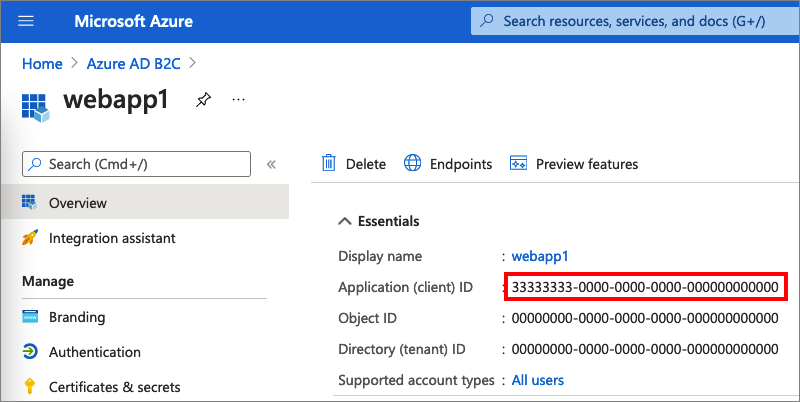
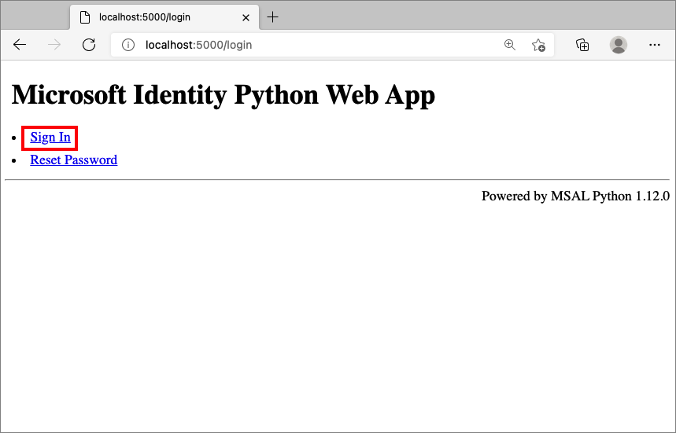
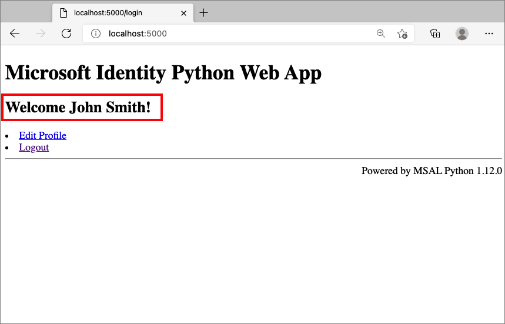
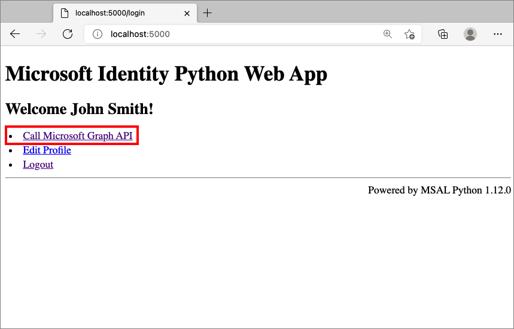

# Configure authentication in a sample Python web app by using Azure AD B2C

This article uses a sample Python web application to illustrate how to add Azure Active Directory B2C (Azure AD B2C) authentication to your web applications.

## Overview

OpenID Connect (OIDC) is an authentication protocol that's built on OAuth 2.0. You can use OIDC to securely sign users in to an application. This web app sample uses the [identity package for Python](https://pypi.org/project/identity/) to simplify adding authentication and authorization support to Python web apps. 

The sign-in flow involves the following steps:

1. Users go to the web app and select **Sign-in**. 
1. The app initiates an authentication request and redirects users to Azure AD B2C.
1. Users [sign up or sign in](add-sign-up-and-sign-in-policy.md), [reset the password](add-password-reset-policy.md), or sign in with a [social account](add-identity-provider.md).
1. After users sign in successfully, Azure AD B2C returns an ID token to the app.
1. The app exchanges the authorization code with an ID token, validates the ID token, reads the claims, and then returns a secure page to users.

## Prerequisites

- An Azure account with an active subscription. [Create an account for free](https://azure.microsoft.com/free/?WT.mc_id=A261C142F).
- If you don't have one already, [create an Azure AD B2C tenant](tutorial-create-tenant.md) that is linked to your Azure subscription.
- [Python 3.7+](https://www.python.org/downloads/)

## Step 1: Configure your user flow

[!INCLUDE [active-directory-b2c-app-integration-add-user-flow](../../includes/active-directory-b2c-app-integration-add-user-flow.md)]

## Step 2: Register a web application

To enable your application to sign in with Azure AD B2C, register your app in the Azure AD B2C directory. Registering your app establishes a trust relationship between the app and Azure AD B2C.  

During app registration, you'll specify the *Redirect URI*. The redirect URI is the endpoint to which users are redirected by Azure AD B2C after they authenticate with Azure AD B2C. The app registration process generates an *Application ID*, also known as the *client ID*, that uniquely identifies your app. After your app is registered, Azure AD B2C uses both the application ID and the redirect URI to create authentication requests. 

### Step 2.1: Register the app

To create the web app registration, follow these steps:

1. Sign in to the [Azure portal](https://portal.azure.com).
1. If you have access to multiple tenants, select the **Settings** icon in the top menu to switch to your Azure AD B2C tenant from the **Directories + subscriptions** menu.
1. In the Azure portal, search for and select **Azure AD B2C**.
1. Select **App registrations**, and then select **New registration**.
1. Under **Name**, enter a name for the application (for example, *webapp1*).
1. Under **Supported account types**, select **Accounts in any identity provider or organizational directory (for authenticating users with user flows)**. 
1. Under **Redirect URI**, select **Web** and then, in the URL box, enter `http://localhost:5000/getAToken`.
1. Under **Permissions**, select the **Grant admin consent to openid and offline access permissions** checkbox.
1. Select **Register**.
1. Select **Overview**.
1. Record the **Application (client) ID** for later use, when you configure the web application.

      


### Step 2.2: Create a web app client secret

[!INCLUDE [active-directory-b2c-app-integration-client-secret](../../includes/active-directory-b2c-app-integration-client-secret.md)]

## Step 3: Get the web app sample

[Download the zip file](https://github.com/Azure-Samples/ms-identity-python-webapp/archive/main.zip), or clone the sample web application from GitHub. 

```bash
git clone https://github.com/Azure-Samples/ms-identity-python-webapp.git
```

Extract the sample file to a folder where the total length of the path is 260 or fewer characters.

## Step 4: Configure the sample web app

In the project's root directory, follow these steps:

1. Rename the *app_config.py* file to *app_config.py.OLD*.
1. Rename the *app_config_b2c.py* file to *app_config.py*. This file contains information about your Azure AD B2C identity provider. 

1. Create an `.env` file in the root folder of the project using `.env.sample.b2c` as a guide.

    ```shell
    FLASK_DEBUG=True
    TENANT_NAME=<tenant name>
    CLIENT_ID=<client id>
    CLIENT_SECRET=<client secret>
    SIGNUPSIGNIN_USER_FLOW=B2C_1_profile_editing
    EDITPROFILE_USER_FLOW=B2C_1_reset_password
    RESETPASSWORD_USER_FLOW=B2C_1_signupsignin1
    ```

    |Key  |Value  |
    |---------|---------|
    |`TENANT_NAME`| The first part of your Azure AD B2C [tenant name](tenant-management-read-tenant-name.md#get-your-tenant-name) (for example, `contoso`). |
    |`CLIENT_ID`| The web API application ID from [step 2.1](#step-21-register-the-app).|
    |`CLIENT_SECRET`| The client secret value you created in [step 2.2](#step-22-create-a-web-app-client-secret). |
    |`*_USER_FLOW`|The user flows you created in [step 1](#step-1-configure-your-user-flow).|
    | | |

    The environment variables are referenced in *app_config.py*, and are kept in a separate *.env* file to keep them out of source control. The provided *.gitignore* file prevents the *.env* file from being checked in.

## Step 5: Run the sample web app

1. In your console or terminal, switch to the directory that contains the sample. For example:

    ```console
    cd ms-identity-python-webapp
    ```
1. Install the required packages from PyPi and run the web app on your local machine by running the following commands:

    # [Linux](#tab/linux)    

    ```bash
    python -m pip install -r requirements.txt
    python -m flask run --host localhost --port 5000
    ```
    
    # [macOS](#tab/macos)
    
    ```bash
    python -m pip install -r requirements.txt
    python -m flask run --host localhost --port 5000
    ```
    
    # [Windows](#tab/windows)
    
    ```bash
    py -m pip install -r requirements.txt
    py -m flask run --host localhost --port 5000
    ```
    
    ---

    The console window displays the port number of the locally running application:

    ```console
     * Debug mode: on
       WARNING: This is a development server. Do not use it in a production deployment.
       Use a production WSGI server instead.
     * Running on `http://localhost:5000/` (Press CTRL+C to quit)
    ```

 
1. To view the web application running on your local machine, go to `http://localhost:5000`. 

1. Select **Sign In**.

    


1. Complete the sign-up or sign-in process.

1. After successful authentication, you'll see your display name, as shown here: 

    


## Step 6: Call to a web API

To enable your app to sign in with Azure AD B2C and call a web API, you must register two applications in the Azure AD B2C directory.  

- The **web application** (Python) registration you already created in [Step 2](#step-2-register-a-web-application). This app registration enables your app to sign in with Azure AD B2C.  The app registration process generates an *Application ID*, also known as the *client ID*, that uniquely identifies your app. For example, **App ID: 1**.

- The **web API** registration enables your app to call a protected web API. The registration exposes the web API permissions (scopes). The app registration process generates an *Application ID* that uniquely identifies your web API (for example, *App ID: 2*). Grant your app (App ID: 1) permissions to the web API scopes (App ID: 2).  

The app registrations and the application architecture are described in the following diagrams:

 

[!INCLUDE [active-directory-b2c-app-integration-call-api](../../includes/active-directory-b2c-app-integration-call-api.md)]

### Step 6.1: Register the web API app

[!INCLUDE [active-directory-b2c-app-integration-register-api](../../includes/active-directory-b2c-app-integration-register-api.md)]

### Step 6.2: Configure scopes

[!INCLUDE [active-directory-b2c-app-integration-api-scopes](../../includes/active-directory-b2c-app-integration-api-scopes.md)]

### Step 6.3: Grant the web app permissions

[!INCLUDE [active-directory-b2c-app-integration-grant-permissions](../../includes/active-directory-b2c-app-integration-grant-permissions.md)]

### Step 6.4: Configure your web API

This sample acquires an access token with the relevant scopes, which the web app can use for a web API. This sample itself does *not* act as a web API. Instead, you must use an existing web API or create a new one. For a tutorial on creating a web API in your B2C tenant, see [Enable authentication in your own web API by using Azure AD B2C](enable-authentication-web-api.md).

### Step 6.5: Configure the sample app with the web API

Open the *app_config.py* file. This file contains information about your Azure AD B2C identity provider. Update the following properties of the app settings: 

|Key  |Value  |
|---------|---------|
|`ENDPOINT`| The URI of your web API (for example, `https://localhost:6000/hello`).|
|`SCOPE`| The web API [scopes](#step-62-configure-scopes) that you created (for example, `["https://contoso.onmicrosoft.com/tasks-api/tasks.read", https://contoso.onmicrosoft.com/tasks-api/tasks.write"]`).|
| | |

### Step 6.6: Run the sample app

1. In your console or terminal, switch to the directory that contains the sample. 
1. If the app isn't still running, restart it using the command from Step 5.
1. Select **Call a downstream API**.

    

## Step 7: Deploy your application 

In a production application, the app registration redirect URI is ordinarily a publicly accessible endpoint where your app is running, such as `https://contoso.com/getAToken`. 

You can add and modify redirect URIs in your registered applications at any time. The following restrictions apply to redirect URIs:

* The redirect URL must begin with the scheme `https`.
* The redirect URL is case-sensitive. Its case must match the case of the URL path of your running application. 

## Next steps
* Learn how to [Configure authentication options in a Python web app by using Azure AD B2C](enable-authentication-python-web-app-options.md).
