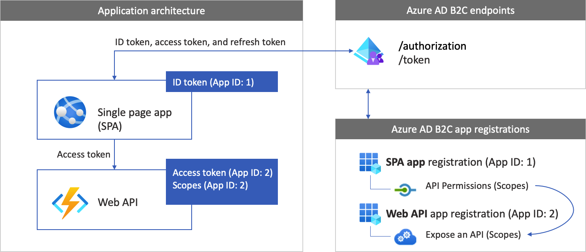
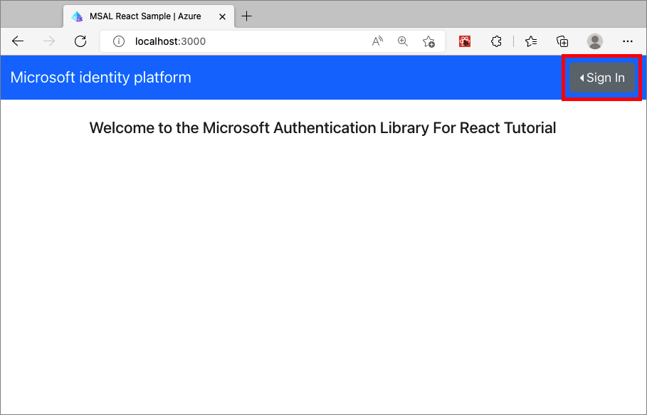

# Configure authentication in a sample React single-page application by using Azure Active Directory B2C

This article uses a sample React single-page application (SPA) to illustrate how to add Azure Active Directory B2C (Azure AD B2C) authentication to your React apps. The React SPA also calls an API that's protected by Azure AD B2C itself. 

## Overview

OpenID Connect (OIDC) is an authentication protocol built on OAuth 2.0 that you can use to securely sign in a user to an application. This React sample uses [MSAL React](https://www.npmjs.com/package/@azure/msal-react) and the [MSAL Browser](https://www.npmjs.com/package/@azure/msal-browser) Node packages. MSAL is a Microsoft-provided library that simplifies adding authentication and authorization support to React SPAs.

### Sign in flow

The sign-in flow involves the following steps:

1. The user opens the app and selects **Sign in**. 
1. The app starts an authentication request to Azure AD B2C.
1. The user [signs up or signs in](add-sign-up-and-sign-in-policy.md) and [resets the password](add-password-reset-policy.md), or signs in with a [social account](add-identity-provider.md).
1. Upon successful sign-in, Azure AD B2C returns an authorization code to the app. The app takes the following actions:
   1. Exchanges the authorization code for an ID token, access token, and refresh token.
   1. Reads the ID token claims.
   1. Stores the access token and refresh token in an in-memory cache for later use. The access token allows the user to call protected resources, such as a web API. The refresh token is used to acquire a new access token.

### App registration

To enable your app to sign in with Azure AD B2C and call a web API, you must register two applications in the Azure AD B2C directory:  

- The *single-page application* (React) registration enables your app to sign in with Azure AD B2C. During app registration, you specify the *redirect URI*. The redirect URI is the endpoint to which the user is redirected after they authenticate with Azure AD B2C. The app registration process generates an *application ID*, also known as the *client ID*, that uniquely identifies your app. This article uses the example **App ID: 1**.

- The *web API* registration enables your app to call a protected web API. The registration exposes the web API permissions (scopes). The app registration process generates an application ID that uniquely identifies your web API. This article uses the example **App ID: 2**. Grant your app (**App ID: 1**) permissions to the web API scopes (**App ID: 2**).  

The following diagram describes the app registrations and the app architecture.

 

### Call to a web API

[!INCLUDE [active-directory-b2c-app-integration-call-api](../../includes/active-directory-b2c-app-integration-call-api.md)]

### Sign out flow

[!INCLUDE [active-directory-b2c-app-integration-sign-out-flow](../../includes/active-directory-b2c-app-integration-sign-out-flow.md)]

## Prerequisites

Before you follow the procedures in this article, make sure that your computer is running:

* [Visual Studio Code](https://code.visualstudio.com/) or another code editor.
* [Node.js runtime](https://nodejs.org/en/download/) and [npm](https://docs.npmjs.com/downloading-and-installing-node-js-and-npm/). To test that you have Node.js and npm correctly installed on your machine, you can type `node --version` and `npm --version` in a terminal or command prompt.

## Step 1: Configure your user flow

[!INCLUDE [active-directory-b2c-app-integration-add-user-flow](../../includes/active-directory-b2c-app-integration-add-user-flow.md)]

## Step 2: Register your React SPA and API

In this step, you create the registrations for the React SPA and the web API app. You also specify the scopes of your web API.

### 2.1 Register the web API application

[!INCLUDE [active-directory-b2c-app-integration-register-api](../../includes/active-directory-b2c-app-integration-register-api.md)]

### 2.2 Configure scopes

[!INCLUDE [active-directory-b2c-app-integration-api-scopes](../../includes/active-directory-b2c-app-integration-api-scopes.md)]

### 2.3 Register the React app

Follow these steps to create the React app registration:

1. Sign in to the [Azure portal](https://portal.azure.com).
1. If you have access to multiple tenants, select the **Settings** icon in the top menu to switch to your Azure AD B2C tenant from the **Directories + subscriptions** menu.
1. In the Azure portal, search for and select **Azure AD B2C**.
1. Select **App registrations**, and then select **New registration**.
1. For **Name**, enter a name for the application. For example, enter **MyApp**.
1. Under **Supported account types**, select **Accounts in any identity provider or organizational directory (for authenticating users with user flows)**. 
1. Under **Redirect URI**, select **Single-page application (SPA)**, and then enter `http://localhost:3000` in the URL box.
1. Under **Permissions**, select the **Grant admin consent to openid and offline access permissions** checkbox.
1. Select **Register**.
1. Record the **Application (client) ID** value for use in a later step when you configure the web application.
    
      

### 2.5 Grant permissions

[!INCLUDE [active-directory-b2c-app-integration-grant-permissions](../../includes/active-directory-b2c-app-integration-grant-permissions.md)]

## Step 3: Get the React sample code

This sample demonstrates how a React single-page application can use Azure AD B2C for user sign-up and sign-in. Then the app acquires an access token and calls a protected web API.

  [Download a .zip file](https://github.com/Azure-Samples/ms-identity-javascript-react-tutorial/archive/refs/heads/main.zip) of the sample, or clone the sample from the [GitHub repository](https://github.com/Azure-Samples/ms-identity-javascript-react-tutorial) by using the following command:

  ```
  git clone https://github.com/Azure-Samples/ms-identity-javascript-react-tutorial
  ```

Open the *3-Authorization-II/2-call-api-b2c/SPA* folder with Visual Studio Code. 

### 3.1 Configure the React sample

Now that you've obtained the SPA sample, update the code with your Azure AD B2C and web API values. In the *3-Authorization-II/2-call-api-b2c/SPA* folder, under the *src* folder, open the *authConfig.js* file. Update the keys with the corresponding values:  


|Section  |Key  |Value  |
|---------|---------|---------|
| b2cPolicies | names |The user flows or custom policies that you created in [step 1](#step-1-configure-your-user-flow). |
| b2cPolicies | authorities | Replace `your-tenant-name` with your Azure AD B2C [tenant name]( tenant-management-read-tenant-name.md#get-your-tenant-name). For example, use `contoso.onmicrosoft.com`. Then, replace the policy name with the user flow or custom policy that you created in [step 1](#step-1-configure-your-user-flow). For example: `https://<your-tenant-name>.b2clogin.com/<your-tenant-name>.onmicrosoft.com/<your-sign-in-sign-up-policy>`. |
| b2cPolicies | authorityDomain|Your Azure AD B2C [tenant name]( tenant-management-read-tenant-name.md#get-your-tenant-name). For example: `contoso.onmicrosoft.com`. |
| Configuration | clientId | The React application ID from [step 2.3](#23-register-the-react-app). |
| protectedResources| endpoint| The URL of the web API: `http://localhost:5000/hello`. |
| protectedResources| scopes| The web API scopes that you created in [step 2.2](#22-configure-scopes). For example: `b2cScopes: ["https://<your-tenant-name>.onmicrosoft.com/tasks-api/tasks.read"]`. |

Your resulting *src/authConfig.js* code should look similar to the following sample:

```typescript
export const b2cPolicies = {
     names: {
         signUpSignIn: "b2c_1_susi_reset_v2",
         editProfile: "b2c_1_edit_profile_v2"
     },
     authorities: {
         signUpSignIn: {
             authority: "https://your-tenant-name.b2clogin.com/your-tenant-name.onmicrosoft.com/b2c_1_susi_reset_v2",
         },
         editProfile: {
             authority: "https://your-tenant-name.b2clogin.com/your-tenant-name.onmicrosoft.com/b2c_1_edit_profile_v2"
         }
     },
     authorityDomain: "your-tenant-name.b2clogin.com"
 };
 
 
export const msalConfig: Configuration = {
     auth: {
         clientId: '<your-MyApp-application-ID>',
         authority: b2cPolicies.authorities.signUpSignIn.authority,
         knownAuthorities: [b2cPolicies.authorityDomain],
         redirectUri: '/', 
     },
    // More configuration here
 }

export const protectedResources = {
  todoListApi: {
    endpoint: "http://localhost:5000/hello",
    scopes: ["https://your-tenant-name.onmicrosoft.com/tasks-api/tasks.read"],
  },
}
```

## Step 4: Configure the web API

Now that the web API is registered and you've defined its scopes, configure the web API code to work with your Azure AD B2C tenant. Open the *3-Authorization-II/2-call-api-b2c/API* folder with Visual Studio Code. 


In the sample folder, open the *authConfig.js* file. This file contains information about your Azure AD B2C identity provider. The web API app uses this information to validate the access token that the web app passes as a bearer token. Update the following properties of the app settings:

|Section  |Key  |Value  |
|---------|---------|---------|
|credentials|tenantName| Your Azure AD B2C [domain/tenant name]( tenant-management-read-tenant-name.md#get-your-tenant-name). For example: `contoso.ommicrosoft.com`.|
|credentials|clientID| The web API application ID from step [2.1](#21-register-the-web-api-application). In the [earlier diagram](#app-registration), it's the application with **App ID: 2**.|
|policies|policyName|The user flow or custom policy that you created in [step 1](#step-1-configure-your-user-flow). If your application uses multiple user flows or custom policies, specify only one. For example, use the sign-up or sign-in user flow.|
| protectedRoutes| scopes | The scopes of your web API application registration from [step 2.5](#25-grant-permissions). |

Your final configuration file should look like the following JSON:

```json
{
    "credentials": {
        "tenantName": "<your-tenant-name>.ommicrosoft.com",
        "clientID": "<your-webapi-application-ID>",
    },
    "policies": {
        "policyName": "b2c_1_susi"
    },
    "protectedRoutes": {
        "hello": {
            "endpoint": "/hello",
            "scopes": ["demo.read"]
        }
    }
    // More settings here
} 
```

## Step 5: Run the React SPA and web API

You're now ready to test the React scoped access to the API. In this step, run both the web API and the sample React application on your local machine. Then, sign in to the React application, and select the **HelloAPI** button to start a request to the protected API.

### Run the web API

1. Open a console window and change to the directory that contains the web API sample. For example:

    ```console
    cd 3-Authorization-II/2-call-api-b2c/API
    ```

1. Run the following commands:

    ```console
    npm install && npm update
    npm start
    ```

    The console window displays the port number where the application is hosted:

    ```console
    Listening on port 5000...
    ```

### Run the React application

1. Open another console window and change to the directory that contains the React sample. For example:

    ```console
    cd 3-Authorization-II/2-call-api-b2c/SPA
    ```

1. Run the following commands:

    ```console
    npm install && npm update
    npm start
    ```

    The console window displays the port number of where the application is hosted:

    ```console
    Listening on port 3000...
    ```

1. In your browser, go to `http://localhost:3000` to view the application.
1. Select **Sign In**.  

    

1. Choose **Sign in using Popup**, or **Sign in using Redirect**. 
1. Complete the sign-up or sign in process. Upon successful sign-in, you should see a page with three buttons, **HelloAPI**, **Edit Profile** and **Sign Out**. 
    
1. From the menu, select **HelloAPI** button. 
1. Check out the result of the REST API call. The following screenshot shows the React sample REST API return value:

    :::image type="content" source="./media/configure-authentication-sample-react-spa-app/sample-app-call-api-result.png" alt-text="Screenshot of the React sample app with the user profile, and the result of calling the web A P I.":::


## Deploy your application 

In a production application, the redirect URI for the app registration is typically a publicly accessible endpoint where your app is running, like `https://contoso.com`. 

You can add and modify redirect URIs in your registered applications at any time. The following restrictions apply to redirect URIs:

* The reply URL must begin with the scheme `https`.
* The reply URL is case-sensitive. Its case must match the case of the URL path of your running application. 

## Next steps

* [Learn more about the code sample](https://github.com/Azure-Samples/ms-identity-javascript-react-tutorial)
* [Enable authentication in your own React application](enable-authentication-React-spa-app.md)
* [Configure authentication options in your React application](enable-authentication-React-spa-app-options.md)
* [Enable authentication in your own web API](enable-authentication-web-api.md)
