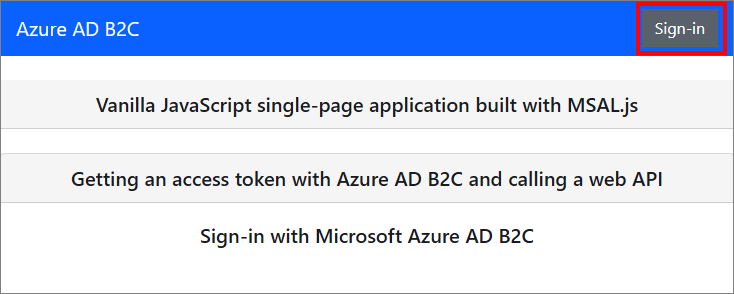
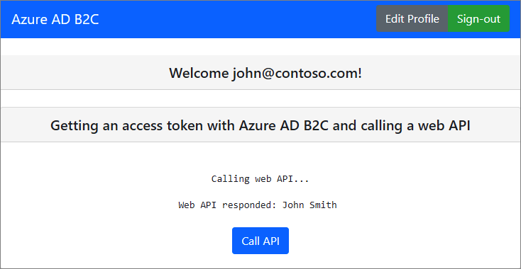

# Configure authentication in a sample single-page application by using Azure AD B2C

This article uses a sample JavaScript single-page application (SPA) to illustrate how to add Azure Active Directory B2C (Azure AD B2C) authentication to your SPAs.

## Overview

OpenID Connect (OIDC) is an authentication protocol that's built on OAuth 2.0. You can use it to securely sign a user into an application. This SPA sample uses [MSAL.js](https://github.com/AzureAD/microsoft-authentication-library-for-js/tree/dev/lib/msal-browser) and the OIDC PKCE flow. MSAL.js is a Microsoft provided library that simplifies adding authentication and authorization support to SPAs.

### Sign in flow

The sign-in flow involves the following steps:

1. Users go to the web app and select **Sign-in**.
1. The app initiates an authentication request and redirects users to Azure AD B2C.
1. Users [sign up or sign in](add-sign-up-and-sign-in-policy.md) and [reset the password](add-password-reset-policy.md). Alternatively, they can sign in with a [social account](add-identity-provider.md).
1. After users sign in, Azure AD B2C returns an authorization code to the app.
1. The single-page application validates the ID token, reads the claims, and in turn allows users to call protected resources and APIs.

### App registration overview

To enable your app to sign in with Azure AD B2C and call a web API, you register two applications in the Azure AD B2C directory.  

- The **web application** registration enables your app to sign in with Azure AD B2C. During the registration, you specify the *redirect URI*. The redirect URI is the endpoint to which users are redirected by Azure AD B2C after their authentication with Azure AD B2C is completed. The app registration process generates an *application ID*, also known as the *client ID*, which uniquely identifies your app.

- The  **web API** registration enables your app to call a secure web API. The registration includes the web API *scopes*. The scopes provide a way to manage permissions to protected resources, such as your web API. You grant the web application permissions to the web API scopes. When an access token is requested, your app specifies the desired permissions in the scope parameter of the request.  

The app architecture and registrations are illustrated in the following diagram:

 

### Call to a web API

[!INCLUDE [active-directory-b2c-app-integration-call-api](../../includes/active-directory-b2c-app-integration-call-api.md)]

### Sign out flow

[!INCLUDE [active-directory-b2c-app-integration-sign-out-flow](../../includes/active-directory-b2c-app-integration-sign-out-flow.md)]

## Prerequisites

A computer that's running:

* [Visual Studio Code](https://code.visualstudio.com/), or another code editor.
* [Node.js runtime](https://nodejs.org/en/download/)

## Step 1: Configure your user flow

[!INCLUDE [active-directory-b2c-app-integration-add-user-flow](../../includes/active-directory-b2c-app-integration-add-user-flow.md)]

## Step 2: Register your SPA and API

In this step, you create the SPA and the web API application registrations, and you specify the scopes of your web API.

### Step 2.1: Register the web API application

[!INCLUDE [active-directory-b2c-app-integration-register-api](../../includes/active-directory-b2c-app-integration-register-api.md)]

### Step 2.2: Configure scopes

[!INCLUDE [active-directory-b2c-app-integration-api-scopes](../../includes/active-directory-b2c-app-integration-api-scopes.md)]

### Step 2.3: Register the SPA

To create the SPA registration, use the following steps:

1. Sign in to the [Azure portal](https://portal.azure.com).
1. If you have access to multiple tenants, select the **Settings** icon in the top menu to switch to your Azure AD B2C tenant from the **Directories + subscriptions** menu.
1. Search for and select **Azure AD B2C**.
1. Select **App registrations**, and then select **New registration**.
1. Enter a **Name** for the application (for example, *MyApp*).
1. Under **Supported account types**, select **Accounts in any identity provider or organizational directory (for authenticating users with user flows)**. 
1. Under **Redirect URI**, select **Single-page application (SPA)** and then, in the URL box, enter `http://localhost:6420`.
1. Under **Permissions**, select the **Grant admin consent to openid and offline access permissions** checkbox.
1. Select **Register**.


Record the **Application (client) ID** to use later, when you configure the web application.


### Step 2.4: Enable the implicit grant flow

In your own environment, if your SPA app uses MSAL.js 1.3 or earlier and the implicit grant flow or you configure [https://jwt.ms/](https://jwt.ms/) app for testing a user flow or custom policy, you need to enable the implicit grant flow in the app registration:

1. In the left menu, under **Manage**, select **Authentication**.

1. Under **Implicit grant and hybrid flows**, select both the **Access tokens (used for implicit flows)** and **ID tokens (used for implicit and hybrid flows)** check boxes.

1. Select **Save**.

If your app uses MSAL.js 2.0 or later, don't enable implicit flow grant as MSAL.js 2.0+ supports the authorization code flow with PKCE. The SPA app in this article uses PKCE flow, and so you don't need to enable implicit grant flow.   

### Step 2.5: Grant permissions

[!INCLUDE [active-directory-b2c-app-integration-grant-permissions](../../includes/active-directory-b2c-app-integration-grant-permissions.md)]

## Step 3: Get the SPA sample code

This sample demonstrates how a single-page application can use Azure AD B2C for user sign-up and sign in. Then the app acquires an access token and calls a protected web API. 

To get the SPA sample code, you can do either of the following: 

* [Download a zip file](https://github.com/Azure-Samples/ms-identity-b2c-javascript-spa/archive/main.zip). 
* Clone the sample from GitHub by running the following command:

    ```bash
    git clone https://github.com/Azure-Samples/ms-identity-b2c-javascript-spa.git
    ```

### Step 3.1: Update the SPA sample

Now that you've obtained the SPA sample, update the code with your Azure AD B2C and web API values. In the sample folder, under the `App` folder, open the JavaScript files that are listed in the following table, and then update them with their corresponding values.  


|File  |Key  |Value  |
|---------|---------|---------|
|authConfig.js|clientId| The SPA ID from [step 2.3](#step-23-register-the-spa).|
|policies.js| names| The user flows, or custom policy you created in [step 1](#step-1-configure-your-user-flow).|
|policies.js|authorities|Your Azure AD B2C user flows or custom policies authorities such as `https://<your-tenant-name>.b2clogin.com/<your-tenant-name>.onmicrosoft.com/<your-sign-in-sign-up-policy>`. Replace `your-sign-in-sign-up-policy` with user flow or custom policy you created in [step 1](#sign-in-flow)|
|policies.js|authorityDomain|Your Azure AD B2C authority domain such as `<your-tenant-name>.b2clogin.com`.|
|apiConfig.js|b2cScopes|The web API scopes you created in [step 2.2](#step-22-configure-scopes) (for example, `b2cScopes: ["https://<your-tenant-name>.onmicrosoft.com/tasks-api/tasks.read"]`).|
|apiConfig.js|webApi|The URL of the web API, `http://localhost:5000/hello`.|
| | | |

Your resulting code should look similar to following sample:

*authConfig.js*:

```javascript
const msalConfig = {
    auth: {
      clientId: "<your-MyApp-application-ID>", // This is the ONLY mandatory field; everything else is optional.
      authority: b2cPolicies.authorities.signUpSignIn.authority, // Choose sign-up/sign-in user-flow as your default.
      knownAuthorities: [b2cPolicies.authorityDomain], // You must identify your tenant's domain as a known authority.
      redirectUri: "http://localhost:6420", // You must register this URI on Azure Portal/App Registration. Defaults to "window.location.href".
    },
    cache: {
      cacheLocation: "sessionStorage",  
      storeAuthStateInCookie: false, 
    },
    system: {
      loggerOptions: {
        loggerCallback: (level, message, containsPii) => {
          if (containsPii) {
            return;
          }
          switch (level) {
            case msal.LogLevel.Error:
              console.error(message);
              return;
            case msal.LogLevel.Info:
              console.info(message);
              return;
            case msal.LogLevel.Verbose:
              console.debug(message);
              return;
            case msal.LogLevel.Warning:
              console.warn(message);
              return;
          }
        }
      }
    }
  };
};

const loginRequest = {
  scopes: ["openid", ...apiConfig.b2cScopes],
};

const tokenRequest = {
  scopes: [...apiConfig.b2cScopes],  // e.g. ["https://fabrikamb2c.onmicrosoft.com/helloapi/demo.read"]
  forceRefresh: false // Set this to "true" to skip a cached token and go to the server to get a new token
};
```

*policies.js*:

```javascript
const b2cPolicies = {
    names: {
        signUpSignIn: "b2c_1_susi",
        forgotPassword: "b2c_1_reset",
        editProfile: "b2c_1_edit_profile"
    },
    authorities: {
        signUpSignIn: {
            authority: "https://your-tenant-name.b2clogin.com/your-tenant-name.onmicrosoft.com/b2c_1_susi",
        },
        forgotPassword: {
            authority: "https://your-tenant-name.b2clogin.com/your-tenant-name.onmicrosoft.com/b2c_1_reset",
        },
        editProfile: {
            authority: "https://your-tenant-name.b2clogin.com/your-tenant-name.onmicrosoft.com/b2c_1_edit_profile"
        }
    },
    authorityDomain: "your-tenant-name.b2clogin.com"
}
```

*apiConfig.js*:

```javascript
const apiConfig = {
  b2cScopes: ["https://your-tenant-name.onmicrosoft.com/tasks-api/tasks.read"],
  webApi: "http://localhost:5000/hello"
};
```

## Step 4: Get the web API sample code

Now that the web API is registered and you've defined its scopes, configure the web API code to work with your Azure AD B2C tenant. 

To get the web API sample code, do one of the following:

* [Download a \*.zip archive](https://github.com/Azure-Samples/active-directory-b2c-javascript-nodejs-webapi/archive/master.zip).

* Clone the sample web API project from GitHub by running the following command:

    ```bash
    git clone https://github.com/Azure-Samples/active-directory-b2c-javascript-nodejs-webapi.git
    ```

* You can also go directly to the [Azure-Samples/active-directory-b2c-javascript-nodejs-webapi](https://github.com/Azure-Samples/active-directory-b2c-javascript-nodejs-webapi) project on GitHub.

### Step 4.1: Update the web API

1. Open the *config.json* file in your code editor.
1. Modify the variable values with the application registration you created earlier. And update the `policyName` with the user flow you created as part of the prerequisites (for example, *b2c_1_susi*).
    
    ```json
    "credentials": {
        "tenantName": "<your-tenant-name>",
        "clientID": "<your-webapi-application-ID>"
    },
    "policies": {
        "policyName": "b2c_1_susi"
    },
    "resource": {
        "scope": ["tasks.read"] 
    },
    ```

### Step 4.2: Enable CORS

To allow your single-page application to call the Node.js web API, you need to enable [cross-origin resource sharing (CORS)](https://expressjs.com/en/resources/middleware/cors.html) in the web API. In a production application, be careful about which domain is making the request. In this example, allow requests from any domain.

To enable CORS, use the following middleware. In the Node.js web API code sample you downloaded, it has already been added to the *index.js* file.

```javascript
app.use((req, res, next) => {
    res.header("Access-Control-Allow-Origin", "*");
    res.header("Access-Control-Allow-Headers", "Authorization, Origin, X-Requested-With, Content-Type, Accept");
    next();
});
```

## Step 5: Run the SPA and web API

You're now ready to test the single-page application's scoped access to the API. Run both the Node.js web API and the sample JavaScript single-page application on your local machine. Then, sign in to the single-page application and select the **Call API** button to initiate a request to the protected API.

### Run the Node.js web API

1. Open a console window, and change to the directory that contains the Node.js web API sample. For example:

    ```console
    cd active-directory-b2c-javascript-nodejs-webapi
    ```

1. Run the following commands:

    ```console
    npm install && npm update
    node index.js
    ```

    The console window displays the port number where the application is hosted.

    ```console
    Listening on port 5000...
    ```

### Run the single-page app

1. Open another console window, and change to the directory that contains the JavaScript SPA sample. For example:

    ```console
    cd ms-identity-b2c-javascript-spa
    ```

1. Run the following commands:

    ```console
    npm install && npm update
    npm start
    ```

    The console window displays the port number of where the application is hosted.

    ```console
    Listening on port 6420...
    ```

1. To view the application, go to `http://localhost:6420` in your browser.

    

1. Complete the sign-up or sign in process. After you've logged in successfully, you should see the "User \<your username> logged in" message.
1. Select the **Call API** button. The SPA sends the access token in a request to the protected web API, which returns the display name of the logged-in user:

    

## Deploy your application 

In a production application, the app registration redirect URI is ordinarily a publicly accessible endpoint where your app is running, such as `https://contoso.com/signin-oidc`. 

You can add and modify redirect URIs in your registered applications at any time. The following restrictions apply to redirect URIs:

* The reply URL must begin with the scheme `https`.
* The reply URL is case-sensitive. Its case must match the case of the URL path of your running application. 

## Next steps

For more information about the concepts discussed in this article:
* [Learn more about the code sample](https://github.com/Azure-Samples/ms-identity-b2c-javascript-spa).
* [Enable authentication in your own SPA](enable-authentication-spa-app.md).
* [Configure authentication options in your SPA](enable-authentication-spa-app-options.md).
* [Enable authentication in your own web API](enable-authentication-web-api.md).
