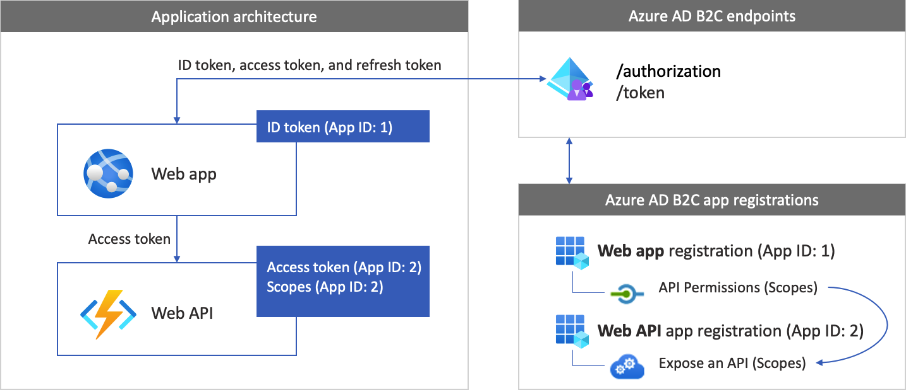
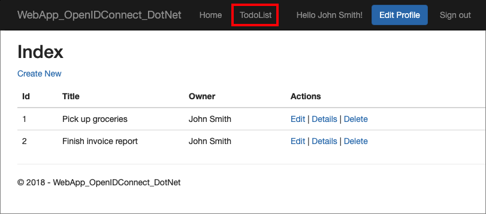

# Configure authentication in a sample web app that calls a web API by using Azure AD B2C

This article uses a sample ASP.NET web application that calls a web API to illustrate how to add Azure Active Directory B2C (Azure AD B2C) authentication to your web applications.

> [!IMPORTANT]
> The sample ASP.NET web app that's referenced in this article is used to call a web API with a bearer token. For a web app that doesn't call a web API, see [Configure authentication in a sample web application by using Azure AD B2C](configure-authentication-sample-web-app.md).  

## Overview

OpenID Connect (OIDC) is an authentication protocol that's built on OAuth 2.0. You can use OIDC to securely sign a user in to an application. This web app sample uses [Microsoft Identity Web](https://www.nuget.org/packages/Microsoft.Identity.Web). Microsoft Identity Web is a set of ASP.NET Core libraries that simplify adding authentication and authorization support to web apps that can call a secure web API. 

The sign-in flow involves the following steps:

1. Users go to the web app and select **Sign-in**.
1. The app initiates an authentication request and redirects users to Azure AD B2C.
1. Users [sign up or sign in](add-sign-up-and-sign-in-policy.md) and [reset the password](add-password-reset-policy.md). Alternatively, they can sign in with a [social account](add-identity-provider.md).
1. After users sign in, Azure AD B2C returns an authorization code to the app.
1. The app then does the following:
 
   a. It exchanges the authorization code to an ID token, access token, and refresh token.  
   b. It reads the ID token claims, and persists an application authorization cookie.  
   c. It stores the refresh token in an in-memory cache for later use.

### App registration overview

To enable your app to sign in with Azure AD B2C and call a web API, you register two applications in the Azure AD B2C directory.  

- The *web application* registration enables your app to sign in with Azure AD B2C. During the registration, you specify the *redirect URI*. The redirect URI is the endpoint to which users are redirected by Azure AD B2C after their authentication with Azure AD B2C is completed. The app registration process generates an *application ID*, also known as the *client ID*, which uniquely identifies your app. You also create a *client secret*, which your app uses to securely acquire the tokens.

- The  *web API* registration enables your app to call a secure web API. The registration includes the web API *scopes*. The scopes provide a way to manage permissions to protected resources, such as your web API. You grant the web application permissions to the web API scopes. When an access token is requested, your app specifies the desired permissions in the scope parameter of the request.  

The app architecture and registrations are illustrated in the following diagram:

 

### Call to a web API

[!INCLUDE [active-directory-b2c-app-integration-call-api](../../includes/active-directory-b2c-app-integration-call-api.md)]

### Sign-out

[!INCLUDE [active-directory-b2c-app-integration-sign-out-flow](../../includes/active-directory-b2c-app-integration-sign-out-flow.md)]

## Prerequisites

A computer that's running either: 

# [Visual Studio](#tab/visual-studio)

* [Visual Studio 2022 17.0 or later](https://visualstudio.microsoft.com/downloads) with the **ASP.NET and web development** workload
* [.NET 6.0 SDK](https://dotnet.microsoft.com/download/dotnet)

# [Visual Studio Code](#tab/visual-studio-code)

* [Visual Studio Code](https://code.visualstudio.com/download)
* [C# for Visual Studio Code (latest version)](https://marketplace.visualstudio.com/items?itemName=ms-dotnettools.csharp)
* [.NET 6.0 SDK](https://dotnet.microsoft.com/download/dotnet)

---

## Step 1: Configure your user flow

[!INCLUDE [active-directory-b2c-app-integration-add-user-flow](../../includes/active-directory-b2c-app-integration-add-user-flow.md)]

## Step 2: Register web applications

In this step, you create the web app and the web API application registration, and specify the scopes of your web API.

### Step 2.1: Register the web API app

[!INCLUDE [active-directory-b2c-app-integration-register-api](../../includes/active-directory-b2c-app-integration-register-api.md)]

### Step 2.2: Configure web API app scopes

[!INCLUDE [active-directory-b2c-app-integration-api-scopes](../../includes/active-directory-b2c-app-integration-api-scopes.md)]


### Step 2.3: Register the web app

To create the web app registration, do the following:

1. Select **App registrations**, and then select **New registration**.
1. Under **Name**, enter a name for the application (for example, *webapp1*).
1. Under **Supported account types**, select **Accounts in any identity provider or organizational directory (for authenticating users with user flows)**. 
1. Under **Redirect URI**, select **Web** and then, in the URL box, enter `https://localhost:5000/signin-oidc`.
1. Under **Permissions**, select the **Grant admin consent to openid and offline access permissions** checkbox.
1. Select **Register**.
1. After the app registration is completed, select **Overview**.
1. Record the **Application (client) ID** for later use, when you configure the web application.

      

### Step 2.4: Create a web app client secret

[!INCLUDE [active-directory-b2c-app-integration-client-secret](../../includes/active-directory-b2c-app-integration-client-secret.md)]


### Step 2.5: Grant the web app permissions for the web API

[!INCLUDE [active-directory-b2c-app-integration-grant-permissions](../../includes/active-directory-b2c-app-integration-grant-permissions.md)]

## Step 3: Get the web app sample

[Download the zip file](https://github.com/Azure-Samples/active-directory-aspnetcore-webapp-openidconnect-v2/archive/refs/heads/master.zip), or run the following Bash command to clone the sample web application from GitHub. 

```bash
git clone https://github.com/Azure-Samples/active-directory-aspnetcore-webapp-openidconnect-v2
```

Extract the sample file to a folder where the total length of the path is 260 or fewer characters.

## Step 4: Configure the sample web API

In the sample folder, in the *4-WebApp-your-API/4-2-B2C/TodoListService* folder, open the **TodoListService.csproj** project with Visual Studio or Visual Studio Code. 

Under the project root folder, open the *appsettings.json* file. This file contains information about your Azure AD B2C identity provider. The web API app uses this information to validate the access token that the web app passes as a bearer token. Update the following properties of the app settings:

| Section | Key | Value |
| --- | --- | --- |
|AzureAdB2C|Instance| The first part of your Azure AD B2C [tenant name]( tenant-management-read-tenant-name.md#get-your-tenant-name). For example, `https://contoso.b2clogin.com`.|
|AzureAdB2C|Domain| Your Azure AD B2C tenant full [tenant name]( tenant-management-read-tenant-name.md#get-your-tenant-name). For example, `contoso.onmicrosoft.com`.|
|AzureAdB2C|ClientId| The web API application ID from [step 2.1](#step-21-register-the-web-api-app).|
|AzureAdB2C|SignUpSignInPolicyId|The user flows, or custom policy you created in [step 1](#step-1-configure-your-user-flow).|
| | | |

Your final configuration file should look like the following JSON file:

```json
{
  "AzureAdB2C": {
    "Instance": "https://contoso.b2clogin.com",
    "Domain": "contoso.onmicrosoft.com",
    "ClientId": "<web-api-app-application-id>",
    "SignedOutCallbackPath": "/signout/<your-sign-up-in-policy>",
    "SignUpSignInPolicyId": "<your-sign-up-in-policy>"
  },
  // More settings here
}
```

### Step 4.1: Set the permission policy

The web API verifies that the user authenticated with the bearer token, and the bearer token has the configured accepted scopes. If the bearer token doesn't have any of these accepted scopes, the web API returns HTTP status code 403 (Forbidden) and writes to the response body a message telling which scopes are expected in the token. 

To configure the accepted scopes, open the  `Controller/TodoListController.cs` class, and set the scope name, without the full URI.

```csharp
[RequiredScope("tasks.read")]
```

### Step 4.2: Run the sample web API app

To allow the web app to call the web API sample, run the web API by doing the  following:

1. If you're requested to do so, restore dependencies.
1. Build and run the project.
1. After the project is built, Visual Studio or Visual Studio Code starts the web API in the browsers with the following address: https://localhost:44332.

## Step 5: Configure the sample web app

In the sample folder, under the `4-WebApp-your-API/4-2-B2C/Client` folder, open the **TodoListClient.csproj** project with Visual Studio or Visual Studio Code. 

Under the project root folder, open the `appsettings.json` file. This file contains information about your Azure AD B2C identity provider. The web app uses this information to establish a trust relationship with Azure AD B2C, sign users in and out, acquire tokens, and validate them. Update the following properties of the app settings:

| Section | Key | Value |
| --- | --- | --- |
| AzureAdB2C | Instance | The first part of your Azure AD B2C [tenant name]( tenant-management-read-tenant-name.md#get-your-tenant-name) (for example, `https://contoso.b2clogin.com`).|
|AzureAdB2C|Domain| Your Azure AD B2C tenant full [tenant name]( tenant-management-read-tenant-name.md#get-your-tenant-name) (for example, `contoso.onmicrosoft.com`).|
|AzureAdB2C|ClientId| The web application ID from [step 2.3](#step-23-register-the-web-app).|
|AzureAdB2C | ClientSecret | The web application secret from [step 2.4](#step-24-create-a-web-app-client-secret). | 
|AzureAdB2C|SignUpSignInPolicyId|The user flows or custom policy you created in [step 1](#step-1-configure-your-user-flow).|
| TodoList | TodoListScope | The web API scopes you created in [step 2.5](#step-25-grant-the-web-app-permissions-for-the-web-api).|
| TodoList | TodoListBaseAddress | The base URI of your web API (for example `https://localhost:44332`). |
| | | |

Your final configuration file should look like the following JSON:

```json
{
  "AzureAdB2C": {
    "Instance": "https://contoso.b2clogin.com",
    "Domain": "contoso.onmicrosoft.com",
    "ClientId": "<web-app-application-id>",
    "ClientSecret": "<web-app-application-secret>",  
    "SignedOutCallbackPath": "/signout/<your-sign-up-in-policy>",
    "SignUpSignInPolicyId": "<your-sign-up-in-policy>"
  },
  "TodoList": {
    "TodoListScope": "https://contoso.onmicrosoft.com/api/demo.read",
    "TodoListBaseAddress": "https://localhost:44332"
  }
}
```


## Step 6: Run the sample web app

1. Build and run the project.
1. Browse to `https://localhost:5000`. 
1. Complete the sign-up or sign-in process.

After successful authentication, you'll see your display name in the navigation bar. To view the claims that Azure AD B2C token returns to your app, select **TodoList**.




## Deploy your application

In a production application, the app registration redirect URI is typically a publicly accessible endpoint where your app is running, such as `https://contoso.com/signin-oidc`. 

You can add and modify redirect URIs in your registered applications at any time. The following restrictions apply to redirect URIs:

* The reply URL must begin with the scheme `https`.
* The reply URL is case-sensitive. Its case must match the case of the URL path of your running application. 

### Token cache for a web app

The web app sample uses in-memory token cache serialization. This implementation is great in samples. It's also good in production applications, provided that you don't mind if the token cache is lost when the web app is restarted. 

For production environment, we recommend you use a distributed memory cache. For example, Redis cache, NCache, or a SQL Server cache. For details about the distributed memory cache implementations, see [Token cache serialization](../active-directory/develop/msal-net-token-cache-serialization.md).


## Next steps

* Learn more [about the code sample](https://github.com/Azure-Samples/active-directory-aspnetcore-webapp-openidconnect-v2/tree/master/1-WebApp-OIDC/1-5-B2C#about-the-code).
* Learn how to [Enable authentication in your own web application by using Azure AD B2C](enable-authentication-web-application.md).
* Learn how to [Enable authentication in your own web API](enable-authentication-web-api.md).
