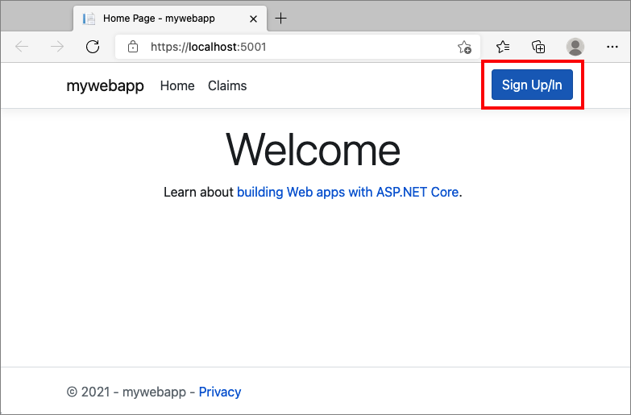
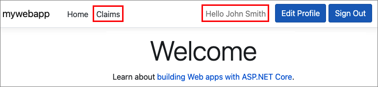

# Configure authentication in a sample web application using Azure Active Directory B2C

This article uses a sample ASP.NET web application to illustrate how to add Azure Active Directory B2C (Azure AD B2C) authentication to your web applications.

> [!IMPORTANT]
> The sample ASP.NET web application referenced in this article can't be used to call a REST API because it returns an ID token but not an access token. For a web application that is able to call a REST API, see [Secure a Web API built with ASP.NET Core using the Azure AD B2C](https://github.com/Azure-Samples/active-directory-aspnetcore-webapp-openidconnect-v2/tree/master/4-WebApp-your-API/4-2-B2C).  

## Overview

OpenID Connect (OIDC) is an authentication protocol built on OAuth 2.0 that you can use to securely sign a user in to an application. This web app sample uses [Microsoft Identity Web](https://www.nuget.org/packages/Microsoft.Identity.Web). Microsoft Identity Web is a set of ASP.NET Core libraries that simplifies adding authentication and authorization support to web apps. 

The sign-in flow involves following steps:

1. User navigates to the web app and select **Sign-in**. 
1. The app initiates authentication request, and redirects the user to Azure AD B2C.
1. The user [sign-up or sign-in](add-sign-up-and-sign-in-policy.md), [reset the password](add-password-reset-policy.md), or sign-in with a [social account](add-identity-provider.md).
1. Upon successful sign-in, Azure AD B2C returns an ID token to the app.
1. The app validates the ID token, reads the claims, and returns a secure page to the user.

When the ID token is expired, or the app session is invalidated, the app initiates a new authentication request, and redirects the user to Azure AD B2C. If the Azure AD B2C [SSO session](session-behavior.md) is active, Azure AD B2C issues an access token without prompting the user to sign in again. If the Azure AD B2C session expires or becomes invalid, the user is prompted to sign-in again.

### Sign-out

[!INCLUDE [active-directory-b2c-app-integration-sign-out-flow](../../includes/active-directory-b2c-app-integration-sign-out-flow.md)] 

## Prerequisites

A computer that's running either: 

# [Visual Studio](#tab/visual-studio)

* [Visual Studio 2019 16.8 or later](https://visualstudio.microsoft.com/downloads/?utm_medium=microsoft&utm_source=docs.microsoft.com&utm_campaign=inline+link&utm_content=download+vs2019) with the **ASP.NET and web development** workload
* [.NET 5.0 SDK](https://dotnet.microsoft.com/download/dotnet)

# [Visual Studio Code](#tab/visual-studio-code)

* [Visual Studio Code](https://code.visualstudio.com/download)
* [C# for Visual Studio Code (latest version)](https://marketplace.visualstudio.com/items?itemName=ms-dotnettools.csharp)
* [.NET 5.0 SDK](https://dotnet.microsoft.com/download/dotnet)

---

## Step 1: Configure your user flow

[!INCLUDE [active-directory-b2c-app-integration-add-user-flow](../../includes/active-directory-b2c-app-integration-add-user-flow.md)]

## Step 2: Register a web application

To enable your application to sign in with Azure AD B2C, register your app in the Azure AD B2C directory. Registering your app establishes a trust relationship between the app and Azure AD B2C.  

During app registration, you'll specify the **Redirect URI**. The redirect URI is the endpoint to which the user is redirected by Azure AD B2C after they authenticate with Azure AD B2C. The app registration process generates an **Application ID**, also known as the **client ID**, that uniquely identifies your app. Once your app is registered, Azure AD B2C will use both the application ID and redirect URI to create authentication requests. 

### Register the app

Follow these steps to create the app registration:

1. Sign in to the [Azure portal](https://portal.azure.com).
1. Select the **Directory + Subscription** icon in the portal toolbar, and then select the directory that contains your Azure AD B2C tenant.
1. In the Azure portal, search for and select **Azure AD B2C**.
1. Select **App registrations**, and then select **New registration**.
1. Enter a **Name** for the application. For example, *webapp1*.
1. Under **Supported account types**, select **Accounts in any identity provider or organizational directory (for authenticating users with user flows)**. 
1. Under **Redirect URI**, select **Web**, and then enter `https://localhost:5001/signin-oidc` in the URL text box.
1. Under **Permissions**, select the **Grant admin consent to openid and offline access permissions** check box.
1. Select **Register**.
1. Select **Overview**.
1. Record the **Application (client) ID** for use in a later step when you configure the web application.

      


### Enable ID tokens

For web apps that request an ID token directly from Azure AD B2C, enable the implicit grant flow in the app registration.

1. In the left menu, under **Manage**, select **Authentication**.
1. Under **Implicit grant**, select the **ID tokens** check box.
1. Select **Save**.

## Step 3: Get the web app sample

[Download the zip file](https://github.com/Azure-Samples/active-directory-aspnetcore-webapp-openidconnect-v2/archive/refs/heads/master.zip), or clone the sample web application from GitHub. 

```bash
git clone https://github.com/Azure-Samples/active-directory-aspnetcore-webapp-openidconnect-v2
```

Extract the sample file to a folder where the total character length of the path is less than 260.

## Step 4: Configure the sample application

In the sample folder, under the `1-WebApp-OIDC/1-5-B2C/` folder, open the **WebApp-OpenIDConnect-DotNet.csproj** project with Visual Studio or Visual Studio Code. 

Under the project root folder, open the `appsettings.json` file. This file contains information about your Azure AD B2C identity provider. Update the following properties of the app settings: 

|Section  |Key  |Value  |
|---------|---------|---------|
|AzureAdB2C|Instance| The first part of your Azure AD B2C [tenant name](tenant-management.md#get-your-tenant-name). For example, `https://contoso.b2clogin.com`.|
|AzureAdB2C|Domain| Your Azure AD B2C tenant full [tenant name](tenant-management.md#get-your-tenant-name). For example, `contoso.onmicrosoft.com`.|
|AzureAdB2C|ClientId| The web API application ID from [step 2](#step-2-register-a-web-application).|
|AzureAdB2C|SignUpSignInPolicyId|The user flows, or custom policy you created in [step 1](#step-1-configure-your-user-flow).|

Your final configuration file should look like the following JSON:

```JSon
"AzureAdB2C": {
  "Instance": "https://contoso.b2clogin.com",
  "Domain": "contoso.onmicrosoft.com",
  "ClientId": "<web-app-application-id>",
  "SignedOutCallbackPath": "/signout/<your-sign-up-in-policy>",
  "SignUpSignInPolicyId": "<your-sign-up-in-policy>"
}
```

## Step 5: Run the sample application

1. Build and run the project.
1. Browse to https://localhost:5001. 
1. Select **SignIn/Up**.

    

1. Complete the sign-up or sign-in process.

After successful authentication, you'll see your display name in the navigation bar. To view the claims that Azure AD B2C token returns to your app, select **Claims**.



## Deploy your application 

In a production application, the app registration redirect URI is typically a publicly accessible endpoint where your app is running, like `https://contoso.com/signin-oidc`. 

You can add and modify redirect URIs in your registered applications at any time. The following restrictions apply to redirect URIs:

* The reply URL must begin with the scheme `https`.
* The reply URL is case-sensitive. Its case must match the case of the URL path of your running application. 

## Next steps

* Learn more [about the code sample](https://github.com/Azure-Samples/active-directory-aspnetcore-webapp-openidconnect-v2/tree/master/1-WebApp-OIDC/1-5-B2C#about-the-code)
* Learn how to [Enable authentication in your own web application using Azure AD B2C](enable-authentication-web-application.md)