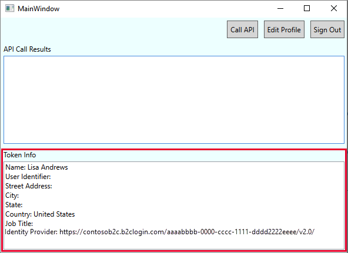

# Configure authentication in a sample WPF desktop application using Azure Active Directory B2C

This article uses a sample [WPF desktop](/visualstudio/designers/getting-started-with-wpf.md) application to illustrate how to add Azure Active Directory B2C (Azure AD B2C) authentication to your desktop apps.

## Overview

OpenID Connect (OIDC) is an authentication protocol built on OAuth 2.0, which you can securely use to sign-in a user to an application. This desktop app sample uses [MSAL](../active-directory/develop/msal-overview.md) library with OpenId Connect authorization code PKCE flow. The MSAL library is a Microsoft provided library that simplifies adding authentication and authorization support to desktop apps. 

The sign-in flow involves following steps:

1. The user opens the app and selects **sign-in**.
1. The app opens the desktop device's system browser, and starts an authentication request to Azure AD B2C.
1. The user [signs up or signs in](add-sign-up-and-sign-in-policy.md), [resets the password](add-password-reset-policy.md), or signs in with a [social account](add-identity-provider.md).
1. Upon successful sign-in, Azure AD B2C returns an authorization code to the app.
1. The app takes the following actions:
    1. Exchanges the authorization code for an ID token, access token and refresh token.
    1. Reads the ID token claims.
    1. Stores the tokens to an in-memory cache for later use.

### App registration overview

To enable your app to sign in with Azure AD B2C and call a web API, register two applications in the Azure AD B2C directory.  

- The **desktop application** registration enables your app to sign in with Azure AD B2C. During app registration, specify the *Redirect URI*. The redirect URI is the endpoint to which the user is redirected by Azure AD B2C after they authenticate with Azure AD B2C. The app registration process generates an *Application ID*, also known as the *client ID*, that uniquely identifies your desktop app. For example, **App ID: 1**.

- The  **web API** registration enables your app to call a protected web API. The registration exposes the web API permissions (scopes). The app registration process generates an *Application ID* that uniquely identifies your web API.  For example, **App ID: 2**. Grant your desktop app (App ID: 1) permissions to the web API scopes (App ID: 2). 

The following diagrams describe the apps registration and the application architecture.

 

### Call to a web API

[!INCLUDE [active-directory-b2c-app-integration-call-api](../../includes/active-directory-b2c-app-integration-call-api.md)]

### Sign-out

[!INCLUDE [active-directory-b2c-app-integration-sign-out-flow](../../includes/active-directory-b2c-app-integration-sign-out-flow.md)]

## Prerequisites

A computer that's running [Visual Studio 2019](https://www.visualstudio.com/downloads/) with **.NET desktop development**.

## Step 1: Configure your user flow

[!INCLUDE [active-directory-b2c-app-integration-add-user-flow](../../includes/active-directory-b2c-app-integration-add-user-flow.md)]

## Step 2: Register your applications

In this step, create the desktop app and the web API application registration, and specify the scopes of your web API.

### 2.1 Register the web API app

[!INCLUDE [active-directory-b2c-app-integration-register-api](../../includes/active-directory-b2c-app-integration-register-api.md)]

### 2.2 Configure web API app scopes

[!INCLUDE [active-directory-b2c-app-integration-api-scopes](../../includes/active-directory-b2c-app-integration-api-scopes.md)]


### 2.3 Register the desktop app

Follow these steps to create the desktop app registration:

1. Select **App registrations**, and then select **New registration**.
1. Enter a **Name** for the application. For example, *desktop-app1*.
1. Under **Supported account types**, select **Accounts in any identity provider or organizational directory (for authenticating users with user flows)**. 
1. Under **Redirect URI**, select **Public client/native (desktop & desktop)**, and then enter: `https://your-tenant-name.b2clogin.com/oauth2/nativeclient`. Replace the `your-tenant-name` with your [tenant name](tenant-management.md#get-your-tenant-name). For more options, see [Configure redirect URI](enable-authentication-wpf-desktop-app-options.md#configure-redirect-uri).
1. Select **Register**.
1. After the app registration is completed, select **Overview**.
1. Record the **Application (client) ID** for use in a later step when you configure the desktop application.
      

### 2.4 Grant the desktop app permissions for the web API

[!INCLUDE [active-directory-b2c-app-integration-grant-permissions](../../includes/active-directory-b2c-app-integration-grant-permissions.md)]

## Step 3: Configure the sample web API

This sample acquires an access token with the relevant scopes the desktop app can use for a web API.  To call a web API from code, follow these steps:

1. Use an existing web API, or create a new one. For more information, see [Enable authentication in your own web API using Azure AD B2C](enable-authentication-web-api.md).
1. After you configure the web API, copy the URI of the web API endpoint. You will use the web API endpoint in the next steps.

> [!TIP]
> If you don't have a web API, you can still run this sample. In this case, the app returns the access token but won't be able to call the web API. 

## Step 4: Get the WPF desktop app sample

1. [Download the zip file](https://github.com/Azure-Samples/active-directory-b2c-dotnet-desktop.git), or clone the sample web application from [GitHub repo](https://github.com/Azure-Samples/active-directory-b2c-dotnet-desktop.git). 

    ```bash
    git clone https://github.com/Azure-Samples/active-directory-b2c-dotnet-desktop.git
    ``` 

1. Open the **active-directory-b2c-wpf** solution (`active-directory-b2c-wpf.sln`) in Visual Studio.


## Step 5: Configure the sample desktop app

In the **active-directory-b2c-wpf** project, open the *App.xaml.cs* file. The `App.xaml.cs` class members contain information about your Azure AD B2C identity provider. The desktop app uses this information to establish a trust relationship with Azure AD B2C, sign the user in and out, acquire tokens, and validate them. 

Update the following members:

|Key  |Value  |
|---------|---------|
|`TenantName`|The first part of your Azure AD B2C [tenant name](tenant-management.md#get-your-tenant-name). For example, `contoso.b2clogin.com`.|
|`ClientId`|The desktop application ID from [step 2.3](#23-register-the-desktop-app).|
|`PolicySignUpSignIn`| The sign-up or sign-in user flow or custom policy you created in [step 1](#step-1-configure-your-user-flow).|
|`PolicyEditProfile`|The edit profile user flow or custom policy you created in [step 1](#step-1-configure-your-user-flow).|
|`ApiEndpoint`| (Optional) the web API endpoint you created in [Step 3](#step-3-configure-the-sample-web-api). For example, `https://contoso.azurewebsites.net/hello`.|
| `ApiScopes` | The web API scopes you created in [step 2.4](#24-grant-the-desktop-app-permissions-for-the-web-api).| 

Your final *App.xaml.cs* file should look like the following C# code:

```csharp
public partial class App : Application
{

private static readonly string TenantName = "contoso";
private static readonly string Tenant = $"{TenantName}.onmicrosoft.com";
private static readonly string AzureAdB2CHostname = $"{TenantName}.b2clogin.com";
private static readonly string ClientId = "<web-api-app-application-id>";
private static readonly string RedirectUri = $"https://{TenantName}.b2clogin.com/oauth2/nativeclient";

public static string PolicySignUpSignIn = "b2c_1_susi";
public static string PolicyEditProfile = "b2c_1_edit_profile";
public static string PolicyResetPassword = "b2c_1_reset";

public static string[] ApiScopes = { $"https://{Tenant}//api/tasks.read" };
public static string ApiEndpoint = "https://contoso.azurewebsites.net/hello";
```

## Step 6: Run and test the desktop app

1. [Restore the NuGet packages](/nuget/consume-packages/package-restore.md).
1. Press **F5** to build and run the sample.
1. Select **Sign In**. Then sign up or sign in with your Azure AD B2C local or social account.

    

1. After a successful sign-up or sign-in, the token details are displayed in the lower pane of the WPF app.

     

1. Select **Call API**, to call your web API.


## Next steps

* [Configure authentication options in a WPF desktop application using Azure Active Directory B2C](enable-authentication-wpf-desktop-app-options.md)
