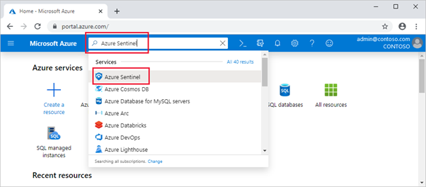
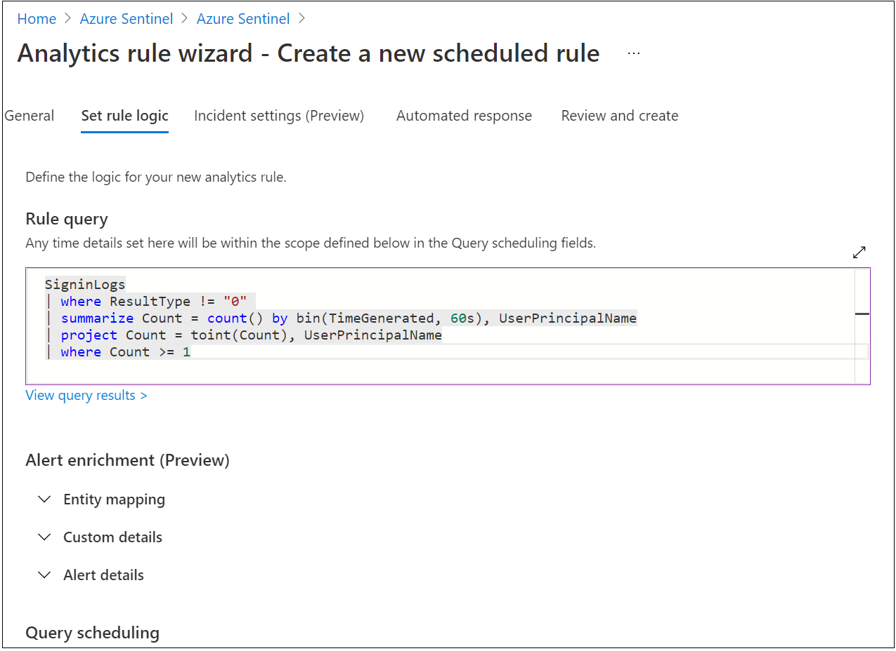
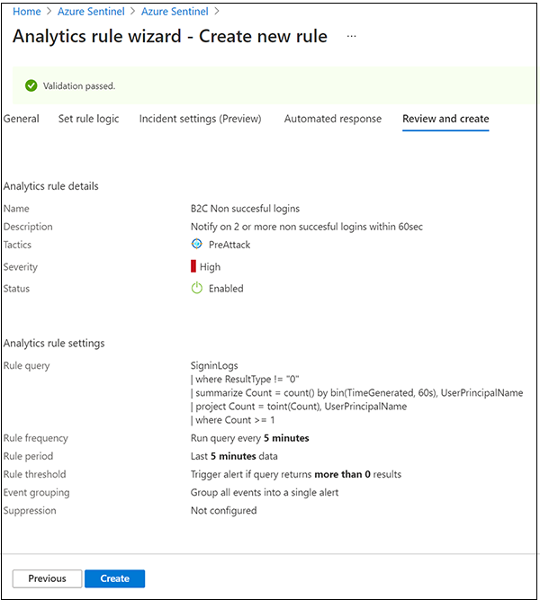
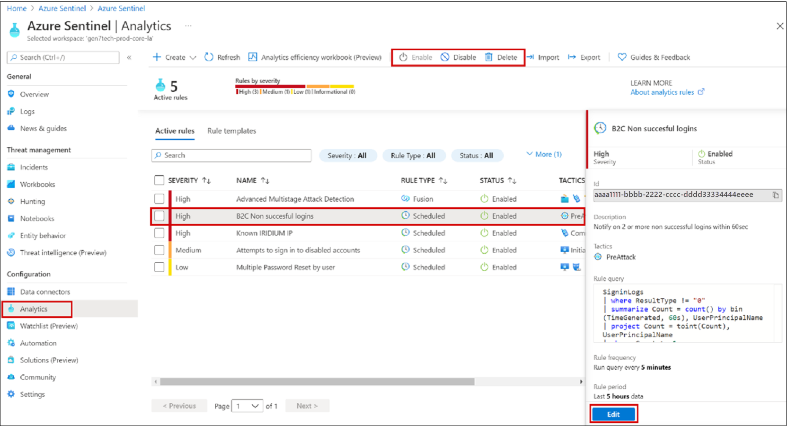
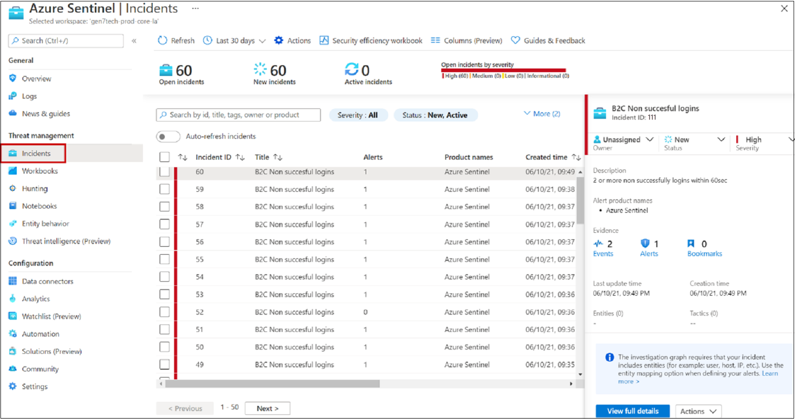
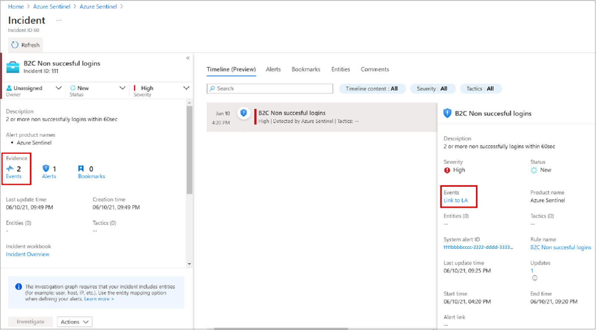
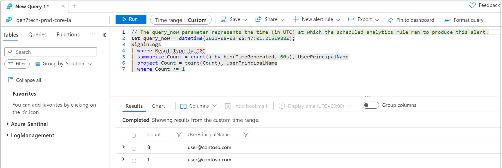

# Tutorial: Configure security analytics for Azure Active Directory B2C data with Microsoft Sentinel

Increase the security of your Azure Active Directory B2C (Azure AD B2C) environment by routing logs and audit information to Microsoft Sentinel. The scalable Microsoft Sentinel is a cloud-native, security information and event management (SIEM) and security orchestration, automation, and response (SOAR) solution. Use the solution for alert detection, threat visibility, proactive hunting, and threat response for Azure AD B2C.

Learn more: 

* [What is Microsoft Sentinel?](../sentinel/overview.md)
* [What is SOAR?](https://www.microsoft.com/security/business/security-101/what-is-soar)

More uses for Microsoft Sentinel, with Azure AD B2C, are:

* Detect previously undetected threats and minimize false positives with analytics and threat intelligence features
* Investigate threats with artificial intelligence (AI)
  * Hunt for suspicious activities at scale, and benefit from the experience of years of cybersecurity work at Microsoft
* Respond to incidents rapidly with common task orchestration and automation 
* Meet your organization's security and compliance requirements 

In this tutorial, learn how to:

* Transfer Azure AD B2C logs to a Log Analytics workspace
* Enable Microsoft Sentinel in a Log Analytics workspace
* Create a sample rule in Microsoft Sentinel to trigger an incident
* Configure an automated response

## Configure Azure AD B2C with Azure Monitor Log Analytics

To define where logs and metrics for a resource are sent, 

1. Enable **Diagnostic settings** in Microsoft Entra ID, in your Azure AD B2C tenant.
2. Configure Azure AD B2C to send logs to Azure Monitor.

Learn more, [Monitor Azure AD B2C with Azure Monitor](./azure-monitor.md).

## Deploy a Microsoft Sentinel instance

After you configure your Azure AD B2C instance to send logs to Azure Monitor, enable an instance of Microsoft Sentinel.

   >[!IMPORTANT]
   >To enable Microsoft Sentinel, obtain Contributor permissions to the subscription in which the Microsoft Sentinel workspace resides. To use Microsoft Sentinel, use Contributor or Reader permissions on the resource group to which the workspace belongs.

1. Sign in to the [Azure portal](https://portal.azure.com).
2. Select the subscription where the Log Analytics workspace is created.
3. Search for and select **Microsoft Sentinel**.

   

3. Select **Add**.
4. In the **search workspaces** field, select the new workspace.

   

5. Select **Add Microsoft Sentinel**.

   >[!NOTE]
   >It's possible to run Microsoft Sentinel on more than one workspace, however data is isolated in a single workspace.  See, [Quickstart: Onboard Microsoft Sentinel](../sentinel/quickstart-onboard.md)

## Create a Microsoft Sentinel rule

After you enable Microsoft Sentinel, get notified when something suspicious occurs in your Azure AD B2C tenant.

You can create custom analytics rules to discover threats and anomalous behaviors in your environment. These rules search for specific events, or event sets, and alert you when event thresholds or conditions are met. Then incidents are generated for investigation.

See, [Create custom analytics rules to detect threats](../sentinel/detect-threats-custom.md)

   >[!NOTE]
   >Microsoft Sentinel has templates to create threat detection rules that search your data for suspicious activity. For this tutorial, you create a rule.

### Notification rule for unsuccessful forced access

Use the following steps to receive notification about two or more unsuccessful, forced access attempts into your environment. An example is brute-force attack. 

1. In Microsoft Sentinel, from the left menu, select **Analytics**.
2. On the top bar, select **+ Create** > **Scheduled query rule**. 

   

3. In the Analytics Rule wizard, go to **General**.
4. For **Name**, enter a name for unsuccessful logins.
5. For **Description**, indicate the rule notifies for two or more unsuccessful sign-ins, within 60 seconds.
6. For **Tactics**, select a category. For example, select **PreAttack**.
7. For **Severity**, select a severity level.
8. **Status** is **Enabled** by default. To change a rule, go to the **Active rules** tab.

   

9. Select the **Set rule logic** tab.
10. Enter a query in the **Rule query** field. The query example organizes the sign-ins by `UserPrincipalName`.

    

11. Go to **Query scheduling**.
12. For **Run query every**, enter **5** and **Minutes**.
13. For **Lookup data from the last**, enter **5** and **Minutes**.
14. For **Generate alert when number of query results**, select **Is greater than**, and **0**.
15. For **Event grouping**, select **Group all events into a single alert**. 
16. For **Stop running query after alert is generated**, select **Off**.
17. Select **Next: Incident settings (Preview)**. 

   

18. Go to the **Review and create** tab to review rule settings. 
19. When the **Validation passed** banner appears, select **Create**.

    

#### View a rule and related incidents

View the rule and the incidents it generates. Find your newly created custom rule of type **Scheduled** in the table under the **Active rules** tab on the main 

1. Go to the **Analytics** screen.
2. Select the **Active rules** tab.
3. In the table, under **Scheduled**, find the rule.  

You can edit, enable, disable, or delete the rule.

   

#### Triage, investigate, and remediate incidents

An incident can include multiple alerts, and is an aggregation of relevant evidence for an investigation. At the incident level, you can set properties such as Severity and Status.

Learn more: [Investigate incidents with Microsoft Sentinel](../sentinel/investigate-cases.md).
    
1. Go to the **Incidents** page.
2. Select an incident. 
3. On the right, detailed incident information appears, including severity, entities, events, and the incident ID.

    

4. On the **Incidents** pane, elect **View full details**. 
5. Review tabs that summarize the incident.

    

6. Select **Evidence** > **Events** > **Link to Log Analytics**. 
7. In the results, see the identity `UserPrincipalName` value attempting sign-in.

    

## Automated response

Microsoft Sentinel has security orchestration, automation, and response (SOAR) functions. Attach automated actions, or a playbook, to analytics rules.

See, [What is SOAR?](https://www.microsoft.com/security/business/security-101/what-is-soar)

### Email notification for an incident

For this task, use a playbook from the Microsoft Sentinel GitHub repository. 

1. Go to a configured playbook.
2. Edit the rule.
3. On the **Automated response** tab, select the playbook.

Learn more: [Incident-Email-Notification](https://github.com/Azure/Azure-Sentinel/tree/master/Playbooks/Incident-Email-Notification)

   

## Resources

For more information about Microsoft Sentinel and Azure AD B2C, see:

* [Azure AD B2C Reports & Alerts, Workbooks](https://github.com/azure-ad-b2c/siem#workbooks)
* [Microsoft Sentinel documentation](../sentinel/index.yml)

## Next step

[Handle false positives in Microsoft Sentinel](../sentinel/false-positives.md)
