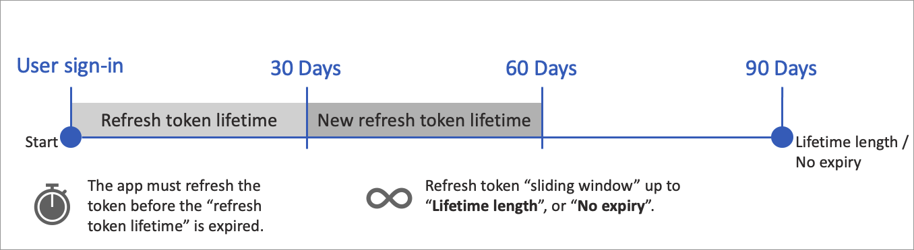

# Configure tokens in Azure Active Directory B2C

[!INCLUDE [active-directory-b2c-choose-user-flow-or-custom-policy](../../includes/active-directory-b2c-choose-user-flow-or-custom-policy.md)]

In this article, you learn how to configure the [lifetime and compatibility of a token](tokens-overview.md) in Azure Active Directory B2C (Azure AD B2C).

## Prerequisites

[!INCLUDE [active-directory-b2c-customization-prerequisites](../../includes/active-directory-b2c-customization-prerequisites.md)]

## Token lifetime behavior

You can configure the token lifetime, including:

- **Access and ID token lifetimes (minutes)** - The lifetime of the OAuth 2.0 bearer token and ID tokens. The default is 60 minutes (1 hour). The minimum (inclusive) is 5 minutes. The maximum (inclusive) is 1,440 minutes (24 hours).
- **Refresh token lifetime (days)** - The maximum time period before which a refresh token can be used to acquire a new access token, if your application had been granted the `offline_access` scope. The default is 14 days. The minimum (inclusive) is one day. The maximum (inclusive) 90 days.
- **Refresh token sliding window lifetime** - The refresh token sliding window type. `Bounded` indicates that the refresh token can be extended as specify in the **Lifetime length (days)**. `No expiry` indicates that the refresh token sliding window lifetime never expires.
- **Lifetime length (days)** - After this time period elapses the user is forced to reauthenticate, irrespective of the validity period of the most recent refresh token acquired by the application. The value must be greater than or equal to the **Refresh token lifetime** value.

The following diagram shows the refresh token sliding window lifetime behavior.



> [!NOTE]
> >Single-page applications using the authorization code flow with PKCE always have a refresh token lifetime of 24 hours while mobile apps, desktop apps, and web apps do not experience this limitation. [Learn more about the security implications of refresh tokens in the browser](../active-directory/develop/reference-third-party-cookies-spas.md#security-implications-of-refresh-tokens-in-the-browser).


## Configure token lifetime

::: zone pivot="b2c-user-flow"

To configure your user flow token lifetime:

1. Sign in to the [Azure portal](https://portal.azure.com).
1. If you have access to multiple tenants, select the **Settings** icon in the top menu to switch to your Azure AD B2C tenant from the **Directories + subscriptions** menu.
1. Choose **All services** in the top-left corner of the Azure portal, and then search for and select **Azure AD B2C**.
1. Select **User flows (policies)**.
1. Open the user flow that you previously created.
1. Select **Properties**.
1. Under **Token lifetime**, adjust the properties to fit the needs of your application.
1. Select **Save**.


:::image type="content" source="./media/configure-tokens/configure-tokens.png" alt-text="configure user flows tokens in Azure portal.":::


::: zone-end

::: zone pivot="b2c-custom-policy"

To change the settings on your token compatibility, you set the [Token Issuer](jwt-issuer-technical-profile.md) technical profile metadata in the extension, or the relying party file of the policy you want to impact. The token issuer technical profile looks like following example:

```xml
<ClaimsProviders>
  <ClaimsProvider>
    <DisplayName>Token Issuer</DisplayName>
    <TechnicalProfiles>
      <TechnicalProfile Id="JwtIssuer">
        <Metadata>
          <Item Key="token_lifetime_secs">3600</Item>
          <Item Key="id_token_lifetime_secs">3600</Item>
          <Item Key="refresh_token_lifetime_secs">1209600</Item>
          <Item Key="rolling_refresh_token_lifetime_secs">7776000</Item>
          <!--<Item Key="allow_infinite_rolling_refresh_token">true</Item>-->
          <Item Key="IssuanceClaimPattern">AuthorityAndTenantGuid</Item>
          <Item Key="AuthenticationContextReferenceClaimPattern">None</Item>
        </Metadata>
      </TechnicalProfile>
    </TechnicalProfiles>
  </ClaimsProvider>
</ClaimsProviders>
```

The following values are set in the previous example:

- **token_lifetime_secs** -  Access token lifetimes (seconds). The default is 3,600 (1 hour). The minimum is 300 (5 minutes). The maximum is 86,400 (24 hours). 
- **id_token_lifetime_secs** -  ID token lifetimes (seconds). The default is 3,600 (1 hour). The minimum  is 300 (5 minutes). The maximum is 86,400 (24 hours). 
- **refresh_token_lifetime_secs** Refresh token lifetimes (seconds). The default is 1,209,600 (14 days). The minimum is 86,400 (24 hours). The maximum  is 7,776,000 (90 days). 
- **rolling_refresh_token_lifetime_secs** - Refresh token sliding window lifetime (seconds). The default is 7,776,000 (90 days). The minimum is 86,400 (24 hours). The maximum  is 31,536,000  (365 days). If you don't want to enforce a sliding window lifetime, set the value of `allow_infinite_rolling_refresh_token` to `true`. 
- **allow_infinite_rolling_refresh_token** - Refresh token sliding window lifetime never expires. 

::: zone-end


## Token compatibility settings

You can configure the token compatibility, including:

- **Issuer (iss) claim** - The access and ID token issuer format.
- **Subject (sub) claim** - The principal about which the token asserts information, such as the user of an application. This value is immutable and can't be reassigned or reused. It can be used to perform authorization checks safely, such as when the token is used to access a resource. By default, the subject claim is populated with the object ID of the user in the directory.
- **Claim representing user flow** - This claim identifies the user flow that was executed. Possible values: `tfp` (default), or `acr`.

::: zone pivot="b2c-user-flow"

To configure your user flow compatibility settings:

1. Select **User flows (policies)**.
1. Open the user flow that you previously created.
1. Select **Properties**.
1. Under **Token compatibility settings**, adjust the properties to fit the needs of your application.
1. Select **Save**.

::: zone-end

::: zone pivot="b2c-custom-policy"

To change the settings on your token compatibility, you set the [Token Issuer](jwt-issuer-technical-profile.md) technical profile metadata in the extension, or the relying party file of the policy you want to update. The token issuer technical profile looks like following example:

```xml
<ClaimsProviders>
  <ClaimsProvider>
    <DisplayName>Token Issuer</DisplayName>
    <TechnicalProfiles>
      <TechnicalProfile Id="JwtIssuer">
        <Metadata>
          ...
          <Item Key="IssuanceClaimPattern">AuthorityAndTenantGuid</Item>
          <Item Key="AuthenticationContextReferenceClaimPattern">None</Item>
        </Metadata>
      </TechnicalProfile>
    </TechnicalProfiles>
  </ClaimsProvider>
</ClaimsProviders>
```

- **Issuer (iss) claim** - The Issuer (iss) claim is set with the **IssuanceClaimPattern** metadata item. The applicable values are `AuthorityAndTenantGuid` and `AuthorityWithTfp`.
- **Setting claim representing policy ID** - The options for setting this value are `TFP` (trust framework policy) and `ACR` (authentication context reference). `TFP` is the recommended value. Set **AuthenticationContextReferenceClaimPattern** with the value of `None`.

    In the **ClaimsSchema** element, add this element:

    ```xml
    <ClaimType Id="trustFrameworkPolicy">
      <DisplayName>Trust framework policy name</DisplayName>
      <DataType>string</DataType>
    </ClaimType>
    ```

    In your [relying party policy](relyingparty.md), under the **OutputClaims** element, add the following output claim:

    ```xml
    <OutputClaim ClaimTypeReferenceId="trustFrameworkPolicy" Required="true" DefaultValue="{policy}" PartnerClaimType="tfp" />
    ```

    For ACR, remove the **AuthenticationContextReferenceClaimPattern** item.

- **Subject (sub) claim** - This option defaults to ObjectID, if you would like to switch this setting to `Not Supported`, replace this line:

    ```xml
    <OutputClaim ClaimTypeReferenceId="objectId" PartnerClaimType="sub" />
    ```

    with this line:

    ```xml
    <OutputClaim ClaimTypeReferenceId="sub" />
    ```

::: zone-end

## Provide optional claims to your app

The application claims are values that are returned to the application. Update your user flow to contain the desired claims.

::: zone pivot="b2c-user-flow"

1. Select **User flows (policies)**.
1. Open the user flow that you previously created.
1. Select **Application claims**.
1. Choose the claims and attributes that you want send back to your application.
1. Select **Save**.

::: zone-end

::: zone pivot="b2c-custom-policy"

The [Relying party policy technical profile](relyingparty.md#technicalprofile) output claims are values that are returned to an application. Adding output claims will issue the claims into the token after a successful user journey, and will be sent to the application. Modify the technical profile element within the relying party section to add the desired claims as an output claim.

1. Open your custom policy file. For example, SignUpOrSignin.xml.
1. Find the OutputClaims element. Add the OutputClaim you want to be included in the token. 
1. Set the output claim attributes. 

The following example adds the `accountBalance` claim. The accountBalance claim is sent to the application as a balance. 

```xml
<RelyingParty>
  <DefaultUserJourney ReferenceId="SignUpOrSignIn" />
  <TechnicalProfile Id="PolicyProfile">
    <DisplayName>PolicyProfile</DisplayName>
    <Protocol Name="OpenIdConnect" />
    <OutputClaims>
      <OutputClaim ClaimTypeReferenceId="displayName" />
      <OutputClaim ClaimTypeReferenceId="givenName" />
      <OutputClaim ClaimTypeReferenceId="surname" />
      <OutputClaim ClaimTypeReferenceId="email" />
      <OutputClaim ClaimTypeReferenceId="objectId" PartnerClaimType="sub"/>
      <OutputClaim ClaimTypeReferenceId="identityProvider" />
      <OutputClaim ClaimTypeReferenceId="tenantId" AlwaysUseDefaultValue="true" DefaultValue="{Policy:TenantObjectId}" />
      <!--Add the optional claims here-->
      <OutputClaim ClaimTypeReferenceId="accountBalance" DefaultValue="" PartnerClaimType="balance" />
    </OutputClaims>
    <SubjectNamingInfo ClaimType="sub" />
  </TechnicalProfile>
</RelyingParty>
```

The OutputClaim element contains the following attributes:

- **ClaimTypeReferenceId** - The identifier of a claim type already defined in the [ClaimsSchema](claimsschema.md) section in the policy file or parent policy file.
- **PartnerClaimType** - Allows you to change the name of the claim in the token. 
- **DefaultValue** - A default value. You can also set the default value to a [claim resolver](claim-resolver-overview.md), such as tenant ID.
- **AlwaysUseDefaultValue** - Force the use of the default value.

::: zone-end

## Authorization code lifetime

When using the [OAuth 2.0 authorization code flow](authorization-code-flow.md), the app can use the authorization code to request an access token for a target resource. Authorization codes are short-lived that expire after about 10 minutes. The authorization code lifetime can't be configured. Make sure your application redeems the authorization codes within 10 minutes. 

## Next steps

- Learn more about how to [request access tokens](access-tokens.md).
- Learn how to build [Resilience through developer best practices](../active-directory/architecture/resilience-b2c-developer-best-practices.md?bc=/azure/active-directory-b2c/bread/toc.json&toc=/azure/active-directory-b2c/TOC.json).
