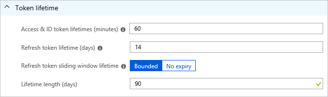
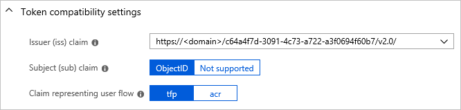

# Configure tokens in Azure Active Directory B2C

In this article, you learn how to configure the [lifetime and compatibility of a token](active-directory-b2c-reference-tokens.md) in Azure Active Directory (Azure AD) B2C.

## Prerequisites

[Create a user flow](tutorial-create-user-flows.md) to enable users to sign up and sign in to your application.

## Configure token lifetime

You can configure the token lifetime on any user flow.

1. Sign in to the [Azure portal](https://portal.azure.com).
2. Make sure you're using the directory that contains your Azure AD B2C tenant. Select the **Directory and subscription filter** in the top menu and choose the directory that contains your Azure AD B2C tenant.
3. Choose **All services** in the top-left corner of the Azure portal, and then search for and select **Azure AD B2C**.
4. Select **User flows (policies)**.
5. Open the user flow that you previously created.
6. Select **Properties**.
7. Under **Token lifetime**, adjust the following properties to fit the needs of your application:

    

8. Click **Save**.

## Configure token compatibility

1. Select **User flows (policies)**.
2. Open the user flow that you previously created.
3. Select **Properties**.
4. Under **Token compatibility settings**, adjust the following properties to fit the needs of your application:

    

5. Click **Save**.

## Next steps

Learn more about how to [use access tokens](active-directory-b2c-access-tokens.md).

