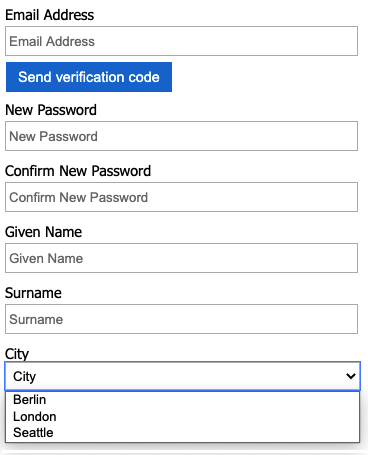

#  Add user attributes and customize user input in Azure Active Directory B2C

[!INCLUDE [active-directory-b2c-choose-user-flow-or-custom-policy](../../includes/active-directory-b2c-choose-user-flow-or-custom-policy.md)]

In this article, you collect a new attribute during your sign-up journey in Azure Active Directory B2C (Azure AD B2C). You'll obtain the users' city, configure it as a drop-down, and define whether it's required to be provided.

> [!IMPORTANT]
> This sample uses the built-in claim 'city'. Instead, you can choose one of the supported [Azure AD B2C built-in attributes](user-profile-attributes.md) or a custom attribute. To use a custom attribute, [enable custom attributes](user-flow-custom-attributes.md). To use a different built-in or custom attribute, replace 'city' with the attribute of your choice, for example the built-in attribute *jobTitle* or a custom attribute like *extension_loyaltyId*.  

## Prerequisites

[!INCLUDE [active-directory-b2c-customization-prerequisites](../../includes/active-directory-b2c-customization-prerequisites.md)]

::: zone pivot="b2c-user-flow"

## Add user attributes your user flow

1. Sign in to the [Azure portal](https://portal.azure.com).
1. If you have access to multiple tenants, select the **Settings** icon in the top menu to switch to your Azure AD B2C tenant from the **Directories + subscriptions** menu.
1. Under  **Azure services**, select  **Azure AD B2C**. Or use the search box to find and select  **Azure AD B2C**.
1. In your Azure AD B2C tenant, select **User flows**.
1. Select your policy (for example, "B2C_1_SignupSignin") to open it.
1. Select **User attributes** and then select the user attribute (for example, "City"). 
1. Select **Save**.

## Provide optional claims to your app

The application claims are values that are returned to the application. Update your user flow to contain the desired claims.

1. Select your policy (for example, "B2C_1_SignupSignin") to open it.
1. Select **Application claims**.
1. Select attributes that you want send back to your application (for example, "City")..
1. Select **Save**.
 
## Configure user attributes input type

1. Select your policy (for example, "B2C_1_SignupSignin") to open it.
1. Select **Page layouts**.
1. Select **Local account sign-up page**.
1. Under **User attributes**, select **City**.
    1. In the **Optional** drop-down, select **No**.
    1. In the **User input type**, select the current user input type, such as **TextBox**, to open a **User input type editor** window pane.
    1. In the **User input type** drop-down, select **DropdownSingleSelect**. 
    1. In the **Text** and **Values**, enter the text and value pairs that make up your set of responses for the attribute. The **Text** displays in the web interface for your flow, and the **Values** is stored to Azure AD B2C for selected **Text**. Optional: Use the "Move up/down" buttons to reorder drop-down items.  
1. Select **Ok**. Optional: Use the "Move up/down" buttons to reorder user attributes in the sign-up page.
1. Select **Save**. 

    :::image type="content" source="./media/configure-user-input/configure-user-attributes-input-type.png" alt-text="Web page call green API.":::

### Provide a list of values by using localized collections

To provide a set list of values for the city attribute: 

1. [Enable language customization on the user flow](language-customization.md#support-requested-languages-for-ui_locales)
1. Select your policy (for example, "B2C_1_SignupSignin") to open it.
1. On the **Languages** page for the user flow, select the language that you want to customize.
1. Under **Page-level resources files**, select **Local account sign up page**.
1. Select **Download defaults** (or **Download overrides** if you have previously edited this language).
1. Create a `LocalizedCollections` attribute.

The `LocalizedCollections` is an array of `Name` and `Value` pairs. The order for the items will be the order they are displayed. 

* `ElementId` is the user attribute that this `LocalizedCollections` attribute is a response to.
* `Name` is the value that's shown to the user.
* `Value` is what is returned in the claim when this option is selected.

```json
{
  "LocalizedStrings": [...],
  "LocalizedCollections": [
    {
      "ElementType": "ClaimType",
      "ElementId": "city",
      "TargetCollection": "Restriction",
      "Override": true,
      "Items": [
        {
          "Name": "Berlin",
          "Value": "Berlin"
        },
        {
          "Name": "London",
          "Value": "London"
        },
        {
          "Name": "Seattle",
          "Value": "Seattle"
        }
      ]
    }
  ]
}
```

#### Upload your changes

1. After you complete the changes to your JSON file, go back to your B2C tenant.
1. Select **User flows** and select your policy (for example, "B2C_1_SignupSignin") to open it.
1. Select **Languages**.
1. Select the language that you want to translate to.
1. Under **Page-level-resources files**, select **Local account sign up page**.
1. Select the folder icon, and select the JSON file to upload. The changes are saved to your user flow automatically.

## Test your user flow

1. Select your policy (for example, "B2C_1_SignupSignin") to open it.
1. To test your policy, select **Run user flow**.
1. For **Application**, select the web application named *testapp1* that you previously registered. The **Reply URL** should show `https://jwt.ms`.
1. Click **Run user flow**

::: zone-end

::: zone pivot="b2c-custom-policy"

## Overview

You can gather initial data from your users by using the sign-up or sign-in user journey. Additional claims can be gathered later by using a profile edit user journey. Anytime Azure AD B2C gathers information directly from the user interactively, it uses the [self-asserted technical profile](self-asserted-technical-profile.md). In this sample, you:

1. Define a "city" claim. 
1. Ask the user for their city.
1. Persist the city to the user profile in the Azure AD B2C directory.
1. Read the city claim from the Azure AD B2C directory on each sign-in.
1. Return the city to your relying party application after sign-in or sign-up.  

## Define a claim

A claim provides a temporary storage of data during an Azure AD B2C policy execution. The [claims schema](claimsschema.md) is the place where you declare your claims. The following elements are used to define the claim:

- **DisplayName** - A string that defines the user-facing label.
- [DataType](claimsschema.md#datatype) - The type of the claim.
- **UserHelpText** - Helps the user understand what is required.
- [UserInputType](claimsschema.md#userinputtype) - The type of input control, such as text box, radio selection, drop-down list, or multiple selections.

Open the extensions file of your policy. For example, <em>`SocialAndLocalAccounts/`**`TrustFrameworkExtensions.xml`**</em>.

1. Search for the [BuildingBlocks](buildingblocks.md) element. If the element doesn't exist, add it.
1. Locate the [ClaimsSchema](claimsschema.md) element. If the element doesn't exist, add it.
1. Add the city claim to the **ClaimsSchema** element.  

```xml
<!-- 
<BuildingBlocks>
  <ClaimsSchema> -->
    <ClaimType Id="city">
      <DisplayName>City where you work</DisplayName>
      <DataType>string</DataType>
      <UserInputType>DropdownSingleSelect</UserInputType>
      <Restriction>
        <Enumeration Text="Berlin" Value="berlin" />
        <Enumeration Text="London" Value="london" />
        <Enumeration Text="Seattle" Value="seattle" />
      </Restriction>
    </ClaimType>
  <!-- 
  </ClaimsSchema>
</BuildingBlocks>-->
```

Include the [SelectByDefault](claimsschema.md#enumeration) attribute on an `Enumeration` element to make it selected by default when the page first loads. For example, to pre-select the *London* item, change the `Enumeration` element as the following example:

```xml
<Restriction>
  <Enumeration Text="Berlin" Value="berlin" />
  <Enumeration Text="London" Value="london" SelectByDefault="true" />
  <Enumeration Text="Seattle" Value="seattle" />
</Restriction>
```

## Add a claim to the user interface

The following technical profiles are [self-asserted](self-asserted-technical-profile.md), invoked when a user is expected to provide input:

- **LocalAccountSignUpWithLogonEmail** - Local account sign-up flow.
- **SelfAsserted-Social** - Federated account first-time user sign-in.
- **SelfAsserted-ProfileUpdate** - Edit profile flow.

To collect the city claim during sign-up, it must be added as an output claim to the `LocalAccountSignUpWithLogonEmail` technical profile. Override this technical profile in the extension file. Specify the entire list of output claims to control the order the claims are presented on the screen. Find the **ClaimsProviders** element. Add a new ClaimsProviders as follows:

```xml
<ClaimsProvider>
  <DisplayName>Local Account</DisplayName>
  <TechnicalProfiles>
    <!--Local account sign-up page-->
    <TechnicalProfile Id="LocalAccountSignUpWithLogonEmail">
      <OutputClaims>
       <OutputClaim ClaimTypeReferenceId="email" PartnerClaimType="Verified.Email" Required="true" />
       <OutputClaim ClaimTypeReferenceId="newPassword" Required="true" />
       <OutputClaim ClaimTypeReferenceId="reenterPassword" Required="true" />
       <OutputClaim ClaimTypeReferenceId="displayName" />
       <OutputClaim ClaimTypeReferenceId="givenName" />
       <OutputClaim ClaimTypeReferenceId="surName" />
       <OutputClaim ClaimTypeReferenceId="city"/>
     </OutputClaims>
   </TechnicalProfile>
  </TechnicalProfiles>
</ClaimsProvider>
```

To collect the city claim after initial sign-in with a federated account, it must be added as an output claim to the `SelfAsserted-Social` technical profile. For local and federated account users to be able to edit their profile data later, add the input and output claims to the `SelfAsserted-ProfileUpdate` technical profile. Override these technical profiles in the extension file. Specify the entire list of the output claims to control the order the claims are presented on the screen. Find the **ClaimsProviders** element. Add a new ClaimsProviders as follows:

```xml
<ClaimsProvider>
  <DisplayName>Self Asserted</DisplayName>
  <TechnicalProfiles>
    <!--Federated account first-time sign-in page-->
    <TechnicalProfile Id="SelfAsserted-Social">
      <InputClaims>
        <InputClaim ClaimTypeReferenceId="city" />
      </InputClaims>
      <OutputClaims>
        <OutputClaim ClaimTypeReferenceId="displayName"/>
        <OutputClaim ClaimTypeReferenceId="givenName"/>
        <OutputClaim ClaimTypeReferenceId="surname"/>
        <OutputClaim ClaimTypeReferenceId="city"/>
      </OutputClaims>
    </TechnicalProfile>
    <!--Edit profile page-->
    <TechnicalProfile Id="SelfAsserted-ProfileUpdate">
      <InputClaims>
        <InputClaim ClaimTypeReferenceId="city" />
      </InputClaims>
      <OutputClaims>
        <OutputClaim ClaimTypeReferenceId="displayName"/>
        <OutputClaim ClaimTypeReferenceId="givenName" />
        <OutputClaim ClaimTypeReferenceId="surname" />
        <OutputClaim ClaimTypeReferenceId="city"/>
      </OutputClaims>
    </TechnicalProfile>
  </TechnicalProfiles>
</ClaimsProvider>
```

## Read and write a claim

The following technical profiles are [Active Directory technical profiles](active-directory-technical-profile.md), which read and write data to Microsoft Entra ID.  
Use `PersistedClaims` to write data to the user profile and `OutputClaims` to read data from the user profile within the respective Active Directory technical profiles.

Override these technical profiles in the extension file. Find the **ClaimsProviders** element.  Add a new ClaimsProviders as follows:

```xml
<ClaimsProvider>
  <DisplayName>Azure Active Directory</DisplayName>
  <TechnicalProfiles>
    <!-- Write data during a local account sign-up flow. -->
    <TechnicalProfile Id="AAD-UserWriteUsingLogonEmail">
      <PersistedClaims>
        <PersistedClaim ClaimTypeReferenceId="city"/>
      </PersistedClaims>
    </TechnicalProfile>
    <!-- Write data during a federated account first-time sign-in flow. -->
    <TechnicalProfile Id="AAD-UserWriteUsingAlternativeSecurityId">
      <PersistedClaims>
        <PersistedClaim ClaimTypeReferenceId="city"/>
      </PersistedClaims>
    </TechnicalProfile>
    <!-- Write data during edit profile flow. -->
    <TechnicalProfile Id="AAD-UserWriteProfileUsingObjectId">
      <PersistedClaims>
        <PersistedClaim ClaimTypeReferenceId="city"/>
      </PersistedClaims>
    </TechnicalProfile>
    <!-- Read data after user resets the password. -->
    <TechnicalProfile Id="AAD-UserReadUsingEmailAddress">
      <OutputClaims>  
        <OutputClaim ClaimTypeReferenceId="city" />
      </OutputClaims>
    </TechnicalProfile>
    <!-- Read data after user authenticates with a local account. -->
    <TechnicalProfile Id="AAD-UserReadUsingObjectId">
      <OutputClaims>  
        <OutputClaim ClaimTypeReferenceId="city" />
      </OutputClaims>
    </TechnicalProfile>
    <!-- Read data after user authenticates with a federated account. -->
    <TechnicalProfile Id="AAD-UserReadUsingAlternativeSecurityId">
      <OutputClaims>  
        <OutputClaim ClaimTypeReferenceId="city" />
      </OutputClaims>
    </TechnicalProfile>
  </TechnicalProfiles>
</ClaimsProvider>
```

## Include a claim in the token 

To return the city claim back to the relying party application, add an output claim to the <em>`SocialAndLocalAccounts/`**`SignUpOrSignIn.xml`**</em> file. The output claim will be added into the token after a successful user journey, and will be sent to the application. Modify the technical profile element within the relying party section to add the city as an output claim.
 
```xml
<RelyingParty>
  <DefaultUserJourney ReferenceId="SignUpOrSignIn" />
  <TechnicalProfile Id="PolicyProfile">
    <DisplayName>PolicyProfile</DisplayName>
    <Protocol Name="OpenIdConnect" />
    <OutputClaims>
      <OutputClaim ClaimTypeReferenceId="displayName" />
      <OutputClaim ClaimTypeReferenceId="givenName" />
      <OutputClaim ClaimTypeReferenceId="surname" />
      <OutputClaim ClaimTypeReferenceId="email" />
      <OutputClaim ClaimTypeReferenceId="objectId" PartnerClaimType="sub"/>
      <OutputClaim ClaimTypeReferenceId="identityProvider" />
      <OutputClaim ClaimTypeReferenceId="tenantId" AlwaysUseDefaultValue="true" DefaultValue="{Policy:TenantObjectId}" />
      <OutputClaim ClaimTypeReferenceId="city" DefaultValue="" />
    </OutputClaims>
    <SubjectNamingInfo ClaimType="sub" />
  </TechnicalProfile>
</RelyingParty>
```

## Upload and test your updated custom policy

1. If you have access to multiple tenants, select the **Settings** icon in the top menu to switch to your Azure AD B2C tenant from the **Directories + subscriptions** menu.
1. Search for and select **Azure AD B2C**.
1. Under **Policies**, select **Identity Experience Framework**.
1. Select **Upload custom policy**.
1. Upload the policy files that you previously changed.

### Test the custom policy

1. Select your relying party policy, for example `B2C_1A_signup_signin`.
1. For **Application**, select a web application that you [previously registered](tutorial-register-applications.md). The **Reply URL** should show `https://jwt.ms`.
1. Select the **Run now** button.
1. From the sign-up or sign-in page, select **Sign up now** to sign up. Finish entering the user information including the city name, and then click **Create**. You should see the contents of the token that was returned.

::: zone-end

The sign-up screen should look similar to the following screenshot:



The token sent back to your application includes the `city` claim.

```json
{
  "typ": "JWT",
  "alg": "RS256",
  "kid": "X5eXk4xyojNFum1kl2Ytv8dlNP4-c57dO6QGTVBwaNk"
}.{
  "exp": 1583500140,
  "nbf": 1583496540,
  "ver": "1.0",
  "iss": "https://contoso.b2clogin.com/f06c2fe8-709f-4030-85dc-38a4bfd9e82d/v2.0/",
  "aud": "e1d2612f-c2bc-4599-8e7b-d874eaca1ee1",
  "acr": "b2c_1a_signup_signin",
  "nonce": "defaultNonce",
  "iat": 1583496540,
  "auth_time": 1583496540,
  "name": "Emily Smith",
  "email": "joe@outlook.com",
  "given_name": "Emily",
  "family_name": "Smith",
  "city": "Berlin"
  ...
}
```

::: zone pivot="b2c-custom-policy"

## [Optional] Localize the UI

Azure AD B2C allows you to accommodate your policy to different languages. For more information, [learn about customizing the language experience](language-customization.md). To localize the sign-up page, [set up the list of supported languages](language-customization.md#set-up-the-list-of-supported-languages), and [provide language-specific labels](language-customization.md#provide-language-specific-labels).

> [!NOTE]
> When using the `LocalizedCollection` with the language-specific labels, you can remove the `Restriction` collection from the [claim definition](#define-a-claim).

The following example demonstrates how to provide the list of cities for English and Spanish. Both set the `Restriction` collection of the claim *city* with a list of items for English and Spanish. The [SelectByDefault](claimsschema.md#enumeration) makes an item selected by default when the page first loads.
   
```xml
<!-- 
<BuildingBlocks>-->
  <Localization Enabled="true">
    <SupportedLanguages DefaultLanguage="en" MergeBehavior="Append">
      <SupportedLanguage>en</SupportedLanguage>
      <SupportedLanguage>es</SupportedLanguage>
    </SupportedLanguages>
    <LocalizedResources Id="api.localaccountsignup.en">
      <LocalizedCollections>
        <LocalizedCollection ElementType="ClaimType" ElementId="city" TargetCollection="Restriction">
          <Item Text="Berlin" Value="Berlin"></Item>
          <Item Text="London" Value="London" SelectByDefault="true"></Item>
          <Item Text="Seattle" Value="Seattle"></Item>
        </LocalizedCollection>
      </LocalizedCollections>
    </LocalizedResources>
    <LocalizedResources Id="api.localaccountsignup.es">
      <LocalizedCollections>
        <LocalizedCollection ElementType="ClaimType" ElementId="city" TargetCollection="Restriction">
          <Item Text="Berlina" Value="Berlin"></Item>
          <Item Text="Londres" Value="London" SelectByDefault="true"></Item>
          <Item Text="Seattle" Value="Seattle"></Item>
        </LocalizedCollection>
      </LocalizedCollections>
    </LocalizedResources>
  </Localization>
<!-- 
</BuildingBlocks>-->
```

After you add the localization element, [edit the content definition with the localization](language-customization.md#edit-the-content-definition-with-the-localization). In the following example, English (en) and Spanish (es) custom localized resources are added to the sign-up page:
   
```xml
<!-- 
<BuildingBlocks>
  <ContentDefinitions> -->
   <ContentDefinition Id="api.localaccountsignup">
    <LocalizedResourcesReferences MergeBehavior="Prepend">
        <LocalizedResourcesReference Language="en" LocalizedResourcesReferenceId="api.localaccountsignup.en" />
        <LocalizedResourcesReference Language="es" LocalizedResourcesReferenceId="api.localaccountsignup.es" />
    </LocalizedResourcesReferences>
   </ContentDefinition>
  <!-- 
  </ContentDefinitions>
</BuildingBlocks>-->
```

## Next steps

- Learn more about the [ClaimsSchema](claimsschema.md) element in the IEF reference.
- Learn how to [use custom attributes in Azure AD B2C](user-flow-custom-attributes.md).

::: zone-end

::: zone pivot="b2c-user-flow"
## Next steps
- [Customize user interface in Azure Active Directory B2C](customize-ui.md).
- [Customize the user interface with HTML templates in Azure Active Directory B2C](customize-ui-with-html.md).
- [Enable JavaScript](javascript-and-page-layout.md).

::: zone-end
