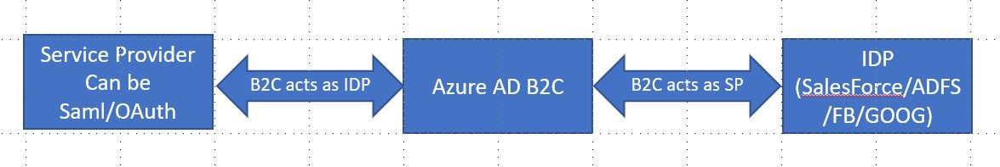

# Register a SAML application in Azure AD B2C

In this article, you learn how to configure Azure Active Directory B2C (Azure AD B2C) to act as a Security Assertion Markup Language (SAML) identity provider (IdP) to your applications.

## Scenario overview

Organizations that use Azure AD B2C as their customer identity and access management solution might require interaction with identity providers or applications that are configured to authenticate using the SAML protocol.

Azure AD B2C achieves SAML interoperability in one of two ways:

* By acting as an *identity provider* (IdP) and achieving single-sign-on (SSO) with SAML-based service providers (your applications)
* By acting as a *service provider* (SP) and interacting with SAML-based identity providers like Salesforce and ADFS



Summarizing the two non-exclusive core scenarios with SAML:

| Scenario | Azure AD B2C role | How-to |
| -------- | ----------------- | ------- |
| My application expects a SAML assertion to complete an authentication. | **Azure AD B2C acts as the identity provider (IdP)**<br />Azure AD B2C acts as a SAML IdP to the applications. | This article. |
| My users need single-sign-on with a SAML-compliant identity provider like ADFS, Salesforce, or Shibboleth.  | **Azure AD B2C acts as the service provider (SP)**<br />Azure AD B2C acts as a service provider when connecting to the SAML identity provider. It's a federation proxy between your application and the SAML identity provider.  | <ul><li>[Set up sign-in with ADFS as a SAML IdP using custom policies](identity-provider-adfs2016-custom.md)</li><li>[Set up sign-in with a Salesforce SAML provider using custom policies](identity-provider-salesforce-custom.md)</li></ul> |

## Prerequisites

* Complete the steps in [Get started with custom policies in Azure AD B2C](custom-policy-get-started.md). You need the *SocialAndLocalAccounts* custom policy from the custom policy starter pack discussed in the article.
* Basic understanding of the Security Assertion Markup Language (SAML) protocol.
* A web application configured as a SAML service provider (SP). For this tutorial, you can use a [SAML test application][samltest] that we provide.

## Components of the solution

There are three main components required for this scenario:

* SAML **service provider** with the ability to send SAML requests, and receive, decode, and respond to SAML assertions from Azure AD B2C. This is also known as the relying party.
* Publicly available SAML **metadata endpoint** for your service provider.
* [Azure AD B2C tenant](tutorial-create-tenant.md)

If you don't yet have a SAML service provider and an associated metadata endpoint, you can use this sample SAML application that we've made available for testing:

[SAML Test Application][samltest]

## 1. Set up certificates

To build a trust relationship between your service provider and Azure AD B2C, you need to provide the web app X509 certificates.

* **Service provider certificates**
  * Certificate with a private key stored in your Web App. This certificate is used by your service provider to sign the SAML request sent to Azure AD B2C. Azure AD B2C reads the public key from the service provider metadata to validate the signature.
  * (Optional) Certificate with a private key stored in your Web App. Azure AD B2C reads the public key from the service provider metadata to encrypt the SAML assertion. The service provider then uses the private key to decrypt the assertion.
* **Azure AD B2C certificates**
  * Certificate with a private key in Azure AD B2C. This certificate is used by Azure AD B2C to sign the SAML response sent to your service provider. Your service provider reads the Azure AD B2C metadata public key to validate the signature of the SAML response.

You can use a certificate issued by a public certificate authority or, for this tutorial, a self-signed certificate.

### 1.1 Prepare a self-signed certificate

If you don't already have a certificate, you can use a self-signed certificate for this tutorial. On Windows, you can use PowerShell's [New-SelfSignedCertificate](https://docs.microsoft.com/powershell/module/pkiclient/new-selfsignedcertificate) cmdlet to generate a certificate.

1. Execute this PowerShell command to generate a self-signed certificate. Modify the `-Subject` argument as appropriate for your application and Azure AD B2C tenant name. You can also adjust the `-NotAfter` date to specify a different expiration for the certificate.

    ```PowerShell
    New-SelfSignedCertificate `
        -KeyExportPolicy Exportable `
        -Subject "CN=yourappname.yourtenant.onmicrosoft.com" `
        -KeyAlgorithm RSA `
        -KeyLength 2048 `
        -KeyUsage DigitalSignature `
        -NotAfter (Get-Date).AddMonths(12) `
        -CertStoreLocation "Cert:\CurrentUser\My"
    ```

1. Open **Manage user certificates** > **Current User** > **Personal** > **Certificates** > *yourappname.yourtenant.onmicrosoft.com*
1. Select the certificate > **Action** > **All Tasks** > **Export**
1. Select **Yes** > **Next** > **Yes, export the private key** > **Next**
1. Accept the defaults for **Export File Format**
1. Provide a password for the certificate

### 1.2 Upload the certificate

Next, upload the SAML assertion and response signing certificate to Azure AD B2C.

1. Sign in to the [Azure portal](https://portal.azure.com) and browse to your Azure AD B2C tenant.
1. Under **Policies**, select **Identity Experience Framework** and then **Policy keys**.
1. Select **Add**, and then select **Options** > **Upload**.
1. Enter a **Name**, for example *SamlIdpCert*. The prefix *B2C_1A_* is automatically added to the name of your key.
1. Upload your certificate using the upload file control.
1. Enter the certificate's password.
1. Select **Create**.
1. Verify that the key appears as expected. For example, *B2C_1A_SamlIdpCert*.

## 2. Prepare your policy

### 2.1 Create the SAML token issuer

Now, add the capability for your tenant to issue SAML tokens, using [SAML token issuer](saml-issuer-technical-profile.md) and [SAML session provider](custom-policy-reference-sso.md#samlssosessionprovider) technical profiles.

Open `SocialAndLocalAccounts\`**`TrustFrameworkExtensions.xml`** in the custom policy starter pack.

Locate the `<ClaimsProviders>` section and add the following XML snippet.

You can change the value of the `IssuerUri` metadata. This is the issuer URI that is returned in the SAML response from Azure AD B2C. Your relying party application should be configured to accept an issuer URI during SAML assertion validation.

```xml
<ClaimsProvider>
  <DisplayName>Token Issuer</DisplayName>
  <TechnicalProfiles>

    <!-- SAML Token Issuer technical profile -->
    <TechnicalProfile Id="Saml2AssertionIssuer">
      <DisplayName>Token Issuer</DisplayName>
      <Protocol Name="SAML2"/>
      <OutputTokenFormat>SAML2</OutputTokenFormat>
      <Metadata>
        <!-- The issuer contains the policy name; it should be the same name as configured in the relying party application. B2C_1A_signup_signin_SAML is used below. -->
        <!--<Item Key="IssuerUri">https://tenant-name.b2clogin.com/tenant-name.onmicrosoft.com/B2C_1A_signup_signin_SAML</Item>-->
      </Metadata>
      <CryptographicKeys>
        <Key Id="MetadataSigning" StorageReferenceId="B2C_1A_SamlIdpCert"/>
        <Key Id="SamlAssertionSigning" StorageReferenceId="B2C_1A_SamlIdpCert"/>
        <Key Id="SamlMessageSigning" StorageReferenceId="B2C_1A_SamlIdpCert"/>
      </CryptographicKeys>
      <InputClaims/>
      <OutputClaims/>
      <UseTechnicalProfileForSessionManagement ReferenceId="SM-Saml-issuer"/>
    </TechnicalProfile>

    <!-- Session management technical profile for SAML based tokens -->
    <TechnicalProfile Id="SM-Saml-issuer">
      <DisplayName>Session Management Provider</DisplayName>
      <Protocol Name="Proprietary" Handler="Web.TPEngine.SSO.SamlSSOSessionProvider, Web.TPEngine, Version=1.0.0.0, Culture=neutral, PublicKeyToken=null"/>
    </TechnicalProfile>

  </TechnicalProfiles>
</ClaimsProvider>
```

## 3. Add the SAML relying party policy

Now that your tenant can issue SAML assertions, you need to create the SAML relying party policy, and modify the user journey so that it issues a SAML assertion instead of a JWT.

### 3.1 Create sign-up or sign-in policy

1. Create a copy of the *SignUpOrSignin.xml* file in your starter pack working directory and save it with a new name. For example, *SignUpOrSigninSAML.xml*. This is your relying party policy file.

1. Open the *SignUpOrSigninSAML.xml* file in your preferred editor.

1. Change the `PolicyId` and `PublicPolicyUri` of the policy to _B2C_1A_signup_signin_saml_ and `http://tenant-name.onmicrosoft.com/B2C_1A_signup_signin_saml` as seen below.

    ```xml
    <TrustFrameworkPolicy
    xmlns:xsi="http://www.w3.org/2001/XMLSchema-instance"
    xmlns:xsd="http://www.w3.org/2001/XMLSchema"
    xmlns="http://schemas.microsoft.com/online/cpim/schemas/2013/06"
    PolicySchemaVersion="0.3.0.0"
    TenantId="tenant-name.onmicrosoft.com"
    PolicyId="B2C_1A_signup_signin_saml"
    PublicPolicyUri="http://tenant-name.onmicrosoft.com/B2C_1A_signup_signin_saml">
    ```

1. Add following XML snippet just before the `<RelyingParty>` element. This XML overwrites orchestration step number 7 of the _SignUpOrSignIn_ user journey. If you started from a different folder in the starter pack, or customized your user journey by adding or removing orchestration steps, make sure the number (in the `order` element) is aligned with the one specified in the user journey for the token issuer step (for example, in the other starter pack folders it's step number 4 for `LocalAccounts`, 6 for `SocialAccounts` and 9 for `SocialAndLocalAccountsWithMfa`).

    ```xml
    <UserJourneys>
      <UserJourney Id="SignUpOrSignIn">
        <OrchestrationSteps>
          <OrchestrationStep Order="7" Type="SendClaims" CpimIssuerTechnicalProfileReferenceId="Saml2AssertionIssuer"/>
        </OrchestrationSteps>
      </UserJourney>
    </UserJourneys>
    ```

1. Replace the entire `<TechnicalProfile>` element in the `<RelyingParty>` element with the following technical profile XML.

    ```xml
    <TechnicalProfile Id="PolicyProfile">
      <DisplayName>PolicyProfile</DisplayName>
      <Protocol Name="SAML2"/>
      <OutputClaims>
        <OutputClaim ClaimTypeReferenceId="displayName" />
        <OutputClaim ClaimTypeReferenceId="givenName" />
        <OutputClaim ClaimTypeReferenceId="surname" />
        <OutputClaim ClaimTypeReferenceId="email" DefaultValue="" />
        <OutputClaim ClaimTypeReferenceId="identityProvider" DefaultValue="" />
        <OutputClaim ClaimTypeReferenceId="objectId" PartnerClaimType="objectId"/>
      </OutputClaims>
      <SubjectNamingInfo ClaimType="objectId" ExcludeAsClaim="true"/>
    </TechnicalProfile>
    ```

1. Update `tenant-name` with the name of your Azure AD B2C tenant.

Your final relying party policy file should look like the following:

```xml
<?xml version="1.0" encoding="UTF-8" standalone="yes"?>
<TrustFrameworkPolicy
  xmlns:xsi="http://www.w3.org/2001/XMLSchema-instance"
  xmlns:xsd="http://www.w3.org/2001/XMLSchema"
  xmlns="http://schemas.microsoft.com/online/cpim/schemas/2013/06"
  PolicySchemaVersion="0.3.0.0"
  TenantId="contoso.onmicrosoft.com"
  PolicyId="B2C_1A_signup_signin_saml"
  PublicPolicyUri="http://contoso.onmicrosoft.com/B2C_1A_signup_signin_saml">

  <BasePolicy>
    <TenantId>contoso.onmicrosoft.com</TenantId>
    <PolicyId>B2C_1A_TrustFrameworkExtensions</PolicyId>
  </BasePolicy>

  <UserJourneys>
    <UserJourney Id="SignUpOrSignIn">
      <OrchestrationSteps>
        <OrchestrationStep Order="7" Type="SendClaims" CpimIssuerTechnicalProfileReferenceId="Saml2AssertionIssuer"/>
      </OrchestrationSteps>
    </UserJourney>
  </UserJourneys>

  <RelyingParty>
    <DefaultUserJourney ReferenceId="SignUpOrSignIn" />
    <TechnicalProfile Id="PolicyProfile">
      <DisplayName>PolicyProfile</DisplayName>
      <Protocol Name="SAML2"/>
      <OutputClaims>
        <OutputClaim ClaimTypeReferenceId="displayName" />
        <OutputClaim ClaimTypeReferenceId="givenName" />
        <OutputClaim ClaimTypeReferenceId="surname" />
        <OutputClaim ClaimTypeReferenceId="email" DefaultValue="" />
        <OutputClaim ClaimTypeReferenceId="identityProvider" DefaultValue="" />
        <OutputClaim ClaimTypeReferenceId="objectId" PartnerClaimType="objectId"/>
      </OutputClaims>
      <SubjectNamingInfo ClaimType="objectId" ExcludeAsClaim="true"/>
    </TechnicalProfile>
  </RelyingParty>
</TrustFrameworkPolicy>
```

### 3.2 Upload and test your policy metadata

Save your changes and upload the new policy file. After you've uploaded both policies (the extension and the relying party files), open a web browser and navigate to the policy metadata.

Azure AD B2C policy IDP metadata is information used in the SAML protocol to expose the configuration of a SAML identity provider. Metadata defines the location of the services, such as sign-in and sign-out, certificates, sign-in method, and more. The Azure AD B2C policy metadata is available at the following URL. Replace `tenant-name` with the name of your Azure AD B2C tenant, and `policy-name` with the name (ID) of the policy:

`https://tenant-name.b2clogin.com/tenant-name.onmicrosoft.com/policy-name/Samlp/metadata`

Your custom policy and Azure AD B2C tenant are now ready. Next, create an application registration in Azure AD B2C.

## 4. Setup application in the Azure AD B2C Directory

### 4.1 Register your application in Azure AD B2C

1. Sign in to the [Azure portal](https://portal.azure.com).
1. Select the **Directory + subscription** filter in the top menu, and then select the directory that contains your Azure AD B2C tenant.
1. In the left menu, select **Azure AD B2C**. Or, select **All services** and search for and select **Azure AD B2C**.
1. Select **App registrations**, and then select **New registration**.
1. Enter a **Name** for the application. For example, *SAMLApp1*.
1. Under **Supported account types**, select **Accounts in this organizational directory only**
1. Under **Redirect URI**, select **Web**, and then enter `https://localhost`. You modify this value later in the application registration's manifest.
1. Select **Register**.

### 4.2 Update the app manifest

For SAML apps, there are several properties you need to configure in the application registration's manifest.

1. In the [Azure portal](https://portal.azure.com), navigate to the application registration that you created in the previous section.
1. Under **Manage**, select **Manifest** to open the manifest editor. You modify several properties in the following sections.

#### identifierUris

The `identifierUris` is a string collection containing user-defined URI(s) that uniquely identify a Web app within its Azure AD B2C tenant. Your service provider must set this value in the `Issuer` element of a SAML request.

#### samlMetadataUrl

This property represents service provider's publicly available metadata URL. The metadata URL can point to a metadata file uploaded to any anonymously accessible endpoint, for example blob storage.

The metadata is information used in the SAML protocol to expose the configuration of a SAML party, such as a service provider. Metadata defines the location of the services like sign-in and sign-out, certificates, sign-in method, and more. Azure AD B2C reads the service provider metadata and acts accordingly. The metadata is not required. You can also specify some of attributes like the reply URI and logout URI directly in the app manifest.

If there are properties specified in *both* the SAML metadata URL and in the application registration's manifest, they are **merged**. The properties specified in the metadata URL are processed first and take precedence.

For this tutorial, which uses the SAML test application, use the following value for `samlMetadataUrl`:

```json
"samlMetadataUrl":"https://samltestapp2.azurewebsites.net/Metadata",
```

#### replyUrlsWithType (Optional)

If you do not provide a metadata URI, you can explicitly specify the reply URL. This optional property represents the `AssertionConsumerServiceUrl` (`SingleSignOnService` URL in the service provider metadata) and the `BindingType` is assumed to be `HTTP POST`.

If you choose to configure the reply URL and logout URL in the application manifest without using the service provider metadata, Azure AD B2C will not validate the SAML request signature, nor encrypt the SAML response.

For this tutorial, in which you use the SAML test application, set the `url` property of `replyUrlsWithType` to the value shown in the following JSON snippet.

```json
"replyUrlsWithType":[
  {
    "url":"https://samltestapp2.azurewebsites.net/SP/AssertionConsumer",
    "type":"Web"
  }
],
```

#### logoutUrl (Optional)

This optional property represents the `Logout` URL (`SingleLogoutService` URL in the relying party metadata), and the `BindingType` for this is assumed to be `Http-Redirect`.

For this tutorial, which uses the SAML test application, leave `logoutUrl` set to `https://samltestapp2.azurewebsites.net/logout`:

```json
"logoutUrl": "https://samltestapp2.azurewebsites.net/logout",
```

## 5. Update your application code

The last step is to enable Azure AD B2C as a SAML IdP in your SAML relying party application. Each application is different and the steps to do so vary. Consult your app's documentation for details.

Some or all the following are typically required:

* **Metadata**: `https://tenant-name.b2clogin.com/tenant-name.onmicrosoft.com/policy-name/Samlp/metadata`
* **Issuer**:   Use the entityID in the metadata file
* **Login Url/SAML endpoint/SAML Url**: Check the value in the metadata file
* **Certificate**: This is *B2C_1A_SamlIdpCert*, but without the private key. To get the public key of the certificate:

    1. Go to the metadata URL specified above.
    1. Copy the value in the `<X509Certificate>` element.
    1. Paste it into a text file.
    1. Save the text file as a *.cer* file.

### 5.1 Test with the SAML Test App (optional)

To complete this tutorial using our [SAML Test Application][samltest]:

* Update the tenant name
* Update policy name, for example *B2C_1A_signup_signin_saml*
* Specify this issuer URI: `https://contoso.onmicrosoft.com/app-name`

Select **Login** and you should be presented with a user sign-in screen. Upon sign-in, a SAML assertion is issued back to the sample application.

## Sample policy

We provide a complete sample policy that you can use for testing with the SAML Test App.

1. Download the [SAML-SP-initiated login sample policy](https://github.com/azure-ad-b2c/saml-sp/tree/master/policy/SAML-SP-Initiated)
1. Update `TenantId` to match your tenant name, for example *contoso.b2clogin.com*
1. Keep the policy name of *B2C_1A_SAML2_signup_signin*

## Supported and unsupported SAML modalities

The following SAML relying party (RP) scenarios are supported via your own metadata endpoint:

* Multiple logout URLs or POST binding for logout URL in application/service principal object.
* Specify signing key to verify RP requests in application/service principal object.
* Specify token encryption key in application/service principal object.

## Next steps

- You can find more information about the [SAML protocol on the OASIS website](https://www.oasis-open.org/).
- Get the SAML test web app from [Azure AD B2C GitHub community repo](https://github.com/azure-ad-b2c/saml-sp-tester).

<!-- LINKS - External -->
[samltest]: https://aka.ms/samltestapp
