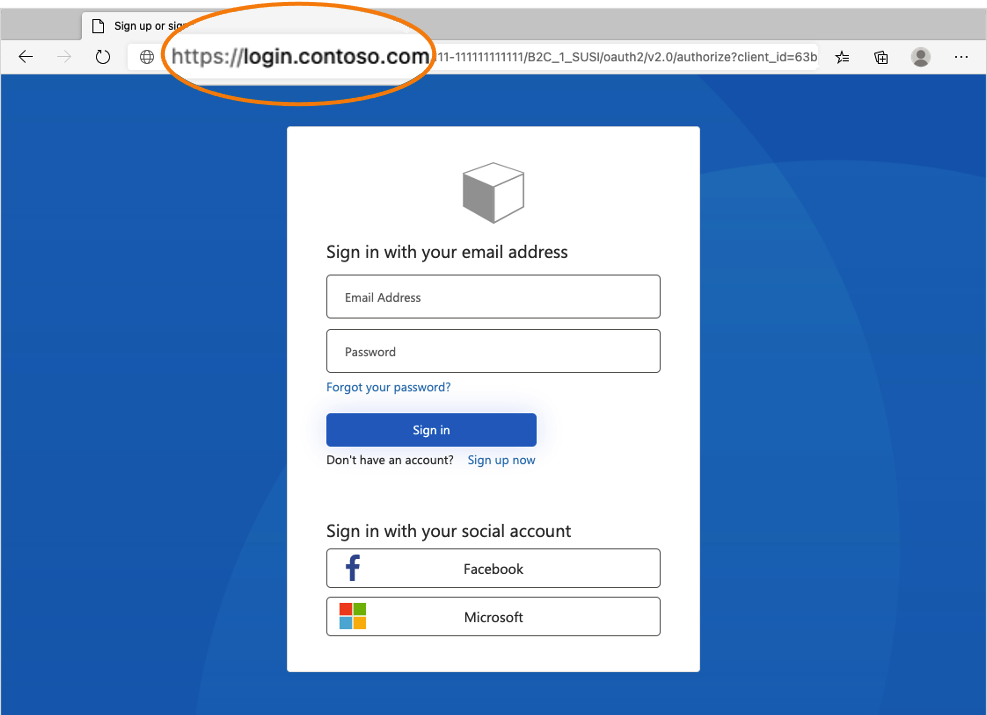
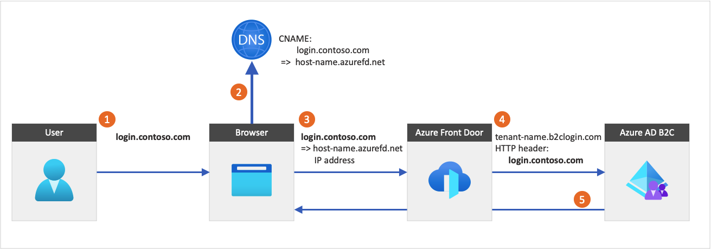
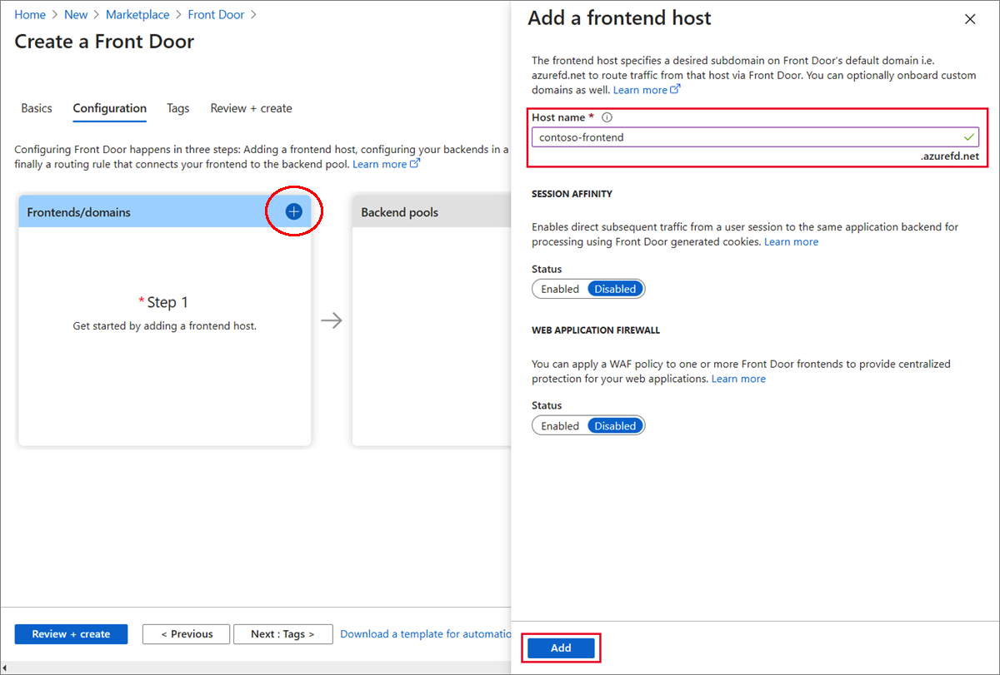
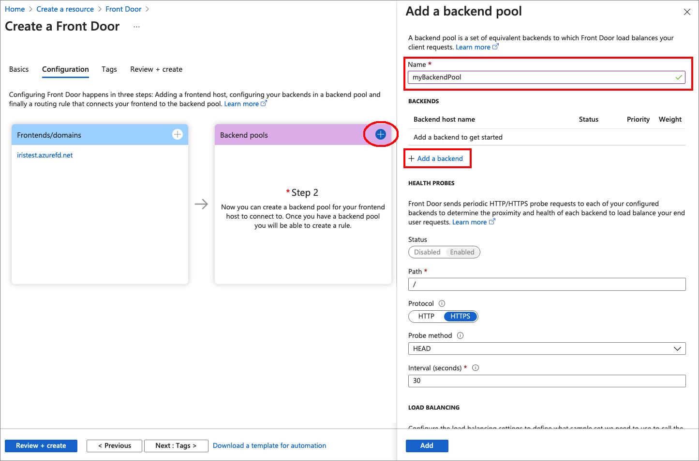
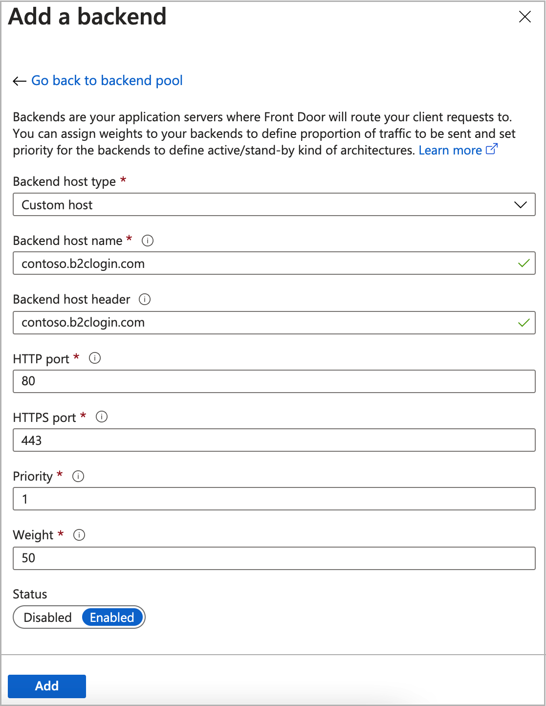
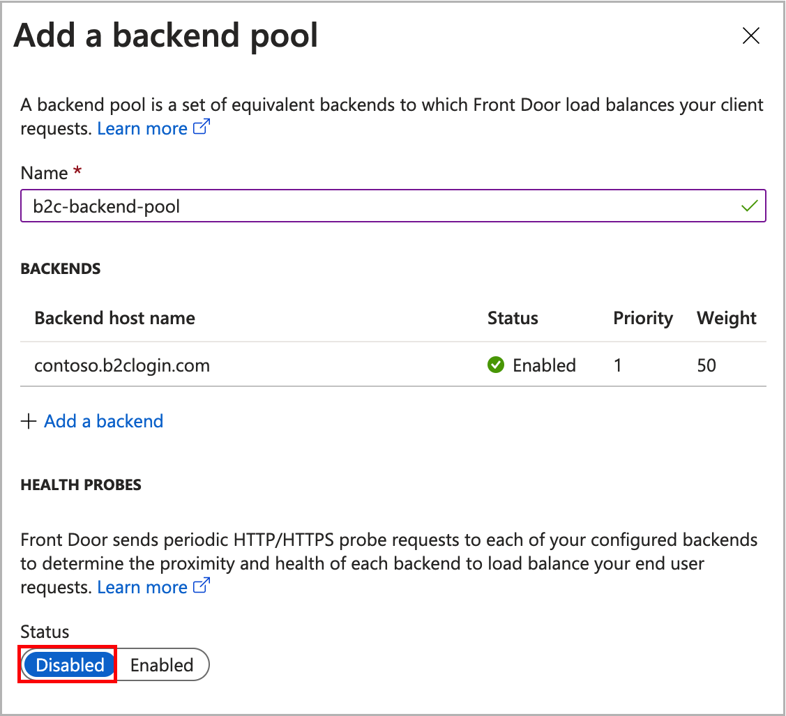
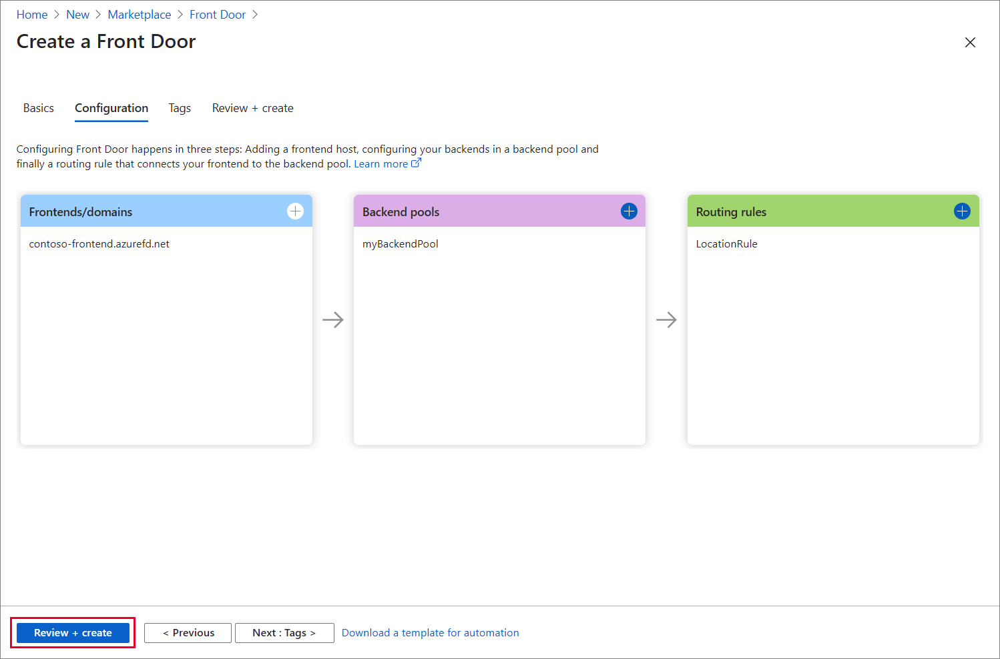
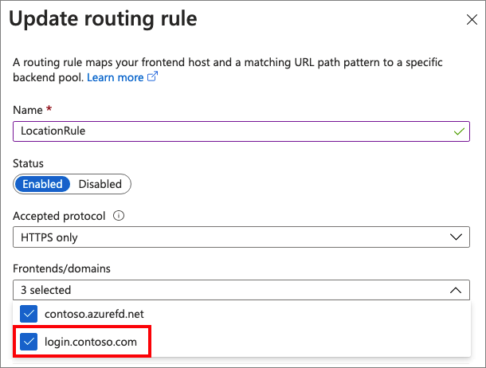
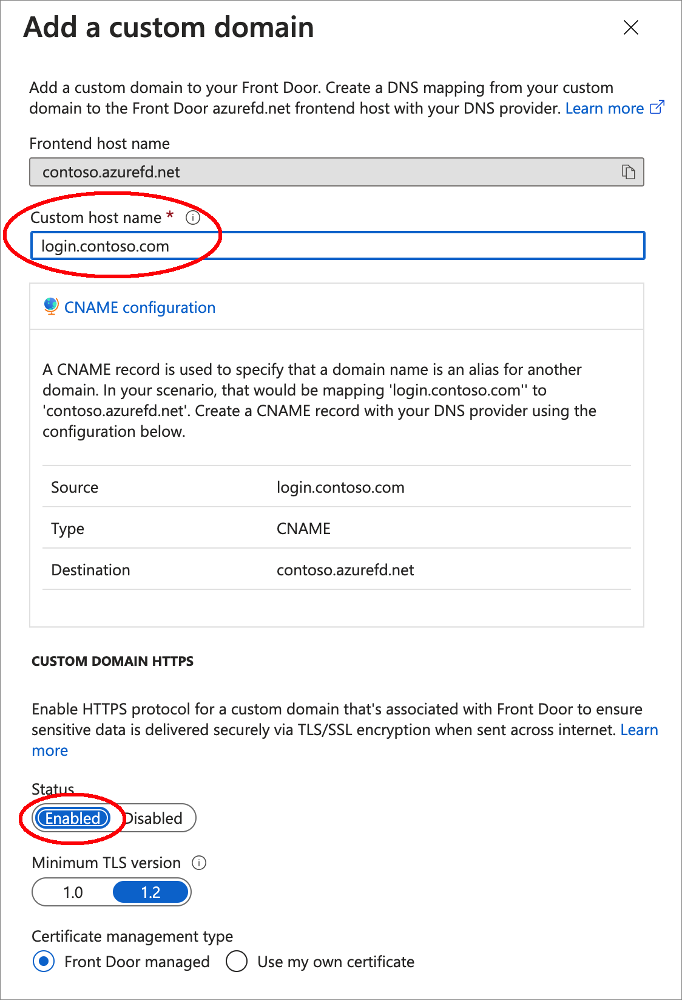
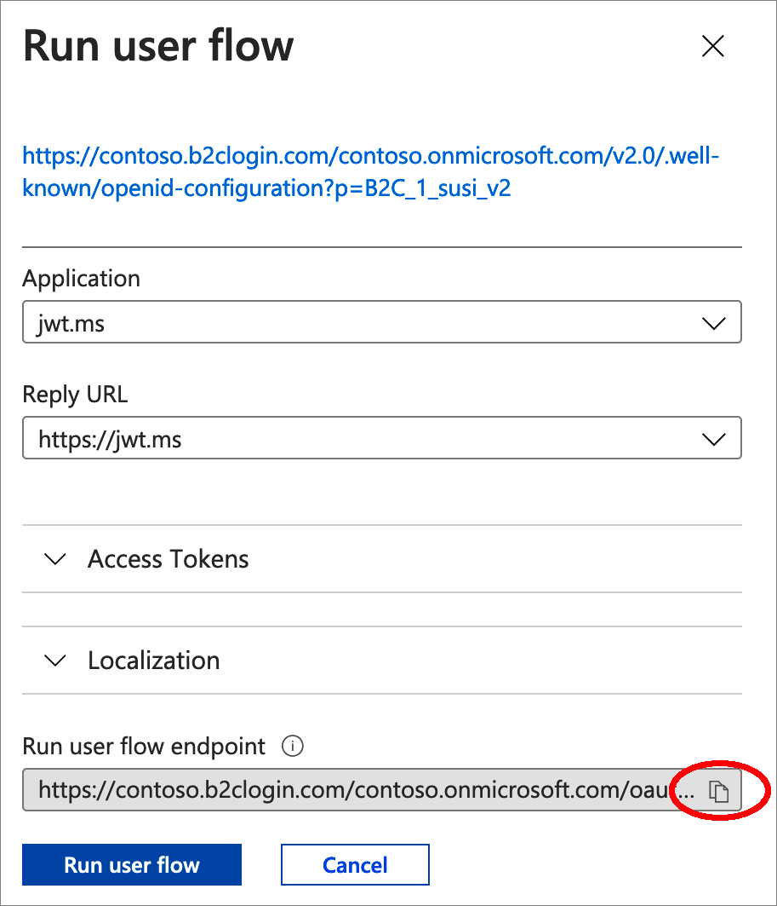

# Enable custom domains for Azure Active Directory B2C

[!INCLUDE [active-directory-b2c-choose-user-flow-or-custom-policy](../../includes/active-directory-b2c-choose-user-flow-or-custom-policy.md)]

[!INCLUDE [b2c-public-preview-feature](../../includes/active-directory-b2c-public-preview.md)]

This article describes how to enable custom domains in your redirect URLs for Azure Active Directory B2C (Azure AD B2C). Using a custom domain with your application provides a more seamless user experience. From the user's perspective, they remain in your domain during the sign-in process rather than redirecting to the Azure AD B2C default domain *<tenant-name>.b2clogin.com*.



## Custom domain overview

You can enable custom domains for Azure AD B2C by using [Azure Front Door](https://azure.microsoft.com/services/frontdoor/). Azure Front Door is a global entry point that uses the Microsoft global edge network to create fast, secure, and widely scalable web applications. You can render Azure AD B2C content behind Azure Front Door, and then configure an option in Azure Front Door to deliver the content via a custom domain in your application's URL.

The following diagram illustrates Azure Front Door integration:

1. From an application, a user selects the sign-in button, which takes them to the Azure AD B2C sign-in page. This page specifies a custom domain name.
1. The web browser resolves the custom domain name to the Azure Front Door IP address. During DNS resolution, a canonical name (CNAME) record with a custom domain name points to your Front Door default front-end host (for example, `contoso.azurefd.net`). 
1. The traffic addressed to the custom domain (for example, `login.contoso.com`) is routed to the specified Front Door default front-end host (`contoso.azurefd.net`).
1. Azure Front Door invokes Azure AD B2C content using the Azure AD B2C `<tenant-name>.b2clogin.com` default domain. The request to the Azure AD B2C endpoint includes the original custom domain name.
1. Azure AD B2C responds to the request by displaying the relevant content and the original custom domain.



> [!IMPORTANT]
> The connection from the browser to Azure Front Door should always use IPv4 instead of IPv6.

When using custom domains, consider the following:

- You can set up multiple custom domains. For the maximum number of supported custom domains, see [Azure AD service limits and restrictions](../active-directory/enterprise-users/directory-service-limits-restrictions.md) for Azure AD B2C and [Azure subscription and service limits, quotas, and constraints](../azure-resource-manager/management/azure-subscription-service-limits.md#azure-front-door-service-limits) for Azure Front Door.
- Azure Front Door is a separate Azure service, so extra charges will be incurred. For more information, see [Front Door pricing](https://azure.microsoft.com/pricing/details/frontdoor).
- To use Azure Front Door [Web Application Firewall](../web-application-firewall/afds/afds-overview.md), you need to confirm your firewall configuration and rules work correctly with your Azure AD B2C user flows.
- After you configure custom domains, users will still be able to access the Azure AD B2C default domain name *<tenant-name>.b2clogin.com* (unless you're using a custom policy and you [block access](#block-access-to-the-default-domain-name).
- If you have multiple applications, migrate them all to the custom domain because the browser stores the Azure AD B2C session under the domain name currently being used.

## Prerequisites

[!INCLUDE [active-directory-b2c-customization-prerequisites](../../includes/active-directory-b2c-customization-prerequisites.md)]


## Step 1. Add a custom domain name to your Azure AD B2C tenant

Follow the guidance for how to [add and validate your custom domain in Azure AD](../active-directory/fundamentals/add-custom-domain.md). After the domain is verified, delete the DNS TXT record you created.

> [!IMPORTANT]
> For these steps, be sure to sign in to your **Azure AD B2C** tenant and select the **Azure Active Directory** service.

Verify each subdomain you plan to use. Verifying just the top-level domain isn't sufficient. For example, to be able to sign-in with *login.contoso.com* and *account.contoso.com*, you need to verify both subdomains and not just the top-level domain *contoso.com*.  

> [!TIP]
> You can manage your custom domain with any publicly available DNS service, such as GoDaddy. If you don't have a DNS server, you can use App Service domains. To use App Service domains:
>
> 1. [Buy a custom domain name](/azure/app-service/manage-custom-dns-buy-domain). 
> 1. [Add your custom domain in Azure AD](../active-directory/fundamentals/add-custom-domain.md). 
> 1. Validate the domain name by [managing custom DNS records](/azure/app-service/manage-custom-dns-buy-domain#manage-custom-dns-records).
    
## Step 2. Create a new Azure Front Door instance

Follow these steps to create a Front Door for your Azure AD B2C tenant. For more information, see [creating a Front Door for your application](../frontdoor/quickstart-create-front-door.md#create-a-front-door-for-your-application).
  

1. Sign in to the [Azure portal](https://portal.azure.com).
1. Select **Directory + subscription** and choose the directory that contains the Azure subscription you’d like to use for Azure Front Door. The directory should *not* be the directory containing your Azure AD B2C tenant.
1. From the home page or the Azure menu, select **Create a resource**. Select **Networking** > **See All** > **Front Door**.
1. In the **Basics** tab of **Create a Front Door** page, enter or select the following information, and then select **Next: Configuration**.

    | Setting | Value |
    | --- | --- |
    | **Subscription** | Select your Azure subscription. |    
    | **Resource group** | Select an existing resource group, or select **Create new** to create a new one.|
    | **Resource group location** | Select the location of the resource group. For example, **Central US**. |

### 2.1 Add frontend host

The frontend host is the domain name used by your application. When you create a Front Door, the default frontend host is a subdomain of `azurefd.net`.

Azure Front Door provides the option of associating a custom domain with the frontend host. With this option, you associate the Azure AD B2C user interface  with a custom domain in your URL instead of a Front Door owned domain name. For example, https://login.contoso.com.

To add a frontend host, follow these steps:

1. In **Frontends/domains**, select **+** to open **Add a frontend host**.
1. For **Host name**, enter a globally unique hostname. The host name is not your custom domain. This example uses *contoso-frontend*. Select **Add**.

    

### 2.2 Add backend and backend pool

A backend refers to your [Azure AD B2C tenant name](tenant-management.md#get-your-tenant-name), `tenant-name.b2clogin.com`. To add a backend pool, follow these steps:

1. Still in **Create a Front Door**, in **Backend pools**, select **+** to open **Add a backend pool**.

1. Enter a **Name**. For example, *myBackendPool*. Select **Add a backend**.
    
    The following screenshot demonstrates how to create a backend pool:
    
    

1. In the **Add a backend** blade, select the following information, and then select **Add**.

    | Setting | Value |
    | --- | --- |
    | **Backend host type**| Select **Custom host**.| 
    | **Backend host name**| Select the name of your [Azure AD B2C](tenant-management.md#get-your-tenant-name), `<tenant-name>.b2clogin.com`. For example, contoso.b2clogin.com.|
    | **Backend host header**| Select the same value you selected for **Backend host name**.|
    
    **Leave all other fields default.*
    
    The following screenshot demonstrates how to create a custom host backend that is associated with an Azure AD B2C tenant:
    
    

1. To complete the configuration of the backend pool, on the **Add a backend pool** blade, select **Add**.

1. After you add the **backend** to the **backend pool**, disable the **Health probes**.

    

### 2.3 Add a routing rule

Finally, add a routing rule. The routing rule maps your frontend host to the backend pool. The rule forwards a request for the [frontend host](#21-add-frontend-host) to the Azure AD B2C [backend](#22-add-backend-and-backend-pool). To add a routing rule, follow these steps:

1. In **Add a rule**, for **Name**, enter *LocationRule*. Accept all the default values, then select **Add** to add the routing rule.
1. Select **Review + Create**, and then **Create**.
    
     


## Step 3. Set up your custom domain on Azure Front Door

In this step, you add the custom domain you registered in [Step 1](#step-1-add-a-custom-domain-name-to-your-azure-ad-b2c-tenant) to your Front Door. 

### 3.1 Create a CNAME DNS record

Before you can use a custom domain with your Front Door, you must first create a canonical name (CNAME) record with your domain provider to point to your Front Door's default frontend host (say contoso.azurefd.net).

A CNAME record is a type of DNS record that maps a source domain name to a destination domain name. For Azure Front Door, the source domain name is your custom domain name, and the destination domain name is your Front Door default hostname you configure in [step 2.1](#21-add-frontend-host). 

After Front Door verifies the CNAME record that you created, traffic addressed to the source custom domain (such as login.contoso.com) is routed to the specified destination Front Door default frontend host, such as `contoso.azurefd.net`. For more information, see [add a custom domain to your Front Door](../frontdoor/front-door-custom-domain.md). 

To create a CNAME record for your custom domain:

1. Sign in to the web site of the domain provider for your custom domain.

1. Find the page for managing DNS records by consulting the provider's documentation or searching for areas of the web site labeled **Domain Name**, **DNS**, or **Name Server Management**. 

1. Create a CNAME record entry for your custom domain and complete the fields as shown in the following table (field names may vary):

    | Source          | Type  | Destination           |
    |-----------------|-------|-----------------------|
    | `<login.contoso.com>` | CNAME | `contoso.azurefd.net` |

   - Source: Enter your custom domain name (for example, login.contoso.com).

   - Type: Enter *CNAME*.

   - Destination: Enter your default Front Door frontend host you create in [step 2.1](#21-add-frontend-host). It must be in the following format:_&lt;hostname&gt;_.azurefd.net. For example, `contoso.azurefd.net`.

1. Save your changes.

### 3.2 Associate the custom domain with your Front Door

After you've registered your custom domain, you can then add it to your Front Door.
    
1. On the **Front Door designer** page, select **+** to add a custom domain.
    
1. For **Frontend host**, the frontend host to use as the destination domain of your CNAME record is pre-filled and is derived from your Front Door: *&lt;default hostname&gt;*.azurefd.net. It cannot be changed.

1. For **Custom hostname**, enter your custom domain, including the subdomain, to use as the source domain of your CNAME record. For example, login.contoso.com.

1. Select **Add**.

   Azure verifies that the CNAME record exists for the custom domain name you entered. If the CNAME is correct, your custom domain will be validated.

### 3.3 Update the routing rule

1. In the **Routing rules**, select the routing rule you created in [step 2.3](#23-add-a-routing-rule).
1. Under the **Frontends/domains**, select your custom domain name.
    
    

1. Select **Update**.
1. From the main window, select **Save**.
    
### 3.4 Configure HTTPS on a Front Door custom domain

After the custom domain name is verified, select **Custom domain name HTTPS**. Then under the **Certificate management type**, select [Front Door management](../frontdoor/front-door-custom-domain-https.md#option-1-default-use-a-certificate-managed-by-front-door), or [Use my own certificate](../frontdoor/front-door-custom-domain-https.md#option-2-use-your-own-certificate). If you choose the *Front Door managed*  option, wait until the certificate is fully provisioned.

The following screenshot shows how to add a custom domain and enable HTTPS using an Azure Front Door certificate.

 


## Step 4. Configure CORS

If you [customize the Azure AD B2C user interface](customize-ui-with-html.md) with an HTML template, you need to [Configure CORS](customize-ui-with-html.md?pivots=b2c-user-flow.md#3-configure-cors) with your custom domain.

Configure Azure Blob storage for Cross-Origin Resource Sharing with the following steps:

1. In the [Azure portal](https://portal.azure.com), navigate to your storage account.
1. In the menu, select **CORS**.
1. For **Allowed origins**, enter `https://your-domain-name`. Replace `your-domain-name` with your domain name. For example, `https://login.contoso.com`. Use all lowercase letters when entering your tenant name.
1. For **Allowed Methods**, select both `GET` and `OPTIONS`.
1. For **Allowed Headers**, enter an asterisk (*).
1. For **Exposed Headers**, enter an asterisk (*).
1. For **Max age**, enter 200.
1. Select **Save**.

## Test your custom domain

1. Sign in to the [Azure portal](https://portal.azure.com).
1. Select the **Directory + subscription** filter in the top menu, and then select the directory that contains your Azure AD B2C tenant.
1. In the Azure portal, search for and select **Azure AD B2C**.
1. Under **Policies**, select **User flows (policies)**.
1. Select a user flow, and then select **Run user flow**.
1. For **Application**, select the web application named *webapp1* that you previously registered. The **Reply URL** should show `https://jwt.ms`.
1. Click **Copy to clipboard**.

    

1. In the **Run user flow endpoint** URL, replace the Azure AD B2C domain (<tenant-name>.b2clogin.com) with your custom domain.  
    For example, instead of:

    ```http
    https://contoso.b2clogin.com/contoso.onmicrosoft.com/oauth2/v2.0/authorize?p=B2C_1_susi&client_id=63ba0d17-c4ba-47fd-89e9-31b3c2734339&nonce=defaultNonce&redirect_uri=https%3A%2F%2Fjwt.ms&scope=openid&response_type=id_token&prompt=login
    ```

    use:

    ```http
    https://login.contoso.com/contoso.onmicrosoft.com/oauth2/v2.0/authorize?p=B2C_1_susi&client_id=63ba0d17-c4ba-47fd-89e9-31b3c2734339&nonce=defaultNonce&redirect_uri=https%3A%2F%2Fjwt.ms&scope=openid&response_type=id_token&prompt=login    
    ```
1. Select **Run user flow**. Your Azure AD B2C policy should load.
1. Sign-in with Azure AD B2C local account.
1. Repeat the test with the rest of your policies.

## Configure your identity provider

When a user chooses to sign in with a social identity provider, Azure AD B2C initiates an authorization request and takes the user to the selected identity provider to complete the sign-in process. The authorization request specifies the `redirect_uri` with the Azure AD B2C default domain name: 

```http
https://<tenant-name>.b2clogin.com/<tenant-name>/oauth2/authresp
```

If you configured your policy to allow sign-in with an external identity provider, update the OAuth redirect URIs with the custom domain. Most identity providers allow you to register multiple redirect URIs. We recommend adding redirect URIs instead of replacing them so you can test your custom policy without affecting applications that use the Azure AD B2C default domain name. 

In the following redirect URI:

```http
https://<custom-domain-name>/<tenant-name>/oauth2/authresp
``` 

- Replace **<custom-domain-name>** with your custom domain name.
- Replace **<tenant-name>** with the name of your tenant, or your tenant ID.

The following example shows a valid OAuth redirect URI:

```http
https://login.contoso.com/contoso.onmicrosoft.com/oauth2/authresp
```

If you choose to use the [tenant ID](#optional-use-tenant-id), a valid OAuth redirect URI would look like the following sample:

```http
https://login.contoso.com/11111111-1111-1111-1111-111111111111/oauth2/authresp
```

The [SAML identity providers](saml-identity-provider-technical-profile.md) metadata would look like the following sample:

```http
https://<custom-domain-name>.b2clogin.com/<tenant-name>/<your-policy>/samlp/metadata?idptp=<your-technical-profile>
```

## Configure your application 

After you configure and test the custom domain, you can update your applications to load the URL that specifies your custom domain as the hostname instead of the Azure AD B2C domain. 

The custom domain integration applies to authentication endpoints that use Azure AD B2C policies (user flows or custom policies) to authenticate users. These endpoints may look like the following sample:

- <code>https://\<custom-domain\>/\<tenant-name\>/<b>\<policy-name\></b>/v2.0/.well-known/openid-configuration</code>

- <code>https://\<custom-domain\>/\<tenant-name\>/<b>\<policy-name\></b>/oauth2/v2.0/authorize</code>

- <code>https://\<custom-domain\>/<tenant-name\>/<b>\<policy-name\></b>/oauth2/v2.0/token</code>

Replace:
- **custom-domain** with your custom domain
- **tenant-name** with your tenant name or tenant ID
- **policy-name** with your policy name. [Learn more about Azure AD B2C policies](technical-overview.md#identity-experiences-user-flows-or-custom-policies). 


The [SAML service provider](./saml-service-provider.md) metadata may look like the following sample: 

```html
https://custom-domain-name/tenant-name/policy-name/Samlp/metadata
```

### (Optional) Use tenant ID

You can replace your B2C tenant name in the URL with your tenant ID GUID so as to remove all references to “b2c” in the URL. You can find your tenant ID GUID in the B2C Overview page in Azure portal.
For example, change `https://account.contosobank.co.uk/contosobank.onmicrosoft.com/` 
to 
`https://account.contosobank.co.uk/<tenant ID GUID>/`

If you choose to use tenant ID instead of tenant name, be sure to update the identity provider **OAuth redirect URIs** accordingly. For more information, see [Configure your identity provider](#configure-your-identity-provider).

### Token issuance

The token issuer name (iss) claim changes based on the custom domain being used. For example:

```http
https://<domain-name>/11111111-1111-1111-1111-111111111111/v2.0/
```

::: zone pivot="b2c-custom-policy"

## Block access to the default domain name

After you add the custom domain and configure your application, users will still be able to access the <tenant-name>.b2clogin.com domain. To prevent access, you can configure the policy to check the authorization request "host name" against an allowed list of domains. The host name is the domain name that appears in the URL. The host name is available through `{Context:HostName}` [claim resolvers](claim-resolver-overview.md). Then you can present a custom error message. 

1. Get the example of a conditional access policy that checks the host name from [GitHub](https://github.com/azure-ad-b2c/samples/blob/master/policies/check-host-name).
1. In each file, replace the string `yourtenant` with the name of your Azure AD B2C tenant. For example, if the name of your B2C tenant is *contosob2c*, all instances of `yourtenant.onmicrosoft.com` become `contosob2c.onmicrosoft.com`.
1. Upload the policy files in the following order: `B2C_1A_TrustFrameworkExtensions_HostName.xml` and then `B2C_1A_signup_signin_HostName.xml`.

::: zone-end

## Troubleshooting

### Azure AD B2C returns a page not found error

- **Symptom** - After you configure a custom domain, when you try to sign in with the custom domain, you get an HTTP 404 error message.
- **Possible causes** - This issue could be related to the DNS configuration or the Azure Front Door backend configuration. 
- **Resolution**:  
    1. Make sure the custom domain is [registered and successfully verified](#step-1-add-a-custom-domain-name-to-your-azure-ad-b2c-tenant) in your Azure AD B2C tenant.
    1. Make sure the [custom domain](../frontdoor/front-door-custom-domain.md) is configured properly. The `CNAME` record for your custom domain must point to your Azure Front Door default frontend host (for example, contoso.azurefd.net).
    1. Make sure the [Azure Front Door backend pool configuration](#22-add-backend-and-backend-pool) points to the tenant where you set up the custom domain name, and where your user flow or custom policies are stored.

### Identify provider returns an error

- **Symptom** - After you configure a custom domain, you're able to sign in with local accounts. But when you sign in with credentials from external [social or enterprise identity providers](add-identity-provider.md), the identity provider presents an error message.
- **Possible causes** - When Azure AD B2C takes the user to sign in with a federated identity provider, it specifies the redirect URI. The redirect URI is the endpoint to where the identity provider returns the token. The redirect URI is the same domain your application uses with the authorization request. If the redirect URI is not yet registered in the identity provider, it may not trust the new redirect URI, which results in an error message. 
- **Resolution** -  Follow the steps in [Configure your identity provider](#configure-your-identity-provider) to add the new redirect URI. 


## Frequently asked questions

### Can I use Azure Front Door advanced configuration, such as *Web application firewall Rules*? 
  
While Azure Front Door advanced configuration settings are not officially supported, you can use them at your own risk. 

### When I use Run Now to try to run my policy, why I can't see the custom domain?

Copy the URL, change the domain name manually, and then paste it back to your browser.

### Which IP address is presented to Azure AD B2C? The user's IP address, or the Azure Front Door IP address?

Azure Front Door passes the user's original IP address. It's the IP address that you'll see in the audit reporting or your custom policy.

### Can I use a third-party web application firewall (WAF) with B2C?

To use your own web application firewall in front of Azure Front Door, you need to configure and validate that everything works correctly with your Azure AD B2C user flows, or custom polies.  

## Next steps

Learn about [OAuth authorization requests](protocols-overview.md).
