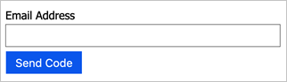

# Custom email verification with SendGrid

[!INCLUDE [active-directory-b2c-choose-user-flow-or-custom-policy](../../includes/active-directory-b2c-choose-user-flow-or-custom-policy.md)]

Use custom email in Azure Active Directory B2C (Azure AD B2C) to send customized email to users that sign up to use your applications. By using the third-party email provider SendGrid, you can use your own email template and *From:* address and subject, as well as support localization and custom one-time password (OTP) settings.

::: zone pivot="b2c-user-flow"

[!INCLUDE [active-directory-b2c-limited-to-custom-policy](../../includes/active-directory-b2c-limited-to-custom-policy.md)]

::: zone-end

::: zone pivot="b2c-custom-policy"

Custom email verification requires the use of a third-party email provider like [SendGrid](https://sendgrid.com), [Mailjet](https://www.mailjet.com/), or [SparkPost](https://messagebird.com/email/cloud-sending?sp=true), a custom REST API, or any HTTP-based email provider (including your own). This article describes setting up a solution that uses SendGrid.

## Create a SendGrid account

If you don't already have one, start by setting up a SendGrid account. For setup instructions, see the [Create a SendGrid Account](https://docs.sendgrid.com/for-developers/partners/microsoft-azure-2021#create-a-sendgrid-account) section of [How to send email using SendGrid with Azure](https://docs.sendgrid.com/for-developers/partners/microsoft-azure-2021#create-a-twilio-sendgrid-accountcreate-a-twilio-sendgrid-account).

Be sure to complete the section in which you [create a SendGrid API key](https://docs.sendgrid.com/for-developers/partners/microsoft-azure-2021#to-find-your-sendgrid-api-key). Record the API key for use in a later step.

> [!IMPORTANT]
> SendGrid offers customers the ability to send emails from shared IP and [dedicated IP addresses](https://docs.sendgrid.com/ui/account-and-settings/dedicated-ip-addresses). When using dedicated IP addresses, you need to build your own reputation properly with an IP address warm-up. For more information, see [Warming Up An Ip Address](https://docs.sendgrid.com/ui/sending-email/warming-up-an-ip-address).

## Create Azure AD B2C policy key

Next, store the SendGrid API key in an Azure AD B2C policy key for your policies to reference.

1. Sign in to the [Azure portal](https://portal.azure.com).
1. Make sure you're using the directory that contains your Azure AD B2C tenant. Select the **Directories + subscriptions** icon in the portal toolbar.
1. On the **Portal settings | Directories + subscriptions** page, find your Azure AD B2C directory in the **Directory name** list, and then select **Switch**.
1. Choose **All services** in the top-left corner of the Azure portal, and then search for and select **Azure AD B2C**.
1. On the Overview page, select **Identity Experience Framework**.
1. Select **Policy Keys** and then select **Add**.
1. For **Options**, choose **Manual**.
1. Enter a **Name** for the policy key. For example, `SendGridSecret`. The prefix `B2C_1A_` is added automatically to the name of your key.
1. In **Secret**, enter the SendGrid API key that you previously recorded.
1. For **Key usage**, select **Signature**.
1. Select **Create**.

## Create SendGrid template

With a SendGrid account created and SendGrid API key stored in an Azure AD B2C policy key, create a SendGrid [dynamic transactional template](https://docs.sendgrid.com/ui/sending-email/how-to-send-an-email-with-dynamic-templates).

1. On the SendGrid site, open the [transactional templates](https://sendgrid.com/dynamic_templates) page and select **Create a Dynamic Template**.
1. Enter a unique template name like `Verification email` and then select **Create**.
1. To begin editing your new template, select the template i.e. `Verification email`, then select **Add Version**.
1. Select **Blank Template** and then **Code Editor**.
1. In the HTML editor, paste following HTML template or use your own. The `{{otp}}` and `{{email}}` parameters will be replaced dynamically with the one-time password value and the user email address.

    ```html
    <!DOCTYPE html PUBLIC "-//W3C//DTD XHTML 1.0 Transitional//EN" "http://www.w3.org/TR/xhtml1/DTD/xhtml1-transitional.dtd">

    <html xmlns="http://www.w3.org/1999/xhtml" dir="ltr" lang="en"><head id="Head1">
    <meta http-equiv="Content-Type" content="text/html; charset=utf-8"><title>Contoso demo account email verification code</title><meta name="ROBOTS" content="NOINDEX, NOFOLLOW">
       <style>
           table td {border-collapse:collapse;margin:0;padding:0;}
       </style>
    </head>
    <body dir="ltr" lang="en">
       <table width="100%" cellpadding="0" cellspacing="0" border="0" dir="ltr" lang="en">
            <tr>
               <td valign="top" width="50%"></td>
               <td valign="top">
                  <!-- Email Header -->
                  <table width="640" cellpadding="0" cellspacing="0" border="0" dir="ltr" lang="en" style="border-left:1px solid #e3e3e3;border-right: 1px solid #e3e3e3;">
                   <tr style="background-color: #0072C6;">
                       <td width="1" style="background:#0072C6; border-top:1px solid #e3e3e3;"></td>
                       <td width="24" style="border-top:1px solid #e3e3e3;border-bottom:1px solid #e3e3e3;">&nbsp;</td>
                       <td width="310" valign="middle" style="border-top:1px solid #e3e3e3; border-bottom:1px solid #e3e3e3;padding:12px 0;">
                           <h1 style="line-height:20pt;font-family:Segoe UI Light; font-size:18pt; color:#ffffff; font-weight:normal;">
                            <span id="HeaderPlaceholder_UserVerificationEmailHeader"><font color="#FFFFFF">Verify your email address</font></span>
                           </h1>
                       </td>
                       <td width="24" style="border-top: 1px solid #e3e3e3;border-bottom: 1px solid #e3e3e3;">&nbsp;</td>
                   </tr>
                  </table>
                  <!-- Email Content -->
                  <table width="640" cellpadding="0" cellspacing="0" border="0" dir="ltr" lang="en">
                   <tr>
                       <td width="1" style="background:#e3e3e3;"></td>
                       <td width="24">&nbsp;</td>
                       <td id="PageBody" width="640" valign="top" colspan="2" style="border-bottom:1px solid #e3e3e3;padding:10px 0 20px;border-bottom-style:hidden;">
                           <table cellpadding="0" cellspacing="0" border="0">
                               <tr>
                                   <td width="630" style="font-size:10pt; line-height:13pt; color:#000;">
                                       <table cellpadding="0" cellspacing="0" border="0" width="100%" style="" dir="ltr" lang="en">
                                           <tr>
                                               <td>

       <div style="font-family:'Segoe UI', Tahoma, sans-serif; font-size:14px; color:#333;">
           <span id="BodyPlaceholder_UserVerificationEmailBodySentence1">Thanks for verifying your {{email}} account!</span>
       </div>
       <br>
       <div style="font-family:'Segoe UI', Tahoma, sans-serif; font-size:14px; color:#333; font-weight: bold">
           <span id="BodyPlaceholder_UserVerificationEmailBodySentence2">Your code is: {{otp}}</span>
       </div>
       <br>
       <br>

                                                   <div style="font-family:'Segoe UI', Tahoma, sans-serif; font-size:14px; color:#333;">
                                                   Sincerely,
                                                   </div>
                                                   <div style="font-family:'Segoe UI', Tahoma, sans-serif; font-size:14px; font-style:italic; color:#333;">
                                                       Contoso
                                                   </div>
                                               </td>
                                           </tr>
                                       </table>
                                   </td>
                               </tr>
                           </table>

                       </td>

                       <td width="1">&nbsp;</td>
                       <td width="1"></td>
                       <td width="1">&nbsp;</td>
                       <td width="1" valign="top"></td>
                       <td width="29">&nbsp;</td>
                       <td width="1" style="background:#e3e3e3;"></td>
                   </tr>
                   <tr>
                       <td width="1" style="background:#e3e3e3; border-bottom:1px solid #e3e3e3;"></td>
                       <td width="24" style="border-bottom:1px solid #e3e3e3;">&nbsp;</td>
                       <td id="PageFooterContainer" width="585" valign="top" colspan="6" style="border-bottom:1px solid #e3e3e3;padding:0px;">

                       </td>

                       <td width="29" style="border-bottom:1px solid #e3e3e3;">&nbsp;</td>
                       <td width="1" style="background:#e3e3e3; border-bottom:1px solid #e3e3e3;"></td>
                   </tr>
                  </table>

               </td>
               <td valign="top" width="50%"></td>
           </tr>
       </table>
    </body>
    </html>
    ```

1. Expand **Settings** on the left, and for **Version Name**, enter a template version.
1. For **Subject**, enter `{{subject}}`.
1. A the top of the page, select **Save**.
1. Return to the **Transactional Templates** page by selecting the back arrow.
1. Record the **ID** of template you created for use in a later step. For example, `d-989077fbba9746e89f3f6411f596fb96`. You specify this ID when you [add the claims transformation](#add-the-claims-transformation).

[!INCLUDE [active-directory-b2c-important-for-custom-email-provider](../../includes/active-directory-b2c-important-for-custom-email-provider.md)]

## Add Azure AD B2C claim types

In your policy, add the following claim types to the `<ClaimsSchema>` element within `<BuildingBlocks>`.

These claims types are necessary to generate and verify the email address using a one-time password (OTP) code.

```xml
<!-- 
<BuildingBlocks>
  <ClaimsSchema> -->
    <ClaimType Id="Otp">
      <DisplayName>Secondary One-time password</DisplayName>
      <DataType>string</DataType>
    </ClaimType>
    <ClaimType Id="emailRequestBody">
      <DisplayName>SendGrid request body</DisplayName>
      <DataType>string</DataType>
    </ClaimType>
    <ClaimType Id="VerificationCode">
      <DisplayName>Secondary Verification Code</DisplayName>
      <DataType>string</DataType>
      <UserHelpText>Enter your email verification code</UserHelpText>
      <UserInputType>TextBox</UserInputType>
    </ClaimType>
  <!-- 
  </ClaimsSchema>
</BuildingBlocks> -->
```

## Add the claims transformation

Next, you need a claims transformation to output a JSON string claim that will be the body of the request sent to SendGrid.

The JSON object's structure is defined by the IDs in dot notation of the InputParameters and the TransformationClaimTypes of the InputClaims. Numbers in the dot notation imply arrays. The values come from the InputClaims' values and the InputParameters' "Value" properties. For more information about JSON claims transformations, see [JSON claims transformations](json-transformations.md).

Add the following claims transformation to the `<ClaimsTransformations>` element within `<BuildingBlocks>`. Make the following updates to the claims transformation XML:

* Update the `template_id` InputParameter value with the ID of the SendGrid transactional template you created earlier in [Create SendGrid template](#create-sendgrid-template).
* Update the `from.email` address value. Use a valid email address to help prevent the verification email from being marked as spam.
   > [!NOTE]
   > This email address must be verified in SendGrid under Sender Authentication with either domain authentication or Single Sender Authentication.
* Update the value of the `personalizations.0.dynamic_template_data.subject` subject line input parameter with a subject line appropriate for your organization.

```xml
<!-- 
<BuildingBlocks>
  <ClaimsTransformations> -->
    <ClaimsTransformation Id="GenerateEmailRequestBody" TransformationMethod="GenerateJson">
      <InputClaims>
        <InputClaim ClaimTypeReferenceId="email" TransformationClaimType="personalizations.0.to.0.email" />
        <InputClaim ClaimTypeReferenceId="otp" TransformationClaimType="personalizations.0.dynamic_template_data.otp" />
        <InputClaim ClaimTypeReferenceId="email" TransformationClaimType="personalizations.0.dynamic_template_data.email" />
      </InputClaims>
      <InputParameters>
        <!-- Update the template_id value with the ID of your SendGrid template. -->
        <InputParameter Id="template_id" DataType="string" Value="d-989077fbba9746e89f3f6411f596fb96"/>
        <InputParameter Id="from.email" DataType="string" Value="my_email@mydomain.com"/>
        <!-- Update with a subject line appropriate for your organization. -->
        <InputParameter Id="personalizations.0.dynamic_template_data.subject" DataType="string" Value="Contoso account email verification code"/>
      </InputParameters>
      <OutputClaims>
        <OutputClaim ClaimTypeReferenceId="emailRequestBody" TransformationClaimType="outputClaim"/>
      </OutputClaims>
    </ClaimsTransformation>
  <!--
  </ClaimsTransformations>
</BuildingBlocks> -->
```

## Add DataUri content definition

Below the claims transformations within `<BuildingBlocks>`, add the following [ContentDefinition](contentdefinitions.md) to reference the version 2.1.2 data URI:

```xml
<!--
<BuildingBlocks> -->
  <ContentDefinitions>
   <ContentDefinition Id="api.localaccountsignup">
      <DataUri>urn:com:microsoft:aad:b2c:elements:contract:selfasserted:2.1.2</DataUri>
    </ContentDefinition>
    <ContentDefinition Id="api.localaccountpasswordreset">
      <DataUri>urn:com:microsoft:aad:b2c:elements:contract:selfasserted:2.1.2</DataUri>
    </ContentDefinition>
  </ContentDefinitions>
<!--
</BuildingBlocks> -->
```

## Create a DisplayControl

A verification display control is used to verify the email address with a verification code that's sent to the user.

This example display control is configured to:

1. Collect the `email` address claim type from the user.
1. Using the `SendCode` action, generate an OTP code and send an email with the OTP code to the user.

    

1. Wait for the user to provide the `verificationCode` claim type with the code sent to the user.
1. Return the `email` back to the self-asserted technical profile that has a reference to this display control.


Under content definitions, still within `<BuildingBlocks>`, add the following [DisplayControl](display-controls.md) of type [VerificationControl](display-control-verification.md) to your policy.

```xml
<!--
<BuildingBlocks> -->
  <DisplayControls>
    <DisplayControl Id="emailVerificationControl" UserInterfaceControlType="VerificationControl">
      <DisplayClaims>
        <DisplayClaim ClaimTypeReferenceId="email" Required="true" />
        <DisplayClaim ClaimTypeReferenceId="verificationCode" ControlClaimType="VerificationCode" Required="true" />
      </DisplayClaims>
      <OutputClaims>
        <OutputClaim ClaimTypeReferenceId="email" />
      </OutputClaims>
      <Actions>
        <Action Id="SendCode">
          <ValidationClaimsExchange>
            <ValidationClaimsExchangeTechnicalProfile TechnicalProfileReferenceId="GenerateOtp" />
            <ValidationClaimsExchangeTechnicalProfile TechnicalProfileReferenceId="SendOtp" />
          </ValidationClaimsExchange>
        </Action>
        <Action Id="VerifyCode">
          <ValidationClaimsExchange>
            <ValidationClaimsExchangeTechnicalProfile TechnicalProfileReferenceId="VerifyOtp" />
          </ValidationClaimsExchange>
        </Action>
      </Actions>
    </DisplayControl>
  </DisplayControls>
<!--
</BuildingBlocks> -->
```

## Add OTP technical profiles

The `GenerateOtp` technical profile generates a code for the email address. The `VerifyOtp` technical profile verifies the code associated with the email address. You can change the configuration of the format and the expiration of the one-time password. For more information about OTP technical profiles, see [Define a one-time password technical profile](one-time-password-technical-profile.md).

> [!NOTE]
> OTP codes that are generated by the Web.TPEngine.Providers.OneTimePasswordProtocolProvider protocol are tied to the browser session. This means a user can generate unique OTP codes in different browser sessions that are each valid for their corresponding sessions. By contrast, an OTP code generated by the built-in email provider is independent of the browser session, so if a user generates a new OTP code in a new browser session, it replaces the previous OTP code.

Add the following technical profiles to the `<ClaimsProviders>` element.

```xml
<!--
<ClaimsProviders> -->
  <ClaimsProvider>
    <DisplayName>One time password technical profiles</DisplayName>
    <TechnicalProfiles>
      <TechnicalProfile Id="GenerateOtp">
        <DisplayName>Generate one time password</DisplayName>
        <Protocol Name="Proprietary" Handler="Web.TPEngine.Providers.OneTimePasswordProtocolProvider, Web.TPEngine, Version=1.0.0.0, Culture=neutral, PublicKeyToken=null" />
        <Metadata>
          <Item Key="Operation">GenerateCode</Item>
          <Item Key="CodeExpirationInSeconds">600</Item>
          <Item Key="CodeLength">6</Item>
          <Item Key="CharacterSet">0-9</Item>
          <Item Key="NumRetryAttempts">5</Item>
          <Item Key="NumCodeGenerationAttempts">10</Item>
          <Item Key="ReuseSameCode">false</Item>
        </Metadata>
        <InputClaims>
          <InputClaim ClaimTypeReferenceId="email" PartnerClaimType="identifier" />
        </InputClaims>
        <OutputClaims>
          <OutputClaim ClaimTypeReferenceId="otp" PartnerClaimType="otpGenerated" />
        </OutputClaims>
      </TechnicalProfile>

      <TechnicalProfile Id="VerifyOtp">
        <DisplayName>Verify one time password</DisplayName>
        <Protocol Name="Proprietary" Handler="Web.TPEngine.Providers.OneTimePasswordProtocolProvider, Web.TPEngine, Version=1.0.0.0, Culture=neutral, PublicKeyToken=null" />
        <Metadata>
          <Item Key="Operation">VerifyCode</Item>
        </Metadata>
        <InputClaims>
          <InputClaim ClaimTypeReferenceId="email" PartnerClaimType="identifier" />
          <InputClaim ClaimTypeReferenceId="verificationCode" PartnerClaimType="otpToVerify" />
        </InputClaims>
      </TechnicalProfile>
     </TechnicalProfiles>
  </ClaimsProvider>
<!--
</ClaimsProviders> -->
```

## Add a REST API technical profile

This REST API technical profile generates the email content (using the SendGrid format). For more information about RESTful technical profiles, see [Define a RESTful technical profile](restful-technical-profile.md).

As with the OTP technical profiles, add the following technical profiles to the `<ClaimsProviders>` element.

```xml
<ClaimsProvider>
  <DisplayName>RestfulProvider</DisplayName>
  <TechnicalProfiles>
    <TechnicalProfile Id="SendOtp">
      <DisplayName>Use SendGrid's email API to send the code the the user</DisplayName>
      <Protocol Name="Proprietary" Handler="Web.TPEngine.Providers.RestfulProvider, Web.TPEngine, Version=1.0.0.0, Culture=neutral, PublicKeyToken=null" />
      <Metadata>
        <Item Key="ServiceUrl">https://api.sendgrid.com/v3/mail/send</Item>
        <Item Key="AuthenticationType">Bearer</Item>
        <Item Key="SendClaimsIn">Body</Item>
        <Item Key="ClaimUsedForRequestPayload">emailRequestBody</Item>
      </Metadata>
      <CryptographicKeys>
        <Key Id="BearerAuthenticationToken" StorageReferenceId="B2C_1A_SendGridSecret" />
      </CryptographicKeys>
      <InputClaimsTransformations>
        <InputClaimsTransformation ReferenceId="GenerateEmailRequestBody" />
      </InputClaimsTransformations>
      <InputClaims>
        <InputClaim ClaimTypeReferenceId="emailRequestBody" />
      </InputClaims>
    </TechnicalProfile>
  </TechnicalProfiles>
</ClaimsProvider>
```

## Make a reference to the DisplayControl

In the final step, add a reference to the DisplayControl you created. Override your existing `LocalAccountSignUpWithLogonEmail` and `LocalAccountDiscoveryUsingEmailAddress` self-asserted technical profiles that are configured in the base policy with the following XML snippet. If you used an earlier version of Azure AD B2C policy, these technical profiles use `DisplayClaims` with a reference to the `DisplayControl`.

For more information, see [Self-asserted technical profile](restful-technical-profile.md) and [DisplayControl](display-controls.md).

```xml
<ClaimsProvider>
  <DisplayName>Local Account</DisplayName>
  <TechnicalProfiles>
    <TechnicalProfile Id="LocalAccountSignUpWithLogonEmail">
      <DisplayClaims>
        <DisplayClaim DisplayControlReferenceId="emailVerificationControl" />
        <DisplayClaim ClaimTypeReferenceId="displayName" Required="true" />
        <DisplayClaim ClaimTypeReferenceId="givenName" Required="true" />
        <DisplayClaim ClaimTypeReferenceId="surName" Required="true" />
        <DisplayClaim ClaimTypeReferenceId="newPassword" Required="true" />
        <DisplayClaim ClaimTypeReferenceId="reenterPassword" Required="true" />
      </DisplayClaims>
    </TechnicalProfile>
    <TechnicalProfile Id="LocalAccountDiscoveryUsingEmailAddress">
      <DisplayClaims>
        <DisplayClaim DisplayControlReferenceId="emailVerificationControl" />
      </DisplayClaims>
    </TechnicalProfile>
  </TechnicalProfiles>
</ClaimsProvider>
```

## [Optional] Localize your email

To localize the email, you must send localized strings to SendGrid, or your email provider. For example, you can localize the email subject, body, your code message, or signature of the email. To do so, you can use the [GetLocalizedStringsTransformation](string-transformations.md) claims transformation to copy localized strings into claim types. The `GenerateEmailRequestBody` claims transformation, which generates the JSON payload, uses input claims that contain the localized strings.

1. In your policy, define the following string claims: subject, message, codeIntro, and signature.
1. Define a [GetLocalizedStringsTransformation](string-transformations.md) claims transformation to substitute localized string values into the claims from step 1.
1. Change the `GenerateEmailRequestBody` claims transformation to use input claims with the following XML snippet.
1. Update your SendGrid template to use dynamic parameters in place of all the strings that will be localized by Azure AD B2C.

    ```xml
    <ClaimsTransformation Id="GetLocalizedStringsForEmail" TransformationMethod="GetLocalizedStringsTransformation">
      <OutputClaims>
        <OutputClaim ClaimTypeReferenceId="subject" TransformationClaimType="email_subject" />
        <OutputClaim ClaimTypeReferenceId="message" TransformationClaimType="email_message" />
        <OutputClaim ClaimTypeReferenceId="codeIntro" TransformationClaimType="email_code" />
        <OutputClaim ClaimTypeReferenceId="signature" TransformationClaimType="email_signature" />
      </OutputClaims>
    </ClaimsTransformation>
    <ClaimsTransformation Id="GenerateEmailRequestBody" TransformationMethod="GenerateJson">
      <InputClaims>
        <InputClaim ClaimTypeReferenceId="email" TransformationClaimType="personalizations.0.to.0.email" />
        <InputClaim ClaimTypeReferenceId="subject" TransformationClaimType="personalizations.0.dynamic_template_data.subject" />
        <InputClaim ClaimTypeReferenceId="otp" TransformationClaimType="personalizations.0.dynamic_template_data.otp" />
        <InputClaim ClaimTypeReferenceId="email" TransformationClaimType="personalizations.0.dynamic_template_data.email" />
        <InputClaim ClaimTypeReferenceId="message" TransformationClaimType="personalizations.0.dynamic_template_data.message" />
        <InputClaim ClaimTypeReferenceId="codeIntro" TransformationClaimType="personalizations.0.dynamic_template_data.codeIntro" />
        <InputClaim ClaimTypeReferenceId="signature" TransformationClaimType="personalizations.0.dynamic_template_data.signature" />
      </InputClaims>
      <InputParameters>
        <InputParameter Id="template_id" DataType="string" Value="d-1234567890" />
        <InputParameter Id="from.email" DataType="string" Value="my_email@mydomain.com" />
      </InputParameters>
      <OutputClaims>
        <OutputClaim ClaimTypeReferenceId="emailRequestBody" TransformationClaimType="outputClaim" />
      </OutputClaims>
    </ClaimsTransformation>
    ```

1. Add the following [Localization](localization.md) element.

    ```xml
    <!--
    <BuildingBlocks> -->
      <Localization Enabled="true">
        <SupportedLanguages DefaultLanguage="en" MergeBehavior="ReplaceAll">
          <SupportedLanguage>en</SupportedLanguage>
          <SupportedLanguage>es</SupportedLanguage>
        </SupportedLanguages>
        <LocalizedResources Id="api.custom-email.en">
          <LocalizedStrings>
            <!--Email template parameters-->
            <LocalizedString ElementType="GetLocalizedStringsTransformationClaimType" StringId="email_subject">Contoso account email verification code</LocalizedString>
            <LocalizedString ElementType="GetLocalizedStringsTransformationClaimType" StringId="email_message">Thanks for validating the account</LocalizedString>
            <LocalizedString ElementType="GetLocalizedStringsTransformationClaimType" StringId="email_code">Your code is</LocalizedString>
            <LocalizedString ElementType="GetLocalizedStringsTransformationClaimType" StringId="email_signature">Sincerely</LocalizedString>
          </LocalizedStrings>
        </LocalizedResources>
        <LocalizedResources Id="api.custom-email.es">
          <LocalizedStrings>
            <!--Email template parameters-->
            <LocalizedString ElementType="GetLocalizedStringsTransformationClaimType" StringId="email_subject">Código de verificación del correo electrónico de la cuenta de Contoso</LocalizedString>
            <LocalizedString ElementType="GetLocalizedStringsTransformationClaimType" StringId="email_message">Gracias por comprobar la cuenta de </LocalizedString>
            <LocalizedString ElementType="GetLocalizedStringsTransformationClaimType" StringId="email_code">Su código es</LocalizedString>
            <LocalizedString ElementType="GetLocalizedStringsTransformationClaimType" StringId="email_signature">Sinceramente</LocalizedString>
          </LocalizedStrings>
        </LocalizedResources>
      </Localization>
    <!--
    </BuildingBlocks> -->
    ```

1. Add references to the LocalizedResources elements by updating the [ContentDefinitions](contentdefinitions.md) element.

    ```xml
    <!--
    <BuildingBlocks> -->
      <ContentDefinitions>
        <ContentDefinition Id="api.localaccountsignup">
          <DataUri>urn:com:microsoft:aad:b2c:elements:contract:selfasserted:2.1.2</DataUri>
          <LocalizedResourcesReferences MergeBehavior="Prepend">
            <LocalizedResourcesReference Language="en" LocalizedResourcesReferenceId="api.custom-email.en" />
            <LocalizedResourcesReference Language="es" LocalizedResourcesReferenceId="api.custom-email.es" />
          </LocalizedResourcesReferences>
        </ContentDefinition>
        <ContentDefinition Id="api.localaccountpasswordreset">
          <DataUri>urn:com:microsoft:aad:b2c:elements:contract:selfasserted:2.1.2</DataUri>
          <LocalizedResourcesReferences MergeBehavior="Prepend">
            <LocalizedResourcesReference Language="en" LocalizedResourcesReferenceId="api.custom-email.en" />
            <LocalizedResourcesReference Language="es" LocalizedResourcesReferenceId="api.custom-email.es" />
          </LocalizedResourcesReferences>
        </ContentDefinition>
      </ContentDefinitions>
    <!--
    </BuildingBlocks> -->
    ```

1. Finally, add following input claims transformation to the `LocalAccountSignUpWithLogonEmail` and `LocalAccountDiscoveryUsingEmailAddress` technical profiles.

    ```xml
    <InputClaimsTransformations>
      <InputClaimsTransformation ReferenceId="GetLocalizedStringsForEmail" />
    </InputClaimsTransformations>
    ```

## [Optional] Localize the UI

The Localization element allows you to support multiple locales or languages in the policy for the user journeys. The localization support in policies allows you to provide language-specific strings for both [Verification display control user interface elements](localization-string-ids.md#verification-display-control-user-interface-elements), and [One time password error messages](localization-string-ids.md#one-time-password-error-messages). Add the following LocalizedString to your LocalizedResources.

```xml
<LocalizedResources Id="api.custom-email.en">
  <LocalizedStrings>
    ...
    <!-- Display control UI elements-->
    <LocalizedString ElementType="DisplayControl" ElementId="emailVerificationControl" StringId="intro_msg">Verification is necessary. Please click Send button.</LocalizedString>
    <LocalizedString ElementType="DisplayControl" ElementId="emailVerificationControl" StringId="success_send_code_msg">Verification code has been sent to your inbox. Please copy it to the input box below.</LocalizedString>
    <LocalizedString ElementType="DisplayControl" ElementId="emailVerificationControl" StringId="failure_send_code_msg">We are having trouble verifying your email address. Please enter a valid email address and try again.</LocalizedString>
    <LocalizedString ElementType="DisplayControl" ElementId="emailVerificationControl" StringId="success_verify_code_msg">E-mail address verified. You can now continue.</LocalizedString>
    <LocalizedString ElementType="DisplayControl" ElementId="emailVerificationControl" StringId="failure_verify_code_msg">We are having trouble verifying your email address. Please try again.</LocalizedString>
    <LocalizedString ElementType="DisplayControl" ElementId="emailVerificationControl" StringId="but_send_code">Send verification code</LocalizedString>
    <LocalizedString ElementType="DisplayControl" ElementId="emailVerificationControl" StringId="but_verify_code">Verify code</LocalizedString>
    <LocalizedString ElementType="DisplayControl" ElementId="emailVerificationControl" StringId="but_send_new_code">Send new code</LocalizedString>
    <LocalizedString ElementType="DisplayControl" ElementId="emailVerificationControl" StringId="but_change_claims">Change e-mail</LocalizedString>
    <!-- Claims-->
    <LocalizedString ElementType="ClaimType" ElementId="emailVerificationCode" StringId="DisplayName">Verification Code</LocalizedString>
    <LocalizedString ElementType="ClaimType" ElementId="emailVerificationCode" StringId="UserHelpText">Verification code received in the email.</LocalizedString>
    <LocalizedString ElementType="ClaimType" ElementId="emailVerificationCode" StringId="AdminHelpText">Verification code received in the email.</LocalizedString>
    <LocalizedString ElementType="ClaimType" ElementId="email" StringId="DisplayName">Email</LocalizedString>
    <!-- Email validation error messages-->
    <LocalizedString ElementType="ErrorMessage" StringId="UserMessageIfSessionDoesNotExist">You have exceeded the maximum time allowed.</LocalizedString>
    <LocalizedString ElementType="ErrorMessage" StringId="UserMessageIfMaxRetryAttempted">You have exceeded the number of retries allowed.</LocalizedString>
    <LocalizedString ElementType="ErrorMessage" StringId="UserMessageIfMaxNumberOfCodeGenerated">You have exceeded the number of code generation attempts allowed.</LocalizedString>
    <LocalizedString ElementType="ErrorMessage" StringId="UserMessageIfInvalidCode">You have entered the wrong code.</LocalizedString>
    <LocalizedString ElementType="ErrorMessage" StringId="UserMessageIfSessionConflict">Cannot verify the code, please try again later.</LocalizedString>
    <LocalizedString ElementType="ErrorMessage" StringId="UserMessageIfVerificationFailedRetryAllowed">The verification has failed, please try again.</LocalizedString>
  </LocalizedStrings>
</LocalizedResources>
```


## Next steps

- You can find an example of [Custom email verification - DisplayControls custom policy](https://github.com/azure-ad-b2c/samples/tree/master/policies/custom-email-verifcation-displaycontrol/policy/SendGrid) on GitHub.
- For information about using a custom REST API or any HTTP-based SMTP email provider, see [Define a RESTful technical profile in an Azure AD B2C custom policy](restful-technical-profile.md).

::: zone-end
