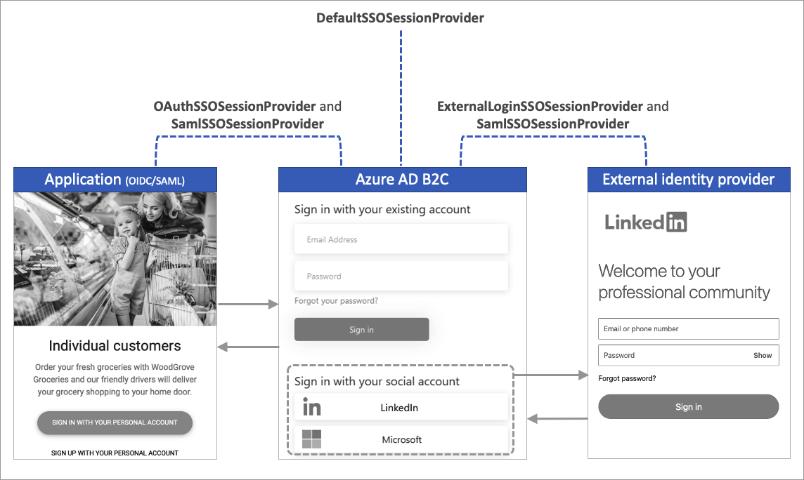

# Single sign-on session providers in Azure Active Directory B2C

In the [Configure session behavior in Azure Active Directory B2C](session-behavior.md) article, we describe the session management for your Azure AD B2C custom policy. This article describes how to further configure the single sign-on (SSO) behavior of any individual technical profile within your custom policy.

For example, you configure your policy for tenant-wide SSO, but you would like to always perform the multifactor step regardless of an active SSO session. You can achieve this behavior by configuring the session provider of the multifactor technical profile.

You can apply session providers to two flows:

- **Fresh logon**
  - When the user logs in for the first time, there’s no session. Any technical profiles that use a session provider become a session participant.
  - The session provider can write claims to the session cookie.
- **Subsequent logons**
  - When the user has an active session, claims that are part of the session cookie are read into the claim bag.
  - Claims that are part of the session cookie can’t be updated.
  - The session provider can issue extra claims into the claim bag, indicating that this technical profile was executed under SSO conditions.
  - The technical profile can be skipped.

Depending on the session management provider chosen for a given technical profile, session behavior can be active or suppressed. The following list presents some of the many possible examples using session providers:

- Prevent or enforce user interface interruptions during subsequent logons (SSO).
- Remember the chosen identity provider during subsequent logons (SSO).
- Reduce the number of read operations into the directory during subsequent logons (SSO).
- Track the social identity provider sessions to perform identity provider sign-out.
- Track logged in relying party applications for single sign-out.

## Session providers

There are five session providers available to manage how a technical profile handles the SSO session. You must choose the most appropriate session provider when configuring your technical profile.

The following table shows which session provider to use depending on the type of technical profile you want to manage. Some session providers allow reading and writing claims to the session cookie.

|Session provider  |Applicable technical profile types| Purpose |Write claims|Read claims|
|---------|---------|---------|---------|---------|
|[DefaultSSOSessionProvider](#defaultssosessionprovider)  | [Self-asserted](self-asserted-technical-profile.md), [Microsoft Entra ID](active-directory-technical-profile.md), [Microsoft Entra multifactor authentication](multi-factor-auth-technical-profile.md), [Claims transformation](claims-transformation-technical-profile.md)| Skips technical profile execution.| Yes | Yes |
|[ExternalLoginSSOSessionProvider](#externalloginssosessionprovider) | [OAuth1 identity provider](oauth1-technical-profile.md), [Oauth2 identity provider](oauth2-technical-profile.md), [OpenID Connect identity provider](openid-connect-technical-profile.md), [SAML identity provider](saml-identity-provider-technical-profile.md)| Accelerate identity provider selection page. Performing single-logout.|Yes|Yes|
|[OAuthSSOSessionProvider](#oauthssosessionprovider) |[JWT token issuer](jwt-issuer-technical-profile.md) | Manages session between OAuth2 or OpenId Connect relying party and Azure AD B2C. Performs single-logout. | No | No |
|[SamlSSOSessionProvider](#samlssosessionprovider) | [SAML token issuer](saml-issuer-technical-profile.md) | Manages session between SAML relying party and Azure AD B2C. Performs single-logout. | No | No |
|[NoopSSOSessionProvider](#noopssosessionprovider) |Any| Suppress any technical profile from being part of the session.| No | No |

The following diagram shows the types of session used by Azure AD B2C.



## Referencing a session provider

To use a session provider in your technical profile:

1. Create a session management technical profile of the appropriate. Note, the Azure AD B2C starter pack includes the most common session management technical profiles. You can reference an existing session management technical profile if applicable.

    The following XML snippet shows the starter pack's `SM-AAD` session management technical profile. The session provide is type of `DefaultSSOSessionProvider`.

    ```xml
    <TechnicalProfile Id="SM-AAD">
      <DisplayName>Session Mananagement Provider</DisplayName>
      <Protocol Name="Proprietary" Handler="Web.TPEngine.SSO.DefaultSSOSessionProvider, Web.TPEngine, Version=1.0.0.0, Culture=neutral, PublicKeyToken=null" />
      <PersistedClaims>
        <PersistedClaim ClaimTypeReferenceId="objectId" />
        <PersistedClaim ClaimTypeReferenceId="signInName" />
        <PersistedClaim ClaimTypeReferenceId="authenticationSource" />
        <PersistedClaim ClaimTypeReferenceId="identityProvider" />
        <PersistedClaim ClaimTypeReferenceId="newUser" />
        <PersistedClaim ClaimTypeReferenceId="executed-SelfAsserted-Input" />
      </PersistedClaims>
      <OutputClaims>
        <OutputClaim ClaimTypeReferenceId="objectIdFromSession" DefaultValue="true" />
      </OutputClaims>
    </TechnicalProfile>
    ```


1. Reference the session management technical profile within your technical profile. By doing so, you control the behavior of that technical profile during subsequent logons (SSO).

    To reference a session management technical profile from your technical profile, add the `UseTechnicalProfileForSessionManagement` element. The following example shows the use of `SM-AAD` session management technical profile. Change the `ReferenceId` to the ID of your session management technical profile.
    
    ```xml
    <TechnicalProfile Id="{Technical-profile-ID}">
      ...
      <UseTechnicalProfileForSessionManagement ReferenceId="SM-AAD" />
    </TechnicalProfile>
    ```

> [!IMPORTANT]
> When a technical profile doesn't  reference any session management provider, the [DefaultSSOSessionProvider](#defaultssosessionprovider) session provider is applied, which may cause unexpected behavior.

> [!Note]
> During a refresh token flow, the session management providers aren't invoked. All attempts to issue a new access token are a copy of the original claims issued.

## Manage session claims

The session management technical profiles control which claims can be read, written or output during custom policy execution.

Within the session management technical profile, use `PersistedClaims` and `OutputClaims` elements to manage the claims.

- **Persisted claims** - Claims that can be written to the session cookie.
  - For a claim to be written into the session cookie, it must be part of the current claim bag.
  - All claims that are written automatically return during subsequent logons (single sign-on). You don’t need to specify the output claims.
- **Output claims** - Extra claims that can be output to the claim bag during subsequent logons (single sign-on). Since the output claims aren't returned from the session, you must set a default value.

The persisted and output claims elements are demonstrated in the following XML snippet:

```xml
<TechnicalProfile Id="SM-AAD">
  <DisplayName>Session Management Provider</DisplayName>
  <Protocol Name="Proprietary" Handler="Web.TPEngine.SSO.DefaultSSOSessionProvider, Web.TPEngine, Version=1.0.0.0, Culture=neutral, PublicKeyToken=null" />
  <PersistedClaims>
    <PersistedClaim ClaimTypeReferenceId="objectId" />
  </PersistedClaims>
  <OutputClaims>
    <OutputClaim ClaimTypeReferenceId="objectIdFromSession" DefaultValue="true"/>
  </OutputClaims>
</TechnicalProfile>
```

The `DefaultSSOSessionProvider` and `ExternalLoginSSOSessionProvider` session management providers can be configured to manage claims, such that during:

- **Fresh logon**
  - The `PersistedClaims` element will write claims into the session cookie. Persisted claims can’t be rewritten.
- **Subsequent logons**
  - Every claim that is written to the session cookie, will be output into the claims bag, available to be used in the next orchestration step.
  - The `OutputClaims` element will output static claims into the claims bag. Use the `DefaultValue` attribute to set the value of the output claim.

## DefaultSSOSessionProvider

The `DefaultSSOSessionProvider` session provider can be configured to manage claims during subsequent logons (single sign-on), and allow technical profiles to be skipped. The `DefaultSSOSessionProvider` should be used to persist and issue claims that are needed by subsequent [orchestration steps](userjourneys.md) that won’t be otherwise obtained during subsequent logons (single sign-on). For example, claims that might be obtained from reading the user object from the directory.

The following `SM-AAD` technical profile is type of `DefaultSSOSessionProvider` session provider. The `SM-AAD` technical profile can be found in the [custom policy starter pack](tutorial-create-user-flows.md?pivots=b2c-custom-policy#custom-policy-starter-pack).

```xml
<TechnicalProfile Id="SM-AAD">
  <DisplayName>Session Management Provider</DisplayName>
  <Protocol Name="Proprietary" Handler="Web.TPEngine.SSO.DefaultSSOSessionProvider, Web.TPEngine, Version=1.0.0.0, Culture=neutral, PublicKeyToken=null" />
  <PersistedClaims>
    <PersistedClaim ClaimTypeReferenceId="objectId" />
    <PersistedClaim ClaimTypeReferenceId="signInName" />
    <PersistedClaim ClaimTypeReferenceId="authenticationSource" />
    <PersistedClaim ClaimTypeReferenceId="identityProvider" />
    <PersistedClaim ClaimTypeReferenceId="newUser" />
    <PersistedClaim ClaimTypeReferenceId="executed-SelfAsserted-Input" />
  </PersistedClaims>
  <OutputClaims>
    <OutputClaim ClaimTypeReferenceId="objectIdFromSession" DefaultValue="true"/>
  </OutputClaims>
</TechnicalProfile>
```

For example, the `SM-AAD`session management technical profile uses the `DefaultSSOSessionProvider` session provider. It will behave as follows when applied against the `SelfAsserted-LocalAccountSignin-Email` technical profile from the [custom policy starter pack](tutorial-create-user-flows.md?pivots=b2c-custom-policy#custom-policy-starter-pack):

- **Fresh logon**
  - `signInName` will be written into the session cookie, because the session management technical profile (SM-AAD) is configured with `signInName` to be persisted, and the technical profile referencing SM-AAD contains an `OutputClaim` for `signInName`. This behavior is applicable to all claims that meet this pattern.
- **Subsequent logons**
  - The technical profile is skipped and the user won’t see the sign-in page.
  - The claim bag will contain the `signInName` value from the session cookie, which was persisted at fresh sign-in, and any other claims that met the pattern to be persisted into the session cookie.
  - The session management technical profile returns the `objectIdFromSession` claim because `Output` claims of the session provider are processed during subsequent logons (single sign-on). In this case, the `objectIdFromSession` claim being present in the claim bag, indicates that the user's claims are coming from the session cookie due to single sign-on.

## ExternalLoginSSOSessionProvider

The `ExternalLoginSSOSessionProvider` session provider is used to skip the "identity provider selection" screen and sign-out from a federated identity provider. It’s typically referenced in a technical profile configured for a federated identity provider, such as Facebook or Microsoft Entra ID.

- **Fresh logon**
  - The `PersistedClaims` element will write claims into the session cookie. Persisted claims can’t be rewritten.
- **Subsequent logons**
  - Every claim that is written to the session cookie, will be output into the claim bag, available to be used in the next orchestration step.
  - The `OutputClaims` element will output static claims into the claims bag. Use the `DefaultValue` attribute the set the value of the claim.
  - When a technical profile, which references a session management technical profile, contains an `OutputClaim`, which has been persisted into the session cookie, then this technical profile will be skipped.

The following `SM-SocialLogin` technical profile is type of `ExternalLoginSSOSessionProvider` session provider. The `SM-SocialLogin` technical profile can be found in the [custom policy starter pack](tutorial-create-user-flows.md?pivots=b2c-custom-policy#custom-policy-starter-pack).

```xml
<TechnicalProfile Id="SM-SocialLogin">
  <DisplayName>Session Management Provider</DisplayName>
  <Protocol Name="Proprietary" Handler="Web.TPEngine.SSO.ExternalLoginSSOSessionProvider, Web.TPEngine, Version=1.0.0.0, Culture=neutral, PublicKeyToken=null" />
  <PersistedClaims>
    <PersistedClaim ClaimTypeReferenceId="AlternativeSecurityId" />
  </PersistedClaims>
</TechnicalProfile>
```

The `AlternativeSecurityId` claim is generated when a user signs in with an external identity provider. Representing the external identity provider user's unique identifier. The `AlternativeSecurityId` claim is persisted such that on single sign on journeys, the user's profile can be read from the directory without any interaction with the federated identity provider.

To configure the external session provider, add a reference to the `SM-SocialLogin` from your [OAuth1](oauth1-technical-profile.md), [OAuth2](oauth2-technical-profile.md), or [OpenID Connect](openid-connect-technical-profile.md) technical profiles. For example, the `Facebook-OAUTH` uses the `SM-SocialLogin` session management technical profile. For more information, see the [custom policy starter pack](tutorial-create-user-flows.md?pivots=b2c-custom-policy#custom-policy-starter-pack).

```xml
<TechnicalProfile Id="Facebook-OAUTH">
  ...
  <UseTechnicalProfileForSessionManagement ReferenceId="SM-SocialLogin" />
</TechnicalProfile>
```

## OAuthSSOSessionProvider

The `OAuthSSOSessionProvider` session provider is used for managing the Azure AD B2C sessions between the OAuth2 or OpenId Connect relying party and Azure AD B2C. Azure AD B2C supports [Single sign-out](session-behavior.md#single-sign-out), also known as *Single Log-Out (SLO)*. When a user signs out through the [Azure AD B2C sign-out endpoint](openid-connect.md#send-a-sign-out-request), Azure AD B2C will clear the user's session cookie from the browser. However, the user might still be signed in to other applications that use Azure AD B2C for authentication.

This type of session provider allows Azure AD B2C to track all OAuth2 or OpenId Connect applications the user logged into. During the sign-out of one application, Azure AD B2C will attempt to call the `logout` endpoints of all other known logged in applications. This functionality is built in to the session provider. There are no persisted or output claims available to be configured. The following `SM-jwt-issuer` technical profile is type of `OAuthSSOSessionProvider` session provider.

```xml
<TechnicalProfile Id="SM-jwt-issuer">
  <DisplayName>Session Management Provider</DisplayName>
  <Protocol Name="Proprietary" Handler="Web.TPEngine.SSO.OAuthSSOSessionProvider, Web.TPEngine, Version=1.0.0.0, Culture=neutral, PublicKeyToken=null" />
</TechnicalProfile>
```

The `SM-jwt-issuer` technical profile is referenced from the `JwtIssuer` technical profile:

```xml
<TechnicalProfile Id="JwtIssuer">
  ...
  <UseTechnicalProfileForSessionManagement ReferenceId="SM-jwt-issuer" />
</TechnicalProfile>
```

## SamlSSOSessionProvider

The `SamlSSOSessionProvider` session provider is used for managing the session behavior with federated SAML identity providers or SAML relying party applications and Azure AD B2C.

### SAML identity provider session management

When you reference a `SamlSSOSessionProvider` session provider from a SAML identity provider session, the `RegisterServiceProviders` must be set to `false`.

The following `SM-Saml-idp` technical profile is type of `SamlSSOSessionProvider` session provider:

```xml
<TechnicalProfile Id="SM-Saml-idp">
  <DisplayName>Session Management Provider</DisplayName>
  <Protocol Name="Proprietary" Handler="Web.TPEngine.SSO.SamlSSOSessionProvider, Web.TPEngine, Version=1.0.0.0, Culture=neutral, PublicKeyToken=null" />
  <Metadata>
    <Item Key="RegisterServiceProviders">false</Item>
  </Metadata>
</TechnicalProfile>
```

To use the `SM-Saml-idp` session management technical profile, add a reference to your [SAML identity provider](identity-provider-generic-saml.md) technical profile. For example, the [AD-FS SAML identity provider](identity-provider-adfs-saml.md) `Contoso-SAML2` uses the `SM-Saml-idp` session management technical profile.

```xml
<TechnicalProfile Id="Contoso-SAML2">
  ...
  <UseTechnicalProfileForSessionManagement ReferenceId="SM-Saml-idp" />
</TechnicalProfile>
```

### SAML service provider session management

When referencing a `SamlSSOSessionProvider` session provider to manage a SAML relying party session, the `RegisterServiceProviders` must set to `true`. SAML session sign-out requires the `SessionIndex` and `NameID` to complete.

The following `SM-Saml-issuer` technical profile is type of `SamlSSOSessionProvider` session provider:

```xml
<TechnicalProfile Id="SM-Saml-issuer">
  <DisplayName>Session Management Provider</DisplayName>
  <Protocol Name="Proprietary" Handler="Web.TPEngine.SSO.SamlSSOSessionProvider, Web.TPEngine, Version=1.0.0.0, Culture=neutral, PublicKeyToken=null"/>
</TechnicalProfile>
```

To use the `SM-Saml-issuer` session management technical profile, add a reference to your [SAML token issuer](saml-issuer-technical-profile.md) technical profile. For example, the `Saml2AssertionIssuer` technical profile uses the `SM-Saml-issuer` session management technical profile.

```xml
<TechnicalProfile Id="Saml2AssertionIssuer">
  ...
  <UseTechnicalProfileForSessionManagement ReferenceId="SM-Saml-issuer" />
</TechnicalProfile>
```

### Metadata

| Attribute | Required | Description|
| --- | --- | --- |
| IncludeSessionIndex | No | Not currently used, can be ignored.|
| RegisterServiceProviders | No | Indicates that the provider should register all SAML service providers that have been issued an assertion. Possible values: `true` (default), or `false`.|

## NoopSSOSessionProvider

The `NoopSSOSessionProvider` session provider is used to suppress single sign on behavior. Technical profiles that use this type of session provider will always be processed, even when the user has an active session. This type of session provider can be useful to force particular technical profiles to always run, for example:

- [Claims transformation](claims-transformation-technical-profile.md) - To create, or transform claims that are later used to determine which orchestration steps to process or skip.
- [Restful](restful-technical-profile.md) - Fetch updated data from a Restful service each time the policy runs. You can also call a Restful for extended logging, and auditing.
- [Self-asserted](self-asserted-technical-profile.md) - Force the user to provide data each time the policy runs. For example, verify emails with one-time pass-code, or ask the user's consent.
- [Phonefactor](phone-factor-technical-profile.md) - Force the user to perform multifactor authentication as part of a "step up authentication" even during subsequent logons (single sign-on).

This type of session provider doesn't persist claims to the user's session cookie. The following `SM-Noop` technical profile is type of `NoopSSOSessionProvider` session provider. The `SM-Noop` technical profile can be found in the [custom policy starter pack](tutorial-create-user-flows.md?pivots=b2c-custom-policy#custom-policy-starter-pack).

```xml
<TechnicalProfile Id="SM-Noop">
  <DisplayName>Noop Session Management Provider</DisplayName>
  <Protocol Name="Proprietary" Handler="Web.TPEngine.SSO.NoopSSOSessionProvider, Web.TPEngine, Version=1.0.0.0, Culture=neutral, PublicKeyToken=null" />
</TechnicalProfile>
```

To suppress single sign on behavior of a technical profile, add a reference to `SM-Noop` to the technical profile. For example, the `AAD-Common` uses the `SM-Noop` session management technical profile. For more information, see the [custom policy starter pack](tutorial-create-user-flows.md?pivots=b2c-custom-policy#custom-policy-starter-pack).

```xml
<TechnicalProfile Id="AAD-Common">
  ...
  <UseTechnicalProfileForSessionManagement ReferenceId="SM-Noop" />
</TechnicalProfile>
```

## Next steps

Learn how to [configure session behavior](session-behavior.md).
