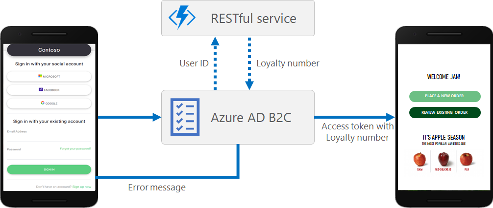

# Integrate REST API claims exchanges in your Azure AD B2C custom policy

[!INCLUDE [active-directory-b2c-advanced-audience-warning](../../includes/active-directory-b2c-advanced-audience-warning.md)]

The Identity Experience Framework, which underlies Azure Active Directory B2C (Azure AD B2C), can integrate with RESTful APIs within a user journey. This article shows how to create a user journey that interacts with a RESTful service using a [RESTful technical profile](https://identitydivision.visualstudio.com/defaultcollection/Identity%20CXP/_git/GTP?path=%2Fyoelh%2Fdocs%2Frest-api%2Frestful-technical-profile.md&version=GBmaster).

Using Azure AD B2C, you can add your own business logic to a user journey by calling your own RESTful service. The Identity Experience Framework can send and receive data from your RESTful service to exchange claims. For example, you can:

- **Validate user input data**. For example, you can verify that the email address provided by the user exists in your customer's database, and if not, present an error.
- **Process claims**. If a user enters their first name in all lowercase or all uppercase letters, your REST API can format the name with only the first letter capitalized and return it to Azure AD B2C.
- **Enrich user data by further integrating with corporate line-of-business applications**. Your RESTful service can receive the user's email address, query the customer's database, and return the user's loyalty number to Azure AD B2C. Then return claims can be stored in the user's Azure AD account, evaluated in the next orchestration steps, or included in the access token.
- **Run custom business logic**. You can send push notifications, update corporate databases, run a user migration process, manage permissions, audit databases, and perform any other workflows.



> [!NOTE]
> If there is slow or no response from the RESTful service to Azure AD B2C, the timeout is 30 seconds and the retry count is 2 times (meaning there are 3 tries in total). The timeout and retry count settings are not currently configurable.

## Calling a RESTful service

The interaction includes a claims exchange of information between the REST API claims and Azure AD B2C. You can design the integration with the RESTful services in the following ways:

- **Validation technical profile**. The call to the RESTful service happens within a [validation technical profile](validation-technical-profile.md) of the specified [self-asserted technical profile](self-asserted-technical-profile.md), or a [verification display control](display-control-verification.md) of a [display control](display-controls.md). The validation technical profile validates the user-provided data before the user journey moves forward. With the validation technical profile, you can:

  - Send claims to your REST API.
  - Validate claims, and throw custom error messages that are displayed to the user.
  - Send back claims from the REST API to subsequent orchestration steps.

- **Claims exchange**. A direct claims exchange can be configured by calling a REST API technical profile directly from an orchestration step of a [user journey](userjourneys.md). This definition is limited to:

  - Send claims to your REST API.
  - Validate claims, and throw custom error messages that are returned to the application.
  - Send back claims from the REST API to subsequent orchestration steps.

You can add a REST API call at any step in the user journey defined by a custom policy. For example, you can call a REST API:

- During sign-in, just before Azure AD B2C validates the credentials.
- Immediately after sign-in.
- Before Azure AD B2C creates a new account in the directory.
- After Azure AD B2C creates a new account in the directory.
- Before Azure AD B2C issues an access token.


## Sending data

In the [RESTful technical profile](restful-technical-profile.md), the `InputClaims` element contains a list of claims to send to your RESTful service. You can map the name of your claim to the name defined in the RESTful service, set a default value, and use [claims resolvers](claim-resolver-overview.md).

You can configure how the input claims are sent to the RESTful claims provider by using the SendClaimsIn attribute. The possible values are:

- **Body**, sent in the HTTP POST request body in JSON format.
- **Form**, sent in the HTTP POST request body in an ampersand '&' separated key value format.
- **Header**, sent in the HTTP GET request header.
- **QueryString**, sent in the HTTP GET request query string.

When the **Body** option is configured, the REST API technical profile allows you to send a complex JSON payload to an endpoint. For more information, see [Send a JSON payload](restful-technical-profile.md#send-a-json-payload).

## Receiving data

The `OutputClaims` element of the [RESTful technical profile](restful-technical-profile.md) contains a list of claims returned by the REST API. You may need to map the name of the claim defined in your policy to the name defined in the REST API. You can also include claims that aren't returned by the REST API identity provider, as long as you set the DefaultValue attribute.

The output claims parsed by the RESTful claims provider always expect to parse a flat JSON Body response, such as:

```json
{
  "name": "Emily Smith",
  "email": "emily@outlook.com",
  "loyaltyNumber":  1234
}
```

The output claims should look like the following:

```xml
<OutputClaims>
  <OutputClaim ClaimTypeReferenceId="displayName" PartnerClaimType="name" />
  <OutputClaim ClaimTypeReferenceId="email" />
  <OutputClaim ClaimTypeReferenceId="loyaltyNumber" />
</OutputClaims>
```

To parse a nested JSON Body response, set the ResolveJsonPathsInJsonTokens metadata to true. In the output claim, set the PartnerClaimType to the JSON path element you want to output.

```json
"contacts": [
  {
    "id": "MAINCONTACT_1",
    "person": {
      "name": "Emily Smith",
      "loyaltyNumber":  1234,
      "emails": [
        {
          "id": "EMAIL_1",
          "type": "WORK",
          "email": "email@domain.com"
        }
      ]
    }
  }
],
```


The output claims should look like following:

```xml
<OutputClaims>
  <OutputClaim ClaimTypeReferenceId="displayName" PartnerClaimType="contacts.0.person.name" />
  <OutputClaim ClaimTypeReferenceId="email" PartnerClaimType="contacts.0.person.emails.0.email" />
  <OutputClaim ClaimTypeReferenceId="loyaltyNumber" PartnerClaimType="contacts.0.person.loyaltyNumber" />
</OutputClaims>
```

## Security considerations

You must protect your REST API endpoint so that only authenticated clients can communicate with it. The REST API must use an HTTPS endpoint. Set the AuthenticationType metadata to one of the following authentication methods:

- **Client certificate** restricts access by using client certificate authentication. Only services that have the appropriate certificates can access your API. You store the client certificate in an Azure AD B2C Policy Key. Learn more about how to [secure your RESTful service by using client certificates](secure-rest-api.md#https-client-certificate-authentication).
- **Basic** secures the REST API with HTTP basic authentication. Only verified users, including Azure AD B2C, can access your API. The username and password are stored in Azure AD B2C policy keys. Learn how to [secure your RESTful services by using HTTP basic authentication](secure-rest-api.md#http-basic-authentication).
- **Bearer** restricts access using a client OAuth2 access token. The access token is stored in an Azure AD B2C policy key. Learn more about how to [secure your RESTful service by using Bearer token](secure-rest-api.md#oauth2-bearer-authentication).

## REST API platform
Your REST API can be based on any platform and written in any programing language, as long as it's secure and can send and receive claims as specified in [RESTful technical profile](restful-technical-profile.md).

## Localize the REST API
In a RESTful technical profile, you may want to send the current session's language/locale, and if necessary, raise a localized error message. Using the [claims resolver](claim-resolver-overview.md), you can send a contextual claim, such as the user language. The following example shows a RESTful technical profile demonstrating this scenario.

```xml
<TechnicalProfile Id="REST-ValidateUserData">
  <DisplayName>Validate user input data</DisplayName>
  <Protocol Name="Proprietary" Handler="Web.TPEngine.Providers.RestfulProvider, Web.TPEngine, Version=1.0.0.0, Culture=neutral, PublicKeyToken=null" />
  <Metadata>
    <Item Key="ServiceUrl">https://your-app.azurewebsites.net/api/identity</Item>
    <Item Key="AuthenticationType">None</Item>
    <Item Key="SendClaimsIn">Body</Item>
    <Item Key="IncludeClaimResolvingInClaimsHandling">true</Item>
  </Metadata>
  <InputClaims>
    <InputClaim ClaimTypeReferenceId="userLanguage" DefaultValue="{Culture:LCID}" AlwaysUseDefaultValue="true" />
    <InputClaim ClaimTypeReferenceId="email" PartnerClaimType="emailAddress" />
  </InputClaims>
  <UseTechnicalProfileForSessionManagement ReferenceId="SM-Noop" />
</TechnicalProfile>
```

## Handling error messages

Your REST API may need to return an error message, such as "The user was not found in the CRM system." If an error occurs, the REST API should return an HTTP 409 error message (Conflict response status code). For more information, see the [RESTful technical profile](restful-technical-profile.md#returning-validation-error-message).

This can only be achieved by calling a REST API technical profile from a validation technical profile. This allows the user to correct the data on the page and run the validation again upon page submission.

An HTTP 409 response is required to prevent the processing of any subsequent validation technical profiles within this orchestration step.

If you reference a REST API technical profile directly from a user journey, the user is redirected back to the relying party application with the relevant error message.

## Publishing your REST API

The request to your REST API service comes from Azure AD B2C servers. The REST API service must be published to a publicly accessible HTTPS endpoint. The REST API calls will arrive from an Azure data center IP address.

Design your REST API service and its underlying components (such as the database and file system) to be highly available.

## Next steps

See the following articles for examples of using a RESTful technical profile:

- [Walkthrough: Integrate REST API claims exchanges in your Azure AD B2C user journey as validation of user input](custom-policy-rest-api-claims-validation.md)
- [Walkthrough: Add REST API claims exchanges to custom policies in Azure Active Directory B2C](custom-policy-rest-api-claims-validation.md)
- [Secure your REST API services](secure-rest-api.md)
- [Reference: RESTful technical profile](restful-technical-profile.md)
