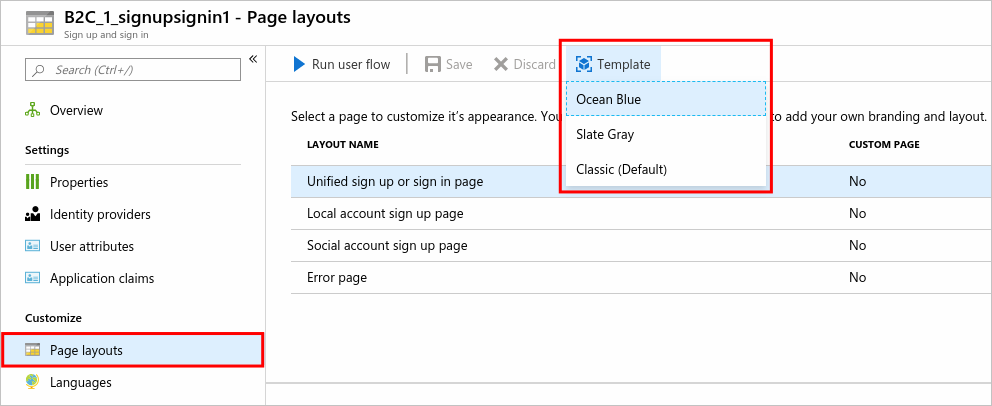
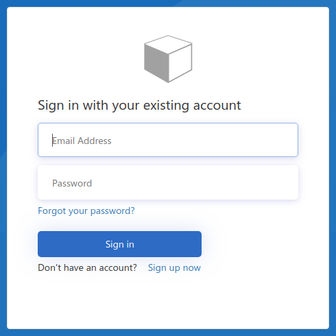
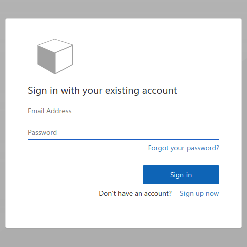
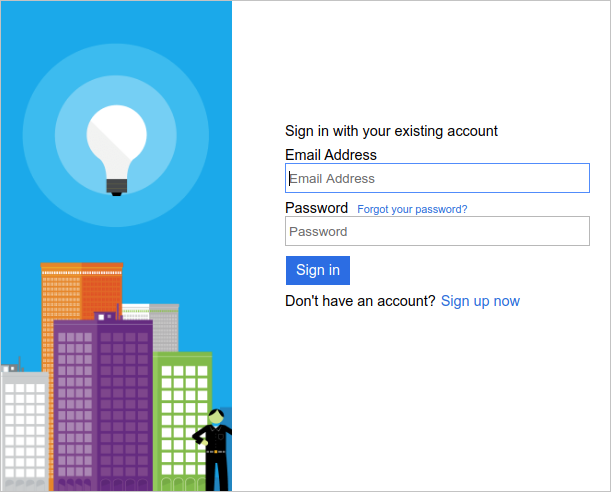
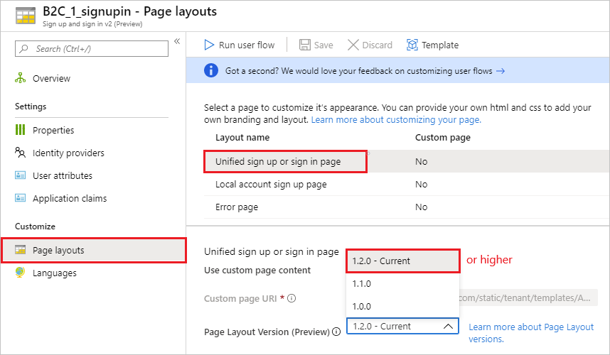

# Customize the user interface in Azure Active Directory B2C

Branding and customizing the user interface that Azure Active Directory B2C (Azure AD B2C) displays to your customers helps provide a seamless user experience in your application. These experiences include signing up, signing in, profile editing, and password resetting. This article introduces the methods of user interface (UI) customization for both user flows and custom policies.

## UI customization in different scenarios

There are several ways to customize the UI of the user experiences your application, each appropriate for different scenarios.

### User flows

If you use [user flows](user-flow-overview.md), you can change the look of your user flow pages by using built-in *page layout templates*, or by using your own HTML and CSS. Both methods are discussed later in this article.

You use the [Azure portal](tutorial-customize-ui.md) to configure the UI customization for user flows.

> [!TIP]
> If you want to modify only the banner logo, background image, and background color of your user flow pages, you can try the [Company branding (preview)](#company-branding-preview) feature described later in this article.

### Custom policies

If you're using [custom policies](custom-policy-overview.md) to provide sign-up or sign-in, password reset, or profile-editing in your application, use [policy files to customize the UI](custom-policy-ui-customization.md).

If you need to provide dynamic content based on a customer's decision, use custom policies that can [change page content dynamically](custom-policy-ui-customization.md#configure-dynamic-custom-page-content-uri) depending on a parameter that's sent in a query string. For example, you can change the background image on the Azure AD B2C sign-up or sign-in page based on a parameter that you pass from your web or mobile application.

### JavaScript

You can enable client-side JavaScript code in both [user flows](user-flow-javascript-overview.md) and [custom policies](page-layout.md).

### Sign in-only UI customization

If you're providing sign-in only, along with its accompanying password reset page and verification emails, use the same customization steps that are used for an [Azure AD sign-in page](../active-directory/fundamentals/customize-branding.md).

If customers try to edit their profile before signing in, they're redirected to a page that you customize by using the same steps that are used for customizing the Azure AD sign-in page.

## Page layout templates

User flows provide several built-in templates you can choose from to give your user experience pages a professional look. These layout templates can also and serve as starting point for your own customization.

Under **Customize** in the left menu, select **Page layouts** and then select **Template**.



Next, select a template from the list. Here are examples of the sign-in pages for each template:

| Ocean Blue | Slate Gray | Classic |
|:-:|:-:|:-:|
||||

When you choose a template, the selected layout is applied to all pages in your user flow, and the URI for each page is visible in the **Custom page URI** field.

## Custom HTML and CSS

If you wish to design your own policy layout with your customized HTML and CSS, you can do so by switching the "Use custom page content" toggle for each of the Layout names present in your policy. Please follow the below instructions regarding the custom layout configurations:

Azure AD B2C runs code in your customer's browser by using an approach called [Cross-Origin Resource Sharing (CORS)](https://www.w3.org/TR/cors/).

At runtime, content is loaded from a URL that you specify in your user flow or custom policy. Each page in the user experience loads its content from the URL you specify for that page. After content is loaded from your URL, it's merged with an HTML fragment inserted by Azure AD B2C, and then the page is displayed to your customer.

Review the following guidance before using your own HTML and CSS files to customize the UI:

- Azure AD B2C **merges** HTML content into your pages. Don't copy and try to change the default content that Azure AD B2C provides. It's best to build your HTML content from scratch and use the default content as reference.
- **JavaScript** can be included in your custom content for both [user flows](user-flow-javascript-overview.md) and [custom policies](javascript-samples.md).
- Supported **browser versions** are:
  - Internet Explorer 11, 10, and Microsoft Edge
  - Limited support for Internet Explorer 9 and 8
  - Google Chrome 42.0 and above
  - Mozilla Firefox 38.0 and above
  - Safari for iOS and macOS, version 12 and above
- Don't include **form tags** in your HTML. Form tags interfere with the POST operations generated by the HTML injected by Azure AD B2C.

### Where do I store UI content?

When using your own HTML and CSS files to customize the UI, you can host your UI content on any publicly available HTTPS endpoint that supports CORS. For example, [Azure Blob storage](../storage/blobs/storage-blobs-introduction.md), web servers, CDNs, AWS S3, or file sharing systems.

The important point is that you host the content on a publicly available HTTPS endpoint with [CORS enabled](https://enable-cors.org/server.html). You must use an absolute URL when you specify it in your content.

> [!NOTE]
> For details about creating HTML content, uploading content to Azure Blob storage, and configuring CORS, see the [Custom page content walkthrough](custom-policy-ui-customization.md#custom-page-content-walkthrough) section in the UI customization article.

## Get started with custom HTML and CSS

Get started using your own HTML and CSS in your user experience pages by following these guidelines.

- Create well-formed HTML content with an empty `<div id="api"></div>` element located somewhere in the `<body>`. This element marks where the Azure AD B2C content is inserted. The following example shows a minimal page:

    ```html
    <!DOCTYPE html>
    <html>
      <head>
        <title>!Add your title here!</title>
        <link rel="stylesheet" href="https://mystore1.blob.core.windows.net/b2c/style.css">
      </head>
      <body>
        <h1>My B2C Application</h1>
        <div id="api"></div>   <!-- Leave this element empty because Azure AD B2C will insert content here. -->
      </body>
    </html>
    ```

- Use CSS to style the UI elements that Azure AD B2C inserts into your page. The following example shows a simple CSS file that also includes settings for the sign-up injected HTML elements:

    ```css
    h1 {
      color: blue;
      text-align: center;
    }
    .intro h2 {
      text-align: center;
    }
    .entry {
      width: 400px ;
      margin-left: auto ;
      margin-right: auto ;
    }
    .divider h2 {
      text-align: center;
    }
    .create {
      width: 400px ;
      margin-left: auto ;
      margin-right: auto ;
    }
    ```

- Host your content on an HTTPS endpoint (with CORS allowed). Both GET and OPTIONS request methods must be enabled when configuring CORS.
- Create or edit a user flow or custom policy to use the content that you created.

### HTML fragments from Azure AD B2C

The following table lists the HTML fragments that Azure AD B2C merges into the `<div id="api"></div>` element located in your content.

| Inserted page | Description of HTML |
| ------------- | ------------------- |
| Identity provider selection | Contains a list of buttons for identity providers that the customer can choose from during sign-up or sign-in. These buttons include social identity providers such as Facebook, Google, or local accounts (based on email address or user name). |
| Local account sign-up | Contains a form for local account sign-up based on an email address or a user name. The form can contain different input controls such as text input box, password entry box, radio button, single-select drop-down boxes, and multi-select check boxes. |
| Social account sign-up | May appear when signing up using an existing account from a social identity provider such as Facebook or Google. It's used when additional information must be collected from the customer using a sign-up form. |
| Unified sign-up or sign-in | Handles both sign-up and sign-in of customers who can use social identity providers such as Facebook, Google, or local accounts. |
| Multi-factor authentication | Customers can verify their phone numbers (using text or voice) during sign-up or sign-in. |
| Error | Provides error information to the customer. |

## Company branding (preview)

You can customize your user flow pages with a banner logo, background image, and background color by using Azure Active Directory [Company branding](../active-directory/fundamentals/customize-branding.md).

To customize your user flow pages, you first configure company branding in Azure Active Directory, then you enable it in the page layouts of your user flows in Azure AD B2C.

[!INCLUDE [preview note](../../includes/active-directory-b2c-public-preview.md)]

### Configure company branding

Start by setting the banner logo, background image, and background color within **Company branding**.

1. Sign in to the [Azure portal](https://portal.azure.com).
1. Select the **Directory + subscription** filter in the top menu, and then select the directory that contains your Azure AD B2C tenant.
1. In the Azure portal, search for and select **Azure AD B2C**.
1. Under **Manage**, select **Company branding**.
1. Follow the steps in [Add branding to your organization's Azure Active Directory sign-in page](../active-directory/fundamentals/customize-branding.md).

Keep these things in mind when you configure company branding in Azure AD B2C:

* Company branding in Azure AD B2C is currently limited to **background image**, **banner logo**, and **background color** customization. The other properties in the company branding pane, for example those in **Advanced settings**, are *not supported*.
* In your user flow pages, the background color is shown before the background image is loaded. We recommended you choose a background color that closely matches the colors in your background image for a smoother loading experience.
* The banner logo appears in the verification emails sent to your users when they initiate a sign-up user flow.

### Enable branding in user flow pages

Once you've configured company branding, enable it in your user flows.

1. In the left menu of the Azure portal, select **Azure AD B2C**.
1. Under **Policies**, select **User flows (policies)**.
1. Select the user flow for which you'd like to enable company branding. Company branding is **not supported** for the *Sign in v1* and *Profile editing v1* user flow types.
1. Under **Customize**, select **Page layouts**, and then select the layout you'd like to brand. For example, select **Unified sign up or sign in page**.
1. For the **Page Layout Version (Preview)**, choose version **1.2.0** or above.
1. Select **Save**.

If you'd like to brand all pages in the user flow, set the page layout version for each page layout in the user flow.



This annotated example shows a custom banner logo and background image on a *Sign up and sign in* user flow page that uses the Ocean Blue template:


### Use company branding assets in custom HTML

To use your company branding assets in custom HTML, add the following tags outside the `<div id="api">` tag:

```HTML


```

The image source is replaced with that of the background image and banner logo. As described in the [Get started with custom HTML and CSS](#get-started-with-custom-html-and-css) section, use CSS classes to style and position the assets on the page .

## Localize content

You localize your HTML content by enabling [language customization](user-flow-language-customization.md) in your Azure AD B2C tenant. Enabling this feature allows Azure AD B2C to forward the OpenID Connect parameter `ui_locales` to your endpoint. Your content server can use this parameter to provide language-specific HTML pages.

Content can be pulled from different places based on the locale that's used. In your CORS-enabled endpoint, you set up a folder structure to host content for specific languages. You'll call the right one if you use the wildcard value `{Culture:RFC5646}`.

For example, your custom page URI might look like:

```HTTP
https://contoso.blob.core.windows.net/{Culture:RFC5646}/myHTML/unified.html
```

You can load the page in French by pulling content from:

```HTTP
https://contoso.blob.core.windows.net/fr/myHTML/unified.html
```

## Examples

You can find several sample template files in the [B2C-AzureBlobStorage-Client](https://github.com/azureadquickstarts/b2c-azureblobstorage-client) repository on GitHub.

The sample HTML and CSS files in the templates are located in the [/sample_templates](https://github.com/AzureADQuickStarts/B2C-AzureBlobStorage-Client/tree/master/sample_templates) directory.

## Next steps

- If you're using **user flows**, you can start customizing your UI with the tutorial:

    [Customize the user interface of your applications in Azure Active Directory B2C](tutorial-customize-ui.md).
- If you're using **custom policies**, you can start customizing the UI with the article:

    [Customize the user interface of your application using a custom policy in Azure Active Directory B2C](custom-policy-ui-customization.md).
